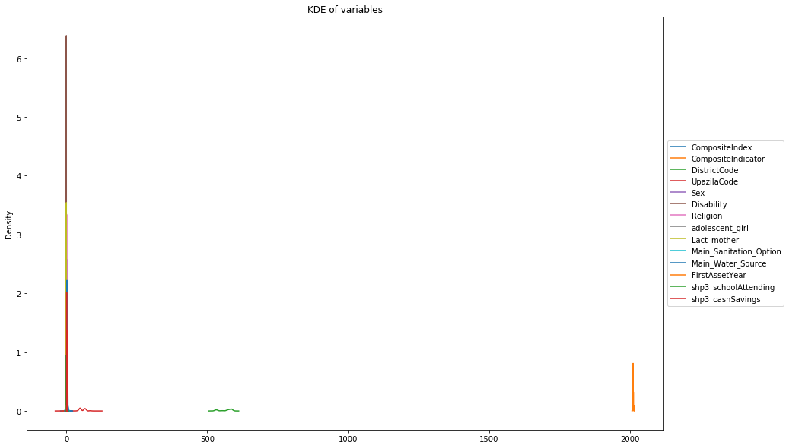
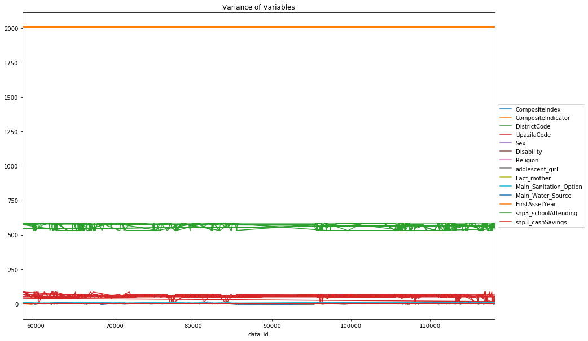
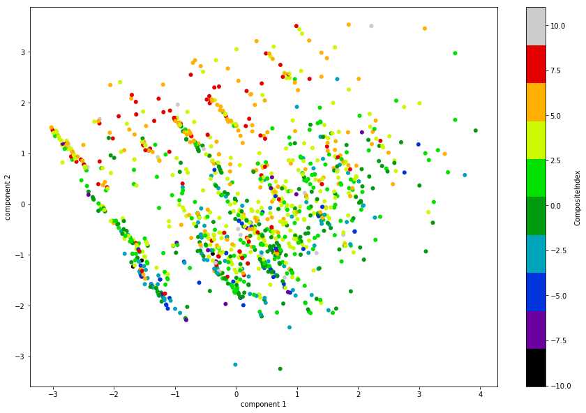
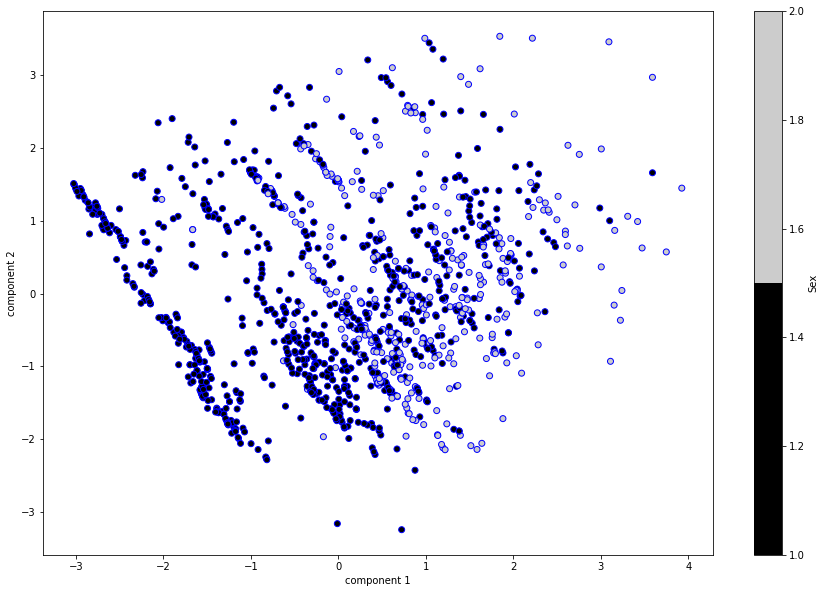
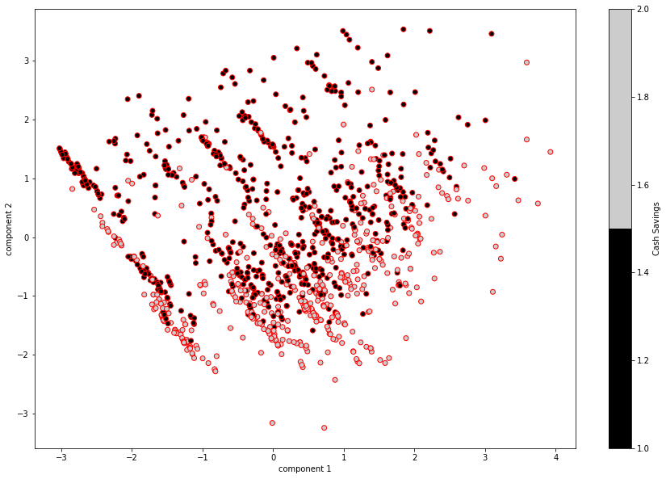
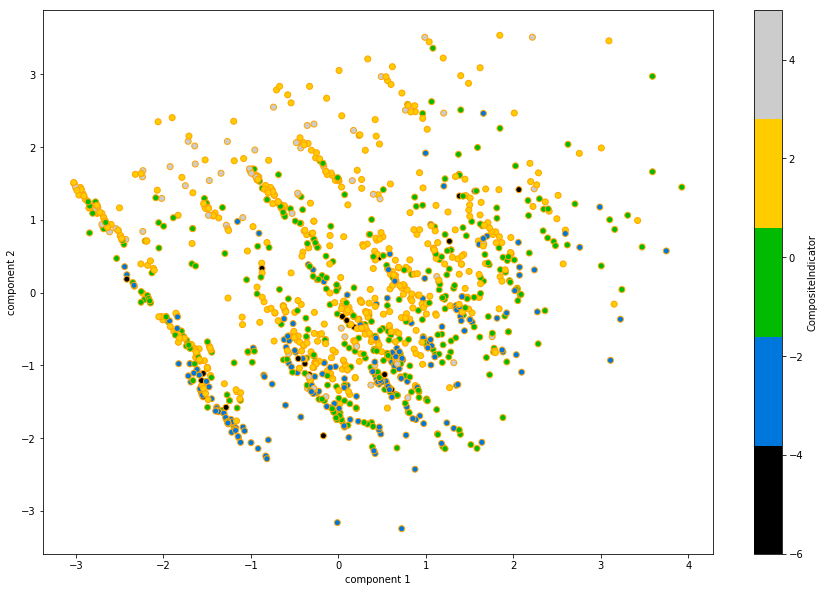

```python
import pandas as pd
```


```python
excel_ds = 'dataset.xlsx'
subjects = pd.read_excel(excel_ds, index_col = 0)
```


```python
subjects.shape
```


    (1271, 73)


```python
subjects.head()
```


<div>
<style>
    .dataframe thead tr:only-child th {
        text-align: right;
    }

    .dataframe thead th {
        text-align: left;
    }

    .dataframe tbody tr th {
        vertical-align: top;
    }
</style>
<table border="1" class="dataframe">
  <thead>
    <tr style="text-align: right;">
      <th></th>
      <th>received</th>
      <th>HH_ID</th>
      <th>Group_ID</th>
      <th>HHSl</th>
      <th>DistrictCode</th>
      <th>UpazilaCode</th>
      <th>Village</th>
      <th>UnionCode</th>
      <th>Ward</th>
      <th>LeadNGO_Code</th>
      <th>...</th>
      <th>Main_IGACode</th>
      <th>Main_IGAName</th>
      <th>Main_IGAValue</th>
      <th>2nd_IGACode</th>
      <th>2nd_IGAName</th>
      <th>2nd_IGAValue</th>
      <th>3rd_IGACode</th>
      <th>3rd_IGAName</th>
      <th>3rd_IGAValue</th>
      <th>Total_IGDValue</th>
    </tr>
    <tr>
      <th>data_id</th>
      <th></th>
      <th></th>
      <th></th>
      <th></th>
      <th></th>
      <th></th>
      <th></th>
      <th></th>
      <th></th>
      <th></th>
      <th></th>
      <th></th>
      <th></th>
      <th></th>
      <th></th>
      <th></th>
      <th></th>
      <th></th>
      <th></th>
      <th></th>
      <th></th>
    </tr>
  </thead>
  <tbody>
    <tr>
      <th>58316</th>
      <td>2013-01-07 11:19:47</td>
      <td>573852720115</td>
      <td>NaN</td>
      <td>115</td>
      <td>573</td>
      <td>85</td>
      <td>Kisamot Kadikhol</td>
      <td>27</td>
      <td>2</td>
      <td>10.0</td>
      <td>...</td>
      <td>3002</td>
      <td>Api culture</td>
      <td>4000.0</td>
      <td>NaN</td>
      <td>NaN</td>
      <td>NaN</td>
      <td>NaN</td>
      <td>NaN</td>
      <td>NaN</td>
      <td>4000.0</td>
    </tr>
    <tr>
      <th>58415</th>
      <td>2013-01-07 11:30:58</td>
      <td>573852720110</td>
      <td>NaN</td>
      <td>110</td>
      <td>573</td>
      <td>85</td>
      <td>Kisamot Kadikhol</td>
      <td>27</td>
      <td>2</td>
      <td>10.0</td>
      <td>...</td>
      <td>3002</td>
      <td>Api culture</td>
      <td>4000.0</td>
      <td>NaN</td>
      <td>NaN</td>
      <td>NaN</td>
      <td>NaN</td>
      <td>NaN</td>
      <td>NaN</td>
      <td>4000.0</td>
    </tr>
    <tr>
      <th>63164</th>
      <td>2013-02-21 18:56:16</td>
      <td>532675770302</td>
      <td>NaN</td>
      <td>302</td>
      <td>532</td>
      <td>67</td>
      <td>Durgapur</td>
      <td>57</td>
      <td>7</td>
      <td>10.0</td>
      <td>...</td>
      <td>443</td>
      <td>Vegetable crop</td>
      <td>NaN</td>
      <td>NaN</td>
      <td>NaN</td>
      <td>NaN</td>
      <td>NaN</td>
      <td>NaN</td>
      <td>NaN</td>
      <td>NaN</td>
    </tr>
    <tr>
      <th>65524</th>
      <td>2013-02-23 12:29:34</td>
      <td>532675760210</td>
      <td>NaN</td>
      <td>210</td>
      <td>532</td>
      <td>67</td>
      <td>Pepulizor</td>
      <td>57</td>
      <td>6</td>
      <td>10.0</td>
      <td>...</td>
      <td>4702</td>
      <td>Small business- food item</td>
      <td>NaN</td>
      <td>NaN</td>
      <td>NaN</td>
      <td>NaN</td>
      <td>NaN</td>
      <td>NaN</td>
      <td>NaN</td>
      <td>NaN</td>
    </tr>
    <tr>
      <th>65648</th>
      <td>2013-02-23 12:50:23</td>
      <td>532675760201</td>
      <td>NaN</td>
      <td>201</td>
      <td>532</td>
      <td>67</td>
      <td>Pepulizor</td>
      <td>57</td>
      <td>6</td>
      <td>10.0</td>
      <td>...</td>
      <td>4702</td>
      <td>Small business- food item</td>
      <td>NaN</td>
      <td>NaN</td>
      <td>NaN</td>
      <td>NaN</td>
      <td>NaN</td>
      <td>NaN</td>
      <td>NaN</td>
      <td>NaN</td>
    </tr>
  </tbody>
</table>
<p>5 rows × 73 columns</p>
</div>


```python
subjects.tail()
```


<div>
<style>
    .dataframe thead tr:only-child th {
        text-align: right;
    }

    .dataframe thead th {
        text-align: left;
    }

    .dataframe tbody tr th {
        vertical-align: top;
    }
</style>
<table border="1" class="dataframe">
  <thead>
    <tr style="text-align: right;">
      <th></th>
      <th>received</th>
      <th>HH_ID</th>
      <th>Group_ID</th>
      <th>HHSl</th>
      <th>DistrictCode</th>
      <th>UpazilaCode</th>
      <th>Village</th>
      <th>UnionCode</th>
      <th>Ward</th>
      <th>LeadNGO_Code</th>
      <th>...</th>
      <th>Main_IGACode</th>
      <th>Main_IGAName</th>
      <th>Main_IGAValue</th>
      <th>2nd_IGACode</th>
      <th>2nd_IGAName</th>
      <th>2nd_IGAValue</th>
      <th>3rd_IGACode</th>
      <th>3rd_IGAName</th>
      <th>3rd_IGAValue</th>
      <th>Total_IGDValue</th>
    </tr>
    <tr>
      <th>data_id</th>
      <th></th>
      <th></th>
      <th></th>
      <th></th>
      <th></th>
      <th></th>
      <th></th>
      <th></th>
      <th></th>
      <th></th>
      <th></th>
      <th></th>
      <th></th>
      <th></th>
      <th></th>
      <th></th>
      <th></th>
      <th></th>
      <th></th>
      <th></th>
      <th></th>
    </tr>
  </thead>
  <tbody>
    <tr>
      <th>114196</th>
      <td>2013-03-10 09:50:04</td>
      <td>532673890704</td>
      <td>NaN</td>
      <td>704</td>
      <td>532</td>
      <td>67</td>
      <td>Ramkrisnopur</td>
      <td>38</td>
      <td>9</td>
      <td>10.0</td>
      <td>...</td>
      <td>441</td>
      <td>Vegetable crop</td>
      <td>NaN</td>
      <td>NaN</td>
      <td>NaN</td>
      <td>NaN</td>
      <td>NaN</td>
      <td>NaN</td>
      <td>NaN</td>
      <td>NaN</td>
    </tr>
    <tr>
      <th>115669</th>
      <td>2013-03-10 16:09:28</td>
      <td>585491730414</td>
      <td>NaN</td>
      <td>414</td>
      <td>585</td>
      <td>49</td>
      <td>Pashim Nayapara</td>
      <td>17</td>
      <td>3</td>
      <td>NaN</td>
      <td>...</td>
      <td>2304</td>
      <td>Large ruminant livestock rearing</td>
      <td>7500.0</td>
      <td>NaN</td>
      <td>NaN</td>
      <td>NaN</td>
      <td>2101.0</td>
      <td>Indigo/dyeing</td>
      <td>NaN</td>
      <td>7500.0</td>
    </tr>
    <tr>
      <th>116159</th>
      <td>2013-03-10 17:27:37</td>
      <td>532673890707</td>
      <td>NaN</td>
      <td>707</td>
      <td>532</td>
      <td>67</td>
      <td>Ramkrisnopur</td>
      <td>38</td>
      <td>9</td>
      <td>10.0</td>
      <td>...</td>
      <td>441</td>
      <td>Vegetable crop</td>
      <td>NaN</td>
      <td>NaN</td>
      <td>NaN</td>
      <td>NaN</td>
      <td>NaN</td>
      <td>NaN</td>
      <td>NaN</td>
      <td>NaN</td>
    </tr>
    <tr>
      <th>118041</th>
      <td>2013-03-11 07:30:05</td>
      <td>552028340406</td>
      <td>NaN</td>
      <td>406</td>
      <td>552</td>
      <td>2</td>
      <td>Tapatari</td>
      <td>83</td>
      <td>4</td>
      <td>10.0</td>
      <td>...</td>
      <td>4702</td>
      <td>Small business- food item</td>
      <td>7500.0</td>
      <td>5505.0</td>
      <td>Transport trading</td>
      <td>4800.0</td>
      <td>NaN</td>
      <td>NaN</td>
      <td>NaN</td>
      <td>12300.0</td>
    </tr>
    <tr>
      <th>118207</th>
      <td>2013-03-11 09:33:29</td>
      <td>552028910308</td>
      <td>NaN</td>
      <td>308</td>
      <td>552</td>
      <td>2</td>
      <td>Modupur</td>
      <td>89</td>
      <td>1</td>
      <td>10.0</td>
      <td>...</td>
      <td>5025</td>
      <td>Small business- Itinerant trade</td>
      <td>4008.0</td>
      <td>3102.0</td>
      <td>Transport</td>
      <td>8000.0</td>
      <td>NaN</td>
      <td>NaN</td>
      <td>NaN</td>
      <td>12008.0</td>
    </tr>
  </tbody>
</table>
<p>5 rows × 73 columns</p>
</div>


```python
best_composite_index = subjects.sort_values(['CompositeIndex'], ascending=False)

```


```python
best_composite_index[["CompositeIndex","CompositeIndicator","DistrictCode","UpazilaCode","Village","Sex",
                      "Disability","Religion","adolescent_girl","Lact_mother","Main_Sanitation_Option",
                      "Main_Water_Source","Beneficiary Type","Main_IGAName","FirstAssetYear",
                     "shp3_schoolAttending","shp3_cashSavings"]].head()

```


<div>
<style>
    .dataframe thead tr:only-child th {
        text-align: right;
    }

    .dataframe thead th {
        text-align: left;
    }

    .dataframe tbody tr th {
        vertical-align: top;
    }
</style>
<table border="1" class="dataframe">
  <thead>
    <tr style="text-align: right;">
      <th></th>
      <th>CompositeIndex</th>
      <th>CompositeIndicator</th>
      <th>DistrictCode</th>
      <th>UpazilaCode</th>
      <th>Village</th>
      <th>Sex</th>
      <th>Disability</th>
      <th>Religion</th>
      <th>adolescent_girl</th>
      <th>Lact_mother</th>
      <th>Main_Sanitation_Option</th>
      <th>Main_Water_Source</th>
      <th>Beneficiary Type</th>
      <th>Main_IGAName</th>
      <th>FirstAssetYear</th>
      <th>shp3_schoolAttending</th>
      <th>shp3_cashSavings</th>
    </tr>
    <tr>
      <th>data_id</th>
      <th></th>
      <th></th>
      <th></th>
      <th></th>
      <th></th>
      <th></th>
      <th></th>
      <th></th>
      <th></th>
      <th></th>
      <th></th>
      <th></th>
      <th></th>
      <th></th>
      <th></th>
      <th></th>
      <th></th>
    </tr>
  </thead>
  <tbody>
    <tr>
      <th>74936</th>
      <td>11.0</td>
      <td>4.0</td>
      <td>532</td>
      <td>67</td>
      <td>Pabnapur</td>
      <td>2.0</td>
      <td>0</td>
      <td>1</td>
      <td>0.0</td>
      <td>0.0</td>
      <td>5.0</td>
      <td>2.0</td>
      <td>Extremely poor</td>
      <td>Fish trading</td>
      <td>2011</td>
      <td>1.0</td>
      <td>1.0</td>
    </tr>
    <tr>
      <th>75092</th>
      <td>11.0</td>
      <td>4.0</td>
      <td>532</td>
      <td>67</td>
      <td>Pabnapur</td>
      <td>2.0</td>
      <td>0</td>
      <td>1</td>
      <td>0.0</td>
      <td>0.0</td>
      <td>5.0</td>
      <td>2.0</td>
      <td>Ultra-Poor</td>
      <td>Small business- Itinerant trade</td>
      <td>2011</td>
      <td>0.0</td>
      <td>1.0</td>
    </tr>
    <tr>
      <th>77312</th>
      <td>10.6</td>
      <td>5.0</td>
      <td>552</td>
      <td>2</td>
      <td>Musur Doilzar</td>
      <td>2.0</td>
      <td>1</td>
      <td>1</td>
      <td>0.0</td>
      <td>0.0</td>
      <td>5.0</td>
      <td>2.0</td>
      <td>Moderatly POOR</td>
      <td>Fish trading</td>
      <td>2011</td>
      <td>0.0</td>
      <td>1.0</td>
    </tr>
    <tr>
      <th>77262</th>
      <td>10.6</td>
      <td>5.0</td>
      <td>552</td>
      <td>2</td>
      <td>Musur Doilzar</td>
      <td>2.0</td>
      <td>0</td>
      <td>1</td>
      <td>0.0</td>
      <td>0.0</td>
      <td>5.0</td>
      <td>2.0</td>
      <td>Ultra-Poor</td>
      <td>Food processing</td>
      <td>2011</td>
      <td>0.0</td>
      <td>1.0</td>
    </tr>
    <tr>
      <th>75405</th>
      <td>10.5</td>
      <td>3.5</td>
      <td>532</td>
      <td>67</td>
      <td>Pabnapur</td>
      <td>1.0</td>
      <td>0</td>
      <td>1</td>
      <td>0.0</td>
      <td>0.0</td>
      <td>5.0</td>
      <td>2.0</td>
      <td>Extremely poor</td>
      <td>Fish trading</td>
      <td>2011</td>
      <td>0.0</td>
      <td>1.0</td>
    </tr>
  </tbody>
</table>
</div>


```python
best_composite_index[["CompositeIndex","CompositeIndicator","DistrictCode","UpazilaCode","Village","Sex",
                      "Disability","Religion","adolescent_girl","Lact_mother","Main_Sanitation_Option",
                      "Main_Water_Source","Beneficiary Type","Main_IGAName","FirstAssetYear",
                     "shp3_schoolAttending","shp3_cashSavings"]].tail()
```


<div>
<style>
    .dataframe thead tr:only-child th {
        text-align: right;
    }

    .dataframe thead th {
        text-align: left;
    }

    .dataframe tbody tr th {
        vertical-align: top;
    }
</style>
<table border="1" class="dataframe">
  <thead>
    <tr style="text-align: right;">
      <th></th>
      <th>CompositeIndex</th>
      <th>CompositeIndicator</th>
      <th>DistrictCode</th>
      <th>UpazilaCode</th>
      <th>Village</th>
      <th>Sex</th>
      <th>Disability</th>
      <th>Religion</th>
      <th>adolescent_girl</th>
      <th>Lact_mother</th>
      <th>Main_Sanitation_Option</th>
      <th>Main_Water_Source</th>
      <th>Beneficiary Type</th>
      <th>Main_IGAName</th>
      <th>FirstAssetYear</th>
      <th>shp3_schoolAttending</th>
      <th>shp3_cashSavings</th>
    </tr>
    <tr>
      <th>data_id</th>
      <th></th>
      <th></th>
      <th></th>
      <th></th>
      <th></th>
      <th></th>
      <th></th>
      <th></th>
      <th></th>
      <th></th>
      <th></th>
      <th></th>
      <th></th>
      <th></th>
      <th></th>
      <th></th>
      <th></th>
    </tr>
  </thead>
  <tbody>
    <tr>
      <th>85587</th>
      <td>-7.85</td>
      <td>-4.0</td>
      <td>573</td>
      <td>64</td>
      <td>Bahalipara</td>
      <td>1.0</td>
      <td>0</td>
      <td>1</td>
      <td>0.0</td>
      <td>0.0</td>
      <td>4.0</td>
      <td>2.0</td>
      <td>Ultra-Poor</td>
      <td>Small business- Itinerant trade</td>
      <td>2010</td>
      <td>0.0</td>
      <td>2.0</td>
    </tr>
    <tr>
      <th>107271</th>
      <td>-8.05</td>
      <td>-4.0</td>
      <td>573</td>
      <td>64</td>
      <td>Rupeshari</td>
      <td>1.0</td>
      <td>0</td>
      <td>1</td>
      <td>0.0</td>
      <td>0.0</td>
      <td>4.0</td>
      <td>2.0</td>
      <td>Ultra-Poor</td>
      <td>Transport trading</td>
      <td>2011</td>
      <td>0.0</td>
      <td>2.0</td>
    </tr>
    <tr>
      <th>85836</th>
      <td>-8.40</td>
      <td>-2.0</td>
      <td>573</td>
      <td>45</td>
      <td>Kalikapur</td>
      <td>1.0</td>
      <td>0</td>
      <td>1</td>
      <td>0.0</td>
      <td>0.0</td>
      <td>1.0</td>
      <td>2.0</td>
      <td>Ultra-Poor</td>
      <td>Vegetable crop</td>
      <td>2011</td>
      <td>0.0</td>
      <td>2.0</td>
    </tr>
    <tr>
      <th>85863</th>
      <td>-9.00</td>
      <td>-3.0</td>
      <td>573</td>
      <td>45</td>
      <td>Kalikapur</td>
      <td>1.0</td>
      <td>0</td>
      <td>1</td>
      <td>0.0</td>
      <td>0.0</td>
      <td>4.0</td>
      <td>2.0</td>
      <td>Extremely poor</td>
      <td>Poultry</td>
      <td>2011</td>
      <td>0.0</td>
      <td>2.0</td>
    </tr>
    <tr>
      <th>85595</th>
      <td>-10.05</td>
      <td>-5.0</td>
      <td>573</td>
      <td>64</td>
      <td>Bahalipara</td>
      <td>1.0</td>
      <td>0</td>
      <td>1</td>
      <td>0.0</td>
      <td>0.0</td>
      <td>5.0</td>
      <td>2.0</td>
      <td>Moderatly POOR</td>
      <td>Fish trading</td>
      <td>2010</td>
      <td>0.0</td>
      <td>2.0</td>
    </tr>
  </tbody>
</table>
</div>


```python
best_composite_indic = subjects.sort_values(['CompositeIndicator'], ascending=False)
```


```python
best_composite_indic[["CompositeIndex","CompositeIndicator","DistrictCode","UpazilaCode","Village","Sex",
                      "Disability","Religion","adolescent_girl","Lact_mother","Main_Sanitation_Option",
                      "Main_Water_Source","Beneficiary Type","Main_IGAName","FirstAssetYear",
                     "shp3_schoolAttending","shp3_cashSavings"]].head()
```


<div>
<style>
    .dataframe thead tr:only-child th {
        text-align: right;
    }

    .dataframe thead th {
        text-align: left;
    }

    .dataframe tbody tr th {
        vertical-align: top;
    }
</style>
<table border="1" class="dataframe">
  <thead>
    <tr style="text-align: right;">
      <th></th>
      <th>CompositeIndex</th>
      <th>CompositeIndicator</th>
      <th>DistrictCode</th>
      <th>UpazilaCode</th>
      <th>Village</th>
      <th>Sex</th>
      <th>Disability</th>
      <th>Religion</th>
      <th>adolescent_girl</th>
      <th>Lact_mother</th>
      <th>Main_Sanitation_Option</th>
      <th>Main_Water_Source</th>
      <th>Beneficiary Type</th>
      <th>Main_IGAName</th>
      <th>FirstAssetYear</th>
      <th>shp3_schoolAttending</th>
      <th>shp3_cashSavings</th>
    </tr>
    <tr>
      <th>data_id</th>
      <th></th>
      <th></th>
      <th></th>
      <th></th>
      <th></th>
      <th></th>
      <th></th>
      <th></th>
      <th></th>
      <th></th>
      <th></th>
      <th></th>
      <th></th>
      <th></th>
      <th></th>
      <th></th>
      <th></th>
    </tr>
  </thead>
  <tbody>
    <tr>
      <th>65969</th>
      <td>9.85</td>
      <td>5.0</td>
      <td>532</td>
      <td>67</td>
      <td>Nayanpur</td>
      <td>1.0</td>
      <td>0</td>
      <td>1</td>
      <td>0.0</td>
      <td>0.0</td>
      <td>2.0</td>
      <td>2.0</td>
      <td>Extremely poor</td>
      <td>Small business- Itinerant trade</td>
      <td>2011</td>
      <td>0.0</td>
      <td>1.0</td>
    </tr>
    <tr>
      <th>77262</th>
      <td>10.60</td>
      <td>5.0</td>
      <td>552</td>
      <td>2</td>
      <td>Musur Doilzar</td>
      <td>2.0</td>
      <td>0</td>
      <td>1</td>
      <td>0.0</td>
      <td>0.0</td>
      <td>5.0</td>
      <td>2.0</td>
      <td>Ultra-Poor</td>
      <td>Food processing</td>
      <td>2011</td>
      <td>0.0</td>
      <td>1.0</td>
    </tr>
    <tr>
      <th>116022</th>
      <td>8.15</td>
      <td>5.0</td>
      <td>552</td>
      <td>2</td>
      <td>Shobdal</td>
      <td>1.0</td>
      <td>0</td>
      <td>1</td>
      <td>0.0</td>
      <td>0.0</td>
      <td>5.0</td>
      <td>2.0</td>
      <td>Extremely poor</td>
      <td>Small business- Catering</td>
      <td>2011</td>
      <td>1.0</td>
      <td>1.0</td>
    </tr>
    <tr>
      <th>77312</th>
      <td>10.60</td>
      <td>5.0</td>
      <td>552</td>
      <td>2</td>
      <td>Musur Doilzar</td>
      <td>2.0</td>
      <td>1</td>
      <td>1</td>
      <td>0.0</td>
      <td>0.0</td>
      <td>5.0</td>
      <td>2.0</td>
      <td>Moderatly POOR</td>
      <td>Fish trading</td>
      <td>2011</td>
      <td>0.0</td>
      <td>1.0</td>
    </tr>
    <tr>
      <th>113624</th>
      <td>9.60</td>
      <td>4.0</td>
      <td>552</td>
      <td>2</td>
      <td>Taluk Horidash</td>
      <td>2.0</td>
      <td>0</td>
      <td>1</td>
      <td>0.0</td>
      <td>0.0</td>
      <td>5.0</td>
      <td>2.0</td>
      <td>Ultra-Poor</td>
      <td>Service renting</td>
      <td>2010</td>
      <td>0.0</td>
      <td>1.0</td>
    </tr>
  </tbody>
</table>
</div>


```python
best_composite_index[["CompositeIndex","CompositeIndicator","DistrictCode","UpazilaCode","Village","Sex",
                      "Disability","Religion","adolescent_girl","Lact_mother","Main_Sanitation_Option",
                      "Main_Water_Source","Beneficiary Type","Main_IGAName","FirstAssetYear",
                     "shp3_schoolAttending","shp3_cashSavings"]].tail()
```


<div>
<style>
    .dataframe thead tr:only-child th {
        text-align: right;
    }

    .dataframe thead th {
        text-align: left;
    }

    .dataframe tbody tr th {
        vertical-align: top;
    }
</style>
<table border="1" class="dataframe">
  <thead>
    <tr style="text-align: right;">
      <th></th>
      <th>CompositeIndex</th>
      <th>CompositeIndicator</th>
      <th>DistrictCode</th>
      <th>UpazilaCode</th>
      <th>Village</th>
      <th>Sex</th>
      <th>Disability</th>
      <th>Religion</th>
      <th>adolescent_girl</th>
      <th>Lact_mother</th>
      <th>Main_Sanitation_Option</th>
      <th>Main_Water_Source</th>
      <th>Beneficiary Type</th>
      <th>Main_IGAName</th>
      <th>FirstAssetYear</th>
      <th>shp3_schoolAttending</th>
      <th>shp3_cashSavings</th>
    </tr>
    <tr>
      <th>data_id</th>
      <th></th>
      <th></th>
      <th></th>
      <th></th>
      <th></th>
      <th></th>
      <th></th>
      <th></th>
      <th></th>
      <th></th>
      <th></th>
      <th></th>
      <th></th>
      <th></th>
      <th></th>
      <th></th>
      <th></th>
    </tr>
  </thead>
  <tbody>
    <tr>
      <th>85587</th>
      <td>-7.85</td>
      <td>-4.0</td>
      <td>573</td>
      <td>64</td>
      <td>Bahalipara</td>
      <td>1.0</td>
      <td>0</td>
      <td>1</td>
      <td>0.0</td>
      <td>0.0</td>
      <td>4.0</td>
      <td>2.0</td>
      <td>Ultra-Poor</td>
      <td>Small business- Itinerant trade</td>
      <td>2010</td>
      <td>0.0</td>
      <td>2.0</td>
    </tr>
    <tr>
      <th>107271</th>
      <td>-8.05</td>
      <td>-4.0</td>
      <td>573</td>
      <td>64</td>
      <td>Rupeshari</td>
      <td>1.0</td>
      <td>0</td>
      <td>1</td>
      <td>0.0</td>
      <td>0.0</td>
      <td>4.0</td>
      <td>2.0</td>
      <td>Ultra-Poor</td>
      <td>Transport trading</td>
      <td>2011</td>
      <td>0.0</td>
      <td>2.0</td>
    </tr>
    <tr>
      <th>85836</th>
      <td>-8.40</td>
      <td>-2.0</td>
      <td>573</td>
      <td>45</td>
      <td>Kalikapur</td>
      <td>1.0</td>
      <td>0</td>
      <td>1</td>
      <td>0.0</td>
      <td>0.0</td>
      <td>1.0</td>
      <td>2.0</td>
      <td>Ultra-Poor</td>
      <td>Vegetable crop</td>
      <td>2011</td>
      <td>0.0</td>
      <td>2.0</td>
    </tr>
    <tr>
      <th>85863</th>
      <td>-9.00</td>
      <td>-3.0</td>
      <td>573</td>
      <td>45</td>
      <td>Kalikapur</td>
      <td>1.0</td>
      <td>0</td>
      <td>1</td>
      <td>0.0</td>
      <td>0.0</td>
      <td>4.0</td>
      <td>2.0</td>
      <td>Extremely poor</td>
      <td>Poultry</td>
      <td>2011</td>
      <td>0.0</td>
      <td>2.0</td>
    </tr>
    <tr>
      <th>85595</th>
      <td>-10.05</td>
      <td>-5.0</td>
      <td>573</td>
      <td>64</td>
      <td>Bahalipara</td>
      <td>1.0</td>
      <td>0</td>
      <td>1</td>
      <td>0.0</td>
      <td>0.0</td>
      <td>5.0</td>
      <td>2.0</td>
      <td>Moderatly POOR</td>
      <td>Fish trading</td>
      <td>2010</td>
      <td>0.0</td>
      <td>2.0</td>
    </tr>
  </tbody>
</table>
</div>


```python
from bokeh.plotting import figure, show
from bokeh.io import output_notebook
output_notebook()
```


    <div class="bk-root">
        <a href="http://bokeh.pydata.org" target="_blank" class="bk-logo bk-logo-small bk-logo-notebook"></a>
        <span id="c0d750bd-69be-4b15-ae9d-df00ee6e2072">Loading BokehJS ...</span>
    </div>


```python
sex1 = subjects.loc[subjects["Sex"]==1]
sex2 = subjects.loc[subjects["Sex"]==2]
TOOLS="resize,crosshair,pan,wheel_zoom,box_zoom,reset,box_select,lasso_select"
mp = figure(title="                          Does Sex have an impact on CIndex and CIndicator?",
            x_axis_label='CompositeIndex', 
            y_axis_label='CompositeIndicator', tools = TOOLS)

mp.circle(sex1["CompositeIndex"],sex1["CompositeIndicator"],legend="Sex 1", alpha=0.5, fill_color="blue", 
          fill_alpha=0.6, line_color="blue", size=6)
mp.circle(sex2["CompositeIndex"],sex2["CompositeIndicator"],legend="Sex 2", alpha=0.5, fill_color="red", 
          fill_alpha=0.6, line_color="red", size=6)
show(mp)


```


    <div class="bk-root">
        <div class="bk-plotdiv" id="463481fc-8cc9-4fbb-81f0-b99aca5130df"></div>
    </div>
<script type="text/javascript">
  
  (function(global) {
    function now() {
      return new Date();
    }
  
    var force = false;
  
    if (typeof (window._bokeh_onload_callbacks) === "undefined" || force === true) {
      window._bokeh_onload_callbacks = [];
      window._bokeh_is_loading = undefined;
    }
  
  
    
    if (typeof (window._bokeh_timeout) === "undefined" || force === true) {
      window._bokeh_timeout = Date.now() + 0;
      window._bokeh_failed_load = false;
    }
  
    var NB_LOAD_WARNING = {'data': {'text/html':
       "<div style='background-color: #fdd'>\n"+
       "<p>\n"+
       "BokehJS does not appear to have successfully loaded. If loading BokehJS from CDN, this \n"+
       "may be due to a slow or bad network connection. Possible fixes:\n"+
       "</p>\n"+
       "<ul>\n"+
       "<li>re-rerun `output_notebook()` to attempt to load from CDN again, or</li>\n"+
       "<li>use INLINE resources instead, as so:</li>\n"+
       "</ul>\n"+
       "<code>\n"+
       "from bokeh.resources import INLINE\n"+
       "output_notebook(resources=INLINE)\n"+
       "</code>\n"+
       "</div>"}};
  
    function display_loaded() {
      if (window.Bokeh !== undefined) {
        var el = document.getElementById("463481fc-8cc9-4fbb-81f0-b99aca5130df");
        el.textContent = "BokehJS " + Bokeh.version + " successfully loaded.";
      } else if (Date.now() < window._bokeh_timeout) {
        setTimeout(display_loaded, 100)
      }
    }
  
    function run_callbacks() {
      window._bokeh_onload_callbacks.forEach(function(callback) { callback() });
      delete window._bokeh_onload_callbacks
      console.info("Bokeh: all callbacks have finished");
    }
  
    function load_libs(js_urls, callback) {
      window._bokeh_onload_callbacks.push(callback);
      if (window._bokeh_is_loading > 0) {
        console.log("Bokeh: BokehJS is being loaded, scheduling callback at", now());
        return null;
      }
      if (js_urls == null || js_urls.length === 0) {
        run_callbacks();
        return null;
      }
      console.log("Bokeh: BokehJS not loaded, scheduling load and callback at", now());
      window._bokeh_is_loading = js_urls.length;
      for (var i = 0; i < js_urls.length; i++) {
        var url = js_urls[i];
        var s = document.createElement('script');
        s.src = url;
        s.async = false;
        s.onreadystatechange = s.onload = function() {
          window._bokeh_is_loading--;
          if (window._bokeh_is_loading === 0) {
            console.log("Bokeh: all BokehJS libraries loaded");
            run_callbacks()
          }
        };
        s.onerror = function() {
          console.warn("failed to load library " + url);
        };
        console.log("Bokeh: injecting script tag for BokehJS library: ", url);
        document.getElementsByTagName("head")[0].appendChild(s);
      }
    };var element = document.getElementById("463481fc-8cc9-4fbb-81f0-b99aca5130df");
    if (element == null) {
      console.log("Bokeh: ERROR: autoload.js configured with elementid '463481fc-8cc9-4fbb-81f0-b99aca5130df' but no matching script tag was found. ")
      return false;
    }
  
    var js_urls = [];
  
    var inline_js = [
      function(Bokeh) {
        (function() {
          var fn = function() {
            var docs_json = {"d87bb88b-ad7b-4b6d-95e4-5f28b9407c9f":{"roots":{"references":[{"attributes":{},"id":"e13c3c5e-0bc5-4c84-bd32-737221510818","type":"BasicTicker"},{"attributes":{"dimension":1,"plot":{"id":"e3ed2161-1e3e-4a66-8e3f-7dfa0d452bf0","subtype":"Figure","type":"Plot"},"ticker":{"id":"e13c3c5e-0bc5-4c84-bd32-737221510818","type":"BasicTicker"}},"id":"72410eec-d538-431e-9600-15a7bdd4ed3e","type":"Grid"},{"attributes":{"below":[{"id":"94b61322-8d5d-43e3-b6fa-7a388655d6c2","type":"LinearAxis"}],"left":[{"id":"591b129e-dc97-4dcb-be79-a535f74146d7","type":"LinearAxis"}],"renderers":[{"id":"94b61322-8d5d-43e3-b6fa-7a388655d6c2","type":"LinearAxis"},{"id":"d0c4bb6c-f532-44a6-9c89-05eb5e8637b2","type":"Grid"},{"id":"591b129e-dc97-4dcb-be79-a535f74146d7","type":"LinearAxis"},{"id":"72410eec-d538-431e-9600-15a7bdd4ed3e","type":"Grid"},{"id":"d69109b7-8b9f-469d-9590-40f483dce714","type":"BoxAnnotation"},{"id":"7b1192ba-2ec0-411b-a5f2-d4f04f3e5bc9","type":"BoxAnnotation"},{"id":"4207cf12-0fce-4c49-869c-2d0a02f18a09","type":"PolyAnnotation"},{"id":"410bc6ff-b3b8-43fe-8c11-c676d920f3ba","type":"Legend"},{"id":"01275f32-b60c-4939-9940-ace555c056c6","type":"GlyphRenderer"},{"id":"51be271d-344b-4a51-82f8-4864b6a3c2b1","type":"GlyphRenderer"}],"title":{"id":"b9d0e647-c093-4861-9dc6-69a622acc234","type":"Title"},"tool_events":{"id":"92fcea12-9955-47e3-be4b-a674dc8a98f6","type":"ToolEvents"},"toolbar":{"id":"25615a85-9a03-419d-b56f-f31db17bb911","type":"Toolbar"},"x_range":{"id":"7279f26b-27db-4cb2-910d-1618f18d7d51","type":"DataRange1d"},"y_range":{"id":"9d8e0b5b-7937-4bcf-be17-6a52eb7743b0","type":"DataRange1d"}},"id":"e3ed2161-1e3e-4a66-8e3f-7dfa0d452bf0","subtype":"Figure","type":"Plot"},{"attributes":{"callback":null,"column_names":["x","y"],"data":{"x":{"__ndarray__":"AAAAAAAA0D9mZmZmZmbuPwAAAAAAAA5AZmZmZmZm1r9mZmZmZmYdQAAAAAAAAPw/zczMzMzMEUAAAAAAAAD8PwAAAAAAAApAzczMzMzMGECamZmZmZnhP2ZmZmZmZgBAAAAAAAAAFkAAAAAAAAAQQGZmZmZmZu6/ZmZmZmZmBMAzMzMzMzMWQDMzMzMzM/c/zczMzMzM3D8zMzMzMzPDPwAAAAAAAPy/mpmZmZmZD8CamZmZmZkUwAAAAAAAABBAAAAAAAAACkAAAAAAAAACQGZmZmZmZghAmpmZmZmZHEAAAAAAAAASQGZmZmZmZghAmpmZmZkZIkAAAAAAAAAVQGZmZmZmZgBAZmZmZmZm7j+amZmZmZkYQGZmZmZmZgxAzczMzMzMCsAAAAAAAAD0PzMzMzMzMw3AmpmZmZmZFkAAAAAAAADov83MzMzMzPC/mpmZmZmZFMCamZmZmZn1PwAAAAAAAPy/ZmZmZmZm7j+amZmZmZmpPzMzMzMzM8M/zczMzMzMFUCamZmZmZkQQM3MzMzMzNy/mpmZmZmZ9T8AAAAAAADov83MzMzMzApAmpmZmZmZFEAzMzMzMzMJQDMzMzMzMxdAZmZmZmZm8j8zMzMzMzMWQJqZmZmZmQdAmpmZmZkZIEBmZmZmZmb6P83MzMzMzBtAzczMzMzMF0CamZmZmZmpvzMzMzMzMxBAAAAAAAAAGEAAAAAAAAAVQAAAAAAAABtAZmZmZmZmCsBmZmZmZmbWv83MzMzMzBtAmpmZmZmZEkAzMzMzMzMewM3MzMzMzBdAmpmZmZmZ4T+amZmZmZnhv83MzMzMzBNAmpmZmZmZD0DNzMzMzMzkv83MzMzMzAZAMzMzMzMzGkBmZmZmZmYMQM3MzMzMzBFAmpmZmZmZEEDNzMzMzMwTQM3MzMzMzA5AAAAAAAAAFUDNzMzMzMwGQAAAAAAAANC/MzMzMzMzEEDNzMzMzMwTQGZmZmZm5iFAmpmZmZmZ4T8zMzMzMzMUQGZmZmZmZu4/ZmZmZmZmCEDNzMzMzMwRQJqZmZmZmRBAMzMzMzMz/z+amZmZmZkSQJqZmZmZmRhAmpmZmZmZFkBmZmZmZmbWv5qZmZmZmQfAZmZmZmZmF0DNzMzMzMwXQJqZmZmZmQ9AmpmZmZmZD0BmZmZmZmb6v5qZmZmZmQtAZmZmZmZmGUAzMzMzMzMSQDMzMzMzM/8/mpmZmZmZFkDNzMzMzMwVQGZmZmZmZgTAmpmZmZmZD0DNzMzMzMwRQDMzMzMzMxBAmpmZmZmZFkDNzMzMzMwZQGZmZmZmZhVAZmZmZmZmFUCamZmZmZkWQM3MzMzMzNw/AAAAAAAAF0AzMzMzMzMjQGZmZmZmZta/mpmZmZmZEECamZmZmZkPQDMzMzMzM/8/MzMzMzMz/z+amZmZmZkPQM3MzMzMzApAAAAAAAAAFUAzMzMzMzMQwJqZmZmZGSBAAAAAAAAA0D/NzMzMzEwiQAAAAAAAABdAzczMzMzMEUAAAAAAAAAXQJqZmZmZmak/MzMzMzMz9z9mZmZmZmYAwM3MzMzMzBFAzczMzMzMEUAzMzMzMzMcQGZmZmZmZgTAAAAAAAAAFUBmZmZmZmYRQJqZmZmZmQNAzczMzMzMBkAAAAAAAADQP2ZmZmZmZghAZmZmZmZmCECamZmZmZkDQM3MzMzMzBNAmpmZmZmZ4b+amZmZmZn9P83MzMzMzBFAmpmZmZmZqT8AAAAAAAACwAAAAAAAAAZAzczMzMzMDkAAAAAAAAAGQAAAAAAAAPQ/ZmZmZmZm7j+amZmZmZkHQDMzMzMzM+u/ZmZmZmZmDEBmZmZmZmb6PwAAAAAAABHAMzMzMzMzAUBmZmZmZmbuvzMzMzMzM8O/zczMzMzM5L/NzMzMzMzkPzMzMzMzMxBAzczMzMzM3L8zMzMzMzMQQM3MzMzMzPC/MzMzMzMz/z8zMzMzMzP/P83MzMzMzOQ/zczMzMzM3L8zMzMzMzMQQGZmZmZmZgDAzczMzMzMGUCamZmZmZkUQDMzMzMzM/e/AAAAAAAA0L+amZmZmZkawM3MzMzMzBnAMzMzMzMzEEDNzMzMzMwbQM3MzMzMzBtAzczMzMzMG0AzMzMzMzMcQDMzMzMzMxxAMzMzMzMzGkBmZmZmZmYAwDMzMzMzMxxAMzMzMzMzFkCamZmZmRkhQDMzMzMzM/+/MzMzMzMzBcDNzMzMzMwTQM3MzMzMzBNAMzMzMzMzDUAAAAAAAIAgQM3MzMzMzBFAZmZmZmZm7j8zMzMzMzMSQGZmZmZmZghAmpmZmZmZC0BmZmZmZmYRQAAAAAAAACZAAAAAAAAAJkAzMzMzMzMlQDMzMzMzMyVAMzMzMzMzEkBmZmZmZmYZQJqZmZmZmQ9AMzMzMzMzEkBmZmZmZmYRQJqZmZmZmQ9AmpmZmZmZD0BmZmZmZmYMQJqZmZmZmQ9AAAAAAAAAF0AAAAAAAAAOQJqZmZmZmam/zczMzMzM8L/NzMzMzMzwv5qZmZmZmam/zczMzMzMAsAAAAAAAAD8PzMzMzMzMwVAZmZmZmZmDMAzMzMzMzMUQM3MzMzMzBNAZmZmZmZmCMAAAAAAAAAKQM3MzMzMzBFAMzMzMzMzEkCamZmZmZkSQDMzMzMzM/c/MzMzMzMzFMCamZmZmZn9PwAAAAAAAPS/mpmZmZmZ4b/NzMzMzMz4P83MzMzMzPC/mpmZmZmZ4b9mZmZmZmYOQGZmZmZmZu4/mpmZmZmZqb+amZmZmZnhP5qZmZmZmeE/mpmZmZmZFkAAAAAAAAAXQGZmZmZmZghAMzMzMzMzGEBmZmZmZmYVQAAAAAAAAOi/ZmZmZmZmBMAzMzMzMzP3v5qZmZmZmfU/AAAAAAAADkCamZmZmZnhPzMzMzMzMwFAAAAAAAAAF0BmZmZmZmYdQDMzMzMzMxBAAAAAAAAADkDNzMzMzMz4PzMzMzMzM8M/ZmZmZmZmDEDNzMzMzEwiQAAAAAAAABlAZmZmZmZmHEAzMzMzMzP/PwAAAAAAAAJAMzMzMzMzAUAzMzMzMzP/PzMzMzMzMxxAAAAAAAAAI0BmZmZmZmYXQDMzMzMzMyNAMzMzMzMzI0DNzMzMzMwXQDMzMzMzMyNAZmZmZmZmGUAAAAAAAAAGQM3MzMzMzPC/zczMzMzMDkCamZmZmZkPQJqZmZmZmRRAmpmZmZmZC0DNzMzMzMwCQGZmZmZmZhXAAAAAAAAA0L8AAAAAAAAOwJqZmZmZmQdAAAAAAAAA9L8zMzMzMzMSQGZmZmZmZvI/mpmZmZmZB8AAAAAAAAD8v5qZmZmZmeG/mpmZmZmZEkDNzMzMzMwCwM3MzMzMzPi/zczMzMzME0CamZmZmZn1P83MzMzMzPA/zczMzMzMCkBmZmZmZmbyPwAAAAAAAPQ/zczMzMzMGUAzMzMzMzMaQDMzMzMzMxBAMzMzMzMzFEDNzMzMzMzwvzMzMzMzMwVAMzMzMzMzCUBmZmZmZmb6P83MzMzMzOQ/ZmZmZmZmDEAzMzMzMzMBQGZmZmZmZhlAMzMzMzMzDUDNzMzMzMwRQM3MzMzMzBFAAAAAAAAAEcAzMzMzMzMYQGZmZmZmZgxAzczMzMzM8L8AAAAAAAARQM3MzMzMzPA/ZmZmZmZmGUBmZmZmZmYZQM3MzMzMzNy/MzMzMzMz9z+amZmZmZkSQAAAAAAAAALAMzMzMzMzFEAAAAAAAAARQDMzMzMzM/e/AAAAAAAAFcAAAAAAAAAVwGZmZmZmZgRAZmZmZmZm1r/NzMzMzMwOwDMzMzMzMxBAZmZmZmZmEUBmZmZmZmYIQM3MzMzMzAJA","dtype":"float64","shape":[360]},"y":{"__ndarray__":"AAAAAAAA8L8AAAAAAAAAAAAAAAAAAPg/AAAAAAAAAMAAAAAAAAAIQAAAAAAAAAAAAAAAAAAA+D8AAAAAAADwPwAAAAAAAARAAAAAAAAAAEAAAAAAAAAAAAAAAAAAAPg/AAAAAAAA+D8AAAAAAADgvwAAAAAAAAjAAAAAAAAAEMAAAAAAAAAAQAAAAAAAAAAAAAAAAAAA8L8AAAAAAADwvwAAAAAAAPC/AAAAAAAAAMAAAAAAAAAAwAAAAAAAAOC/AAAAAAAABEAAAAAAAAAEQAAAAAAAAARAAAAAAAAAEEAAAAAAAADwvwAAAAAAAARAAAAAAAAADEAAAAAAAAAEQAAAAAAAAPg/AAAAAAAAAAAAAAAAAAAEQAAAAAAAAAAAAAAAAAAAAMAAAAAAAAAAAAAAAAAAAADAAAAAAAAABEAAAAAAAAAAwAAAAAAAAADAAAAAAAAAAMAAAAAAAAAIwAAAAAAAABDAAAAAAAAAAAAAAAAAAAAAwAAAAAAAAADAAAAAAAAAAEAAAAAAAAAAQAAAAAAAAPC/AAAAAAAAAMAAAAAAAAAAwAAAAAAAAOA/AAAAAAAAAEAAAAAAAADgPwAAAAAAAARAAAAAAAAA4L8AAAAAAAAAQAAAAAAAAPA/AAAAAAAABEAAAAAAAAAAAAAAAAAAAAhAAAAAAAAABEAAAAAAAADwvwAAAAAAAAAAAAAAAAAA8L8AAAAAAAAEQAAAAAAAABBAAAAAAAAA4D8AAAAAAAAAAAAAAAAAAAhAAAAAAAAABEAAAAAAAAAIwAAAAAAAAARAAAAAAAAAAMAAAAAAAAAAwAAAAAAAAARAAAAAAAAABEAAAAAAAADgvwAAAAAAAAAAAAAAAAAABEAAAAAAAAAAAAAAAAAAAARAAAAAAAAA+D8AAAAAAAAEQAAAAAAAAPA/AAAAAAAABEAAAAAAAAAAAAAAAAAAAPC/AAAAAAAA4D8AAAAAAAAEQAAAAAAAABBAAAAAAAAAAAAAAAAAAAD4PwAAAAAAAAAAAAAAAAAAAAAAAAAAAAAEQAAAAAAAAARAAAAAAAAAAAAAAAAAAAAEQAAAAAAAAABAAAAAAAAABEAAAAAAAAAAAAAAAAAAAPi/AAAAAAAABEAAAAAAAAAMQAAAAAAAAARAAAAAAAAABEAAAAAAAAAAwAAAAAAAAARAAAAAAAAAAEAAAAAAAAAAQAAAAAAAAAAAAAAAAAAABEAAAAAAAAAEQAAAAAAAAADAAAAAAAAABEAAAAAAAAAEQAAAAAAAAARAAAAAAAAABEAAAAAAAAAAQAAAAAAAAARAAAAAAAAABEAAAAAAAAAMQAAAAAAAAAAAAAAAAAAABEAAAAAAAAAQQAAAAAAAAADAAAAAAAAAAEAAAAAAAAAAQAAAAAAAAAAAAAAAAAAAAAAAAAAAAAAAQAAAAAAAAPA/AAAAAAAABEAAAAAAAAAAwAAAAAAAABBAAAAAAAAA8L8AAAAAAAAQQAAAAAAAAARAAAAAAAAABEAAAAAAAAAEQAAAAAAAAPC/AAAAAAAAAAAAAAAAAAAQwAAAAAAAAARAAAAAAAAABEAAAAAAAAAEQAAAAAAAAADAAAAAAAAA+D8AAAAAAAD4PwAAAAAAAOC/AAAAAAAAAAAAAAAAAADgPwAAAAAAAARAAAAAAAAABEAAAAAAAAAEQAAAAAAAAARAAAAAAAAAAMAAAAAAAADwvwAAAAAAAARAAAAAAAAAAMAAAAAAAAAAwAAAAAAAAPg/AAAAAAAAAAAAAAAAAAAEQAAAAAAAAOA/AAAAAAAA8L8AAAAAAADwPwAAAAAAAADAAAAAAAAABEAAAAAAAAAAAAAAAAAAAADAAAAAAAAA4D8AAAAAAAAAAAAAAAAAAPg/AAAAAAAA8L8AAAAAAAAAwAAAAAAAAARAAAAAAAAA8L8AAAAAAAAEQAAAAAAAAADAAAAAAAAAAAAAAAAAAAAAAAAAAAAAAAAAAAAAAAAAAAAAAAAAAAAEQAAAAAAAAADAAAAAAAAABEAAAAAAAAAAQAAAAAAAAADAAAAAAAAA8L8AAAAAAAAQwAAAAAAAABTAAAAAAAAABEAAAAAAAAAIQAAAAAAAAAhAAAAAAAAACEAAAAAAAAAEQAAAAAAAAARAAAAAAAAABEAAAAAAAAAAwAAAAAAAAARAAAAAAAAAAAAAAAAAAAAQQAAAAAAAAADAAAAAAAAA8L8AAAAAAAAEQAAAAAAAAARAAAAAAAAA+D8AAAAAAAAMQAAAAAAAAPg/AAAAAAAAAAAAAAAAAAAAAAAAAAAAAARAAAAAAAAA+D8AAAAAAAAAAAAAAAAAABBAAAAAAAAAEEAAAAAAAAAUQAAAAAAAABRAAAAAAAAAAAAAAAAAAAAEQAAAAAAAAPg/AAAAAAAA+D8AAAAAAAD4PwAAAAAAAPg/AAAAAAAA+D8AAAAAAAAEQAAAAAAAAPg/AAAAAAAABEAAAAAAAAAAQAAAAAAAAPC/AAAAAAAAAMAAAAAAAAAAwAAAAAAAAPC/AAAAAAAABMAAAAAAAAAAAAAAAAAAAARAAAAAAAAACMAAAAAAAAD4PwAAAAAAAARAAAAAAAAAAMAAAAAAAAAAAAAAAAAAAABAAAAAAAAA+D8AAAAAAAAAQAAAAAAAAAAAAAAAAAAAAMAAAAAAAAAAAAAAAAAAAADAAAAAAAAAAMAAAAAAAADwvwAAAAAAAADAAAAAAAAAAMAAAAAAAAAAAAAAAAAAAPC/AAAAAAAAAMAAAAAAAAAAwAAAAAAAAADAAAAAAAAABEAAAAAAAAAEQAAAAAAAAARAAAAAAAAABEAAAAAAAAAEQAAAAAAAAADAAAAAAAAAEMAAAAAAAAAAwAAAAAAAAOC/AAAAAAAAAAAAAAAAAAAAwAAAAAAAAAAAAAAAAAAA+D8AAAAAAAAIQAAAAAAAAARAAAAAAAAAAAAAAAAAAADwvwAAAAAAAADAAAAAAAAAAAAAAAAAAAAQQAAAAAAAAARAAAAAAAAABEAAAAAAAADwvwAAAAAAAPA/AAAAAAAAAAAAAAAAAAAAAAAAAAAAAARAAAAAAAAADEAAAAAAAAAEQAAAAAAAABBAAAAAAAAAEEAAAAAAAAAEQAAAAAAAABBAAAAAAAAAAEAAAAAAAADwPwAAAAAAAPC/AAAAAAAA+D8AAAAAAAD4PwAAAAAAAARAAAAAAAAABEAAAAAAAADgPwAAAAAAAADAAAAAAAAAAMAAAAAAAAAIwAAAAAAAAOA/AAAAAAAA8L8AAAAAAAAAAAAAAAAAAPC/AAAAAAAA8L8AAAAAAAAAwAAAAAAAAADAAAAAAAAA+D8AAAAAAAAAAAAAAAAAAPC/AAAAAAAABEAAAAAAAAAAwAAAAAAAAADAAAAAAAAAAAAAAAAAAAD4PwAAAAAAAAAAAAAAAAAABEAAAAAAAAAAQAAAAAAAAARAAAAAAAAA+D8AAAAAAAAAwAAAAAAAAOA/AAAAAAAAAEAAAAAAAAD4PwAAAAAAAPC/AAAAAAAAAAAAAAAAAAAAAAAAAAAAAARAAAAAAAAA+D8AAAAAAAAEQAAAAAAAAARAAAAAAAAACMAAAAAAAAAAQAAAAAAAAAAAAAAAAAAAAMAAAAAAAAD4PwAAAAAAAPC/AAAAAAAABEAAAAAAAAAEQAAAAAAAAPC/AAAAAAAA4D8AAAAAAAAEQAAAAAAAAADAAAAAAAAA+D8AAAAAAAAEQAAAAAAAAADAAAAAAAAAEMAAAAAAAAAQwAAAAAAAAPC/AAAAAAAAAMAAAAAAAAAQwAAAAAAAAOA/AAAAAAAAAEAAAAAAAAAEQAAAAAAAAAAA","dtype":"float64","shape":[360]}}},"id":"6aa8e688-b888-4298-94ba-e4e6ca8e88a5","type":"ColumnDataSource"},{"attributes":{"plot":{"id":"e3ed2161-1e3e-4a66-8e3f-7dfa0d452bf0","subtype":"Figure","type":"Plot"}},"id":"06f4ab8c-ce86-4aac-a2b6-6d2e53c1d67b","type":"ResizeTool"},{"attributes":{"plot":{"id":"e3ed2161-1e3e-4a66-8e3f-7dfa0d452bf0","subtype":"Figure","type":"Plot"}},"id":"38d0bb87-164a-442b-95d3-d82bf8ea18f0","type":"CrosshairTool"},{"attributes":{"plot":{"id":"e3ed2161-1e3e-4a66-8e3f-7dfa0d452bf0","subtype":"Figure","type":"Plot"}},"id":"eb0d3510-23a1-4bf3-92e1-4c8f3a8f3d36","type":"PanTool"},{"attributes":{"plot":{"id":"e3ed2161-1e3e-4a66-8e3f-7dfa0d452bf0","subtype":"Figure","type":"Plot"}},"id":"c289d23c-f73e-45a9-b154-8b173eef7aa8","type":"WheelZoomTool"},{"attributes":{"label":{"value":"Sex 1"},"renderers":[{"id":"01275f32-b60c-4939-9940-ace555c056c6","type":"GlyphRenderer"}]},"id":"840d597e-c1d0-4710-b96b-3caced4370d3","type":"LegendItem"},{"attributes":{"bottom_units":"screen","fill_alpha":{"value":0.5},"fill_color":{"value":"lightgrey"},"left_units":"screen","level":"overlay","line_alpha":{"value":1.0},"line_color":{"value":"black"},"line_dash":[4,4],"line_width":{"value":2},"plot":null,"render_mode":"css","right_units":"screen","top_units":"screen"},"id":"7b1192ba-2ec0-411b-a5f2-d4f04f3e5bc9","type":"BoxAnnotation"},{"attributes":{"data_source":{"id":"6aa8e688-b888-4298-94ba-e4e6ca8e88a5","type":"ColumnDataSource"},"glyph":{"id":"bd7a73d8-b47d-4a25-be75-1cf6fdc648cb","type":"Circle"},"hover_glyph":null,"muted_glyph":null,"nonselection_glyph":{"id":"7d895ba7-1a27-431f-b785-4a887a91b970","type":"Circle"},"selection_glyph":null},"id":"51be271d-344b-4a51-82f8-4864b6a3c2b1","type":"GlyphRenderer"},{"attributes":{"fill_alpha":{"value":0.6},"fill_color":{"value":"red"},"line_alpha":{"value":0.5},"line_color":{"value":"red"},"size":{"units":"screen","value":6},"x":{"field":"x"},"y":{"field":"y"}},"id":"bd7a73d8-b47d-4a25-be75-1cf6fdc648cb","type":"Circle"},{"attributes":{},"id":"c6df4ba2-8569-4ed6-ab23-0884f1fa582f","type":"BasicTickFormatter"},{"attributes":{"fill_alpha":{"value":0.1},"fill_color":{"value":"#1f77b4"},"line_alpha":{"value":0.1},"line_color":{"value":"#1f77b4"},"size":{"units":"screen","value":6},"x":{"field":"x"},"y":{"field":"y"}},"id":"7d895ba7-1a27-431f-b785-4a887a91b970","type":"Circle"},{"attributes":{"callback":null,"overlay":{"id":"7b1192ba-2ec0-411b-a5f2-d4f04f3e5bc9","type":"BoxAnnotation"},"plot":{"id":"e3ed2161-1e3e-4a66-8e3f-7dfa0d452bf0","subtype":"Figure","type":"Plot"},"renderers":[{"id":"01275f32-b60c-4939-9940-ace555c056c6","type":"GlyphRenderer"},{"id":"51be271d-344b-4a51-82f8-4864b6a3c2b1","type":"GlyphRenderer"}]},"id":"dc86ef69-eff0-4e98-a562-b291e940ef1c","type":"BoxSelectTool"},{"attributes":{"bottom_units":"screen","fill_alpha":{"value":0.5},"fill_color":{"value":"lightgrey"},"left_units":"screen","level":"overlay","line_alpha":{"value":1.0},"line_color":{"value":"black"},"line_dash":[4,4],"line_width":{"value":2},"plot":null,"render_mode":"css","right_units":"screen","top_units":"screen"},"id":"d69109b7-8b9f-469d-9590-40f483dce714","type":"BoxAnnotation"},{"attributes":{"callback":null},"id":"9d8e0b5b-7937-4bcf-be17-6a52eb7743b0","type":"DataRange1d"},{"attributes":{},"id":"e059847e-f3c8-4e37-a2a3-bdb01a51e874","type":"BasicTicker"},{"attributes":{"plot":{"id":"e3ed2161-1e3e-4a66-8e3f-7dfa0d452bf0","subtype":"Figure","type":"Plot"},"ticker":{"id":"e059847e-f3c8-4e37-a2a3-bdb01a51e874","type":"BasicTicker"}},"id":"d0c4bb6c-f532-44a6-9c89-05eb5e8637b2","type":"Grid"},{"attributes":{"fill_alpha":{"value":0.6},"fill_color":{"value":"blue"},"line_alpha":{"value":0.5},"line_color":{"value":"blue"},"size":{"units":"screen","value":6},"x":{"field":"x"},"y":{"field":"y"}},"id":"a0908b2f-a794-468d-96fd-8b25c11cd1fc","type":"Circle"},{"attributes":{"fill_alpha":{"value":0.1},"fill_color":{"value":"#1f77b4"},"line_alpha":{"value":0.1},"line_color":{"value":"#1f77b4"},"size":{"units":"screen","value":6},"x":{"field":"x"},"y":{"field":"y"}},"id":"2f62ee50-6282-4541-9b57-24edf78a7544","type":"Circle"},{"attributes":{"items":[{"id":"840d597e-c1d0-4710-b96b-3caced4370d3","type":"LegendItem"},{"id":"7748281b-b4a8-491c-8481-3e918c793b90","type":"LegendItem"}],"plot":{"id":"e3ed2161-1e3e-4a66-8e3f-7dfa0d452bf0","subtype":"Figure","type":"Plot"}},"id":"410bc6ff-b3b8-43fe-8c11-c676d920f3ba","type":"Legend"},{"attributes":{"label":{"value":"Sex 2"},"renderers":[{"id":"51be271d-344b-4a51-82f8-4864b6a3c2b1","type":"GlyphRenderer"}]},"id":"7748281b-b4a8-491c-8481-3e918c793b90","type":"LegendItem"},{"attributes":{},"id":"2f8f9bf1-cbdf-48c5-8354-a6734fe0f461","type":"BasicTickFormatter"},{"attributes":{"axis_label":"CompositeIndex","formatter":{"id":"c6df4ba2-8569-4ed6-ab23-0884f1fa582f","type":"BasicTickFormatter"},"plot":{"id":"e3ed2161-1e3e-4a66-8e3f-7dfa0d452bf0","subtype":"Figure","type":"Plot"},"ticker":{"id":"e059847e-f3c8-4e37-a2a3-bdb01a51e874","type":"BasicTicker"}},"id":"94b61322-8d5d-43e3-b6fa-7a388655d6c2","type":"LinearAxis"},{"attributes":{"data_source":{"id":"12619010-34a4-4551-9fc9-12d0c5949b0d","type":"ColumnDataSource"},"glyph":{"id":"a0908b2f-a794-468d-96fd-8b25c11cd1fc","type":"Circle"},"hover_glyph":null,"muted_glyph":null,"nonselection_glyph":{"id":"2f62ee50-6282-4541-9b57-24edf78a7544","type":"Circle"},"selection_glyph":null},"id":"01275f32-b60c-4939-9940-ace555c056c6","type":"GlyphRenderer"},{"attributes":{},"id":"92fcea12-9955-47e3-be4b-a674dc8a98f6","type":"ToolEvents"},{"attributes":{"axis_label":"CompositeIndicator","formatter":{"id":"2f8f9bf1-cbdf-48c5-8354-a6734fe0f461","type":"BasicTickFormatter"},"plot":{"id":"e3ed2161-1e3e-4a66-8e3f-7dfa0d452bf0","subtype":"Figure","type":"Plot"},"ticker":{"id":"e13c3c5e-0bc5-4c84-bd32-737221510818","type":"BasicTicker"}},"id":"591b129e-dc97-4dcb-be79-a535f74146d7","type":"LinearAxis"},{"attributes":{"plot":null,"text":"                          Does Sex have an impact on CIndex and CIndicator?"},"id":"b9d0e647-c093-4861-9dc6-69a622acc234","type":"Title"},{"attributes":{"callback":null},"id":"7279f26b-27db-4cb2-910d-1618f18d7d51","type":"DataRange1d"},{"attributes":{"plot":{"id":"e3ed2161-1e3e-4a66-8e3f-7dfa0d452bf0","subtype":"Figure","type":"Plot"}},"id":"559959db-16e8-44d3-bfe2-bdcf9d910473","type":"ResetTool"},{"attributes":{"active_drag":"auto","active_scroll":"auto","active_tap":"auto","tools":[{"id":"06f4ab8c-ce86-4aac-a2b6-6d2e53c1d67b","type":"ResizeTool"},{"id":"38d0bb87-164a-442b-95d3-d82bf8ea18f0","type":"CrosshairTool"},{"id":"eb0d3510-23a1-4bf3-92e1-4c8f3a8f3d36","type":"PanTool"},{"id":"c289d23c-f73e-45a9-b154-8b173eef7aa8","type":"WheelZoomTool"},{"id":"ea916e67-a276-4c55-9789-8d53519c0852","type":"BoxZoomTool"},{"id":"559959db-16e8-44d3-bfe2-bdcf9d910473","type":"ResetTool"},{"id":"dc86ef69-eff0-4e98-a562-b291e940ef1c","type":"BoxSelectTool"},{"id":"b38a8d3d-161d-4fc3-b080-fc16afaa99e5","type":"LassoSelectTool"}]},"id":"25615a85-9a03-419d-b56f-f31db17bb911","type":"Toolbar"},{"attributes":{"overlay":{"id":"d69109b7-8b9f-469d-9590-40f483dce714","type":"BoxAnnotation"},"plot":{"id":"e3ed2161-1e3e-4a66-8e3f-7dfa0d452bf0","subtype":"Figure","type":"Plot"}},"id":"ea916e67-a276-4c55-9789-8d53519c0852","type":"BoxZoomTool"},{"attributes":{"callback":null,"column_names":["x","y"],"data":{"x":{"__ndarray__":"mpmZmZmZGkBmZmZmZmYWQAAAAAAAACFAAAAAAAAABsCamZmZmZnhP5qZmZmZmQ9AmpmZmZmZ/b+amZmZmZkPQAAAAAAAACFAAAAAAAAAHEAzMzMzMzP/P5qZmZmZmRhAmpmZmZmZ4T9mZmZmZmb6PzMzMzMzM/e/zczMzMzMDkBmZmZmZmbuv83MzMzMzBNAmpmZmZmZHEBmZmZmZmYaQJqZmZmZmRRAAAAAAAAADkAAAAAAAADQP2ZmZmZmZhtAZmZmZmZmE8DNzMzMzMzkvwAAAAAAAPS/AAAAAAAA9L/NzMzMzMwOwGZmZmZmZhXAzczMzMzM+D8AAAAAAAACwDMzMzMzM/8/AAAAAAAA9L+amZmZmZkLQAAAAAAAANA/MzMzMzMzBUBmZmZmZmYIQGZmZmZmZghAMzMzMzMzCUCamZmZmZkDwJqZmZmZmQvAMzMzMzMzA0CamZmZmZkPQDMzMzMzMxnAMzMzMzMzGkCamZmZmZkPQM3MzMzMzBPAmpmZmZmZ9T/NzMzMzMzkP83MzMzMzBVAmpmZmZmZD0DNzMzMzMzwv83MzMzMzOQ/MzMzMzMz/79mZmZmZmYIwJqZmZmZmeG/mpmZmZmZFEAzMzMzMzP3PzMzMzMzMw3AMzMzMzMzDcBmZmZmZmYVwM3MzMzMzA7AZmZmZmZmE8AAAAAAAAACwGZmZmZmZvK/MzMzMzMz678AAAAAAAACwAAAAAAAAArAMzMzMzMz979mZmZmZmYTQAAAAAAAAB3AzczMzMzMCMAAAAAAAAAGwJqZmZmZmeG/MzMzMzMzBUBmZmZmZmYAQGZmZmZmZgBAZmZmZmZmCEBmZmZmZmYAQAAAAAAAAPQ/AAAAAAAAE0BmZmZmZmbWPzMzMzMzMxZAMzMzMzMzAcAzMzMzMzMBQM3MzMzMzApAMzMzMzMz9z+amZmZmZkPQM3MzMzMzBFAAAAAAAAAGUDNzMzMzMwVQM3MzMzMzBtAzczMzMzMG0CamZmZmZkLQM3MzMzMzPC/zczMzMzMDkAzMzMzMzP3vwAAAAAAAApAAAAAAAAAJEAzMzMzMzMQQAAAAAAAABhAAAAAAAAAFUAzMzMzMzMQQAAAAAAAAB9AmpmZmZmZC0AzMzMzMzMFQDMzMzMzMxpAZmZmZmZm1j+amZmZmZkSQGZmZmZmZgjAAAAAAAAAF0CamZmZmZkaQM3MzMzMzA5AmpmZmZmZHEBmZmZmZmYXQJqZmZmZmRhAAAAAAAAAE0AAAAAAAAAkQGZmZmZmZh1AMzMzMzMzDUAAAAAAAAD0PwAAAAAAABlAZmZmZmZmHUBmZmZmZmYdQGZmZmZmZh1AzczMzMzM8L8AAAAAAAAKQM3MzMzMzAZAzczMzMzMGUBmZmZmZmYEQAAAAAAAAApAmpmZmZmZ/T+amZmZmZkUQGZmZmZmZhdAzczMzMzM5D+amZmZmRkgQGZmZmZmZhtAmpmZmZkZIkAAAAAAAAAGQGZmZmZmZhFAZmZmZmZmDsDNzMzMzMwKwDMzMzMzM+s/mpmZmZmZ/b8zMzMzMzMFwDMzMzMzM/c/MzMzMzMzBUAAAAAAAAAdQGZmZmZmZhxAmpmZmZmZD0CamZmZmZkWQDMzMzMzMxhAmpmZmZmZ9b+amZmZmZn9P5qZmZmZmQ9AAAAAAAAA6D8zMzMzMzP/v5qZmZmZmeE/MzMzMzMzEkCamZmZmZnhPzMzMzMzMxBAMzMzMzMzEEDNzMzMzMwRQDMzMzMzMwXAZmZmZmZmE0CamZmZmZkDQM3MzMzMzNy/zczMzMzMBkBmZmZmZmYbQGZmZmZmZgRAzczMzMzMBkBmZmZmZmYEQAAAAAAAABFAAAAAAAAAE0BmZmZmZmYIQDMzMzMzMxBAmpmZmZmZ4T8zMzMzMzMSQDMzMzMzMxBAzczMzMzMEUBmZmZmZmYfwM3MzMzMzALAmpmZmZkZJMAAAAAAAAAKwDMzMzMzMwXAZmZmZmZm1r8AAAAAAADQPwAAAAAAgCBAmpmZmZmZ4b+amZmZmZkUQDMzMzMzM/8/zczMzMzMEUAAAAAAAADQvwAAAAAAAPQ/MzMzMzMzw7+amZmZmZkPwDMzMzMzMxBAzczMzMzM3L8AAAAAAAAXQGZmZmZmZhVAAAAAAAAAHcBmZmZmZmbWP5qZmZmZmQNAmpmZmZmZA0AAAAAAAAARQGZmZmZmZtY/MzMzMzMz978AAAAAAAD0PzMzMzMzM/c/mpmZmZmZ4b8zMzMzMzMYQGZmZmZmZhFAZmZmZmZmEUCamZmZmZkQQAAAAAAAAA5AMzMzMzMz/z/NzMzMzMwRQM3MzMzMzBFAZmZmZmZmF0BmZmZmZmYAQGZmZmZmZvo/zczMzMzMG0BmZmZmZmYdQM3MzMzMzBtAzczMzMzMG0BmZmZmZmYdQAAAAAAAABFAZmZmZmZmF0AAAAAAAAAdQDMzMzMzMxBAMzMzMzMzEEAzMzMzMzMQQDMzMzMzMxBAMzMzMzMzEEAzMzMzMzMWQAAAAAAAAB9AAAAAAAAAE0DNzMzMzMwGQJqZmZmZmQ9AzczMzMzMBkAzMzMzMzP/P5qZmZmZmQ9AmpmZmZmZD0BmZmZmZmYEwM3MzMzMzBFAAAAAAAAAF0AAAAAAAAACwJqZmZmZmfU/mpmZmZmZqb8AAAAAAAD0PzMzMzMzMwVAzczMzMzM8D8AAAAAAAAVQAAAAAAAAB1AAAAAAAAAFUAAAAAAAAAOQAAAAAAAAApAmpmZmZmZEEAAAAAAAAACQAAAAAAAAApAAAAAAAAACkBmZmZmZmYbQGZmZmZmZhVAzczMzMzMCkCamZmZmZkPQAAAAAAAABdAZmZmZmZmEUAzMzMzMzP/P83MzMzMzBFAmpmZmZmZqb9mZmZmZmYZQM3MzMzMzPC/MzMzMzMzHEBmZmZmZmYZQAAAAAAAAB5AzczMzMzM8L+amZmZmZmpPwAAAAAAAPy/zczMzMzMFMAzMzMzMzMSwAAAAAAAABlAmpmZmZmZ9T9mZmZmZmYAQGZmZmZmZhlAAAAAAAAAE0AAAAAAAAARQJqZmZmZmQtAAAAAAAAA9L/NzMzMzMzcvzMzMzMzM/e/AAAAAAAA9D8AAAAAAAATQJqZmZmZmQNAZmZmZmZmAEBmZmZmZmYAQJqZmZmZmQ9AmpmZmZmZC0BmZmZmZmYIQGZmZmZmZghAzczMzMzM3D9mZmZmZmbWv5qZmZmZmf2/ZmZmZmZm1r8zMzMzMzP3P83MzMzMzPg/mpmZmZmZ4b/NzMzMzMzcP83MzMzMzBVAAAAAAAAAAsCamZmZmZkDQAAAAAAAANA/zczMzMzME0CamZmZmZkLwDMzMzMzM+s/ZmZmZmZm+j9mZmZmZmbuP2ZmZmZmZta/zczMzMzM8L+amZmZmZn9PwAAAAAAAA5AAAAAAAAAAkBmZmZmZmYIQDMzMzMzMwnAzczMzMzMBkAzMzMzMzP3vwAAAAAAANA/AAAAAAAA0L8zMzMzMzMBQAAAAAAAANC/zczMzMzMEUAAAAAAAAD8v5qZmZmZmeG/MzMzMzMz9z8zMzMzMzMFQM3MzMzMzAbAmpmZmZmZA8AAAAAAAAD8v5qZmZmZmRTAMzMzMzMzAUAzMzMzMzMFQM3MzMzMzBFAZmZmZmZmE8AzMzMzMzMBwDMzMzMzMwVAmpmZmZmZC8CamZmZmZkDQAAAAAAAAPS/MzMzMzMzCcDNzMzMzMz4PwAAAAAAAPi/AAAAAAAA9D8zMzMzMzMFQDMzMzMzM/e/AAAAAAAA9D8AAAAAAAACQJqZmZmZmRLAMzMzMzMz9z8zMzMzMzP/PwAAAAAAAOg/zczMzMzM8D9mZmZmZmbyP2ZmZmZmZvI/MzMzMzMzCUBmZmZmZmbWP5qZmZmZmf2/ZmZmZmZmDEBmZmZmZmYMQM3MzMzMzBFAmpmZmZmZFkAAAAAAAAAfQDMzMzMzMwFAMzMzMzMzBUDNzMzMzMzwv83MzMzMzPg/MzMzMzMz6z8zMzMzMzMQQDMzMzMzMwVAMzMzMzMzEEAzMzMzMzMQQGZmZmZmZhHAZmZmZmZm7r9mZmZmZmYAwM3MzMzMzALAAAAAAAAAEUBmZmZmZmYdwAAAAAAAABFAZmZmZmZmDEAAAAAAAADQP2ZmZmZmZghAAAAAAAAAAsAAAAAAAADQv5qZmZmZmQPAMzMzMzMz6z8zMzMzMzMBwJqZmZmZmeG/zczMzMzMHUDNzMzMzMwdQM3MzMzMzBtAzczMzMzMHUDNzMzMzMwbQM3MzMzMzBtAZmZmZmZmHUDNzMzMzMwZQM3MzMzMzBtAmpmZmZmZC0DNzMzMzMwbQJqZmZmZmRhAzczMzMzMEUBmZmZmZmYdQM3MzMzMzBtAzczMzMzM8L+amZmZmZkPQAAAAAAAAA5AAAAAAAAA6D8zMzMzMzP3vzMzMzMzMw1AMzMzMzMzHECamZmZmZkHQDMzMzMzMxpAzczMzMzMEUDNzMzMzMzwP83MzMzMzBtAZmZmZmZmEUAAAAAAAAD0PwAAAAAAABVAAAAAAAAAFUCamZmZmZkDQM3MzMzMzAZAMzMzMzMzEkAzMzMzM7MjQGZmZmZmZh9AzczMzMzMF0DNzMzMzMwRQDMzMzMzM8O/ZmZmZmZmGcAAAAAAAAAXQM3MzMzMzPC/mpmZmZmZD0CamZmZmZkLQDMzMzMzMxJAAAAAAAAADkBmZmZmZmbuPzMzMzMzM/8/MzMzMzMzEkCamZmZmZnhvzMzMzMzMxJAzczMzMzMEcAzMzMzMzP3v83MzMzMzBHAzczMzMzM3D/NzMzMzMwKQM3MzMzMzApAZmZmZmZmDEAzMzMzMzMQQGZmZmZmZgRAMzMzMzMzEECamZmZmZkQQGZmZmZmZgDAMzMzMzMzEkAAAAAAAAAjQAAAAAAAAB1AAAAAAAAAGkAAAAAAAAAlQGZmZmZmZhFAzczMzMzMCsCamZmZmZkSQM3MzMzMzApAZmZmZmZm1r9mZmZmZmYIQDMzMzMzMwVAZmZmZmZmHEBmZmZmZmYAQDMzMzMzMxxAAAAAAAAAGUBmZmZmZmYTQGZmZmZmZgRAMzMzMzMz/z+amZmZmZn9P83MzMzMzOQ/ZmZmZmZm1r/NzMzMzMz4PwAAAAAAABFAMzMzMzMz978zMzMzMzMQQM3MzMzMzBNAZmZmZmZm7r9mZmZmZmYTwDMzMzMzM8M/MzMzMzMzEEAAAAAAAAARQAAAAAAAABFAzczMzMzME0BmZmZmZmYIQDMzMzMzMxRAzczMzMzMFUAAAAAAAAAOQM3MzMzMzAZAMzMzMzMzwz9mZmZmZmYVQDMzMzMzMxhAAAAAAAAA9D/NzMzMzMwTQJqZmZmZmRLAAAAAAAAAEUBmZmZmZmYIQGZmZmZmZgDAmpmZmZmZC8DNzMzMzMwgwAAAAAAAACLAZmZmZmZmAEBmZmZmZmbWv2ZmZmZmZgRAMzMzMzMzAUDNzMzMzMz4P83MzMzMzPC/MzMzMzMzAUDNzMzMzMwZQAAAAAAAAAbAzczMzMzMGUAAAAAAAAD0vwAAAAAAABdAmpmZmZmZEECamZmZmZnhvwAAAAAAABPAMzMzMzMzEkAzMzMzMzMcQDMzMzMzMxJAMzMzMzMzEkAzMzMzMzMcQGZmZmZmZgRAmpmZmZmZ4T/NzMzMzMzwv5qZmZmZmfU/zczMzMzM5D+amZmZmZn1vwAAAAAAAPQ/zczMzMzM+D+amZmZmZkDwDMzMzMzMxBAAAAAAAAA6L+amZmZmZkDwAAAAAAAAOi/MzMzMzMzw78AAAAAAADQP2ZmZmZmZhlAzczMzMzMBkBmZmZmZmYZQM3MzMzMzBFAzczMzMzM+D8zMzMzMzMaQJqZmZmZGSDAMzMzMzMz9z/NzMzMzMzkP5qZmZmZmam/ZmZmZmZmE8AAAAAAAADQPzMzMzMzM/e/MzMzMzMz97/NzMzMzMzwP2ZmZmZmZhfAmpmZmZmZ4b+amZmZmZkUQJqZmZmZmRRAmpmZmZmZ/b+amZmZmZmpv5qZmZmZmam/mpmZmZmZqb+amZmZmZkQQGZmZmZmZh1AZmZmZmZmGUBmZmZmZmYdQJqZmZmZmRxAZmZmZmZmHUCamZmZmZkDQGZmZmZmZhlAzczMzMzMG0BmZmZmZmbuvzMzMzMzM/c/AAAAAAAAEUAAAAAAAAD0P83MzMzMzPg/AAAAAAAAE0AAAAAAAADovwAAAAAAAALAAAAAAAAADkDNzMzMzMzkP2ZmZmZmZvI/ZmZmZmZm1r8zMzMzMzPrvzMzMzMzM8M/ZmZmZmZmDEAzMzMzMzPDPwAAAAAAABFAAAAAAAAAEcBmZmZmZmYbQM3MzMzMzAZAAAAAAAAA6D8zMzMzMzP3PwAAAAAAAA5AAAAAAAAA9L/NzMzMzMzwP5qZmZmZmQNAAAAAAAAAAsAAAAAAAAAXQAAAAAAAAArAAAAAAAAABkBmZmZmZmYZQJqZmZmZmRLAmpmZmZmZB0AAAAAAAAAdQAAAAAAAAPS/ZmZmZmZmHEAzMzMzMzMjQM3MzMzMzBVAAAAAAAAA0L+amZmZmZnhv5qZmZmZmQPAZmZmZmZmF8AzMzMzMzMFwDMzMzMzM/8/mpmZmZmZqT+amZmZmZkPQJqZmZmZmQdAMzMzMzMzGkBmZmZmZmYIQM3MzMzMzBFAzczMzMzMEUAzMzMzMzMcQDMzMzMzM/8/MzMzMzMzHEAAAAAAAAACwAAAAAAAAPw/ZmZmZmZmFUDNzMzMzEwgQJqZmZmZmRjAMzMzMzMzFkBmZmZmZmYZQJqZmZmZmRBAZmZmZmZm7j8zMzMzMzMUQGZmZmZmZhXAzczMzMzM5D+amZmZmZkSQJqZmZmZmQ9AmpmZmZmZ9b9mZmZmZmbuvzMzMzMzMyNAMzMzMzMzI0AAAAAAAAAXQGZmZmZmZhtAAAAAAAAAF0BmZmZmZmYbQAAAAAAAABdAmpmZmZmZEEAAAAAAAAAZQDMzMzMzMxxAAAAAAAAAJEAzMzMzMzMcQDMzMzMzMxxAZmZmZmZmHcAAAAAAAAAVQAAAAAAAABdAAAAAAAAAFUBmZmZmZmYTQM3MzMzMzBpAZmZmZmZm8r8zMzMzMzPrPwAAAAAAAAJAAAAAAAAAEUCamZmZmZkQQM3MzMzMzBVAMzMzMzMzCUAzMzMzMzMJQDMzMzMzMxBAZmZmZmZmBEAAAAAAAAARQDMzMzMzMxBAMzMzMzMzDUAAAAAAAAAUQAAAAAAAABRAMzMzMzMz67+amZmZmZkLQDMzMzMzM/c/ZmZmZmZm8j9mZmZmZmYIQJqZmZmZmQPAMzMzMzMzDUAAAAAAAAACwAAAAAAAAOg/MzMzMzMzEEBmZmZmZmYIQM3MzMzMzOQ/mpmZmZmZ/b8zMzMzMzMcQM3MzMzMzNw/ZmZmZmZmCEAAAAAAAAD0PzMzMzMzM/8/zczMzMzM+D9mZmZmZmb6v2ZmZmZmZgjAZmZmZmZmAEAAAAAAAAARQDMzMzMzMxBAMzMzMzMzEEAAAAAAAAARQM3MzMzMzBNAMzMzMzMzDcAAAAAAAADQP5qZmZmZmeG/mpmZmZmZGEAzMzMzMzP/PwAAAAAAABdAzczMzMzMCkDNzMzMzMwOQM3MzMzMzB3AZmZmZmZm7j/NzMzMzMwRwGZmZmZmZgjAMzMzMzMzAUBmZmZmZmYIQGZmZmZmZghAZmZmZmZmCEBmZmZmZmYTQJqZmZmZmf0/zczMzMzMEUCamZmZmZkUQGZmZmZmZh1AzczMzMzME0CamZmZmZmpv83MzMzMTCNAMzMzMzMzHEAAAAAAAAAeQDMzMzMzM/e/mpmZmZmZHEDNzMzMzMwdQGZmZmZmZh9AzczMzMzMGUAzMzMzMzMaQDMzMzMzMxxAZmZmZmZmCMDNzMzMzMwXwDMzMzMzMw1AzczMzMzM3D8zMzMzMzP3vwAAAAAAAAhAmpmZmZmZEEAzMzMzMzMcQJqZmZmZmQtAmpmZmZmZA0AAAAAAAADQPwAAAAAAAAZAMzMzMzMz678AAAAAAAD0PzMzMzMzMwlAzczMzMzMCkAzMzMzMzMjQDMzMzMzMwVAzczMzMzM+D+amZmZmZkQQGZmZmZmZh1AAAAAAAAADkBmZmZmZmYAQAAAAAAAAOi/ZmZmZmZmEUBmZmZmZmYMQAAAAAAAAPy/AAAAAAAA/D8zMzMzMzMQQAAAAAAAAPw/MzMzMzMzCcAzMzMzMzMQQDMzMzMzMxBAMzMzMzMzEEDNzMzMzMwTQGZmZmZmZghAzczMzMzM8D8AAAAAAAAXQDMzMzMzM8M/zczMzMzM5D9mZmZmZmYAQDMzMzMzMwHAAAAAAAAA0L8AAAAAAADov83MzMzMzBFAMzMzMzMzAUBmZmZmZmYEQGZmZmZmZta/zczMzMzM+D/NzMzMzMwCQAAAAAAAABdAMzMzMzMzDUBmZmZmZmYTwJqZmZmZmRRAzczMzMzMBkCamZmZmZnJv5qZmZmZmak/MzMzMzMzHMCamZmZmZmpP5qZmZmZmRJAmpmZmZmZEkAAAAAAAAAKQM3MzMzMzBFAzczMzMzMEUDNzMzMzMwZQGZmZmZmZhtAZmZmZmZmHUAzMzMzMzMVwAAAAAAAANA/MzMzMzMzAUDNzMzMzMwCwGZmZmZmZvq/zczMzMzMDkDNzMzMzMzcv5qZmZmZmeE/AAAAAAAAF0DNzMzMzMzwv83MzMzMzBFAmpmZmZmZGkBmZmZmZmYcQGZmZmZmZhxAMzMzMzMzHEAAAAAAAAAKQDMzMzMzMxxAAAAAAAAACkAzMzMzMzMaQDMzMzMzMxDAzczMzMzMDsCamZmZmZnhv5qZmZmZmQPAmpmZmZmZ4b9mZmZmZmYXwAAAAAAAAAJAmpmZmZmZ4T8zMzMzMzMQwDMzMzMzM/e/zczMzMzMBsAAAAAAAAD8PzMzMzMzMwFAmpmZmZmZ/b/NzMzMzMwRQGZmZmZmZu6/AAAAAAAACkBmZmZmZmYZQM3MzMzMzArAZmZmZmZm8j+amZmZmZkYQGZmZmZmZghAzczMzMzM8D8zMzMzMzMUQJqZmZmZmRJAzczMzMzMEUAAAAAAAAAVQGZmZmZmZgRAmpmZmZmZEMAAAAAAAADQP83MzMzMzOQ/MzMzMzMzEkAzMzMzMzPDvzMzMzMzMwVAZmZmZmZmAEAAAAAAAADoP5qZmZmZmRJAmpmZmZmZEkAzMzMzMzMQQGZmZmZmZhlAzczMzMzMBkAzMzMzMzPrv5qZmZmZmam/mpmZmZmZ4T8AAAAAAAACwAAAAAAAAA5A","dtype":"float64","shape":[873]},"y":{"__ndarray__":"AAAAAAAACEAAAAAAAAAAAAAAAAAAAPg/AAAAAAAAAMAAAAAAAAAAAAAAAAAAAPg/AAAAAAAAAMAAAAAAAAD4PwAAAAAAAARAAAAAAAAA8D8AAAAAAAAAAAAAAAAAAAxAAAAAAAAAAAAAAAAAAAAAAAAAAAAAAADAAAAAAAAA+D8AAAAAAADgvwAAAAAAAARAAAAAAAAAAEAAAAAAAAAAQAAAAAAAAAAAAAAAAAAA4D8AAAAAAADwvwAAAAAAAPg/AAAAAAAA8L8AAAAAAADwvwAAAAAAAAAAAAAAAAAAAMAAAAAAAAAAwAAAAAAAAADAAAAAAAAABEAAAAAAAADwvwAAAAAAAPA/AAAAAAAAAAAAAAAAAAAEQAAAAAAAAOA/AAAAAAAABEAAAAAAAAAEQAAAAAAAAARAAAAAAAAABEAAAAAAAAAAwAAAAAAAAADAAAAAAAAABEAAAAAAAAAEQAAAAAAAAAjAAAAAAAAABEAAAAAAAAAAQAAAAAAAAADAAAAAAAAAAMAAAAAAAAAAwAAAAAAAAARAAAAAAAAABEAAAAAAAAAAwAAAAAAAAPC/AAAAAAAAAAAAAAAAAAAAwAAAAAAAAAAAAAAAAAAABEAAAAAAAAAAAAAAAAAAAADAAAAAAAAAAMAAAAAAAAAAwAAAAAAAAADAAAAAAAAAAMAAAAAAAADwvwAAAAAAAAAAAAAAAAAAAMAAAAAAAAAAwAAAAAAAAAjAAAAAAAAAAMAAAAAAAADwPwAAAAAAABDAAAAAAAAAAEAAAAAAAAAQwAAAAAAAAADAAAAAAAAABEAAAAAAAAD4PwAAAAAAAPg/AAAAAAAA+D8AAAAAAAD4PwAAAAAAAAAAAAAAAAAABEAAAAAAAAAAAAAAAAAAAARAAAAAAAAAEMAAAAAAAAD4PwAAAAAAAPg/AAAAAAAAAAAAAAAAAAAAQAAAAAAAAPg/AAAAAAAAEEAAAAAAAAD4PwAAAAAAAAhAAAAAAAAACEAAAAAAAAD4PwAAAAAAAADAAAAAAAAAAAAAAAAAAADwvwAAAAAAAAAAAAAAAAAACEAAAAAAAAAAAAAAAAAAAPC/AAAAAAAABEAAAAAAAAAAAAAAAAAAABBAAAAAAAAACEAAAAAAAAAAAAAAAAAAAABAAAAAAAAAAAAAAAAAAAAEQAAAAAAAAPC/AAAAAAAABEAAAAAAAAAEQAAAAAAAAPg/AAAAAAAACEAAAAAAAAAEQAAAAAAAAARAAAAAAAAABEAAAAAAAAAIQAAAAAAAAAhAAAAAAAAAAEAAAAAAAAAAAAAAAAAAAAhAAAAAAAAACEAAAAAAAAAIQAAAAAAAAAhAAAAAAAAAAMAAAAAAAAAAAAAAAAAAAAAAAAAAAAAACEAAAAAAAAAAAAAAAAAAAAAAAAAAAAAAAAAAAAAAAAAEQAAAAAAAAAhAAAAAAAAA8L8AAAAAAAAEQAAAAAAAAPg/AAAAAAAADEAAAAAAAAD4PwAAAAAAAAAAAAAAAAAAAMAAAAAAAAAAwAAAAAAAAARAAAAAAAAABEAAAAAAAAAAwAAAAAAAAAAAAAAAAAAAAAAAAAAAAAAEQAAAAAAAAARAAAAAAAAAAEAAAAAAAAAEQAAAAAAAAPg/AAAAAAAAAMAAAAAAAAAAAAAAAAAAAPg/AAAAAAAAAEAAAAAAAAAAwAAAAAAAAAAAAAAAAAAAAAAAAAAAAAAAAAAAAAAAAARAAAAAAAAABEAAAAAAAAAEQAAAAAAAAAjAAAAAAAAABEAAAAAAAAAAAAAAAAAAAAAAAAAAAAAAAAAAAAAAAAAEQAAAAAAAAAAAAAAAAAAA4D8AAAAAAADgPwAAAAAAAARAAAAAAAAABEAAAAAAAAAEQAAAAAAAAARAAAAAAAAAAAAAAAAAAAAEQAAAAAAAAARAAAAAAAAABEAAAAAAAAAQwAAAAAAAAADAAAAAAAAAFMAAAAAAAAAAwAAAAAAAAADAAAAAAAAAAMAAAAAAAAAAwAAAAAAAAARAAAAAAAAAAMAAAAAAAAAAQAAAAAAAAAAAAAAAAAAABEAAAAAAAAAAwAAAAAAAAADAAAAAAAAAAMAAAAAAAAAAwAAAAAAAAARAAAAAAAAACMAAAAAAAAAEQAAAAAAAAARAAAAAAAAAAMAAAAAAAAAAAAAAAAAAAAAAAAAAAAAAAAAAAAAAAAAEQAAAAAAAAAAAAAAAAAAAAMAAAAAAAAAAAAAAAAAAAPC/AAAAAAAA4D8AAAAAAAAAQAAAAAAAAARAAAAAAAAABEAAAAAAAAAEQAAAAAAAAARAAAAAAAAAAAAAAAAAAAAEQAAAAAAAAARAAAAAAAAABEAAAAAAAAAAAAAAAAAAAAAAAAAAAAAACEAAAAAAAAAIQAAAAAAAAAhAAAAAAAAACEAAAAAAAAAIQAAAAAAAAAAAAAAAAAAA+D8AAAAAAAAEQAAAAAAAAARAAAAAAAAABEAAAAAAAAAEQAAAAAAAAARAAAAAAAAABEAAAAAAAAD4PwAAAAAAAAxAAAAAAAAA+D8AAAAAAAAAAAAAAAAAAARAAAAAAAAAAAAAAAAAAAAAAAAAAAAAAABAAAAAAAAAAEAAAAAAAAAIwAAAAAAAAARAAAAAAAAABEAAAAAAAAAAwAAAAAAAAAAAAAAAAAAAAAAAAAAAAADgPwAAAAAAAAAAAAAAAAAA8L8AAAAAAAAEQAAAAAAAAAxAAAAAAAAA+D8AAAAAAAAEQAAAAAAAAARAAAAAAAAABEAAAAAAAAAAAAAAAAAAAAAAAAAAAAAAAAAAAAAAAAAEQAAAAAAAAARAAAAAAAAA+D8AAAAAAAAEQAAAAAAAAARAAAAAAAAABEAAAAAAAAAAAAAAAAAAAARAAAAAAAAAAMAAAAAAAAD4PwAAAAAAAAAAAAAAAAAABEAAAAAAAAAAQAAAAAAAAPg/AAAAAAAAAAAAAAAAAAAAwAAAAAAAAADAAAAAAAAAAAAAAAAAAADwvwAAAAAAAARAAAAAAAAA4D8AAAAAAAD4PwAAAAAAAABAAAAAAAAA+D8AAAAAAAAEQAAAAAAAAABAAAAAAAAAAMAAAAAAAADwvwAAAAAAAOC/AAAAAAAA+D8AAAAAAAAEQAAAAAAAAPg/AAAAAAAA+D8AAAAAAAD4PwAAAAAAAPg/AAAAAAAA+D8AAAAAAAAEQAAAAAAAAARAAAAAAAAA8L8AAAAAAAAAwAAAAAAAAADAAAAAAAAAAMAAAAAAAADwvwAAAAAAAAAAAAAAAAAAAMAAAAAAAAAAAAAAAAAAAARAAAAAAAAAAMAAAAAAAAAAAAAAAAAAAPC/AAAAAAAABEAAAAAAAAAAwAAAAAAAAADAAAAAAAAA8L8AAAAAAADgPwAAAAAAAAjAAAAAAAAACMAAAAAAAADwvwAAAAAAAABAAAAAAAAA+D8AAAAAAAD4PwAAAAAAAAjAAAAAAAAAAAAAAAAAAAAAwAAAAAAAAOC/AAAAAAAA8L8AAAAAAADwvwAAAAAAAADAAAAAAAAA+D8AAAAAAAAAwAAAAAAAAADAAAAAAAAA4D8AAAAAAAAAAAAAAAAAAADAAAAAAAAAAMAAAAAAAADgvwAAAAAAAAjAAAAAAAAAAAAAAAAAAAAAAAAAAAAAAARAAAAAAAAAAMAAAAAAAADwvwAAAAAAAARAAAAAAAAAAMAAAAAAAAAEQAAAAAAAAADAAAAAAAAAAMAAAAAAAADwPwAAAAAAAOA/AAAAAAAA+D8AAAAAAAAEQAAAAAAAAADAAAAAAAAA4D8AAAAAAADgPwAAAAAAABDAAAAAAAAA4D8AAAAAAADgPwAAAAAAAOA/AAAAAAAAAAAAAAAAAAAAAAAAAAAAAAAAAAAAAAAAAAAAAAAAAAAAAAAAAAAAAAAAAAAAAAAAAAAAAAAAAAAAAAAAAAAAAPA/AAAAAAAABEAAAAAAAAAEQAAAAAAAAAAAAAAAAAAAAAAAAAAAAAAAAAAAAAAAAPA/AAAAAAAAAAAAAAAAAAAEQAAAAAAAAARAAAAAAAAABEAAAAAAAAAEQAAAAAAAAAjAAAAAAAAA+L8AAAAAAAAAAAAAAAAAAADAAAAAAAAABEAAAAAAAAAUwAAAAAAAAABAAAAAAAAAAEAAAAAAAADwvwAAAAAAAARAAAAAAAAAAMAAAAAAAADwvwAAAAAAAAjAAAAAAAAA8D8AAAAAAADwvwAAAAAAAOC/AAAAAAAACEAAAAAAAAAIQAAAAAAAAAhAAAAAAAAACEAAAAAAAAAIQAAAAAAAAAhAAAAAAAAAAEAAAAAAAAAIQAAAAAAAAAhAAAAAAAAA+D8AAAAAAAAIQAAAAAAAAAhAAAAAAAAA8D8AAAAAAAAIQAAAAAAAAAhAAAAAAAAAAMAAAAAAAAD4PwAAAAAAAPg/AAAAAAAA8L8AAAAAAAAAwAAAAAAAAARAAAAAAAAABEAAAAAAAAAEQAAAAAAAAABAAAAAAAAA+D8AAAAAAAD4PwAAAAAAAAhAAAAAAAAAAAAAAAAAAAAAwAAAAAAAAARAAAAAAAAABEAAAAAAAAAEQAAAAAAAAAAAAAAAAAAAAAAAAAAAAAAUQAAAAAAAAAhAAAAAAAAACEAAAAAAAAAAAAAAAAAAAAAAAAAAAAAAAMAAAAAAAAAIQAAAAAAAAADAAAAAAAAA+D8AAAAAAAD4PwAAAAAAAAAAAAAAAAAAAAAAAAAAAADwvwAAAAAAAAAAAAAAAAAAAAAAAAAAAADwvwAAAAAAAAAAAAAAAAAAAMAAAAAAAAAAwAAAAAAAAADAAAAAAAAA8L8AAAAAAAAAAAAAAAAAAOA/AAAAAAAA4D8AAAAAAADgPwAAAAAAAPC/AAAAAAAAAAAAAAAAAAAEQAAAAAAAAADAAAAAAAAAAAAAAAAAAAAMQAAAAAAAAAhAAAAAAAAA+D8AAAAAAAAMQAAAAAAAAARAAAAAAAAAAMAAAAAAAAD4PwAAAAAAAARAAAAAAAAAAMAAAAAAAAAAAAAAAAAAAAAAAAAAAAAABEAAAAAAAADgPwAAAAAAAARAAAAAAAAADEAAAAAAAAAEQAAAAAAAAPg/AAAAAAAA8L8AAAAAAAAAwAAAAAAAAADAAAAAAAAAAMAAAAAAAADwvwAAAAAAAARAAAAAAAAAAMAAAAAAAAAEQAAAAAAAAARAAAAAAAAA8L8AAAAAAADwvwAAAAAAAAAAAAAAAAAABEAAAAAAAAAEQAAAAAAAAARAAAAAAAAABEAAAAAAAAAAAAAAAAAAAPg/AAAAAAAABEAAAAAAAAAEQAAAAAAAAARAAAAAAAAAAAAAAAAAAAAEQAAAAAAAAARAAAAAAAAAAEAAAAAAAAAEQAAAAAAAAADAAAAAAAAABEAAAAAAAAAEQAAAAAAAAADAAAAAAAAAAMAAAAAAAAAAwAAAAAAAAAjAAAAAAAAAAAAAAAAAAAAAwAAAAAAAAPC/AAAAAAAA8L8AAAAAAADwvwAAAAAAAADAAAAAAAAA8L8AAAAAAAAEQAAAAAAAAAjAAAAAAAAABEAAAAAAAAAAwAAAAAAAAABAAAAAAAAABEAAAAAAAADwvwAAAAAAAAjAAAAAAAAAAAAAAAAAAAAEQAAAAAAAAAAAAAAAAAAAAAAAAAAAAAAEQAAAAAAAAPC/AAAAAAAAAMAAAAAAAAAAwAAAAAAAAPC/AAAAAAAA8L8AAAAAAAAIwAAAAAAAAAAAAAAAAAAA8L8AAAAAAAAAwAAAAAAAAPg/AAAAAAAAAMAAAAAAAAAAwAAAAAAAAADAAAAAAAAA4L8AAAAAAAAAwAAAAAAAAAxAAAAAAAAABEAAAAAAAAAEQAAAAAAAAARAAAAAAAAA4L8AAAAAAAAEQAAAAAAAABDAAAAAAAAA8L8AAAAAAADwvwAAAAAAAPC/AAAAAAAAEMAAAAAAAADgPwAAAAAAAADAAAAAAAAAAMAAAAAAAADwvwAAAAAAAAjAAAAAAAAAAMAAAAAAAAAEQAAAAAAAAARAAAAAAAAA8L8AAAAAAADwvwAAAAAAAPC/AAAAAAAA8L8AAAAAAAAEQAAAAAAAAAhAAAAAAAAAAEAAAAAAAAAIQAAAAAAAAAhAAAAAAAAACEAAAAAAAAD4PwAAAAAAAARAAAAAAAAACEAAAAAAAAAAAAAAAAAAAPC/AAAAAAAABEAAAAAAAADgPwAAAAAAAAAAAAAAAAAA+D8AAAAAAAAAAAAAAAAAAADAAAAAAAAAAAAAAAAAAADwvwAAAAAAAPC/AAAAAAAAAMAAAAAAAAAAwAAAAAAAAADAAAAAAAAAAAAAAAAAAAAAAAAAAAAAAARAAAAAAAAAAMAAAAAAAAAAQAAAAAAAAAAAAAAAAAAAAAAAAAAAAADgPwAAAAAAAPg/AAAAAAAAAMAAAAAAAADgPwAAAAAAAAAAAAAAAAAAAMAAAAAAAAAEQAAAAAAAAADAAAAAAAAA4D8AAAAAAAAEQAAAAAAAAADAAAAAAAAA+D8AAAAAAAAMQAAAAAAAAADAAAAAAAAABEAAAAAAAAAQQAAAAAAAAARAAAAAAAAA8L8AAAAAAAAAwAAAAAAAAADAAAAAAAAAAMAAAAAAAAAAwAAAAAAAAAAAAAAAAAAA8L8AAAAAAAAEQAAAAAAAAPA/AAAAAAAABEAAAAAAAAAAAAAAAAAAAARAAAAAAAAABEAAAAAAAAAEQAAAAAAAAAAAAAAAAAAABEAAAAAAAAAAwAAAAAAAAAAAAAAAAAAAAEAAAAAAAAAUQAAAAAAAABDAAAAAAAAABEAAAAAAAAAEQAAAAAAAAARAAAAAAAAAAMAAAAAAAADgPwAAAAAAABDAAAAAAAAA4D8AAAAAAAAEQAAAAAAAAARAAAAAAAAAAMAAAAAAAAAAwAAAAAAAABBAAAAAAAAAEEAAAAAAAAAEQAAAAAAAAARAAAAAAAAABEAAAAAAAAAEQAAAAAAAAARAAAAAAAAAAAAAAAAAAAAEQAAAAAAAAARAAAAAAAAACEAAAAAAAAAEQAAAAAAAAARAAAAAAAAACMAAAAAAAAAEQAAAAAAAAARAAAAAAAAAAEAAAAAAAAAEQAAAAAAAAARAAAAAAAAAAMAAAAAAAAD4PwAAAAAAAPg/AAAAAAAABEAAAAAAAAD4PwAAAAAAAARAAAAAAAAA+D8AAAAAAAD4PwAAAAAAAARAAAAAAAAABEAAAAAAAAAEQAAAAAAAAARAAAAAAAAA4D8AAAAAAADwPwAAAAAAAPA/AAAAAAAAAMAAAAAAAAAAQAAAAAAAAAAAAAAAAAAAAAAAAAAAAADgPwAAAAAAAPC/AAAAAAAABEAAAAAAAAAAwAAAAAAAAAAAAAAAAAAABEAAAAAAAAD4PwAAAAAAAPC/AAAAAAAAAMAAAAAAAAAEQAAAAAAAAPg/AAAAAAAA+D8AAAAAAAD4PwAAAAAAAARAAAAAAAAAAEAAAAAAAAAAAAAAAAAAAADAAAAAAAAA+D8AAAAAAAAEQAAAAAAAAARAAAAAAAAABEAAAAAAAAAEQAAAAAAAAARAAAAAAAAAAMAAAAAAAAAAAAAAAAAAAAAAAAAAAAAABEAAAAAAAAAAAAAAAAAAAARAAAAAAAAAAAAAAAAAAAD4PwAAAAAAABjAAAAAAAAAAAAAAAAAAADwvwAAAAAAABTAAAAAAAAAAAAAAAAAAAD4PwAAAAAAAPg/AAAAAAAA+D8AAAAAAAD4PwAAAAAAAAAAAAAAAAAABEAAAAAAAAAEQAAAAAAAAARAAAAAAAAABEAAAAAAAADwvwAAAAAAAAxAAAAAAAAABEAAAAAAAAD4PwAAAAAAAADAAAAAAAAACEAAAAAAAAAIQAAAAAAAAAhAAAAAAAAACEAAAAAAAAAEQAAAAAAAAARAAAAAAAAAAMAAAAAAAAD4vwAAAAAAAPg/AAAAAAAA8L8AAAAAAAAAwAAAAAAAAPC/AAAAAAAABEAAAAAAAAAEQAAAAAAAAPg/AAAAAAAA+D8AAAAAAADwvwAAAAAAAPg/AAAAAAAA8L8AAAAAAADgPwAAAAAAAARAAAAAAAAABEAAAAAAAAAQQAAAAAAAAAAAAAAAAAAAAAAAAAAAAAAEQAAAAAAAAAxAAAAAAAAA8D8AAAAAAADwvwAAAAAAAPC/AAAAAAAA+D8AAAAAAAAEQAAAAAAAAAjAAAAAAAAA8D8AAAAAAAAEQAAAAAAAAAAAAAAAAAAAAMAAAAAAAAAEQAAAAAAAAARAAAAAAAAABEAAAAAAAAAEQAAAAAAAAARAAAAAAAAA4D8AAAAAAAAEQAAAAAAAAADAAAAAAAAA8L8AAAAAAAAAQAAAAAAAAADAAAAAAAAAAMAAAAAAAADwvwAAAAAAAPg/AAAAAAAA8L8AAAAAAADwvwAAAAAAAADAAAAAAAAA8L8AAAAAAAAAAAAAAAAAAARAAAAAAAAABEAAAAAAAAAAwAAAAAAAAABAAAAAAAAAAAAAAAAAAAAEQAAAAAAAAADAAAAAAAAAEMAAAAAAAADwvwAAAAAAAARAAAAAAAAABEAAAAAAAAAAAAAAAAAAAARAAAAAAAAA8D8AAAAAAAAEQAAAAAAAAARAAAAAAAAACEAAAAAAAAAAAAAAAAAAAPC/AAAAAAAAAAAAAAAAAADwvwAAAAAAAAAAAAAAAAAAAAAAAAAAAAAEwAAAAAAAAAAAAAAAAAAABEAAAAAAAAAAwAAAAAAAAARAAAAAAAAABEAAAAAAAAAEQAAAAAAAAARAAAAAAAAABEAAAAAAAAAAQAAAAAAAAARAAAAAAAAABEAAAAAAAAAEQAAAAAAAAADAAAAAAAAAAMAAAAAAAADwvwAAAAAAAADAAAAAAAAA4D8AAAAAAAAIwAAAAAAAAARAAAAAAAAAAAAAAAAAAAAIwAAAAAAAAADAAAAAAAAAAMAAAAAAAAD4PwAAAAAAAOA/AAAAAAAAAMAAAAAAAAAEQAAAAAAAAPC/AAAAAAAAAAAAAAAAAAAEQAAAAAAAAADAAAAAAAAA8L8AAAAAAAAMQAAAAAAAAAhAAAAAAAAAAMAAAAAAAAD4PwAAAAAAAABAAAAAAAAAAEAAAAAAAAAAQAAAAAAAAPg/AAAAAAAACMAAAAAAAAAAwAAAAAAAAADAAAAAAAAA4D8AAAAAAADwvwAAAAAAAOA/AAAAAAAABEAAAAAAAADwvwAAAAAAAARAAAAAAAAABEAAAAAAAADgPwAAAAAAAARAAAAAAAAABEAAAAAAAADwvwAAAAAAAPC/AAAAAAAAAAAAAAAAAAAAwAAAAAAAAPg/","dtype":"float64","shape":[873]}}},"id":"12619010-34a4-4551-9fc9-12d0c5949b0d","type":"ColumnDataSource"},{"attributes":{"callback":null,"overlay":{"id":"4207cf12-0fce-4c49-869c-2d0a02f18a09","type":"PolyAnnotation"},"plot":{"id":"e3ed2161-1e3e-4a66-8e3f-7dfa0d452bf0","subtype":"Figure","type":"Plot"}},"id":"b38a8d3d-161d-4fc3-b080-fc16afaa99e5","type":"LassoSelectTool"},{"attributes":{"fill_alpha":{"value":0.5},"fill_color":{"value":"lightgrey"},"level":"overlay","line_alpha":{"value":1.0},"line_color":{"value":"black"},"line_dash":[4,4],"line_width":{"value":2},"plot":null,"xs_units":"screen","ys_units":"screen"},"id":"4207cf12-0fce-4c49-869c-2d0a02f18a09","type":"PolyAnnotation"}],"root_ids":["e3ed2161-1e3e-4a66-8e3f-7dfa0d452bf0"]},"title":"Bokeh Application","version":"0.12.5"}};
            var render_items = [{"docid":"d87bb88b-ad7b-4b6d-95e4-5f28b9407c9f","elementid":"463481fc-8cc9-4fbb-81f0-b99aca5130df","modelid":"e3ed2161-1e3e-4a66-8e3f-7dfa0d452bf0"}];
            
            Bokeh.embed.embed_items(docs_json, render_items);
          };
          if (document.readyState != "loading") fn();
          else document.addEventListener("DOMContentLoaded", fn);
        })();
      },
      function(Bokeh) {
      }
    ];
  
    function run_inline_js() {
      
      if ((window.Bokeh !== undefined) || (force === true)) {
        for (var i = 0; i < inline_js.length; i++) {
          inline_js[i](window.Bokeh);
        }if (force === true) {
          display_loaded();
        }} else if (Date.now() < window._bokeh_timeout) {
        setTimeout(run_inline_js, 100);
      } else if (!window._bokeh_failed_load) {
        console.log("Bokeh: BokehJS failed to load within specified timeout.");
        window._bokeh_failed_load = true;
      } else if (force !== true) {
        var cell = $(document.getElementById("463481fc-8cc9-4fbb-81f0-b99aca5130df")).parents('.cell').data().cell;
        cell.output_area.append_execute_result(NB_LOAD_WARNING)
      }
  
    }
  
    if (window._bokeh_is_loading === 0) {
      console.log("Bokeh: BokehJS loaded, going straight to plotting");
      run_inline_js();
    } else {
      load_libs(js_urls, function() {
        console.log("Bokeh: BokehJS plotting callback run at", now());
        run_inline_js();
      });
    }
  }(this));
</script>


```python
from bokeh.charts import Bar, output_file, show

mp = Bar(subjects, 'Sex', values='CompositeIndex', agg = 'mean',
        title="     Mean of cIndex by Sex", bar_width=0.4, color = 'navy')

show(mp)
```


    <div class="bk-root">
        <div class="bk-plotdiv" id="ae291fe4-a31a-477a-b830-bc374e6150b0"></div>
    </div>
<script type="text/javascript">
  
  (function(global) {
    function now() {
      return new Date();
    }
  
    var force = false;
  
    if (typeof (window._bokeh_onload_callbacks) === "undefined" || force === true) {
      window._bokeh_onload_callbacks = [];
      window._bokeh_is_loading = undefined;
    }
  
  
    
    if (typeof (window._bokeh_timeout) === "undefined" || force === true) {
      window._bokeh_timeout = Date.now() + 0;
      window._bokeh_failed_load = false;
    }
  
    var NB_LOAD_WARNING = {'data': {'text/html':
       "<div style='background-color: #fdd'>\n"+
       "<p>\n"+
       "BokehJS does not appear to have successfully loaded. If loading BokehJS from CDN, this \n"+
       "may be due to a slow or bad network connection. Possible fixes:\n"+
       "</p>\n"+
       "<ul>\n"+
       "<li>re-rerun `output_notebook()` to attempt to load from CDN again, or</li>\n"+
       "<li>use INLINE resources instead, as so:</li>\n"+
       "</ul>\n"+
       "<code>\n"+
       "from bokeh.resources import INLINE\n"+
       "output_notebook(resources=INLINE)\n"+
       "</code>\n"+
       "</div>"}};
  
    function display_loaded() {
      if (window.Bokeh !== undefined) {
        var el = document.getElementById("ae291fe4-a31a-477a-b830-bc374e6150b0");
        el.textContent = "BokehJS " + Bokeh.version + " successfully loaded.";
      } else if (Date.now() < window._bokeh_timeout) {
        setTimeout(display_loaded, 100)
      }
    }
  
    function run_callbacks() {
      window._bokeh_onload_callbacks.forEach(function(callback) { callback() });
      delete window._bokeh_onload_callbacks
      console.info("Bokeh: all callbacks have finished");
    }
  
    function load_libs(js_urls, callback) {
      window._bokeh_onload_callbacks.push(callback);
      if (window._bokeh_is_loading > 0) {
        console.log("Bokeh: BokehJS is being loaded, scheduling callback at", now());
        return null;
      }
      if (js_urls == null || js_urls.length === 0) {
        run_callbacks();
        return null;
      }
      console.log("Bokeh: BokehJS not loaded, scheduling load and callback at", now());
      window._bokeh_is_loading = js_urls.length;
      for (var i = 0; i < js_urls.length; i++) {
        var url = js_urls[i];
        var s = document.createElement('script');
        s.src = url;
        s.async = false;
        s.onreadystatechange = s.onload = function() {
          window._bokeh_is_loading--;
          if (window._bokeh_is_loading === 0) {
            console.log("Bokeh: all BokehJS libraries loaded");
            run_callbacks()
          }
        };
        s.onerror = function() {
          console.warn("failed to load library " + url);
        };
        console.log("Bokeh: injecting script tag for BokehJS library: ", url);
        document.getElementsByTagName("head")[0].appendChild(s);
      }
    };var element = document.getElementById("ae291fe4-a31a-477a-b830-bc374e6150b0");
    if (element == null) {
      console.log("Bokeh: ERROR: autoload.js configured with elementid 'ae291fe4-a31a-477a-b830-bc374e6150b0' but no matching script tag was found. ")
      return false;
    }
  
    var js_urls = [];
  
    var inline_js = [
      function(Bokeh) {
        (function() {
          var fn = function() {
            var docs_json = {"1bc453b4-ed67-445e-b38d-118f8c6e6ec4":{"roots":{"references":[{"attributes":{"fill_alpha":{"field":"fill_alpha"},"fill_color":{"field":"color"},"height":{"field":"height","units":"data"},"line_color":{"field":"line_color"},"width":{"field":"width","units":"data"},"x":{"field":"x"},"y":{"field":"y"}},"id":"bec4b17b-b950-40a9-a2ef-0032a156dd92","type":"Rect"},{"attributes":{},"id":"90ad3017-a60a-4dcc-a86e-dc287f73a821","type":"ToolEvents"},{"attributes":{"fill_alpha":{"field":"fill_alpha"},"fill_color":{"field":"color"},"height":{"field":"height","units":"data"},"line_color":{"field":"line_color"},"width":{"field":"width","units":"data"},"x":{"field":"x"},"y":{"field":"y"}},"id":"e9036a66-ad8c-428d-a4f0-97b876e13fe9","type":"Rect"},{"attributes":{"dimension":1,"plot":{"id":"30dcfd45-7ec9-4648-b92e-33e736379e81","subtype":"Chart","type":"Plot"},"ticker":{"id":"488b5d19-e0c1-425a-baaa-130e47ec2a34","type":"BasicTicker"}},"id":"8764dc65-62b5-4346-8ac7-429b195e9364","type":"Grid"},{"attributes":{"items":[{"id":"00842b1b-b841-4481-bfc9-bffc7fd350df","type":"LegendItem"},{"id":"7679f7f5-cecd-440b-a338-53c12febe71d","type":"LegendItem"}],"location":"top_left","plot":{"id":"30dcfd45-7ec9-4648-b92e-33e736379e81","subtype":"Chart","type":"Plot"}},"id":"2bdb0fe7-01ad-44ff-a62e-7023ee509353","type":"Legend"},{"attributes":{"below":[{"id":"42d9bd3b-7b8a-45d0-8871-151f231a80e5","type":"CategoricalAxis"}],"css_classes":null,"left":[{"id":"2c2f9ad1-a427-4dfc-bebe-f26d4c215e34","type":"LinearAxis"}],"renderers":[{"id":"a16069df-2dd0-461d-8fa3-c74d740fea36","type":"BoxAnnotation"},{"id":"57a85bb6-bdf7-4315-9f85-cc5b4f11f728","type":"GlyphRenderer"},{"id":"795397b4-8750-41be-bd1f-de990aa88d9d","type":"GlyphRenderer"},{"id":"2bdb0fe7-01ad-44ff-a62e-7023ee509353","type":"Legend"},{"id":"42d9bd3b-7b8a-45d0-8871-151f231a80e5","type":"CategoricalAxis"},{"id":"2c2f9ad1-a427-4dfc-bebe-f26d4c215e34","type":"LinearAxis"},{"id":"8764dc65-62b5-4346-8ac7-429b195e9364","type":"Grid"}],"title":{"id":"c1ea4607-3149-4b65-956f-1debed8919e5","type":"Title"},"tool_events":{"id":"90ad3017-a60a-4dcc-a86e-dc287f73a821","type":"ToolEvents"},"toolbar":{"id":"f2128869-ff39-4379-b920-af5da4cd50f1","type":"Toolbar"},"x_mapper_type":"auto","x_range":{"id":"5ccbd460-5c0a-4500-aae0-ae7eb9d8299a","type":"FactorRange"},"y_mapper_type":"auto","y_range":{"id":"77a21577-0909-4aa6-bd36-f5a6a3fb1a64","type":"Range1d"}},"id":"30dcfd45-7ec9-4648-b92e-33e736379e81","subtype":"Chart","type":"Plot"},{"attributes":{"data_source":{"id":"b28be6d3-caaa-484d-beae-5bb4ca798f2d","type":"ColumnDataSource"},"glyph":{"id":"bec4b17b-b950-40a9-a2ef-0032a156dd92","type":"Rect"},"hover_glyph":null,"muted_glyph":null},"id":"57a85bb6-bdf7-4315-9f85-cc5b4f11f728","type":"GlyphRenderer"},{"attributes":{"axis_label":"Sex","formatter":{"id":"ae33fdd8-3f8d-4df9-a7ad-925fe6cc0efa","type":"CategoricalTickFormatter"},"major_label_orientation":0.7853981633974483,"plot":{"id":"30dcfd45-7ec9-4648-b92e-33e736379e81","subtype":"Chart","type":"Plot"},"ticker":{"id":"5419977b-0ad0-449f-aa54-590d81f9fa46","type":"CategoricalTicker"}},"id":"42d9bd3b-7b8a-45d0-8871-151f231a80e5","type":"CategoricalAxis"},{"attributes":{"callback":null,"column_names":["x","y","width","height","color","fill_alpha","line_color","line_alpha","label"],"data":{"Sex":[1.0],"chart_index":[{"Sex":1.0}],"color":["navy"],"fill_alpha":[0.8],"height":[2.288888888888891],"label":[{"Sex":1.0}],"line_alpha":[1.0],"line_color":["white"],"width":[0.4],"x":["1.0"],"y":[1.1444444444444455]}},"id":"eebfc3d4-f237-4843-8436-47be73553942","type":"ColumnDataSource"},{"attributes":{"active_drag":"auto","active_scroll":"auto","active_tap":"auto","tools":[{"id":"3a824e1b-f5e4-432c-8be7-cf15fe06cbce","type":"PanTool"},{"id":"8a839f23-ff92-4c84-8db0-1480bff8b25c","type":"WheelZoomTool"},{"id":"39bf0526-8681-4a21-a228-4848ae2e5cdf","type":"BoxZoomTool"},{"id":"9ef6e527-f949-45c5-be00-c11fd8546eea","type":"SaveTool"},{"id":"fc62266b-c8c9-4eef-95a9-318b6b69466d","type":"ResetTool"},{"id":"ddecfd92-cb57-4dd9-b716-8501d019e20a","type":"HelpTool"}]},"id":"f2128869-ff39-4379-b920-af5da4cd50f1","type":"Toolbar"},{"attributes":{"plot":null,"text":"     Mean of cIndex by Sex"},"id":"c1ea4607-3149-4b65-956f-1debed8919e5","type":"Title"},{"attributes":{"label":{"value":"1.0"},"renderers":[{"id":"795397b4-8750-41be-bd1f-de990aa88d9d","type":"GlyphRenderer"}]},"id":"7679f7f5-cecd-440b-a338-53c12febe71d","type":"LegendItem"},{"attributes":{"bottom_units":"screen","fill_alpha":{"value":0.5},"fill_color":{"value":"lightgrey"},"left_units":"screen","level":"overlay","line_alpha":{"value":1.0},"line_color":{"value":"black"},"line_dash":[4,4],"line_width":{"value":2},"plot":null,"render_mode":"css","right_units":"screen","top_units":"screen"},"id":"a16069df-2dd0-461d-8fa3-c74d740fea36","type":"BoxAnnotation"},{"attributes":{"plot":{"id":"30dcfd45-7ec9-4648-b92e-33e736379e81","subtype":"Chart","type":"Plot"}},"id":"3a824e1b-f5e4-432c-8be7-cf15fe06cbce","type":"PanTool"},{"attributes":{"data_source":{"id":"eebfc3d4-f237-4843-8436-47be73553942","type":"ColumnDataSource"},"glyph":{"id":"e9036a66-ad8c-428d-a4f0-97b876e13fe9","type":"Rect"},"hover_glyph":null,"muted_glyph":null},"id":"795397b4-8750-41be-bd1f-de990aa88d9d","type":"GlyphRenderer"},{"attributes":{},"id":"488b5d19-e0c1-425a-baaa-130e47ec2a34","type":"BasicTicker"},{"attributes":{"plot":{"id":"30dcfd45-7ec9-4648-b92e-33e736379e81","subtype":"Chart","type":"Plot"}},"id":"8a839f23-ff92-4c84-8db0-1480bff8b25c","type":"WheelZoomTool"},{"attributes":{"overlay":{"id":"a16069df-2dd0-461d-8fa3-c74d740fea36","type":"BoxAnnotation"},"plot":{"id":"30dcfd45-7ec9-4648-b92e-33e736379e81","subtype":"Chart","type":"Plot"}},"id":"39bf0526-8681-4a21-a228-4848ae2e5cdf","type":"BoxZoomTool"},{"attributes":{"plot":{"id":"30dcfd45-7ec9-4648-b92e-33e736379e81","subtype":"Chart","type":"Plot"}},"id":"9ef6e527-f949-45c5-be00-c11fd8546eea","type":"SaveTool"},{"attributes":{},"id":"ae33fdd8-3f8d-4df9-a7ad-925fe6cc0efa","type":"CategoricalTickFormatter"},{"attributes":{"plot":{"id":"30dcfd45-7ec9-4648-b92e-33e736379e81","subtype":"Chart","type":"Plot"}},"id":"fc62266b-c8c9-4eef-95a9-318b6b69466d","type":"ResetTool"},{"attributes":{"plot":{"id":"30dcfd45-7ec9-4648-b92e-33e736379e81","subtype":"Chart","type":"Plot"}},"id":"ddecfd92-cb57-4dd9-b716-8501d019e20a","type":"HelpTool"},{"attributes":{"axis_label":"Mean( Compositeindex )","formatter":{"id":"0c6f6dea-c120-4d8f-ada0-d2b749166bf9","type":"BasicTickFormatter"},"plot":{"id":"30dcfd45-7ec9-4648-b92e-33e736379e81","subtype":"Chart","type":"Plot"},"ticker":{"id":"488b5d19-e0c1-425a-baaa-130e47ec2a34","type":"BasicTicker"}},"id":"2c2f9ad1-a427-4dfc-bebe-f26d4c215e34","type":"LinearAxis"},{"attributes":{},"id":"5419977b-0ad0-449f-aa54-590d81f9fa46","type":"CategoricalTicker"},{"attributes":{"callback":null,"column_names":["x","y","width","height","color","fill_alpha","line_color","line_alpha","label"],"data":{"Sex":[2.0],"chart_index":[{"Sex":2.0}],"color":["navy"],"fill_alpha":[0.8],"height":[2.7048611111111103],"label":[{"Sex":2.0}],"line_alpha":[1.0],"line_color":["white"],"width":[0.4],"x":["2.0"],"y":[1.3524305555555551]}},"id":"b28be6d3-caaa-484d-beae-5bb4ca798f2d","type":"ColumnDataSource"},{"attributes":{},"id":"0c6f6dea-c120-4d8f-ada0-d2b749166bf9","type":"BasicTickFormatter"},{"attributes":{"label":{"value":"2.0"},"renderers":[{"id":"57a85bb6-bdf7-4315-9f85-cc5b4f11f728","type":"GlyphRenderer"}]},"id":"00842b1b-b841-4481-bfc9-bffc7fd350df","type":"LegendItem"},{"attributes":{"callback":null,"factors":["1.0","2.0","nan"]},"id":"5ccbd460-5c0a-4500-aae0-ae7eb9d8299a","type":"FactorRange"},{"attributes":{"callback":null,"end":2.840104166666666},"id":"77a21577-0909-4aa6-bd36-f5a6a3fb1a64","type":"Range1d"}],"root_ids":["30dcfd45-7ec9-4648-b92e-33e736379e81"]},"title":"Bokeh Application","version":"0.12.5"}};
            var render_items = [{"docid":"1bc453b4-ed67-445e-b38d-118f8c6e6ec4","elementid":"ae291fe4-a31a-477a-b830-bc374e6150b0","modelid":"30dcfd45-7ec9-4648-b92e-33e736379e81"}];
            
            Bokeh.embed.embed_items(docs_json, render_items);
          };
          if (document.readyState != "loading") fn();
          else document.addEventListener("DOMContentLoaded", fn);
        })();
      },
      function(Bokeh) {
      }
    ];
  
    function run_inline_js() {
      
      if ((window.Bokeh !== undefined) || (force === true)) {
        for (var i = 0; i < inline_js.length; i++) {
          inline_js[i](window.Bokeh);
        }if (force === true) {
          display_loaded();
        }} else if (Date.now() < window._bokeh_timeout) {
        setTimeout(run_inline_js, 100);
      } else if (!window._bokeh_failed_load) {
        console.log("Bokeh: BokehJS failed to load within specified timeout.");
        window._bokeh_failed_load = true;
      } else if (force !== true) {
        var cell = $(document.getElementById("ae291fe4-a31a-477a-b830-bc374e6150b0")).parents('.cell').data().cell;
        cell.output_area.append_execute_result(NB_LOAD_WARNING)
      }
  
    }
  
    if (window._bokeh_is_loading === 0) {
      console.log("Bokeh: BokehJS loaded, going straight to plotting");
      run_inline_js();
    } else {
      load_libs(js_urls, function() {
        console.log("Bokeh: BokehJS plotting callback run at", now());
        run_inline_js();
      });
    }
  }(this));
</script>


```python
from bokeh.charts import Bar, output_file, show

mp = Bar(subjects, label='DistrictCode', values='CompositeIndex', agg='median', group = 'Beneficiary Type',
        title="Median CompositeIndex by District Code grouped by Beneficiary Type", legend='top_right')

show(mp)
```

    C:\Anaconda3\lib\site-packages\bokeh\core\json_encoder.py:73: FutureWarning: pandas.tslib is deprecated and will be removed in a future version.
    You can access Timestamp as pandas.Timestamp
      if pd and isinstance(obj, pd.tslib.Timestamp):
    


    <div class="bk-root">
        <div class="bk-plotdiv" id="72bf789d-0cfd-49f2-9990-19e0c7ce2be7"></div>
    </div>
<script type="text/javascript">
  
  (function(global) {
    function now() {
      return new Date();
    }
  
    var force = false;
  
    if (typeof (window._bokeh_onload_callbacks) === "undefined" || force === true) {
      window._bokeh_onload_callbacks = [];
      window._bokeh_is_loading = undefined;
    }
  
  
    
    if (typeof (window._bokeh_timeout) === "undefined" || force === true) {
      window._bokeh_timeout = Date.now() + 0;
      window._bokeh_failed_load = false;
    }
  
    var NB_LOAD_WARNING = {'data': {'text/html':
       "<div style='background-color: #fdd'>\n"+
       "<p>\n"+
       "BokehJS does not appear to have successfully loaded. If loading BokehJS from CDN, this \n"+
       "may be due to a slow or bad network connection. Possible fixes:\n"+
       "</p>\n"+
       "<ul>\n"+
       "<li>re-rerun `output_notebook()` to attempt to load from CDN again, or</li>\n"+
       "<li>use INLINE resources instead, as so:</li>\n"+
       "</ul>\n"+
       "<code>\n"+
       "from bokeh.resources import INLINE\n"+
       "output_notebook(resources=INLINE)\n"+
       "</code>\n"+
       "</div>"}};
  
    function display_loaded() {
      if (window.Bokeh !== undefined) {
        var el = document.getElementById("72bf789d-0cfd-49f2-9990-19e0c7ce2be7");
        el.textContent = "BokehJS " + Bokeh.version + " successfully loaded.";
      } else if (Date.now() < window._bokeh_timeout) {
        setTimeout(display_loaded, 100)
      }
    }
  
    function run_callbacks() {
      window._bokeh_onload_callbacks.forEach(function(callback) { callback() });
      delete window._bokeh_onload_callbacks
      console.info("Bokeh: all callbacks have finished");
    }
  
    function load_libs(js_urls, callback) {
      window._bokeh_onload_callbacks.push(callback);
      if (window._bokeh_is_loading > 0) {
        console.log("Bokeh: BokehJS is being loaded, scheduling callback at", now());
        return null;
      }
      if (js_urls == null || js_urls.length === 0) {
        run_callbacks();
        return null;
      }
      console.log("Bokeh: BokehJS not loaded, scheduling load and callback at", now());
      window._bokeh_is_loading = js_urls.length;
      for (var i = 0; i < js_urls.length; i++) {
        var url = js_urls[i];
        var s = document.createElement('script');
        s.src = url;
        s.async = false;
        s.onreadystatechange = s.onload = function() {
          window._bokeh_is_loading--;
          if (window._bokeh_is_loading === 0) {
            console.log("Bokeh: all BokehJS libraries loaded");
            run_callbacks()
          }
        };
        s.onerror = function() {
          console.warn("failed to load library " + url);
        };
        console.log("Bokeh: injecting script tag for BokehJS library: ", url);
        document.getElementsByTagName("head")[0].appendChild(s);
      }
    };var element = document.getElementById("72bf789d-0cfd-49f2-9990-19e0c7ce2be7");
    if (element == null) {
      console.log("Bokeh: ERROR: autoload.js configured with elementid '72bf789d-0cfd-49f2-9990-19e0c7ce2be7' but no matching script tag was found. ")
      return false;
    }
  
    var js_urls = [];
  
    var inline_js = [
      function(Bokeh) {
        (function() {
          var fn = function() {
            var docs_json = {"9c2640a1-5d56-4469-9001-525e0df8abea":{"roots":{"references":[{"attributes":{"fill_alpha":{"field":"fill_alpha"},"fill_color":{"field":"color"},"height":{"field":"height","units":"data"},"line_color":{"field":"line_color"},"width":{"field":"width","units":"data"},"x":{"field":"x"},"y":{"field":"y"}},"id":"f42f292a-26b8-466e-a523-d9d665c2d3c5","type":"Rect"},{"attributes":{"data_source":{"id":"9fbb0bde-81fc-45c8-af1d-65dea90236f4","type":"ColumnDataSource"},"glyph":{"id":"d3b50bdf-8ac8-4d01-9e77-56f384deed18","type":"Rect"},"hover_glyph":null,"muted_glyph":null},"id":"6fc20dce-3d44-4752-9099-ac3351c0668d","type":"GlyphRenderer"},{"attributes":{"data_source":{"id":"317354ea-57a9-44d0-8555-b67d9d224c50","type":"ColumnDataSource"},"glyph":{"id":"dc22b170-2a18-4e90-82dc-122b0409f6fe","type":"Rect"},"hover_glyph":null,"muted_glyph":null},"id":"69e7e054-fac6-4697-84a6-04b44999bc68","type":"GlyphRenderer"},{"attributes":{"fill_alpha":{"field":"fill_alpha"},"fill_color":{"field":"color"},"height":{"field":"height","units":"data"},"line_color":{"field":"line_color"},"width":{"field":"width","units":"data"},"x":{"field":"x"},"y":{"field":"y"}},"id":"b83a3beb-4154-48f7-9cce-b4f5ab3b09c4","type":"Rect"},{"attributes":{"callback":null,"column_names":["x","y","width","height","color","fill_alpha","line_color","line_alpha","label"],"data":{"Beneficiary Type":["Moderatly POOR"],"DistrictCode":[585],"chart_index":[{"Beneficiary Type":"Moderatly POOR","DistrictCode":585}],"color":["#5ab738"],"fill_alpha":[0.8],"height":[1.45],"label":[{"Beneficiary Type":"Moderatly POOR","DistrictCode":585}],"line_alpha":[1.0],"line_color":["white"],"width":[0.2],"x":["585:0.5"],"y":[0.725]}},"id":"ffa49a46-8978-4caf-9cee-e4ca903cdc87","type":"ColumnDataSource"},{"attributes":{"callback":null,"column_names":["x","y","width","height","color","fill_alpha","line_color","line_alpha","label"],"data":{"Beneficiary Type":["Extremely poor"],"DistrictCode":[585],"chart_index":[{"Beneficiary Type":"Extremely poor","DistrictCode":585}],"color":["#f22c40"],"fill_alpha":[0.8],"height":[2.05],"label":[{"Beneficiary Type":"Extremely poor","DistrictCode":585}],"line_alpha":[1.0],"line_color":["white"],"width":[0.2],"x":["585:0.75"],"y":[1.025]}},"id":"786a25d6-cb5b-4807-b0db-9f2791254999","type":"ColumnDataSource"},{"attributes":{"callback":null,"column_names":["x","y","width","height","color","fill_alpha","line_color","line_alpha","label"],"data":{"Beneficiary Type":["Extremely poor"],"DistrictCode":[532],"chart_index":[{"Beneficiary Type":"Extremely poor","DistrictCode":532}],"color":["#f22c40"],"fill_alpha":[0.8],"height":[5.25],"label":[{"Beneficiary Type":"Extremely poor","DistrictCode":532}],"line_alpha":[1.0],"line_color":["white"],"width":[0.2],"x":["532:0.75"],"y":[2.625]}},"id":"20cd2640-7b14-4c28-86e0-f633b54ce261","type":"ColumnDataSource"},{"attributes":{"fill_alpha":{"field":"fill_alpha"},"fill_color":{"field":"color"},"height":{"field":"height","units":"data"},"line_color":{"field":"line_color"},"width":{"field":"width","units":"data"},"x":{"field":"x"},"y":{"field":"y"}},"id":"73bff58c-8db5-4975-9b1a-aec33e466bde","type":"Rect"},{"attributes":{"fill_alpha":{"field":"fill_alpha"},"fill_color":{"field":"color"},"height":{"field":"height","units":"data"},"line_color":{"field":"line_color"},"width":{"field":"width","units":"data"},"x":{"field":"x"},"y":{"field":"y"}},"id":"d3b50bdf-8ac8-4d01-9e77-56f384deed18","type":"Rect"},{"attributes":{"fill_alpha":{"field":"fill_alpha"},"fill_color":{"field":"color"},"height":{"field":"height","units":"data"},"line_color":{"field":"line_color"},"width":{"field":"width","units":"data"},"x":{"field":"x"},"y":{"field":"y"}},"id":"98c28a93-2edc-4e83-9404-701244d1741d","type":"Rect"},{"attributes":{"fill_alpha":{"field":"fill_alpha"},"fill_color":{"field":"color"},"height":{"field":"height","units":"data"},"line_color":{"field":"line_color"},"width":{"field":"width","units":"data"},"x":{"field":"x"},"y":{"field":"y"}},"id":"ec3a6b3d-a87b-4335-b01e-9afe023404be","type":"Rect"},{"attributes":{"axis_label":"Median( Compositeindex )","formatter":{"id":"25e93a59-2971-40e1-9d9b-eb1e957313ba","type":"BasicTickFormatter"},"plot":{"id":"39e033a3-df9e-49a8-bfed-20b2446464b1","subtype":"Chart","type":"Plot"},"ticker":{"id":"a57c8802-a8a5-4ffb-b560-92226392eb0c","type":"BasicTicker"}},"id":"c19dbaa9-2880-42fd-97fa-5fa90e4d44e2","type":"LinearAxis"},{"attributes":{"active_drag":"auto","active_scroll":"auto","active_tap":"auto","tools":[{"id":"5689f35c-5357-4244-bbe0-0dda7d2d4038","type":"PanTool"},{"id":"ee83d168-b295-44be-9925-2236db2a0ccb","type":"WheelZoomTool"},{"id":"86e84ba4-da58-4116-9c16-b36a430abf14","type":"BoxZoomTool"},{"id":"91857d7f-d97f-447f-b54e-8fa5bfe992d9","type":"SaveTool"},{"id":"9abdb374-f87a-4553-903d-834f0ad8b5f9","type":"ResetTool"},{"id":"7e029f1d-c17c-4001-9af5-5640d0901f2c","type":"HelpTool"}]},"id":"52503963-0a34-4acf-a9c1-ee37c461fedc","type":"Toolbar"},{"attributes":{"callback":null,"end":6.3525},"id":"df7d5caa-1df0-44bb-a702-0baa19b00ee2","type":"Range1d"},{"attributes":{"data_source":{"id":"20cd2640-7b14-4c28-86e0-f633b54ce261","type":"ColumnDataSource"},"glyph":{"id":"73bff58c-8db5-4975-9b1a-aec33e466bde","type":"Rect"},"hover_glyph":null,"muted_glyph":null},"id":"dd146609-35ae-4459-85ec-2d265dbe401f","type":"GlyphRenderer"},{"attributes":{"label":{"value":"Ultra-Poor"},"renderers":[{"id":"f82bf278-2875-4d8b-97e6-2bcc120fb5ef","type":"GlyphRenderer"}]},"id":"319b4f43-913d-4e1c-9b3f-c8901ac13527","type":"LegendItem"},{"attributes":{"data_source":{"id":"13c2dbf2-32da-4f2a-9d03-ae22cee702d9","type":"ColumnDataSource"},"glyph":{"id":"ec3a6b3d-a87b-4335-b01e-9afe023404be","type":"Rect"},"hover_glyph":null,"muted_glyph":null},"id":"b7f9e7c9-9bb5-4efe-91d5-d8137e943565","type":"GlyphRenderer"},{"attributes":{"axis_label":"Districtcode","formatter":{"id":"1c8c079f-578b-46a1-b9b3-8ac6f35cd714","type":"CategoricalTickFormatter"},"major_label_orientation":0.7853981633974483,"plot":{"id":"39e033a3-df9e-49a8-bfed-20b2446464b1","subtype":"Chart","type":"Plot"},"ticker":{"id":"23e2ebb8-dc92-4e1b-a776-f06a3ac43219","type":"CategoricalTicker"}},"id":"a4ada454-47fd-46f3-9a79-68c621ba498e","type":"CategoricalAxis"},{"attributes":{"data_source":{"id":"b734f4f5-9be2-4a43-a8fe-ca647cf2f7c5","type":"ColumnDataSource"},"glyph":{"id":"95ec482c-98fc-4380-8cce-dcc6379ca35d","type":"Rect"},"hover_glyph":null,"muted_glyph":null},"id":"66af8f67-9369-4ac8-9b93-cfa2d5ce9760","type":"GlyphRenderer"},{"attributes":{"callback":null,"column_names":["x","y","width","height","color","fill_alpha","line_color","line_alpha","label"],"data":{"Beneficiary Type":["Extremely poor"],"DistrictCode":[573],"chart_index":[{"Beneficiary Type":"Extremely poor","DistrictCode":573}],"color":["#f22c40"],"fill_alpha":[0.8],"height":[1.25],"label":[{"Beneficiary Type":"Extremely poor","DistrictCode":573}],"line_alpha":[1.0],"line_color":["white"],"width":[0.2],"x":["573:0.75"],"y":[0.625]}},"id":"abb7fdd9-07e6-40bf-a95c-083fdc79f30a","type":"ColumnDataSource"},{"attributes":{},"id":"58adacea-c783-42e6-82ee-6fe3e0e2a906","type":"ToolEvents"},{"attributes":{},"id":"a57c8802-a8a5-4ffb-b560-92226392eb0c","type":"BasicTicker"},{"attributes":{"plot":null,"text":"Median CompositeIndex by District Code grouped by Beneficiary Type"},"id":"e546d4f3-8727-4ae6-a28f-09b936371de7","type":"Title"},{"attributes":{"data_source":{"id":"80493174-a52f-465e-bca0-c742144bf8c2","type":"ColumnDataSource"},"glyph":{"id":"b83a3beb-4154-48f7-9cce-b4f5ab3b09c4","type":"Rect"},"hover_glyph":null,"muted_glyph":null},"id":"cec61822-6c4f-4055-83f2-e9a79be44b34","type":"GlyphRenderer"},{"attributes":{"below":[{"id":"a4ada454-47fd-46f3-9a79-68c621ba498e","type":"CategoricalAxis"}],"css_classes":null,"left":[{"id":"c19dbaa9-2880-42fd-97fa-5fa90e4d44e2","type":"LinearAxis"}],"renderers":[{"id":"6a0bdaba-3663-401e-8b83-f05c391596f1","type":"BoxAnnotation"},{"id":"f82bf278-2875-4d8b-97e6-2bcc120fb5ef","type":"GlyphRenderer"},{"id":"6fc20dce-3d44-4752-9099-ac3351c0668d","type":"GlyphRenderer"},{"id":"66af8f67-9369-4ac8-9b93-cfa2d5ce9760","type":"GlyphRenderer"},{"id":"dd146609-35ae-4459-85ec-2d265dbe401f","type":"GlyphRenderer"},{"id":"cec61822-6c4f-4055-83f2-e9a79be44b34","type":"GlyphRenderer"},{"id":"c52dca0f-7859-4f1e-94eb-4ee78cf1b8ad","type":"GlyphRenderer"},{"id":"0ad5021e-a408-490a-af12-3fcd6130ae75","type":"GlyphRenderer"},{"id":"c968778a-1d91-4e11-bf19-bd4121ef1c5c","type":"GlyphRenderer"},{"id":"7b6cfffd-dad7-46d5-95f5-be7dd1a75a86","type":"GlyphRenderer"},{"id":"69e7e054-fac6-4697-84a6-04b44999bc68","type":"GlyphRenderer"},{"id":"b7f9e7c9-9bb5-4efe-91d5-d8137e943565","type":"GlyphRenderer"},{"id":"0b7f6523-6f88-43ad-b074-b9036519aca5","type":"GlyphRenderer"},{"id":"011fc781-c88d-4dff-b7c3-15ad1a55e9be","type":"Legend"},{"id":"a4ada454-47fd-46f3-9a79-68c621ba498e","type":"CategoricalAxis"},{"id":"c19dbaa9-2880-42fd-97fa-5fa90e4d44e2","type":"LinearAxis"},{"id":"7a318b56-8d28-460f-a5b0-3289279d440b","type":"Grid"}],"title":{"id":"e546d4f3-8727-4ae6-a28f-09b936371de7","type":"Title"},"tool_events":{"id":"58adacea-c783-42e6-82ee-6fe3e0e2a906","type":"ToolEvents"},"toolbar":{"id":"52503963-0a34-4acf-a9c1-ee37c461fedc","type":"Toolbar"},"x_mapper_type":"auto","x_range":{"id":"80e3e77a-df9d-40c7-b4bb-71af6fe0d61c","type":"FactorRange"},"y_mapper_type":"auto","y_range":{"id":"df7d5caa-1df0-44bb-a702-0baa19b00ee2","type":"Range1d"}},"id":"39e033a3-df9e-49a8-bfed-20b2446464b1","subtype":"Chart","type":"Plot"},{"attributes":{"callback":null,"column_names":["x","y","width","height","color","fill_alpha","line_color","line_alpha","label"],"data":{"Beneficiary Type":["Moderatly POOR"],"DistrictCode":[552],"chart_index":[{"Beneficiary Type":"Moderatly POOR","DistrictCode":552}],"color":["#5ab738"],"fill_alpha":[0.8],"height":[6.05],"label":[{"Beneficiary Type":"Moderatly POOR","DistrictCode":552}],"line_alpha":[1.0],"line_color":["white"],"width":[0.2],"x":["552:0.5"],"y":[3.025]}},"id":"9bce95ae-aea7-435d-b374-57c0374813cf","type":"ColumnDataSource"},{"attributes":{"callback":null,"factors":["532","552","573","585"]},"id":"80e3e77a-df9d-40c7-b4bb-71af6fe0d61c","type":"FactorRange"},{"attributes":{"callback":null,"column_names":["x","y","width","height","color","fill_alpha","line_color","line_alpha","label"],"data":{"Beneficiary Type":["Extremely poor"],"DistrictCode":[552],"chart_index":[{"Beneficiary Type":"Extremely poor","DistrictCode":552}],"color":["#f22c40"],"fill_alpha":[0.8],"height":[5.35],"label":[{"Beneficiary Type":"Extremely poor","DistrictCode":552}],"line_alpha":[1.0],"line_color":["white"],"width":[0.2],"x":["552:0.75"],"y":[2.675]}},"id":"13c2dbf2-32da-4f2a-9d03-ae22cee702d9","type":"ColumnDataSource"},{"attributes":{"items":[{"id":"319b4f43-913d-4e1c-9b3f-c8901ac13527","type":"LegendItem"},{"id":"88af840e-a3a7-43e2-a597-adeb684d0de5","type":"LegendItem"},{"id":"357987bc-ecf1-432f-8f4a-ffd19724fb0e","type":"LegendItem"}],"plot":{"id":"39e033a3-df9e-49a8-bfed-20b2446464b1","subtype":"Chart","type":"Plot"}},"id":"011fc781-c88d-4dff-b7c3-15ad1a55e9be","type":"Legend"},{"attributes":{"fill_alpha":{"field":"fill_alpha"},"fill_color":{"field":"color"},"height":{"field":"height","units":"data"},"line_color":{"field":"line_color"},"width":{"field":"width","units":"data"},"x":{"field":"x"},"y":{"field":"y"}},"id":"95ec482c-98fc-4380-8cce-dcc6379ca35d","type":"Rect"},{"attributes":{"label":{"value":"Moderatly POOR"},"renderers":[{"id":"6fc20dce-3d44-4752-9099-ac3351c0668d","type":"GlyphRenderer"}]},"id":"88af840e-a3a7-43e2-a597-adeb684d0de5","type":"LegendItem"},{"attributes":{"bottom_units":"screen","fill_alpha":{"value":0.5},"fill_color":{"value":"lightgrey"},"left_units":"screen","level":"overlay","line_alpha":{"value":1.0},"line_color":{"value":"black"},"line_dash":[4,4],"line_width":{"value":2},"plot":null,"render_mode":"css","right_units":"screen","top_units":"screen"},"id":"6a0bdaba-3663-401e-8b83-f05c391596f1","type":"BoxAnnotation"},{"attributes":{"fill_alpha":{"field":"fill_alpha"},"fill_color":{"field":"color"},"height":{"field":"height","units":"data"},"line_color":{"field":"line_color"},"width":{"field":"width","units":"data"},"x":{"field":"x"},"y":{"field":"y"}},"id":"7e7fb3c2-ea6c-49cb-a565-90488149858d","type":"Rect"},{"attributes":{"label":{"value":"Extremely poor"},"renderers":[{"id":"dd146609-35ae-4459-85ec-2d265dbe401f","type":"GlyphRenderer"}]},"id":"357987bc-ecf1-432f-8f4a-ffd19724fb0e","type":"LegendItem"},{"attributes":{"plot":{"id":"39e033a3-df9e-49a8-bfed-20b2446464b1","subtype":"Chart","type":"Plot"}},"id":"5689f35c-5357-4244-bbe0-0dda7d2d4038","type":"PanTool"},{"attributes":{"data_source":{"id":"abb7fdd9-07e6-40bf-a95c-083fdc79f30a","type":"ColumnDataSource"},"glyph":{"id":"98c28a93-2edc-4e83-9404-701244d1741d","type":"Rect"},"hover_glyph":null,"muted_glyph":null},"id":"0ad5021e-a408-490a-af12-3fcd6130ae75","type":"GlyphRenderer"},{"attributes":{"plot":{"id":"39e033a3-df9e-49a8-bfed-20b2446464b1","subtype":"Chart","type":"Plot"}},"id":"ee83d168-b295-44be-9925-2236db2a0ccb","type":"WheelZoomTool"},{"attributes":{"dimension":1,"plot":{"id":"39e033a3-df9e-49a8-bfed-20b2446464b1","subtype":"Chart","type":"Plot"},"ticker":{"id":"a57c8802-a8a5-4ffb-b560-92226392eb0c","type":"BasicTicker"}},"id":"7a318b56-8d28-460f-a5b0-3289279d440b","type":"Grid"},{"attributes":{"overlay":{"id":"6a0bdaba-3663-401e-8b83-f05c391596f1","type":"BoxAnnotation"},"plot":{"id":"39e033a3-df9e-49a8-bfed-20b2446464b1","subtype":"Chart","type":"Plot"}},"id":"86e84ba4-da58-4116-9c16-b36a430abf14","type":"BoxZoomTool"},{"attributes":{"plot":{"id":"39e033a3-df9e-49a8-bfed-20b2446464b1","subtype":"Chart","type":"Plot"}},"id":"91857d7f-d97f-447f-b54e-8fa5bfe992d9","type":"SaveTool"},{"attributes":{"plot":{"id":"39e033a3-df9e-49a8-bfed-20b2446464b1","subtype":"Chart","type":"Plot"}},"id":"9abdb374-f87a-4553-903d-834f0ad8b5f9","type":"ResetTool"},{"attributes":{"plot":{"id":"39e033a3-df9e-49a8-bfed-20b2446464b1","subtype":"Chart","type":"Plot"}},"id":"7e029f1d-c17c-4001-9af5-5640d0901f2c","type":"HelpTool"},{"attributes":{"data_source":{"id":"bd969e4b-41c7-41b2-8ee4-63b507411772","type":"ColumnDataSource"},"glyph":{"id":"437ae299-335f-4eff-ab05-5616dfe76bac","type":"Rect"},"hover_glyph":null,"muted_glyph":null},"id":"f82bf278-2875-4d8b-97e6-2bcc120fb5ef","type":"GlyphRenderer"},{"attributes":{},"id":"25e93a59-2971-40e1-9d9b-eb1e957313ba","type":"BasicTickFormatter"},{"attributes":{"fill_alpha":{"field":"fill_alpha"},"fill_color":{"field":"color"},"height":{"field":"height","units":"data"},"line_color":{"field":"line_color"},"width":{"field":"width","units":"data"},"x":{"field":"x"},"y":{"field":"y"}},"id":"c2bd12de-9fce-4550-b6aa-8797d747e237","type":"Rect"},{"attributes":{"callback":null,"column_names":["x","y","width","height","color","fill_alpha","line_color","line_alpha","label"],"data":{"Beneficiary Type":["Ultra-Poor"],"DistrictCode":[552],"chart_index":[{"Beneficiary Type":"Ultra-Poor","DistrictCode":552}],"color":["#407ee7"],"fill_alpha":[0.8],"height":[5.45],"label":[{"Beneficiary Type":"Ultra-Poor","DistrictCode":552}],"line_alpha":[1.0],"line_color":["white"],"width":[0.2],"x":["552:0.25"],"y":[2.725]}},"id":"317354ea-57a9-44d0-8555-b67d9d224c50","type":"ColumnDataSource"},{"attributes":{},"id":"1c8c079f-578b-46a1-b9b3-8ac6f35cd714","type":"CategoricalTickFormatter"},{"attributes":{},"id":"23e2ebb8-dc92-4e1b-a776-f06a3ac43219","type":"CategoricalTicker"},{"attributes":{"callback":null,"column_names":["x","y","width","height","color","fill_alpha","line_color","line_alpha","label"],"data":{"Beneficiary Type":["Ultra-Poor"],"DistrictCode":[585],"chart_index":[{"Beneficiary Type":"Ultra-Poor","DistrictCode":585}],"color":["#407ee7"],"fill_alpha":[0.8],"height":[1.55],"label":[{"Beneficiary Type":"Ultra-Poor","DistrictCode":585}],"line_alpha":[1.0],"line_color":["white"],"width":[0.2],"x":["585:0.25"],"y":[0.775]}},"id":"ac0c8936-0b2a-430b-9715-571a27998e23","type":"ColumnDataSource"},{"attributes":{"callback":null,"column_names":["x","y","width","height","color","fill_alpha","line_color","line_alpha","label"],"data":{"Beneficiary Type":["Moderatly POOR"],"DistrictCode":[532],"chart_index":[{"Beneficiary Type":"Moderatly POOR","DistrictCode":532}],"color":["#5ab738"],"fill_alpha":[0.8],"height":[5.05],"label":[{"Beneficiary Type":"Moderatly POOR","DistrictCode":532}],"line_alpha":[1.0],"line_color":["white"],"width":[0.2],"x":["532:0.5"],"y":[2.525]}},"id":"b734f4f5-9be2-4a43-a8fe-ca647cf2f7c5","type":"ColumnDataSource"},{"attributes":{"callback":null,"column_names":["x","y","width","height","color","fill_alpha","line_color","line_alpha","label"],"data":{"Beneficiary Type":["Ultra-Poor"],"DistrictCode":[532],"chart_index":[{"Beneficiary Type":"Ultra-Poor","DistrictCode":532}],"color":["#407ee7"],"fill_alpha":[0.8],"height":[4.35],"label":[{"Beneficiary Type":"Ultra-Poor","DistrictCode":532}],"line_alpha":[1.0],"line_color":["white"],"width":[0.2],"x":["532:0.25"],"y":[2.175]}},"id":"80493174-a52f-465e-bca0-c742144bf8c2","type":"ColumnDataSource"},{"attributes":{"data_source":{"id":"ac0c8936-0b2a-430b-9715-571a27998e23","type":"ColumnDataSource"},"glyph":{"id":"7e7fb3c2-ea6c-49cb-a565-90488149858d","type":"Rect"},"hover_glyph":null,"muted_glyph":null},"id":"c968778a-1d91-4e11-bf19-bd4121ef1c5c","type":"GlyphRenderer"},{"attributes":{"fill_alpha":{"field":"fill_alpha"},"fill_color":{"field":"color"},"height":{"field":"height","units":"data"},"line_color":{"field":"line_color"},"width":{"field":"width","units":"data"},"x":{"field":"x"},"y":{"field":"y"}},"id":"437ae299-335f-4eff-ab05-5616dfe76bac","type":"Rect"},{"attributes":{"callback":null,"column_names":["x","y","width","height","color","fill_alpha","line_color","line_alpha","label"],"data":{"Beneficiary Type":["Moderatly POOR"],"DistrictCode":[573],"chart_index":[{"Beneficiary Type":"Moderatly POOR","DistrictCode":573}],"color":["#5ab738"],"fill_alpha":[0.8],"height":[1.0],"label":[{"Beneficiary Type":"Moderatly POOR","DistrictCode":573}],"line_alpha":[1.0],"line_color":["white"],"width":[0.2],"x":["573:0.5"],"y":[0.5]}},"id":"9fbb0bde-81fc-45c8-af1d-65dea90236f4","type":"ColumnDataSource"},{"attributes":{"fill_alpha":{"field":"fill_alpha"},"fill_color":{"field":"color"},"height":{"field":"height","units":"data"},"line_color":{"field":"line_color"},"width":{"field":"width","units":"data"},"x":{"field":"x"},"y":{"field":"y"}},"id":"ab8797bf-0650-4186-8ec6-abc56f869b1a","type":"Rect"},{"attributes":{"callback":null,"column_names":["x","y","width","height","color","fill_alpha","line_color","line_alpha","label"],"data":{"Beneficiary Type":["Ultra-Poor"],"DistrictCode":[573],"chart_index":[{"Beneficiary Type":"Ultra-Poor","DistrictCode":573}],"color":["#407ee7"],"fill_alpha":[0.8],"height":[1.55],"label":[{"Beneficiary Type":"Ultra-Poor","DistrictCode":573}],"line_alpha":[1.0],"line_color":["white"],"width":[0.2],"x":["573:0.25"],"y":[0.775]}},"id":"bd969e4b-41c7-41b2-8ee4-63b507411772","type":"ColumnDataSource"},{"attributes":{"fill_alpha":{"field":"fill_alpha"},"fill_color":{"field":"color"},"height":{"field":"height","units":"data"},"line_color":{"field":"line_color"},"width":{"field":"width","units":"data"},"x":{"field":"x"},"y":{"field":"y"}},"id":"dc22b170-2a18-4e90-82dc-122b0409f6fe","type":"Rect"},{"attributes":{"data_source":{"id":"ffa49a46-8978-4caf-9cee-e4ca903cdc87","type":"ColumnDataSource"},"glyph":{"id":"c2bd12de-9fce-4550-b6aa-8797d747e237","type":"Rect"},"hover_glyph":null,"muted_glyph":null},"id":"7b6cfffd-dad7-46d5-95f5-be7dd1a75a86","type":"GlyphRenderer"},{"attributes":{"data_source":{"id":"786a25d6-cb5b-4807-b0db-9f2791254999","type":"ColumnDataSource"},"glyph":{"id":"f42f292a-26b8-466e-a523-d9d665c2d3c5","type":"Rect"},"hover_glyph":null,"muted_glyph":null},"id":"c52dca0f-7859-4f1e-94eb-4ee78cf1b8ad","type":"GlyphRenderer"},{"attributes":{"data_source":{"id":"9bce95ae-aea7-435d-b374-57c0374813cf","type":"ColumnDataSource"},"glyph":{"id":"ab8797bf-0650-4186-8ec6-abc56f869b1a","type":"Rect"},"hover_glyph":null,"muted_glyph":null},"id":"0b7f6523-6f88-43ad-b074-b9036519aca5","type":"GlyphRenderer"}],"root_ids":["39e033a3-df9e-49a8-bfed-20b2446464b1"]},"title":"Bokeh Application","version":"0.12.5"}};
            var render_items = [{"docid":"9c2640a1-5d56-4469-9001-525e0df8abea","elementid":"72bf789d-0cfd-49f2-9990-19e0c7ce2be7","modelid":"39e033a3-df9e-49a8-bfed-20b2446464b1"}];
            
            Bokeh.embed.embed_items(docs_json, render_items);
          };
          if (document.readyState != "loading") fn();
          else document.addEventListener("DOMContentLoaded", fn);
        })();
      },
      function(Bokeh) {
      }
    ];
  
    function run_inline_js() {
      
      if ((window.Bokeh !== undefined) || (force === true)) {
        for (var i = 0; i < inline_js.length; i++) {
          inline_js[i](window.Bokeh);
        }if (force === true) {
          display_loaded();
        }} else if (Date.now() < window._bokeh_timeout) {
        setTimeout(run_inline_js, 100);
      } else if (!window._bokeh_failed_load) {
        console.log("Bokeh: BokehJS failed to load within specified timeout.");
        window._bokeh_failed_load = true;
      } else if (force !== true) {
        var cell = $(document.getElementById("72bf789d-0cfd-49f2-9990-19e0c7ce2be7")).parents('.cell').data().cell;
        cell.output_area.append_execute_result(NB_LOAD_WARNING)
      }
  
    }
  
    if (window._bokeh_is_loading === 0) {
      console.log("Bokeh: BokehJS loaded, going straight to plotting");
      run_inline_js();
    } else {
      load_libs(js_urls, function() {
        console.log("Bokeh: BokehJS plotting callback run at", now());
        run_inline_js();
      });
    }
  }(this));
</script>


```python
from bokeh.charts import Histogram, output_file, show

mp = Histogram(subjects['CompositeIndicator'], title="Composite Indicator Distribution")

output_file("histogramCIndicator.html")

show(mp)
```


    <div class="bk-root">
        <div class="bk-plotdiv" id="ebad983b-27b6-4740-9e6a-f9357caeea41"></div>
    </div>
<script type="text/javascript">
  
  (function(global) {
    function now() {
      return new Date();
    }
  
    var force = false;
  
    if (typeof (window._bokeh_onload_callbacks) === "undefined" || force === true) {
      window._bokeh_onload_callbacks = [];
      window._bokeh_is_loading = undefined;
    }
  
  
    
    if (typeof (window._bokeh_timeout) === "undefined" || force === true) {
      window._bokeh_timeout = Date.now() + 0;
      window._bokeh_failed_load = false;
    }
  
    var NB_LOAD_WARNING = {'data': {'text/html':
       "<div style='background-color: #fdd'>\n"+
       "<p>\n"+
       "BokehJS does not appear to have successfully loaded. If loading BokehJS from CDN, this \n"+
       "may be due to a slow or bad network connection. Possible fixes:\n"+
       "</p>\n"+
       "<ul>\n"+
       "<li>re-rerun `output_notebook()` to attempt to load from CDN again, or</li>\n"+
       "<li>use INLINE resources instead, as so:</li>\n"+
       "</ul>\n"+
       "<code>\n"+
       "from bokeh.resources import INLINE\n"+
       "output_notebook(resources=INLINE)\n"+
       "</code>\n"+
       "</div>"}};
  
    function display_loaded() {
      if (window.Bokeh !== undefined) {
        var el = document.getElementById("ebad983b-27b6-4740-9e6a-f9357caeea41");
        el.textContent = "BokehJS " + Bokeh.version + " successfully loaded.";
      } else if (Date.now() < window._bokeh_timeout) {
        setTimeout(display_loaded, 100)
      }
    }
  
    function run_callbacks() {
      window._bokeh_onload_callbacks.forEach(function(callback) { callback() });
      delete window._bokeh_onload_callbacks
      console.info("Bokeh: all callbacks have finished");
    }
  
    function load_libs(js_urls, callback) {
      window._bokeh_onload_callbacks.push(callback);
      if (window._bokeh_is_loading > 0) {
        console.log("Bokeh: BokehJS is being loaded, scheduling callback at", now());
        return null;
      }
      if (js_urls == null || js_urls.length === 0) {
        run_callbacks();
        return null;
      }
      console.log("Bokeh: BokehJS not loaded, scheduling load and callback at", now());
      window._bokeh_is_loading = js_urls.length;
      for (var i = 0; i < js_urls.length; i++) {
        var url = js_urls[i];
        var s = document.createElement('script');
        s.src = url;
        s.async = false;
        s.onreadystatechange = s.onload = function() {
          window._bokeh_is_loading--;
          if (window._bokeh_is_loading === 0) {
            console.log("Bokeh: all BokehJS libraries loaded");
            run_callbacks()
          }
        };
        s.onerror = function() {
          console.warn("failed to load library " + url);
        };
        console.log("Bokeh: injecting script tag for BokehJS library: ", url);
        document.getElementsByTagName("head")[0].appendChild(s);
      }
    };var element = document.getElementById("ebad983b-27b6-4740-9e6a-f9357caeea41");
    if (element == null) {
      console.log("Bokeh: ERROR: autoload.js configured with elementid 'ebad983b-27b6-4740-9e6a-f9357caeea41' but no matching script tag was found. ")
      return false;
    }
  
    var js_urls = [];
  
    var inline_js = [
      function(Bokeh) {
        (function() {
          var fn = function() {
            var docs_json = {"af9bcdba-80c1-4d77-871c-eac0d2c5aae9":{"roots":{"references":[{"attributes":{"fill_alpha":{"field":"fill_alpha"},"fill_color":{"field":"color"},"height":{"field":"height","units":"data"},"line_color":{"field":"line_color"},"width":{"field":"width","units":"data"},"x":{"field":"x"},"y":{"field":"y"}},"id":"390c41e9-0f90-4a26-bf73-0802635cf69f","type":"Rect"},{"attributes":{"callback":null,"column_names":["x","y","width","height","color","fill_alpha","line_color","line_alpha","label"],"data":{"chart_index":["(4.388889, 5.000000]"],"color":["#f22c40"],"fill_alpha":[0.8],"height":[4.0],"label":["(4.388889, 5.000000]"],"line_alpha":[1.0],"line_color":["black"],"width":[0.6111111111111107],"x":["4.6944444999999995"],"y":[2.0]}},"id":"df3813b2-3c0e-4ef6-825f-92037ad10ceb","type":"ColumnDataSource"},{"attributes":{"callback":null,"column_names":["x","y","width","height","color","fill_alpha","line_color","line_alpha","label"],"data":{"chart_index":["(3.777778, 4.388889]"],"color":["#f22c40"],"fill_alpha":[0.8],"height":[19.0],"label":["(3.777778, 4.388889]"],"line_alpha":[1.0],"line_color":["black"],"width":[0.6111111111111107],"x":["4.0833335"],"y":[9.5]}},"id":"617cbe35-4224-409b-9eb3-dad554c19bac","type":"ColumnDataSource"},{"attributes":{"data_source":{"id":"617cbe35-4224-409b-9eb3-dad554c19bac","type":"ColumnDataSource"},"glyph":{"id":"39e1fc7e-233c-4ee4-98ba-9e1fab267cbd","type":"Rect"},"hover_glyph":null,"muted_glyph":null},"id":"dce06a80-0194-4adb-a0f0-75f545ae730a","type":"GlyphRenderer"},{"attributes":{"axis_label":"CompositeIndicator","formatter":{"id":"6211fd58-4d71-42c9-abef-06291fd001de","type":"BasicTickFormatter"},"plot":{"id":"e2e73c8f-5714-403d-9c5c-290e9737c959","subtype":"Chart","type":"Plot"},"ticker":{"id":"4c8aa6d8-59f0-4846-aa04-30677471a333","type":"BasicTicker"}},"id":"09a8185d-b559-42aa-ba08-2fb1bf6e248d","type":"LinearAxis"},{"attributes":{"data_source":{"id":"df3813b2-3c0e-4ef6-825f-92037ad10ceb","type":"ColumnDataSource"},"glyph":{"id":"390c41e9-0f90-4a26-bf73-0802635cf69f","type":"Rect"},"hover_glyph":null,"muted_glyph":null},"id":"878eb870-356e-471c-bbd9-1bae8af7901a","type":"GlyphRenderer"},{"attributes":{"axis_label":"Count( Compositeindicator )","formatter":{"id":"58f6572d-0bb9-4c68-9be3-5ac2d5304c73","type":"BasicTickFormatter"},"plot":{"id":"e2e73c8f-5714-403d-9c5c-290e9737c959","subtype":"Chart","type":"Plot"},"ticker":{"id":"91f4a511-bc2b-4f6c-b8db-f1d88d5fd7eb","type":"BasicTicker"}},"id":"dfd42cbe-eed7-44aa-b6dc-cd1a82c0ac28","type":"LinearAxis"},{"attributes":{},"id":"91f4a511-bc2b-4f6c-b8db-f1d88d5fd7eb","type":"BasicTicker"},{"attributes":{"dimension":1,"plot":{"id":"e2e73c8f-5714-403d-9c5c-290e9737c959","subtype":"Chart","type":"Plot"},"ticker":{"id":"91f4a511-bc2b-4f6c-b8db-f1d88d5fd7eb","type":"BasicTicker"}},"id":"cf1367b0-3ca1-43c7-ae2f-f312bde8b0a5","type":"Grid"},{"attributes":{},"id":"58f6572d-0bb9-4c68-9be3-5ac2d5304c73","type":"BasicTickFormatter"},{"attributes":{"data_source":{"id":"56934dd0-cea3-427f-9180-2416eacb89fd","type":"ColumnDataSource"},"glyph":{"id":"12fe6e00-3731-448e-9f3e-82b4aff95dbc","type":"Rect"},"hover_glyph":null,"muted_glyph":null},"id":"e161f2a5-0d6c-4cde-963a-6238e60fc30a","type":"GlyphRenderer"},{"attributes":{"plot":{"id":"e2e73c8f-5714-403d-9c5c-290e9737c959","subtype":"Chart","type":"Plot"}},"id":"6b42a6f2-ce5c-4169-a0ea-425bc8dae907","type":"SaveTool"},{"attributes":{"overlay":{"id":"5d13c944-4c30-42cf-aff7-f7c032ef6c74","type":"BoxAnnotation"},"plot":{"id":"e2e73c8f-5714-403d-9c5c-290e9737c959","subtype":"Chart","type":"Plot"}},"id":"38724653-ffc9-4315-b9db-6e4416829c9b","type":"BoxZoomTool"},{"attributes":{"fill_alpha":{"field":"fill_alpha"},"fill_color":{"field":"color"},"height":{"field":"height","units":"data"},"line_color":{"field":"line_color"},"width":{"field":"width","units":"data"},"x":{"field":"x"},"y":{"field":"y"}},"id":"63f0cc03-6dee-4665-9fed-623bbbb42047","type":"Rect"},{"attributes":{"active_drag":"auto","active_scroll":"auto","active_tap":"auto","tools":[{"id":"8ba16df1-4ce5-471f-9c31-a8ec63db60c9","type":"PanTool"},{"id":"2fef3c16-c731-40d5-bfbb-178c3f6aa58d","type":"WheelZoomTool"},{"id":"38724653-ffc9-4315-b9db-6e4416829c9b","type":"BoxZoomTool"},{"id":"6b42a6f2-ce5c-4169-a0ea-425bc8dae907","type":"SaveTool"},{"id":"27f152cc-33cc-40d9-8062-02a3c2f49708","type":"ResetTool"},{"id":"137d78ff-35b8-48c4-8b92-eff65ce07f93","type":"HelpTool"}]},"id":"a5027f7f-f727-466f-948a-03228cca9ff4","type":"Toolbar"},{"attributes":{"plot":{"id":"e2e73c8f-5714-403d-9c5c-290e9737c959","subtype":"Chart","type":"Plot"}},"id":"8ba16df1-4ce5-471f-9c31-a8ec63db60c9","type":"PanTool"},{"attributes":{"fill_alpha":{"field":"fill_alpha"},"fill_color":{"field":"color"},"height":{"field":"height","units":"data"},"line_color":{"field":"line_color"},"width":{"field":"width","units":"data"},"x":{"field":"x"},"y":{"field":"y"}},"id":"96437960-4685-4db7-a743-07c933790f08","type":"Rect"},{"attributes":{"bottom_units":"screen","fill_alpha":{"value":0.5},"fill_color":{"value":"lightgrey"},"left_units":"screen","level":"overlay","line_alpha":{"value":1.0},"line_color":{"value":"black"},"line_dash":[4,4],"line_width":{"value":2},"plot":null,"render_mode":"css","right_units":"screen","top_units":"screen"},"id":"5d13c944-4c30-42cf-aff7-f7c032ef6c74","type":"BoxAnnotation"},{"attributes":{"callback":null,"column_names":["x","y","width","height","color","fill_alpha","line_color","line_alpha","label"],"data":{"chart_index":["(-5.388889, -4.777778]"],"color":["#f22c40"],"fill_alpha":[0.8],"height":[4.0],"label":["(-5.388889, -4.777778]"],"line_alpha":[1.0],"line_color":["black"],"width":[0.6111111111111116],"x":["-5.0833335"],"y":[2.0]}},"id":"7d3af176-c86e-4ec4-9ffb-0486c8f1a848","type":"ColumnDataSource"},{"attributes":{"callback":null,"column_names":["x","y","width","height","color","fill_alpha","line_color","line_alpha","label"],"data":{"chart_index":["[-6.000000, -5.388889]"],"color":["#f22c40"],"fill_alpha":[0.8],"height":[1.0],"label":["[-6.000000, -5.388889]"],"line_alpha":[1.0],"line_color":["black"],"width":[0.6111111111111107],"x":["-5.6944444999999995"],"y":[0.5]}},"id":"faeb171e-49d1-4965-8d4f-93637bb42de4","type":"ColumnDataSource"},{"attributes":{"data_source":{"id":"faeb171e-49d1-4965-8d4f-93637bb42de4","type":"ColumnDataSource"},"glyph":{"id":"63f0cc03-6dee-4665-9fed-623bbbb42047","type":"Rect"},"hover_glyph":null,"muted_glyph":null},"id":"606c7b76-6561-420c-ba2c-be2c9a65d55b","type":"GlyphRenderer"},{"attributes":{"plot":null,"text":"Composite Indicator Distribution"},"id":"9f4fe3d3-6fcd-4086-9495-92d152b9f3e3","type":"Title"},{"attributes":{"fill_alpha":{"field":"fill_alpha"},"fill_color":{"field":"color"},"height":{"field":"height","units":"data"},"line_color":{"field":"line_color"},"width":{"field":"width","units":"data"},"x":{"field":"x"},"y":{"field":"y"}},"id":"55a78ee2-442e-4c57-901e-475a82d443da","type":"Rect"},{"attributes":{"callback":null,"column_names":["x","y","width","height","color","fill_alpha","line_color","line_alpha","label"],"data":{"chart_index":["(-4.777778, -4.166667]"],"color":["#f22c40"],"fill_alpha":[0.8],"height":[0.0],"label":["(-4.777778, -4.166667]"],"line_alpha":[1.0],"line_color":["black"],"width":[0.6111111111111116],"x":["-4.4722225"],"y":[0.0]}},"id":"4d77a04d-46f8-43b3-8f7b-f194abb42f2e","type":"ColumnDataSource"},{"attributes":{"plot":{"id":"e2e73c8f-5714-403d-9c5c-290e9737c959","subtype":"Chart","type":"Plot"}},"id":"137d78ff-35b8-48c4-8b92-eff65ce07f93","type":"HelpTool"},{"attributes":{"plot":{"id":"e2e73c8f-5714-403d-9c5c-290e9737c959","subtype":"Chart","type":"Plot"}},"id":"27f152cc-33cc-40d9-8062-02a3c2f49708","type":"ResetTool"},{"attributes":{"data_source":{"id":"7d3af176-c86e-4ec4-9ffb-0486c8f1a848","type":"ColumnDataSource"},"glyph":{"id":"96437960-4685-4db7-a743-07c933790f08","type":"Rect"},"hover_glyph":null,"muted_glyph":null},"id":"3687aa89-f871-44f3-9f70-c889257ba708","type":"GlyphRenderer"},{"attributes":{"fill_alpha":{"field":"fill_alpha"},"fill_color":{"field":"color"},"height":{"field":"height","units":"data"},"line_color":{"field":"line_color"},"width":{"field":"width","units":"data"},"x":{"field":"x"},"y":{"field":"y"}},"id":"745fbbcb-b071-4b50-ab13-d5ab0e69d970","type":"Rect"},{"attributes":{"callback":null,"column_names":["x","y","width","height","color","fill_alpha","line_color","line_alpha","label"],"data":{"chart_index":["(-4.166667, -3.555556]"],"color":["#f22c40"],"fill_alpha":[0.8],"height":[18.0],"label":["(-4.166667, -3.555556]"],"line_alpha":[1.0],"line_color":["black"],"width":[0.6111111111111107],"x":["-3.8611115000000003"],"y":[9.0]}},"id":"65711d91-4a66-441b-ae00-4a256b06aacc","type":"ColumnDataSource"},{"attributes":{"callback":null,"column_names":["x","y","width","height","color","fill_alpha","line_color","line_alpha","label"],"data":{"chart_index":["(-2.333333, -1.722222]"],"color":["#f22c40"],"fill_alpha":[0.8],"height":[200.0],"label":["(-2.333333, -1.722222]"],"line_alpha":[1.0],"line_color":["black"],"width":[0.6111111111111116],"x":["-2.0277775"],"y":[100.0]}},"id":"56934dd0-cea3-427f-9180-2416eacb89fd","type":"ColumnDataSource"},{"attributes":{"data_source":{"id":"4d77a04d-46f8-43b3-8f7b-f194abb42f2e","type":"ColumnDataSource"},"glyph":{"id":"55a78ee2-442e-4c57-901e-475a82d443da","type":"Rect"},"hover_glyph":null,"muted_glyph":null},"id":"e24896ea-984a-4d34-bf4c-4043e61d06ef","type":"GlyphRenderer"},{"attributes":{},"id":"9a793272-1248-4972-8970-1a02be56b4e9","type":"ToolEvents"},{"attributes":{"fill_alpha":{"field":"fill_alpha"},"fill_color":{"field":"color"},"height":{"field":"height","units":"data"},"line_color":{"field":"line_color"},"width":{"field":"width","units":"data"},"x":{"field":"x"},"y":{"field":"y"}},"id":"12fe6e00-3731-448e-9f3e-82b4aff95dbc","type":"Rect"},{"attributes":{"location":"top_left","plot":{"id":"e2e73c8f-5714-403d-9c5c-290e9737c959","subtype":"Chart","type":"Plot"}},"id":"062bcd18-a7e0-45a1-9932-378b713aaf68","type":"Legend"},{"attributes":{"below":[{"id":"09a8185d-b559-42aa-ba08-2fb1bf6e248d","type":"LinearAxis"}],"css_classes":null,"left":[{"id":"dfd42cbe-eed7-44aa-b6dc-cd1a82c0ac28","type":"LinearAxis"}],"renderers":[{"id":"5d13c944-4c30-42cf-aff7-f7c032ef6c74","type":"BoxAnnotation"},{"id":"606c7b76-6561-420c-ba2c-be2c9a65d55b","type":"GlyphRenderer"},{"id":"3687aa89-f871-44f3-9f70-c889257ba708","type":"GlyphRenderer"},{"id":"e24896ea-984a-4d34-bf4c-4043e61d06ef","type":"GlyphRenderer"},{"id":"19448e9f-08c5-4b63-a8d8-6df01e06e550","type":"GlyphRenderer"},{"id":"2def5d86-5758-482d-8a9f-4b704cb9f27e","type":"GlyphRenderer"},{"id":"aa7fdd3d-35e8-426f-81a1-d87392daca94","type":"GlyphRenderer"},{"id":"e161f2a5-0d6c-4cde-963a-6238e60fc30a","type":"GlyphRenderer"},{"id":"28529180-cd72-4de8-b2fd-feed7aeaf079","type":"GlyphRenderer"},{"id":"4761d3a2-07a6-4cb9-9f6c-0da3270a53f7","type":"GlyphRenderer"},{"id":"c676e2a5-7db3-4131-86f6-fc1047d478d6","type":"GlyphRenderer"},{"id":"2b35114a-6e08-4886-b233-e1411b8f2f9a","type":"GlyphRenderer"},{"id":"d972e013-9e71-4a76-adc7-1290e8f96fca","type":"GlyphRenderer"},{"id":"edb4b304-737f-4b61-92a7-5f17b1a6898d","type":"GlyphRenderer"},{"id":"5050adc5-4546-451a-a1e8-e88103a290dd","type":"GlyphRenderer"},{"id":"e70d9007-b56a-4401-9fd3-6189ad7e31a8","type":"GlyphRenderer"},{"id":"e909069b-6caa-4f5a-a918-6eaf6d1cd649","type":"GlyphRenderer"},{"id":"dce06a80-0194-4adb-a0f0-75f545ae730a","type":"GlyphRenderer"},{"id":"878eb870-356e-471c-bbd9-1bae8af7901a","type":"GlyphRenderer"},{"id":"062bcd18-a7e0-45a1-9932-378b713aaf68","type":"Legend"},{"id":"09a8185d-b559-42aa-ba08-2fb1bf6e248d","type":"LinearAxis"},{"id":"dfd42cbe-eed7-44aa-b6dc-cd1a82c0ac28","type":"LinearAxis"},{"id":"cf1367b0-3ca1-43c7-ae2f-f312bde8b0a5","type":"Grid"}],"title":{"id":"9f4fe3d3-6fcd-4086-9495-92d152b9f3e3","type":"Title"},"tool_events":{"id":"9a793272-1248-4972-8970-1a02be56b4e9","type":"ToolEvents"},"toolbar":{"id":"a5027f7f-f727-466f-948a-03228cca9ff4","type":"Toolbar"},"x_mapper_type":"auto","x_range":{"id":"7baa0db4-ff86-43f4-9e8d-9724a3c6b0e7","type":"Range1d"},"y_mapper_type":"auto","y_range":{"id":"f464b4cd-ff0f-4af2-8402-8242376e7d8a","type":"Range1d"}},"id":"e2e73c8f-5714-403d-9c5c-290e9737c959","subtype":"Chart","type":"Plot"},{"attributes":{"fill_alpha":{"field":"fill_alpha"},"fill_color":{"field":"color"},"height":{"field":"height","units":"data"},"line_color":{"field":"line_color"},"width":{"field":"width","units":"data"},"x":{"field":"x"},"y":{"field":"y"}},"id":"023a331e-e4aa-476f-aa75-67dc63e2d295","type":"Rect"},{"attributes":{"data_source":{"id":"65711d91-4a66-441b-ae00-4a256b06aacc","type":"ColumnDataSource"},"glyph":{"id":"745fbbcb-b071-4b50-ab13-d5ab0e69d970","type":"Rect"},"hover_glyph":null,"muted_glyph":null},"id":"19448e9f-08c5-4b63-a8d8-6df01e06e550","type":"GlyphRenderer"},{"attributes":{"fill_alpha":{"field":"fill_alpha"},"fill_color":{"field":"color"},"height":{"field":"height","units":"data"},"line_color":{"field":"line_color"},"width":{"field":"width","units":"data"},"x":{"field":"x"},"y":{"field":"y"}},"id":"c1faf9e0-f5ac-4ecc-93e8-91a828a3d0b5","type":"Rect"},{"attributes":{"callback":null,"end":4.9750000555555545,"start":-5.9750000555555545},"id":"7baa0db4-ff86-43f4-9e8d-9724a3c6b0e7","type":"Range1d"},{"attributes":{"fill_alpha":{"field":"fill_alpha"},"fill_color":{"field":"color"},"height":{"field":"height","units":"data"},"line_color":{"field":"line_color"},"width":{"field":"width","units":"data"},"x":{"field":"x"},"y":{"field":"y"}},"id":"549b70b8-9b2c-42a5-a456-e68351827c77","type":"Rect"},{"attributes":{"callback":null,"column_names":["x","y","width","height","color","fill_alpha","line_color","line_alpha","label"],"data":{"chart_index":["(-2.944444, -2.333333]"],"color":["#f22c40"],"fill_alpha":[0.8],"height":[2.0],"label":["(-2.944444, -2.333333]"],"line_alpha":[1.0],"line_color":["black"],"width":[0.6111111111111112],"x":["-2.6388885"],"y":[1.0]}},"id":"d4af4f2e-f72b-4153-8f0d-a6162ec29889","type":"ColumnDataSource"},{"attributes":{"fill_alpha":{"field":"fill_alpha"},"fill_color":{"field":"color"},"height":{"field":"height","units":"data"},"line_color":{"field":"line_color"},"width":{"field":"width","units":"data"},"x":{"field":"x"},"y":{"field":"y"}},"id":"2488e624-c602-4e31-b1a5-94fcb21ea423","type":"Rect"},{"attributes":{"callback":null,"column_names":["x","y","width","height","color","fill_alpha","line_color","line_alpha","label"],"data":{"chart_index":["(-3.555556, -2.944444]"],"color":["#f22c40"],"fill_alpha":[0.8],"height":[27.0],"label":["(-3.555556, -2.944444]"],"line_alpha":[1.0],"line_color":["black"],"width":[0.6111111111111112],"x":["-3.25"],"y":[13.5]}},"id":"75d05c36-5577-4ac9-a5d0-ea4cb63ec1ea","type":"ColumnDataSource"},{"attributes":{"data_source":{"id":"75d05c36-5577-4ac9-a5d0-ea4cb63ec1ea","type":"ColumnDataSource"},"glyph":{"id":"c1faf9e0-f5ac-4ecc-93e8-91a828a3d0b5","type":"Rect"},"hover_glyph":null,"muted_glyph":null},"id":"2def5d86-5758-482d-8a9f-4b704cb9f27e","type":"GlyphRenderer"},{"attributes":{"callback":null,"column_names":["x","y","width","height","color","fill_alpha","line_color","line_alpha","label"],"data":{"chart_index":["(-1.111111, -0.500000]"],"color":["#f22c40"],"fill_alpha":[0.8],"height":[113.0],"label":["(-1.111111, -0.500000]"],"line_alpha":[1.0],"line_color":["black"],"width":[0.6111111111111107],"x":["-0.8055555"],"y":[56.5]}},"id":"7c932202-d39e-4a7a-9c2f-651742e7b5f0","type":"ColumnDataSource"},{"attributes":{"plot":{"id":"e2e73c8f-5714-403d-9c5c-290e9737c959","subtype":"Chart","type":"Plot"}},"id":"2fef3c16-c731-40d5-bfbb-178c3f6aa58d","type":"WheelZoomTool"},{"attributes":{"callback":null,"column_names":["x","y","width","height","color","fill_alpha","line_color","line_alpha","label"],"data":{"chart_index":["(-1.722222, -1.111111]"],"color":["#f22c40"],"fill_alpha":[0.8],"height":[3.0],"label":["(-1.722222, -1.111111]"],"line_alpha":[1.0],"line_color":["black"],"width":[0.6111111111111107],"x":["-1.4166664999999998"],"y":[1.5]}},"id":"0a51696d-6d5b-46e9-bfd6-6fac6d89b46f","type":"ColumnDataSource"},{"attributes":{"fill_alpha":{"field":"fill_alpha"},"fill_color":{"field":"color"},"height":{"field":"height","units":"data"},"line_color":{"field":"line_color"},"width":{"field":"width","units":"data"},"x":{"field":"x"},"y":{"field":"y"}},"id":"eea5c487-1eb8-4459-bcf0-408136b4a2ba","type":"Rect"},{"attributes":{"data_source":{"id":"d4af4f2e-f72b-4153-8f0d-a6162ec29889","type":"ColumnDataSource"},"glyph":{"id":"549b70b8-9b2c-42a5-a456-e68351827c77","type":"Rect"},"hover_glyph":null,"muted_glyph":null},"id":"aa7fdd3d-35e8-426f-81a1-d87392daca94","type":"GlyphRenderer"},{"attributes":{"data_source":{"id":"0a51696d-6d5b-46e9-bfd6-6fac6d89b46f","type":"ColumnDataSource"},"glyph":{"id":"eea5c487-1eb8-4459-bcf0-408136b4a2ba","type":"Rect"},"hover_glyph":null,"muted_glyph":null},"id":"28529180-cd72-4de8-b2fd-feed7aeaf079","type":"GlyphRenderer"},{"attributes":{},"id":"4c8aa6d8-59f0-4846-aa04-30677471a333","type":"BasicTicker"},{"attributes":{"fill_alpha":{"field":"fill_alpha"},"fill_color":{"field":"color"},"height":{"field":"height","units":"data"},"line_color":{"field":"line_color"},"width":{"field":"width","units":"data"},"x":{"field":"x"},"y":{"field":"y"}},"id":"07e8a568-b145-42b7-ae0a-57e23d1ebc7b","type":"Rect"},{"attributes":{"fill_alpha":{"field":"fill_alpha"},"fill_color":{"field":"color"},"height":{"field":"height","units":"data"},"line_color":{"field":"line_color"},"width":{"field":"width","units":"data"},"x":{"field":"x"},"y":{"field":"y"}},"id":"39e1fc7e-233c-4ee4-98ba-9e1fab267cbd","type":"Rect"},{"attributes":{"callback":null,"column_names":["x","y","width","height","color","fill_alpha","line_color","line_alpha","label"],"data":{"chart_index":["(-0.500000, 0.111111]"],"color":["#f22c40"],"fill_alpha":[0.8],"height":[251.0],"label":["(-0.500000, 0.111111]"],"line_alpha":[1.0],"line_color":["black"],"width":[0.6111111111111116],"x":["-0.1944445"],"y":[125.5]}},"id":"d5984d83-f086-4863-be6c-4b288e822712","type":"ColumnDataSource"},{"attributes":{"data_source":{"id":"7c932202-d39e-4a7a-9c2f-651742e7b5f0","type":"ColumnDataSource"},"glyph":{"id":"2488e624-c602-4e31-b1a5-94fcb21ea423","type":"Rect"},"hover_glyph":null,"muted_glyph":null},"id":"4761d3a2-07a6-4cb9-9f6c-0da3270a53f7","type":"GlyphRenderer"},{"attributes":{"fill_alpha":{"field":"fill_alpha"},"fill_color":{"field":"color"},"height":{"field":"height","units":"data"},"line_color":{"field":"line_color"},"width":{"field":"width","units":"data"},"x":{"field":"x"},"y":{"field":"y"}},"id":"f7e0f6af-f55c-4cce-881e-fef4899a3d4c","type":"Rect"},{"attributes":{"data_source":{"id":"772a400c-e4bf-484e-85c2-0312ff877998","type":"ColumnDataSource"},"glyph":{"id":"1041ab68-12ef-4e4f-97f8-9fc608003cf5","type":"Rect"},"hover_glyph":null,"muted_glyph":null},"id":"e70d9007-b56a-4401-9fd3-6189ad7e31a8","type":"GlyphRenderer"},{"attributes":{"callback":null,"column_names":["x","y","width","height","color","fill_alpha","line_color","line_alpha","label"],"data":{"chart_index":["(0.111111, 0.722222]"],"color":["#f22c40"],"fill_alpha":[0.8],"height":[47.0],"label":["(0.111111, 0.722222]"],"line_alpha":[1.0],"line_color":["black"],"width":[0.6111111111111116],"x":["0.4166665"],"y":[23.5]}},"id":"67ab6f1d-2bbe-4a6b-a183-119b05603a89","type":"ColumnDataSource"},{"attributes":{"data_source":{"id":"d5984d83-f086-4863-be6c-4b288e822712","type":"ColumnDataSource"},"glyph":{"id":"07e8a568-b145-42b7-ae0a-57e23d1ebc7b","type":"Rect"},"hover_glyph":null,"muted_glyph":null},"id":"c676e2a5-7db3-4131-86f6-fc1047d478d6","type":"GlyphRenderer"},{"attributes":{"fill_alpha":{"field":"fill_alpha"},"fill_color":{"field":"color"},"height":{"field":"height","units":"data"},"line_color":{"field":"line_color"},"width":{"field":"width","units":"data"},"x":{"field":"x"},"y":{"field":"y"}},"id":"a88d925f-c906-48a8-bc90-492afe15d7f4","type":"Rect"},{"attributes":{"callback":null,"column_names":["x","y","width","height","color","fill_alpha","line_color","line_alpha","label"],"data":{"chart_index":["(0.722222, 1.333333]"],"color":["#f22c40"],"fill_alpha":[0.8],"height":[21.0],"label":["(0.722222, 1.333333]"],"line_alpha":[1.0],"line_color":["black"],"width":[0.6111111111111107],"x":["1.0277775"],"y":[10.5]}},"id":"eeed45c9-582b-44f7-bac5-f49152646986","type":"ColumnDataSource"},{"attributes":{"data_source":{"id":"67ab6f1d-2bbe-4a6b-a183-119b05603a89","type":"ColumnDataSource"},"glyph":{"id":"f7e0f6af-f55c-4cce-881e-fef4899a3d4c","type":"Rect"},"hover_glyph":null,"muted_glyph":null},"id":"2b35114a-6e08-4886-b233-e1411b8f2f9a","type":"GlyphRenderer"},{"attributes":{"fill_alpha":{"field":"fill_alpha"},"fill_color":{"field":"color"},"height":{"field":"height","units":"data"},"line_color":{"field":"line_color"},"width":{"field":"width","units":"data"},"x":{"field":"x"},"y":{"field":"y"}},"id":"993dbd90-91b7-47fc-8f78-c29613734055","type":"Rect"},{"attributes":{"callback":null,"column_names":["x","y","width","height","color","fill_alpha","line_color","line_alpha","label"],"data":{"chart_index":["(1.333333, 1.944444]"],"color":["#f22c40"],"fill_alpha":[0.8],"height":[112.0],"label":["(1.333333, 1.944444]"],"line_alpha":[1.0],"line_color":["black"],"width":[0.6111111111111107],"x":["1.6388885000000002"],"y":[56.0]}},"id":"54c1f203-1fe2-4700-9e9d-0ea9343fd7e7","type":"ColumnDataSource"},{"attributes":{"data_source":{"id":"eeed45c9-582b-44f7-bac5-f49152646986","type":"ColumnDataSource"},"glyph":{"id":"a88d925f-c906-48a8-bc90-492afe15d7f4","type":"Rect"},"hover_glyph":null,"muted_glyph":null},"id":"d972e013-9e71-4a76-adc7-1290e8f96fca","type":"GlyphRenderer"},{"attributes":{"fill_alpha":{"field":"fill_alpha"},"fill_color":{"field":"color"},"height":{"field":"height","units":"data"},"line_color":{"field":"line_color"},"width":{"field":"width","units":"data"},"x":{"field":"x"},"y":{"field":"y"}},"id":"f5c9636d-b510-47e5-ba13-924f4d47eb19","type":"Rect"},{"attributes":{"callback":null,"column_names":["x","y","width","height","color","fill_alpha","line_color","line_alpha","label"],"data":{"chart_index":["(3.166667, 3.777778]"],"color":["#f22c40"],"fill_alpha":[0.8],"height":[17.0],"label":["(3.166667, 3.777778]"],"line_alpha":[1.0],"line_color":["black"],"width":[0.6111111111111107],"x":["3.4722225"],"y":[8.5]}},"id":"59847b55-2a8b-4f01-bdaf-9c32470c8b68","type":"ColumnDataSource"},{"attributes":{"data_source":{"id":"54c1f203-1fe2-4700-9e9d-0ea9343fd7e7","type":"ColumnDataSource"},"glyph":{"id":"993dbd90-91b7-47fc-8f78-c29613734055","type":"Rect"},"hover_glyph":null,"muted_glyph":null},"id":"edb4b304-737f-4b61-92a7-5f17b1a6898d","type":"GlyphRenderer"},{"attributes":{"callback":null,"column_names":["x","y","width","height","color","fill_alpha","line_color","line_alpha","label"],"data":{"chart_index":["(1.944444, 2.555556]"],"color":["#f22c40"],"fill_alpha":[0.8],"height":[377.0],"label":["(1.944444, 2.555556]"],"line_alpha":[1.0],"line_color":["black"],"width":[0.6111111111111125],"x":["2.25"],"y":[188.5]}},"id":"4c41f2e2-7efd-4a31-940b-67d81071c5ed","type":"ColumnDataSource"},{"attributes":{"callback":null,"end":414.70000000000005},"id":"f464b4cd-ff0f-4af2-8402-8242376e7d8a","type":"Range1d"},{"attributes":{"fill_alpha":{"field":"fill_alpha"},"fill_color":{"field":"color"},"height":{"field":"height","units":"data"},"line_color":{"field":"line_color"},"width":{"field":"width","units":"data"},"x":{"field":"x"},"y":{"field":"y"}},"id":"1041ab68-12ef-4e4f-97f8-9fc608003cf5","type":"Rect"},{"attributes":{"data_source":{"id":"4c41f2e2-7efd-4a31-940b-67d81071c5ed","type":"ColumnDataSource"},"glyph":{"id":"023a331e-e4aa-476f-aa75-67dc63e2d295","type":"Rect"},"hover_glyph":null,"muted_glyph":null},"id":"5050adc5-4546-451a-a1e8-e88103a290dd","type":"GlyphRenderer"},{"attributes":{"callback":null,"column_names":["x","y","width","height","color","fill_alpha","line_color","line_alpha","label"],"data":{"chart_index":["(2.555556, 3.166667]"],"color":["#f22c40"],"fill_alpha":[0.8],"height":[55.0],"label":["(2.555556, 3.166667]"],"line_alpha":[1.0],"line_color":["black"],"width":[0.6111111111111107],"x":["2.8611115"],"y":[27.5]}},"id":"772a400c-e4bf-484e-85c2-0312ff877998","type":"ColumnDataSource"},{"attributes":{},"id":"6211fd58-4d71-42c9-abef-06291fd001de","type":"BasicTickFormatter"},{"attributes":{"data_source":{"id":"59847b55-2a8b-4f01-bdaf-9c32470c8b68","type":"ColumnDataSource"},"glyph":{"id":"f5c9636d-b510-47e5-ba13-924f4d47eb19","type":"Rect"},"hover_glyph":null,"muted_glyph":null},"id":"e909069b-6caa-4f5a-a918-6eaf6d1cd649","type":"GlyphRenderer"}],"root_ids":["e2e73c8f-5714-403d-9c5c-290e9737c959"]},"title":"Bokeh Application","version":"0.12.5"}};
            var render_items = [{"docid":"af9bcdba-80c1-4d77-871c-eac0d2c5aae9","elementid":"ebad983b-27b6-4740-9e6a-f9357caeea41","modelid":"e2e73c8f-5714-403d-9c5c-290e9737c959"}];
            
            Bokeh.embed.embed_items(docs_json, render_items);
          };
          if (document.readyState != "loading") fn();
          else document.addEventListener("DOMContentLoaded", fn);
        })();
      },
      function(Bokeh) {
      }
    ];
  
    function run_inline_js() {
      
      if ((window.Bokeh !== undefined) || (force === true)) {
        for (var i = 0; i < inline_js.length; i++) {
          inline_js[i](window.Bokeh);
        }if (force === true) {
          display_loaded();
        }} else if (Date.now() < window._bokeh_timeout) {
        setTimeout(run_inline_js, 100);
      } else if (!window._bokeh_failed_load) {
        console.log("Bokeh: BokehJS failed to load within specified timeout.");
        window._bokeh_failed_load = true;
      } else if (force !== true) {
        var cell = $(document.getElementById("ebad983b-27b6-4740-9e6a-f9357caeea41")).parents('.cell').data().cell;
        cell.output_area.append_execute_result(NB_LOAD_WARNING)
      }
  
    }
  
    if (window._bokeh_is_loading === 0) {
      console.log("Bokeh: BokehJS loaded, going straight to plotting");
      run_inline_js();
    } else {
      load_libs(js_urls, function() {
        console.log("Bokeh: BokehJS plotting callback run at", now());
        run_inline_js();
      });
    }
  }(this));
</script>


```python
from bokeh.charts import Histogram, output_file, show

mp = Histogram(subjects['CompositeIndex'], title="Composite Index Distribution")

output_file("histogramCIndex.html")

show(mp)
```


    <div class="bk-root">
        <div class="bk-plotdiv" id="5f922af5-2e6a-4f69-950b-f68ea7b03a47"></div>
    </div>
<script type="text/javascript">
  
  (function(global) {
    function now() {
      return new Date();
    }
  
    var force = false;
  
    if (typeof (window._bokeh_onload_callbacks) === "undefined" || force === true) {
      window._bokeh_onload_callbacks = [];
      window._bokeh_is_loading = undefined;
    }
  
  
    
    if (typeof (window._bokeh_timeout) === "undefined" || force === true) {
      window._bokeh_timeout = Date.now() + 0;
      window._bokeh_failed_load = false;
    }
  
    var NB_LOAD_WARNING = {'data': {'text/html':
       "<div style='background-color: #fdd'>\n"+
       "<p>\n"+
       "BokehJS does not appear to have successfully loaded. If loading BokehJS from CDN, this \n"+
       "may be due to a slow or bad network connection. Possible fixes:\n"+
       "</p>\n"+
       "<ul>\n"+
       "<li>re-rerun `output_notebook()` to attempt to load from CDN again, or</li>\n"+
       "<li>use INLINE resources instead, as so:</li>\n"+
       "</ul>\n"+
       "<code>\n"+
       "from bokeh.resources import INLINE\n"+
       "output_notebook(resources=INLINE)\n"+
       "</code>\n"+
       "</div>"}};
  
    function display_loaded() {
      if (window.Bokeh !== undefined) {
        var el = document.getElementById("5f922af5-2e6a-4f69-950b-f68ea7b03a47");
        el.textContent = "BokehJS " + Bokeh.version + " successfully loaded.";
      } else if (Date.now() < window._bokeh_timeout) {
        setTimeout(display_loaded, 100)
      }
    }
  
    function run_callbacks() {
      window._bokeh_onload_callbacks.forEach(function(callback) { callback() });
      delete window._bokeh_onload_callbacks
      console.info("Bokeh: all callbacks have finished");
    }
  
    function load_libs(js_urls, callback) {
      window._bokeh_onload_callbacks.push(callback);
      if (window._bokeh_is_loading > 0) {
        console.log("Bokeh: BokehJS is being loaded, scheduling callback at", now());
        return null;
      }
      if (js_urls == null || js_urls.length === 0) {
        run_callbacks();
        return null;
      }
      console.log("Bokeh: BokehJS not loaded, scheduling load and callback at", now());
      window._bokeh_is_loading = js_urls.length;
      for (var i = 0; i < js_urls.length; i++) {
        var url = js_urls[i];
        var s = document.createElement('script');
        s.src = url;
        s.async = false;
        s.onreadystatechange = s.onload = function() {
          window._bokeh_is_loading--;
          if (window._bokeh_is_loading === 0) {
            console.log("Bokeh: all BokehJS libraries loaded");
            run_callbacks()
          }
        };
        s.onerror = function() {
          console.warn("failed to load library " + url);
        };
        console.log("Bokeh: injecting script tag for BokehJS library: ", url);
        document.getElementsByTagName("head")[0].appendChild(s);
      }
    };var element = document.getElementById("5f922af5-2e6a-4f69-950b-f68ea7b03a47");
    if (element == null) {
      console.log("Bokeh: ERROR: autoload.js configured with elementid '5f922af5-2e6a-4f69-950b-f68ea7b03a47' but no matching script tag was found. ")
      return false;
    }
  
    var js_urls = [];
  
    var inline_js = [
      function(Bokeh) {
        (function() {
          var fn = function() {
            var docs_json = {"de58da33-a7dc-48ed-80a5-c4f0a85ef6df":{"roots":{"references":[{"attributes":{"fill_alpha":{"field":"fill_alpha"},"fill_color":{"field":"color"},"height":{"field":"height","units":"data"},"line_color":{"field":"line_color"},"width":{"field":"width","units":"data"},"x":{"field":"x"},"y":{"field":"y"}},"id":"178baa92-5896-41aa-829c-1211a13d1e43","type":"Rect"},{"attributes":{"fill_alpha":{"field":"fill_alpha"},"fill_color":{"field":"color"},"height":{"field":"height","units":"data"},"line_color":{"field":"line_color"},"width":{"field":"width","units":"data"},"x":{"field":"x"},"y":{"field":"y"}},"id":"1d6250a5-6b24-45cc-8a58-54a28d0ec53f","type":"Rect"},{"attributes":{"callback":null,"column_names":["x","y","width","height","color","fill_alpha","line_color","line_alpha","label"],"data":{"chart_index":["(-9.208000, -8.366000]"],"color":["#f22c40"],"fill_alpha":[0.8],"height":[2.0],"label":["(-9.208000, -8.366000]"],"line_alpha":[1.0],"line_color":["black"],"width":[0.8420000000000005],"x":["-8.786999999999999"],"y":[1.0]}},"id":"41b0aba8-da31-47f1-9d36-b99e8f9664ab","type":"ColumnDataSource"},{"attributes":{"callback":null,"column_names":["x","y","width","height","color","fill_alpha","line_color","line_alpha","label"],"data":{"chart_index":["[-10.050000, -9.208000]"],"color":["#f22c40"],"fill_alpha":[0.8],"height":[1.0],"label":["[-10.050000, -9.208000]"],"line_alpha":[1.0],"line_color":["black"],"width":[0.8420000000000005],"x":["-9.629000000000001"],"y":[0.5]}},"id":"708cfec0-958b-4d0f-ba66-ec344347fa44","type":"ColumnDataSource"},{"attributes":{"data_source":{"id":"708cfec0-958b-4d0f-ba66-ec344347fa44","type":"ColumnDataSource"},"glyph":{"id":"178baa92-5896-41aa-829c-1211a13d1e43","type":"Rect"},"hover_glyph":null,"muted_glyph":null},"id":"cc83fd1e-d240-48cb-9e89-3359a65b334d","type":"GlyphRenderer"},{"attributes":{"fill_alpha":{"field":"fill_alpha"},"fill_color":{"field":"color"},"height":{"field":"height","units":"data"},"line_color":{"field":"line_color"},"width":{"field":"width","units":"data"},"x":{"field":"x"},"y":{"field":"y"}},"id":"148e47f9-f6ef-4e35-905c-8eff61ee59e3","type":"Rect"},{"attributes":{"data_source":{"id":"62e5c5c8-339f-4f25-8175-22fdb512be1a","type":"ColumnDataSource"},"glyph":{"id":"4855a766-68e4-417b-8908-de1bb20892e3","type":"Rect"},"hover_glyph":null,"muted_glyph":null},"id":"1110f17d-c55c-4f47-8c38-d595d6dab5a1","type":"GlyphRenderer"},{"attributes":{"data_source":{"id":"41b0aba8-da31-47f1-9d36-b99e8f9664ab","type":"ColumnDataSource"},"glyph":{"id":"1d6250a5-6b24-45cc-8a58-54a28d0ec53f","type":"Rect"},"hover_glyph":null,"muted_glyph":null},"id":"a19ed579-09ff-4f04-8dc3-ba9ef34a861f","type":"GlyphRenderer"},{"attributes":{"callback":null,"column_names":["x","y","width","height","color","fill_alpha","line_color","line_alpha","label"],"data":{"chart_index":["(-8.366000, -7.524000]"],"color":["#f22c40"],"fill_alpha":[0.8],"height":[3.0],"label":["(-8.366000, -7.524000]"],"line_alpha":[1.0],"line_color":["black"],"width":[0.8419999999999987],"x":["-7.945"],"y":[1.5]}},"id":"b1df9286-b60e-4002-bd56-7cfe09ead09f","type":"ColumnDataSource"},{"attributes":{"fill_alpha":{"field":"fill_alpha"},"fill_color":{"field":"color"},"height":{"field":"height","units":"data"},"line_color":{"field":"line_color"},"width":{"field":"width","units":"data"},"x":{"field":"x"},"y":{"field":"y"}},"id":"788ccdc6-d755-4f61-8e92-b9107ab664ec","type":"Rect"},{"attributes":{"callback":null,"end":174.9},"id":"6f4d9c1f-36e8-4751-b5f3-838bacada2ce","type":"Range1d"},{"attributes":{"plot":{"id":"64e675c7-83d0-4564-8d4f-8037cbde573d","subtype":"Chart","type":"Plot"}},"id":"941e7619-561e-4d98-aa43-93bbfc26d966","type":"HelpTool"},{"attributes":{"plot":{"id":"64e675c7-83d0-4564-8d4f-8037cbde573d","subtype":"Chart","type":"Plot"}},"id":"01ee3d3a-9c83-4486-977b-25e91c38ee56","type":"ResetTool"},{"attributes":{"callback":null,"column_names":["x","y","width","height","color","fill_alpha","line_color","line_alpha","label"],"data":{"chart_index":["(-5.840000, -4.998000]"],"color":["#f22c40"],"fill_alpha":[0.8],"height":[12.0],"label":["(-5.840000, -4.998000]"],"line_alpha":[1.0],"line_color":["black"],"width":[0.8419999999999996],"x":["-5.4190000000000005"],"y":[6.0]}},"id":"c49ad92a-4248-4ba0-9ce8-d82d70365360","type":"ColumnDataSource"},{"attributes":{"data_source":{"id":"b1df9286-b60e-4002-bd56-7cfe09ead09f","type":"ColumnDataSource"},"glyph":{"id":"788ccdc6-d755-4f61-8e92-b9107ab664ec","type":"Rect"},"hover_glyph":null,"muted_glyph":null},"id":"a40f116f-637d-4895-b1cd-a43b2c3ff240","type":"GlyphRenderer"},{"attributes":{"callback":null,"column_names":["x","y","width","height","color","fill_alpha","line_color","line_alpha","label"],"data":{"chart_index":["(-7.524000, -6.682000]"],"color":["#f22c40"],"fill_alpha":[0.8],"height":[6.0],"label":["(-7.524000, -6.682000]"],"line_alpha":[1.0],"line_color":["black"],"width":[0.8420000000000005],"x":["-7.103"],"y":[3.0]}},"id":"338bdb16-dee9-4643-81b0-cd3afa9c2b1e","type":"ColumnDataSource"},{"attributes":{"fill_alpha":{"field":"fill_alpha"},"fill_color":{"field":"color"},"height":{"field":"height","units":"data"},"line_color":{"field":"line_color"},"width":{"field":"width","units":"data"},"x":{"field":"x"},"y":{"field":"y"}},"id":"21840ea4-9023-4690-8c06-4c837595841d","type":"Rect"},{"attributes":{"plot":null,"text":"Composite Index Distribution"},"id":"84af45d8-586f-45d8-aa62-022d0cc44a06","type":"Title"},{"attributes":{"callback":null,"column_names":["x","y","width","height","color","fill_alpha","line_color","line_alpha","label"],"data":{"chart_index":["(-6.682000, -5.840000]"],"color":["#f22c40"],"fill_alpha":[0.8],"height":[9.0],"label":["(-6.682000, -5.840000]"],"line_alpha":[1.0],"line_color":["black"],"width":[0.8420000000000005],"x":["-6.261"],"y":[4.5]}},"id":"62e5c5c8-339f-4f25-8175-22fdb512be1a","type":"ColumnDataSource"},{"attributes":{"data_source":{"id":"338bdb16-dee9-4643-81b0-cd3afa9c2b1e","type":"ColumnDataSource"},"glyph":{"id":"21840ea4-9023-4690-8c06-4c837595841d","type":"Rect"},"hover_glyph":null,"muted_glyph":null},"id":"682f93c6-3f88-41b6-a96b-8e0af611f794","type":"GlyphRenderer"},{"attributes":{"fill_alpha":{"field":"fill_alpha"},"fill_color":{"field":"color"},"height":{"field":"height","units":"data"},"line_color":{"field":"line_color"},"width":{"field":"width","units":"data"},"x":{"field":"x"},"y":{"field":"y"}},"id":"4855a766-68e4-417b-8908-de1bb20892e3","type":"Rect"},{"attributes":{"fill_alpha":{"field":"fill_alpha"},"fill_color":{"field":"color"},"height":{"field":"height","units":"data"},"line_color":{"field":"line_color"},"width":{"field":"width","units":"data"},"x":{"field":"x"},"y":{"field":"y"}},"id":"9bafd390-f10b-4c93-887a-2bd78b336ef9","type":"Rect"},{"attributes":{},"id":"413e59be-0e09-48c0-8532-257516dd8a00","type":"ToolEvents"},{"attributes":{"active_drag":"auto","active_scroll":"auto","active_tap":"auto","tools":[{"id":"1c27c8b4-bdcb-44fc-ac25-bddf879003d2","type":"PanTool"},{"id":"b06b8d3d-135a-4ec5-bfda-3b3ec19628d0","type":"WheelZoomTool"},{"id":"d30ced44-5545-4df5-b3e4-4ca94d67ea69","type":"BoxZoomTool"},{"id":"6618a3f0-6c5e-495e-8775-1087ac21448b","type":"SaveTool"},{"id":"01ee3d3a-9c83-4486-977b-25e91c38ee56","type":"ResetTool"},{"id":"941e7619-561e-4d98-aa43-93bbfc26d966","type":"HelpTool"}]},"id":"8064039c-86e7-40c1-9662-92f1f62b9b7c","type":"Toolbar"},{"attributes":{"data_source":{"id":"c49ad92a-4248-4ba0-9ce8-d82d70365360","type":"ColumnDataSource"},"glyph":{"id":"148e47f9-f6ef-4e35-905c-8eff61ee59e3","type":"Rect"},"hover_glyph":null,"muted_glyph":null},"id":"3507c5da-50de-43d6-ad1e-1bbb9534a303","type":"GlyphRenderer"},{"attributes":{"callback":null,"column_names":["x","y","width","height","color","fill_alpha","line_color","line_alpha","label"],"data":{"chart_index":["(-4.998000, -4.156000]"],"color":["#f22c40"],"fill_alpha":[0.8],"height":[19.0],"label":["(-4.998000, -4.156000]"],"line_alpha":[1.0],"line_color":["black"],"width":[0.8419999999999996],"x":["-4.577"],"y":[9.5]}},"id":"0c10b6c5-e4b6-43ff-9ae3-0c1fd44cf17e","type":"ColumnDataSource"},{"attributes":{"fill_alpha":{"field":"fill_alpha"},"fill_color":{"field":"color"},"height":{"field":"height","units":"data"},"line_color":{"field":"line_color"},"width":{"field":"width","units":"data"},"x":{"field":"x"},"y":{"field":"y"}},"id":"0e5d804d-45a7-41cc-9942-ff0b96bae022","type":"Rect"},{"attributes":{"data_source":{"id":"eda148c0-0851-4567-91d3-fe2fde47c2d0","type":"ColumnDataSource"},"glyph":{"id":"c178a9f3-e210-4c5a-897f-d2f8ac8cb21f","type":"Rect"},"hover_glyph":null,"muted_glyph":null},"id":"8999e1fe-7ad8-4906-bd93-94d6110e02d1","type":"GlyphRenderer"},{"attributes":{"fill_alpha":{"field":"fill_alpha"},"fill_color":{"field":"color"},"height":{"field":"height","units":"data"},"line_color":{"field":"line_color"},"width":{"field":"width","units":"data"},"x":{"field":"x"},"y":{"field":"y"}},"id":"c178a9f3-e210-4c5a-897f-d2f8ac8cb21f","type":"Rect"},{"attributes":{"below":[{"id":"0eca11f5-c82c-44f8-a85b-0ead455a34df","type":"LinearAxis"}],"css_classes":null,"left":[{"id":"50226c2e-bc1c-4fd4-8bc5-c3ec9b939f21","type":"LinearAxis"}],"renderers":[{"id":"93e4c3f1-a097-4922-930b-a4851992a941","type":"BoxAnnotation"},{"id":"cc83fd1e-d240-48cb-9e89-3359a65b334d","type":"GlyphRenderer"},{"id":"a19ed579-09ff-4f04-8dc3-ba9ef34a861f","type":"GlyphRenderer"},{"id":"a40f116f-637d-4895-b1cd-a43b2c3ff240","type":"GlyphRenderer"},{"id":"682f93c6-3f88-41b6-a96b-8e0af611f794","type":"GlyphRenderer"},{"id":"1110f17d-c55c-4f47-8c38-d595d6dab5a1","type":"GlyphRenderer"},{"id":"3507c5da-50de-43d6-ad1e-1bbb9534a303","type":"GlyphRenderer"},{"id":"587d60a0-e816-4239-92ff-1c50823ce690","type":"GlyphRenderer"},{"id":"ed5963f1-e4a6-4d6f-b422-051c8b413d1b","type":"GlyphRenderer"},{"id":"a056e9b7-e2a5-4acf-aa25-5e50010aa212","type":"GlyphRenderer"},{"id":"388e1bb7-fa7d-4233-9789-af757f65cde7","type":"GlyphRenderer"},{"id":"32d9a0e8-a1c5-466d-a3f0-d35b7dc61a7a","type":"GlyphRenderer"},{"id":"8999e1fe-7ad8-4906-bd93-94d6110e02d1","type":"GlyphRenderer"},{"id":"5fbabc67-4f94-4cd2-ad47-18e952523761","type":"GlyphRenderer"},{"id":"22002c1f-10e7-4694-8e77-3c05c2607bda","type":"GlyphRenderer"},{"id":"a0c4d09b-76b3-4544-b833-716fb91dda0b","type":"GlyphRenderer"},{"id":"d005da1f-5ba5-4e30-910c-c93cd08c0ce7","type":"GlyphRenderer"},{"id":"1c094c60-abfd-400b-9600-bd0a96bb05e7","type":"GlyphRenderer"},{"id":"e19369d8-d03a-40a0-b458-e127a574b15b","type":"GlyphRenderer"},{"id":"13face86-6a14-4f8a-8900-28e179b5fb39","type":"GlyphRenderer"},{"id":"cad2f386-c13c-49c1-a1e1-c7eb65a0cc84","type":"GlyphRenderer"},{"id":"b391dcf6-fb17-4257-be53-c00a3368eca0","type":"GlyphRenderer"},{"id":"04301968-ea8f-4aea-aecd-177d16adeb5b","type":"GlyphRenderer"},{"id":"0f13f402-2239-4636-8027-a2ba86383f91","type":"GlyphRenderer"},{"id":"6aedbb4f-a125-40ba-a597-8a665aa15bcd","type":"GlyphRenderer"},{"id":"70cfc314-ec23-4130-aff9-469f7136b588","type":"GlyphRenderer"},{"id":"e6df6198-0c1a-4197-a69c-54c7338ff0be","type":"Legend"},{"id":"0eca11f5-c82c-44f8-a85b-0ead455a34df","type":"LinearAxis"},{"id":"50226c2e-bc1c-4fd4-8bc5-c3ec9b939f21","type":"LinearAxis"},{"id":"a89335fb-fc23-4c49-aac3-39d13c98a4ff","type":"Grid"}],"title":{"id":"84af45d8-586f-45d8-aa62-022d0cc44a06","type":"Title"},"tool_events":{"id":"413e59be-0e09-48c0-8532-257516dd8a00","type":"ToolEvents"},"toolbar":{"id":"8064039c-86e7-40c1-9662-92f1f62b9b7c","type":"Toolbar"},"x_mapper_type":"auto","x_range":{"id":"c31e5afd-78db-4047-8a58-3574dda0cc83","type":"Range1d"},"y_mapper_type":"auto","y_range":{"id":"6f4d9c1f-36e8-4751-b5f3-838bacada2ce","type":"Range1d"}},"id":"64e675c7-83d0-4564-8d4f-8037cbde573d","subtype":"Chart","type":"Plot"},{"attributes":{"data_source":{"id":"0c10b6c5-e4b6-43ff-9ae3-0c1fd44cf17e","type":"ColumnDataSource"},"glyph":{"id":"0e5d804d-45a7-41cc-9942-ff0b96bae022","type":"Rect"},"hover_glyph":null,"muted_glyph":null},"id":"587d60a0-e816-4239-92ff-1c50823ce690","type":"GlyphRenderer"},{"attributes":{"callback":null,"column_names":["x","y","width","height","color","fill_alpha","line_color","line_alpha","label"],"data":{"chart_index":["(-4.156000, -3.314000]"],"color":["#f22c40"],"fill_alpha":[0.8],"height":[25.0],"label":["(-4.156000, -3.314000]"],"line_alpha":[1.0],"line_color":["black"],"width":[0.8420000000000005],"x":["-3.735"],"y":[12.5]}},"id":"44de3a77-7a0f-44a6-b5dd-f1e40b8a79be","type":"ColumnDataSource"},{"attributes":{"fill_alpha":{"field":"fill_alpha"},"fill_color":{"field":"color"},"height":{"field":"height","units":"data"},"line_color":{"field":"line_color"},"width":{"field":"width","units":"data"},"x":{"field":"x"},"y":{"field":"y"}},"id":"86056929-f77d-4a68-8351-e9c1ca6515cb","type":"Rect"},{"attributes":{"bottom_units":"screen","fill_alpha":{"value":0.5},"fill_color":{"value":"lightgrey"},"left_units":"screen","level":"overlay","line_alpha":{"value":1.0},"line_color":{"value":"black"},"line_dash":[4,4],"line_width":{"value":2},"plot":null,"render_mode":"css","right_units":"screen","top_units":"screen"},"id":"93e4c3f1-a097-4922-930b-a4851992a941","type":"BoxAnnotation"},{"attributes":{"overlay":{"id":"93e4c3f1-a097-4922-930b-a4851992a941","type":"BoxAnnotation"},"plot":{"id":"64e675c7-83d0-4564-8d4f-8037cbde573d","subtype":"Chart","type":"Plot"}},"id":"d30ced44-5545-4df5-b3e4-4ca94d67ea69","type":"BoxZoomTool"},{"attributes":{"fill_alpha":{"field":"fill_alpha"},"fill_color":{"field":"color"},"height":{"field":"height","units":"data"},"line_color":{"field":"line_color"},"width":{"field":"width","units":"data"},"x":{"field":"x"},"y":{"field":"y"}},"id":"8c30c144-2038-4040-ba0f-a7ea0f67166c","type":"Rect"},{"attributes":{"plot":{"id":"64e675c7-83d0-4564-8d4f-8037cbde573d","subtype":"Chart","type":"Plot"}},"id":"b06b8d3d-135a-4ec5-bfda-3b3ec19628d0","type":"WheelZoomTool"},{"attributes":{"data_source":{"id":"44de3a77-7a0f-44a6-b5dd-f1e40b8a79be","type":"ColumnDataSource"},"glyph":{"id":"86056929-f77d-4a68-8351-e9c1ca6515cb","type":"Rect"},"hover_glyph":null,"muted_glyph":null},"id":"ed5963f1-e4a6-4d6f-b422-051c8b413d1b","type":"GlyphRenderer"},{"attributes":{"fill_alpha":{"field":"fill_alpha"},"fill_color":{"field":"color"},"height":{"field":"height","units":"data"},"line_color":{"field":"line_color"},"width":{"field":"width","units":"data"},"x":{"field":"x"},"y":{"field":"y"}},"id":"1b267f4e-993e-4de6-a1b1-55e2ce0ca9be","type":"Rect"},{"attributes":{"data_source":{"id":"155d09bb-0ee6-4909-9812-f676127f3019","type":"ColumnDataSource"},"glyph":{"id":"1b267f4e-993e-4de6-a1b1-55e2ce0ca9be","type":"Rect"},"hover_glyph":null,"muted_glyph":null},"id":"a056e9b7-e2a5-4acf-aa25-5e50010aa212","type":"GlyphRenderer"},{"attributes":{"callback":null,"column_names":["x","y","width","height","color","fill_alpha","line_color","line_alpha","label"],"data":{"chart_index":["(-3.314000, -2.472000]"],"color":["#f22c40"],"fill_alpha":[0.8],"height":[31.0],"label":["(-3.314000, -2.472000]"],"line_alpha":[1.0],"line_color":["black"],"width":[0.8420000000000005],"x":["-2.893"],"y":[15.5]}},"id":"155d09bb-0ee6-4909-9812-f676127f3019","type":"ColumnDataSource"},{"attributes":{"plot":{"id":"64e675c7-83d0-4564-8d4f-8037cbde573d","subtype":"Chart","type":"Plot"}},"id":"1c27c8b4-bdcb-44fc-ac25-bddf879003d2","type":"PanTool"},{"attributes":{"plot":{"id":"64e675c7-83d0-4564-8d4f-8037cbde573d","subtype":"Chart","type":"Plot"}},"id":"6618a3f0-6c5e-495e-8775-1087ac21448b","type":"SaveTool"},{"attributes":{"data_source":{"id":"3585617e-8453-4160-aaed-ab4abbf511ee","type":"ColumnDataSource"},"glyph":{"id":"82d168e5-e855-4e80-a11f-edec0693b985","type":"Rect"},"hover_glyph":null,"muted_glyph":null},"id":"13face86-6a14-4f8a-8900-28e179b5fb39","type":"GlyphRenderer"},{"attributes":{"callback":null,"column_names":["x","y","width","height","color","fill_alpha","line_color","line_alpha","label"],"data":{"chart_index":["(-2.472000, -1.630000]"],"color":["#f22c40"],"fill_alpha":[0.8],"height":[56.0],"label":["(-2.472000, -1.630000]"],"line_alpha":[1.0],"line_color":["black"],"width":[0.8420000000000005],"x":["-2.051"],"y":[28.0]}},"id":"48fc82ce-058b-4509-ba1a-6fa5a0a57125","type":"ColumnDataSource"},{"attributes":{"fill_alpha":{"field":"fill_alpha"},"fill_color":{"field":"color"},"height":{"field":"height","units":"data"},"line_color":{"field":"line_color"},"width":{"field":"width","units":"data"},"x":{"field":"x"},"y":{"field":"y"}},"id":"87c20e7e-40b1-4e56-9dd3-37bf36f6e1fd","type":"Rect"},{"attributes":{"callback":null,"column_names":["x","y","width","height","color","fill_alpha","line_color","line_alpha","label"],"data":{"chart_index":["(6.790000, 7.632000]"],"color":["#f22c40"],"fill_alpha":[0.8],"height":[86.0],"label":["(6.790000, 7.632000]"],"line_alpha":[1.0],"line_color":["black"],"width":[0.8419999999999987],"x":["7.211"],"y":[43.0]}},"id":"df5b01a3-3030-4044-8bee-4c9dd6f6299d","type":"ColumnDataSource"},{"attributes":{"data_source":{"id":"df5b01a3-3030-4044-8bee-4c9dd6f6299d","type":"ColumnDataSource"},"glyph":{"id":"9bafd390-f10b-4c93-887a-2bd78b336ef9","type":"Rect"},"hover_glyph":null,"muted_glyph":null},"id":"b391dcf6-fb17-4257-be53-c00a3368eca0","type":"GlyphRenderer"},{"attributes":{"callback":null,"column_names":["x","y","width","height","color","fill_alpha","line_color","line_alpha","label"],"data":{"chart_index":["(7.632000, 8.474000]"],"color":["#f22c40"],"fill_alpha":[0.8],"height":[11.0],"label":["(7.632000, 8.474000]"],"line_alpha":[1.0],"line_color":["black"],"width":[0.8419999999999987],"x":["8.053"],"y":[5.5]}},"id":"18a17e56-2bf7-4a6d-ac3a-9d0f0aea6732","type":"ColumnDataSource"},{"attributes":{"callback":null,"column_names":["x","y","width","height","color","fill_alpha","line_color","line_alpha","label"],"data":{"chart_index":["(0.896000, 1.738000]"],"color":["#f22c40"],"fill_alpha":[0.8],"height":[88.0],"label":["(0.896000, 1.738000]"],"line_alpha":[1.0],"line_color":["black"],"width":[0.8419999999999987],"x":["1.317"],"y":[44.0]}},"id":"81c204b4-0844-4020-a3fa-a775dfc39266","type":"ColumnDataSource"},{"attributes":{"fill_alpha":{"field":"fill_alpha"},"fill_color":{"field":"color"},"height":{"field":"height","units":"data"},"line_color":{"field":"line_color"},"width":{"field":"width","units":"data"},"x":{"field":"x"},"y":{"field":"y"}},"id":"7ccf1608-52b9-4498-8e4e-c62b13e837dc","type":"Rect"},{"attributes":{"data_source":{"id":"e486409e-ac56-4f71-a08c-bb6cd9400f32","type":"ColumnDataSource"},"glyph":{"id":"8c30c144-2038-4040-ba0f-a7ea0f67166c","type":"Rect"},"hover_glyph":null,"muted_glyph":null},"id":"5fbabc67-4f94-4cd2-ad47-18e952523761","type":"GlyphRenderer"},{"attributes":{"data_source":{"id":"48fc82ce-058b-4509-ba1a-6fa5a0a57125","type":"ColumnDataSource"},"glyph":{"id":"87c20e7e-40b1-4e56-9dd3-37bf36f6e1fd","type":"Rect"},"hover_glyph":null,"muted_glyph":null},"id":"388e1bb7-fa7d-4233-9789-af757f65cde7","type":"GlyphRenderer"},{"attributes":{"callback":null,"column_names":["x","y","width","height","color","fill_alpha","line_color","line_alpha","label"],"data":{"chart_index":["(-1.630000, -0.788000]"],"color":["#f22c40"],"fill_alpha":[0.8],"height":[69.0],"label":["(-1.630000, -0.788000]"],"line_alpha":[1.0],"line_color":["black"],"width":[0.8419999999999987],"x":["-1.209"],"y":[34.5]}},"id":"7bfceeb5-ba5f-4e68-8e74-51214bc53bcc","type":"ColumnDataSource"},{"attributes":{"fill_alpha":{"field":"fill_alpha"},"fill_color":{"field":"color"},"height":{"field":"height","units":"data"},"line_color":{"field":"line_color"},"width":{"field":"width","units":"data"},"x":{"field":"x"},"y":{"field":"y"}},"id":"52e2b989-5c92-4267-af32-e152b2a54ff8","type":"Rect"},{"attributes":{"data_source":{"id":"18a17e56-2bf7-4a6d-ac3a-9d0f0aea6732","type":"ColumnDataSource"},"glyph":{"id":"7ccf1608-52b9-4498-8e4e-c62b13e837dc","type":"Rect"},"hover_glyph":null,"muted_glyph":null},"id":"04301968-ea8f-4aea-aecd-177d16adeb5b","type":"GlyphRenderer"},{"attributes":{"callback":null,"column_names":["x","y","width","height","color","fill_alpha","line_color","line_alpha","label"],"data":{"chart_index":["(8.474000, 9.316000]"],"color":["#f22c40"],"fill_alpha":[0.8],"height":[8.0],"label":["(8.474000, 9.316000]"],"line_alpha":[1.0],"line_color":["black"],"width":[0.8420000000000023],"x":["8.895"],"y":[4.0]}},"id":"53bcdb43-a35b-4646-8e2d-14c7bc52f724","type":"ColumnDataSource"},{"attributes":{"fill_alpha":{"field":"fill_alpha"},"fill_color":{"field":"color"},"height":{"field":"height","units":"data"},"line_color":{"field":"line_color"},"width":{"field":"width","units":"data"},"x":{"field":"x"},"y":{"field":"y"}},"id":"c727bacb-5fc0-4b7b-98f3-f0149131fcf8","type":"Rect"},{"attributes":{"fill_alpha":{"field":"fill_alpha"},"fill_color":{"field":"color"},"height":{"field":"height","units":"data"},"line_color":{"field":"line_color"},"width":{"field":"width","units":"data"},"x":{"field":"x"},"y":{"field":"y"}},"id":"6f0ebf53-6f83-4af1-9ee9-c3da3faadd82","type":"Rect"},{"attributes":{"data_source":{"id":"7bfceeb5-ba5f-4e68-8e74-51214bc53bcc","type":"ColumnDataSource"},"glyph":{"id":"52e2b989-5c92-4267-af32-e152b2a54ff8","type":"Rect"},"hover_glyph":null,"muted_glyph":null},"id":"32d9a0e8-a1c5-466d-a3f0-d35b7dc61a7a","type":"GlyphRenderer"},{"attributes":{"fill_alpha":{"field":"fill_alpha"},"fill_color":{"field":"color"},"height":{"field":"height","units":"data"},"line_color":{"field":"line_color"},"width":{"field":"width","units":"data"},"x":{"field":"x"},"y":{"field":"y"}},"id":"136ff05e-40d4-4795-a483-64b8a872d47c","type":"Rect"},{"attributes":{"data_source":{"id":"53bcdb43-a35b-4646-8e2d-14c7bc52f724","type":"ColumnDataSource"},"glyph":{"id":"6f0ebf53-6f83-4af1-9ee9-c3da3faadd82","type":"Rect"},"hover_glyph":null,"muted_glyph":null},"id":"0f13f402-2239-4636-8027-a2ba86383f91","type":"GlyphRenderer"},{"attributes":{"callback":null,"column_names":["x","y","width","height","color","fill_alpha","line_color","line_alpha","label"],"data":{"chart_index":["(9.316000, 10.158000]"],"color":["#f22c40"],"fill_alpha":[0.8],"height":[15.0],"label":["(9.316000, 10.158000]"],"line_alpha":[1.0],"line_color":["black"],"width":[0.8419999999999987],"x":["9.737"],"y":[7.5]}},"id":"a9763d71-7e8b-4929-babe-0326bd1b49e6","type":"ColumnDataSource"},{"attributes":{"callback":null,"column_names":["x","y","width","height","color","fill_alpha","line_color","line_alpha","label"],"data":{"chart_index":["(0.054000, 0.896000]"],"color":["#f22c40"],"fill_alpha":[0.8],"height":[75.0],"label":["(0.054000, 0.896000]"],"line_alpha":[1.0],"line_color":["black"],"width":[0.8420000000000005],"x":["0.47500000000000003"],"y":[37.5]}},"id":"e486409e-ac56-4f71-a08c-bb6cd9400f32","type":"ColumnDataSource"},{"attributes":{"fill_alpha":{"field":"fill_alpha"},"fill_color":{"field":"color"},"height":{"field":"height","units":"data"},"line_color":{"field":"line_color"},"width":{"field":"width","units":"data"},"x":{"field":"x"},"y":{"field":"y"}},"id":"dec314e3-25ab-440d-9b0a-5df763a67808","type":"Rect"},{"attributes":{},"id":"b2f5d6a2-e133-4b5b-80c4-89261163af37","type":"BasicTickFormatter"},{"attributes":{"data_source":{"id":"81c204b4-0844-4020-a3fa-a775dfc39266","type":"ColumnDataSource"},"glyph":{"id":"136ff05e-40d4-4795-a483-64b8a872d47c","type":"Rect"},"hover_glyph":null,"muted_glyph":null},"id":"22002c1f-10e7-4694-8e77-3c05c2607bda","type":"GlyphRenderer"},{"attributes":{"callback":null,"column_names":["x","y","width","height","color","fill_alpha","line_color","line_alpha","label"],"data":{"chart_index":["(1.738000, 2.580000]"],"color":["#f22c40"],"fill_alpha":[0.8],"height":[98.0],"label":["(1.738000, 2.580000]"],"line_alpha":[1.0],"line_color":["black"],"width":[0.8420000000000005],"x":["2.159"],"y":[49.0]}},"id":"0ac8fd3d-0b02-4ffd-80a1-7092321a97eb","type":"ColumnDataSource"},{"attributes":{"fill_alpha":{"field":"fill_alpha"},"fill_color":{"field":"color"},"height":{"field":"height","units":"data"},"line_color":{"field":"line_color"},"width":{"field":"width","units":"data"},"x":{"field":"x"},"y":{"field":"y"}},"id":"e0e4d26d-dc40-43a0-9953-022e68933010","type":"Rect"},{"attributes":{"data_source":{"id":"a9763d71-7e8b-4929-babe-0326bd1b49e6","type":"ColumnDataSource"},"glyph":{"id":"dec314e3-25ab-440d-9b0a-5df763a67808","type":"Rect"},"hover_glyph":null,"muted_glyph":null},"id":"6aedbb4f-a125-40ba-a597-8a665aa15bcd","type":"GlyphRenderer"},{"attributes":{"callback":null,"column_names":["x","y","width","height","color","fill_alpha","line_color","line_alpha","label"],"data":{"chart_index":["(2.580000, 3.422000]"],"color":["#f22c40"],"fill_alpha":[0.8],"height":[102.0],"label":["(2.580000, 3.422000]"],"line_alpha":[1.0],"line_color":["black"],"width":[0.8420000000000005],"x":["3.0010000000000003"],"y":[51.0]}},"id":"28c8d607-9ec8-43d5-a4a5-833cce9236ff","type":"ColumnDataSource"},{"attributes":{"callback":null,"column_names":["x","y","width","height","color","fill_alpha","line_color","line_alpha","label"],"data":{"chart_index":["(10.158000, 11.000000]"],"color":["#f22c40"],"fill_alpha":[0.8],"height":[5.0],"label":["(10.158000, 11.000000]"],"line_alpha":[1.0],"line_color":["black"],"width":[0.8419999999999987],"x":["10.579"],"y":[2.5]}},"id":"cda3faa9-1019-4517-84b2-a2df257a088b","type":"ColumnDataSource"},{"attributes":{"fill_alpha":{"field":"fill_alpha"},"fill_color":{"field":"color"},"height":{"field":"height","units":"data"},"line_color":{"field":"line_color"},"width":{"field":"width","units":"data"},"x":{"field":"x"},"y":{"field":"y"}},"id":"5bf602a1-3c37-4ae2-bfef-9eca12b500b6","type":"Rect"},{"attributes":{"callback":null,"column_names":["x","y","width","height","color","fill_alpha","line_color","line_alpha","label"],"data":{"chart_index":["(5.948000, 6.790000]"],"color":["#f22c40"],"fill_alpha":[0.8],"height":[69.0],"label":["(5.948000, 6.790000]"],"line_alpha":[1.0],"line_color":["black"],"width":[0.8420000000000023],"x":["6.369"],"y":[34.5]}},"id":"83a30ce5-8b02-4c08-a788-547351da47a1","type":"ColumnDataSource"},{"attributes":{"axis_label":"CompositeIndex","formatter":{"id":"d8456b70-25ac-46a1-814e-c13ccdd37289","type":"BasicTickFormatter"},"plot":{"id":"64e675c7-83d0-4564-8d4f-8037cbde573d","subtype":"Chart","type":"Plot"},"ticker":{"id":"9d4d2d4f-0e0d-4de4-b618-5be7140e4c12","type":"BasicTicker"}},"id":"0eca11f5-c82c-44f8-a85b-0ead455a34df","type":"LinearAxis"},{"attributes":{"data_source":{"id":"0ac8fd3d-0b02-4ffd-80a1-7092321a97eb","type":"ColumnDataSource"},"glyph":{"id":"e0e4d26d-dc40-43a0-9953-022e68933010","type":"Rect"},"hover_glyph":null,"muted_glyph":null},"id":"a0c4d09b-76b3-4544-b833-716fb91dda0b","type":"GlyphRenderer"},{"attributes":{"data_source":{"id":"cda3faa9-1019-4517-84b2-a2df257a088b","type":"ColumnDataSource"},"glyph":{"id":"5bf602a1-3c37-4ae2-bfef-9eca12b500b6","type":"Rect"},"hover_glyph":null,"muted_glyph":null},"id":"70cfc314-ec23-4130-aff9-469f7136b588","type":"GlyphRenderer"},{"attributes":{"fill_alpha":{"field":"fill_alpha"},"fill_color":{"field":"color"},"height":{"field":"height","units":"data"},"line_color":{"field":"line_color"},"width":{"field":"width","units":"data"},"x":{"field":"x"},"y":{"field":"y"}},"id":"d3c3fcaa-1cd7-4b6e-abc0-839494a32a7f","type":"Rect"},{"attributes":{"axis_label":"Count( Compositeindex )","formatter":{"id":"b2f5d6a2-e133-4b5b-80c4-89261163af37","type":"BasicTickFormatter"},"plot":{"id":"64e675c7-83d0-4564-8d4f-8037cbde573d","subtype":"Chart","type":"Plot"},"ticker":{"id":"c0c9b60e-344e-49d8-9315-02d28d7911da","type":"BasicTicker"}},"id":"50226c2e-bc1c-4fd4-8bc5-c3ec9b939f21","type":"LinearAxis"},{"attributes":{},"id":"c0c9b60e-344e-49d8-9315-02d28d7911da","type":"BasicTicker"},{"attributes":{"dimension":1,"plot":{"id":"64e675c7-83d0-4564-8d4f-8037cbde573d","subtype":"Chart","type":"Plot"},"ticker":{"id":"c0c9b60e-344e-49d8-9315-02d28d7911da","type":"BasicTicker"}},"id":"a89335fb-fc23-4c49-aac3-39d13c98a4ff","type":"Grid"},{"attributes":{"data_source":{"id":"28c8d607-9ec8-43d5-a4a5-833cce9236ff","type":"ColumnDataSource"},"glyph":{"id":"c727bacb-5fc0-4b7b-98f3-f0149131fcf8","type":"Rect"},"hover_glyph":null,"muted_glyph":null},"id":"d005da1f-5ba5-4e30-910c-c93cd08c0ce7","type":"GlyphRenderer"},{"attributes":{"callback":null,"column_names":["x","y","width","height","color","fill_alpha","line_color","line_alpha","label"],"data":{"chart_index":["(3.422000, 4.264000]"],"color":["#f22c40"],"fill_alpha":[0.8],"height":[159.0],"label":["(3.422000, 4.264000]"],"line_alpha":[1.0],"line_color":["black"],"width":[0.8420000000000005],"x":["3.843"],"y":[79.5]}},"id":"614ed753-d49b-467c-b2dc-62e61549facd","type":"ColumnDataSource"},{"attributes":{"fill_alpha":{"field":"fill_alpha"},"fill_color":{"field":"color"},"height":{"field":"height","units":"data"},"line_color":{"field":"line_color"},"width":{"field":"width","units":"data"},"x":{"field":"x"},"y":{"field":"y"}},"id":"e07a04ea-494f-416a-8628-a35e81511332","type":"Rect"},{"attributes":{"fill_alpha":{"field":"fill_alpha"},"fill_color":{"field":"color"},"height":{"field":"height","units":"data"},"line_color":{"field":"line_color"},"width":{"field":"width","units":"data"},"x":{"field":"x"},"y":{"field":"y"}},"id":"02f6a1b9-f81d-4c77-a07d-780bf19d3196","type":"Rect"},{"attributes":{},"id":"d8456b70-25ac-46a1-814e-c13ccdd37289","type":"BasicTickFormatter"},{"attributes":{"location":"top_left","plot":{"id":"64e675c7-83d0-4564-8d4f-8037cbde573d","subtype":"Chart","type":"Plot"}},"id":"e6df6198-0c1a-4197-a69c-54c7338ff0be","type":"Legend"},{"attributes":{"callback":null,"column_names":["x","y","width","height","color","fill_alpha","line_color","line_alpha","label"],"data":{"chart_index":["(4.264000, 5.106000]"],"color":["#f22c40"],"fill_alpha":[0.8],"height":[115.0],"label":["(4.264000, 5.106000]"],"line_alpha":[1.0],"line_color":["black"],"width":[0.8420000000000005],"x":["4.6850000000000005"],"y":[57.5]}},"id":"6e377f7a-65a3-4fc7-a37f-4a74ebf3bec7","type":"ColumnDataSource"},{"attributes":{"data_source":{"id":"614ed753-d49b-467c-b2dc-62e61549facd","type":"ColumnDataSource"},"glyph":{"id":"e07a04ea-494f-416a-8628-a35e81511332","type":"Rect"},"hover_glyph":null,"muted_glyph":null},"id":"1c094c60-abfd-400b-9600-bd0a96bb05e7","type":"GlyphRenderer"},{"attributes":{},"id":"9d4d2d4f-0e0d-4de4-b618-5be7140e4c12","type":"BasicTicker"},{"attributes":{"data_source":{"id":"83a30ce5-8b02-4c08-a788-547351da47a1","type":"ColumnDataSource"},"glyph":{"id":"d3c3fcaa-1cd7-4b6e-abc0-839494a32a7f","type":"Rect"},"hover_glyph":null,"muted_glyph":null},"id":"cad2f386-c13c-49c1-a1e1-c7eb65a0cc84","type":"GlyphRenderer"},{"attributes":{"callback":null,"end":11.02375,"start":-10.07375},"id":"c31e5afd-78db-4047-8a58-3574dda0cc83","type":"Range1d"},{"attributes":{"data_source":{"id":"6e377f7a-65a3-4fc7-a37f-4a74ebf3bec7","type":"ColumnDataSource"},"glyph":{"id":"02f6a1b9-f81d-4c77-a07d-780bf19d3196","type":"Rect"},"hover_glyph":null,"muted_glyph":null},"id":"e19369d8-d03a-40a0-b458-e127a574b15b","type":"GlyphRenderer"},{"attributes":{"fill_alpha":{"field":"fill_alpha"},"fill_color":{"field":"color"},"height":{"field":"height","units":"data"},"line_color":{"field":"line_color"},"width":{"field":"width","units":"data"},"x":{"field":"x"},"y":{"field":"y"}},"id":"82d168e5-e855-4e80-a11f-edec0693b985","type":"Rect"},{"attributes":{"callback":null,"column_names":["x","y","width","height","color","fill_alpha","line_color","line_alpha","label"],"data":{"chart_index":["(-0.788000, 0.054000]"],"color":["#f22c40"],"fill_alpha":[0.8],"height":[124.0],"label":["(-0.788000, 0.054000]"],"line_alpha":[1.0],"line_color":["black"],"width":[0.8420000000000005],"x":["-0.367"],"y":[62.0]}},"id":"eda148c0-0851-4567-91d3-fe2fde47c2d0","type":"ColumnDataSource"},{"attributes":{"callback":null,"column_names":["x","y","width","height","color","fill_alpha","line_color","line_alpha","label"],"data":{"chart_index":["(5.106000, 5.948000]"],"color":["#f22c40"],"fill_alpha":[0.8],"height":[83.0],"label":["(5.106000, 5.948000]"],"line_alpha":[1.0],"line_color":["black"],"width":[0.8419999999999987],"x":["5.527"],"y":[41.5]}},"id":"3585617e-8453-4160-aaed-ab4abbf511ee","type":"ColumnDataSource"}],"root_ids":["64e675c7-83d0-4564-8d4f-8037cbde573d"]},"title":"Bokeh Application","version":"0.12.5"}};
            var render_items = [{"docid":"de58da33-a7dc-48ed-80a5-c4f0a85ef6df","elementid":"5f922af5-2e6a-4f69-950b-f68ea7b03a47","modelid":"64e675c7-83d0-4564-8d4f-8037cbde573d"}];
            
            Bokeh.embed.embed_items(docs_json, render_items);
          };
          if (document.readyState != "loading") fn();
          else document.addEventListener("DOMContentLoaded", fn);
        })();
      },
      function(Bokeh) {
      }
    ];
  
    function run_inline_js() {
      
      if ((window.Bokeh !== undefined) || (force === true)) {
        for (var i = 0; i < inline_js.length; i++) {
          inline_js[i](window.Bokeh);
        }if (force === true) {
          display_loaded();
        }} else if (Date.now() < window._bokeh_timeout) {
        setTimeout(run_inline_js, 100);
      } else if (!window._bokeh_failed_load) {
        console.log("Bokeh: BokehJS failed to load within specified timeout.");
        window._bokeh_failed_load = true;
      } else if (force !== true) {
        var cell = $(document.getElementById("5f922af5-2e6a-4f69-950b-f68ea7b03a47")).parents('.cell').data().cell;
        cell.output_area.append_execute_result(NB_LOAD_WARNING)
      }
  
    }
  
    if (window._bokeh_is_loading === 0) {
      console.log("Bokeh: BokehJS loaded, going straight to plotting");
      run_inline_js();
    } else {
      load_libs(js_urls, function() {
        console.log("Bokeh: BokehJS plotting callback run at", now());
        run_inline_js();
      });
    }
  }(this));
</script>


```python
from bokeh.charts import Bar, output_file, show

mp = Bar(subjects, label='UnionCode', values='CompositeIndicator', agg='mean', group = 'shp3_cashSavings',
        title="Median CompositeIndicator by Union Code grouped by Cash Savings", legend='top_right')

show(mp)
```


    <div class="bk-root">
        <div class="bk-plotdiv" id="2e92e1b8-c011-4110-aad2-ecee859b87f0"></div>
    </div>
<script type="text/javascript">
  
  (function(global) {
    function now() {
      return new Date();
    }
  
    var force = false;
  
    if (typeof (window._bokeh_onload_callbacks) === "undefined" || force === true) {
      window._bokeh_onload_callbacks = [];
      window._bokeh_is_loading = undefined;
    }
  
  
    
    if (typeof (window._bokeh_timeout) === "undefined" || force === true) {
      window._bokeh_timeout = Date.now() + 0;
      window._bokeh_failed_load = false;
    }
  
    var NB_LOAD_WARNING = {'data': {'text/html':
       "<div style='background-color: #fdd'>\n"+
       "<p>\n"+
       "BokehJS does not appear to have successfully loaded. If loading BokehJS from CDN, this \n"+
       "may be due to a slow or bad network connection. Possible fixes:\n"+
       "</p>\n"+
       "<ul>\n"+
       "<li>re-rerun `output_notebook()` to attempt to load from CDN again, or</li>\n"+
       "<li>use INLINE resources instead, as so:</li>\n"+
       "</ul>\n"+
       "<code>\n"+
       "from bokeh.resources import INLINE\n"+
       "output_notebook(resources=INLINE)\n"+
       "</code>\n"+
       "</div>"}};
  
    function display_loaded() {
      if (window.Bokeh !== undefined) {
        var el = document.getElementById("2e92e1b8-c011-4110-aad2-ecee859b87f0");
        el.textContent = "BokehJS " + Bokeh.version + " successfully loaded.";
      } else if (Date.now() < window._bokeh_timeout) {
        setTimeout(display_loaded, 100)
      }
    }
  
    function run_callbacks() {
      window._bokeh_onload_callbacks.forEach(function(callback) { callback() });
      delete window._bokeh_onload_callbacks
      console.info("Bokeh: all callbacks have finished");
    }
  
    function load_libs(js_urls, callback) {
      window._bokeh_onload_callbacks.push(callback);
      if (window._bokeh_is_loading > 0) {
        console.log("Bokeh: BokehJS is being loaded, scheduling callback at", now());
        return null;
      }
      if (js_urls == null || js_urls.length === 0) {
        run_callbacks();
        return null;
      }
      console.log("Bokeh: BokehJS not loaded, scheduling load and callback at", now());
      window._bokeh_is_loading = js_urls.length;
      for (var i = 0; i < js_urls.length; i++) {
        var url = js_urls[i];
        var s = document.createElement('script');
        s.src = url;
        s.async = false;
        s.onreadystatechange = s.onload = function() {
          window._bokeh_is_loading--;
          if (window._bokeh_is_loading === 0) {
            console.log("Bokeh: all BokehJS libraries loaded");
            run_callbacks()
          }
        };
        s.onerror = function() {
          console.warn("failed to load library " + url);
        };
        console.log("Bokeh: injecting script tag for BokehJS library: ", url);
        document.getElementsByTagName("head")[0].appendChild(s);
      }
    };var element = document.getElementById("2e92e1b8-c011-4110-aad2-ecee859b87f0");
    if (element == null) {
      console.log("Bokeh: ERROR: autoload.js configured with elementid '2e92e1b8-c011-4110-aad2-ecee859b87f0' but no matching script tag was found. ")
      return false;
    }
  
    var js_urls = [];
  
    var inline_js = [
      function(Bokeh) {
        (function() {
          var fn = function() {
            var docs_json = {"e566699e-ea5e-4544-a9ce-dbf9d8e75a59":{"roots":{"references":[{"attributes":{"callback":null,"column_names":["x","y","width","height","color","fill_alpha","line_color","line_alpha","label"],"data":{"UnionCode":[73],"chart_index":[{"UnionCode":73,"shp3_cashSavings":2.0}],"color":["#5ab738"],"fill_alpha":[0.8],"height":[-1.1428571428571428],"label":[{"UnionCode":73,"shp3_cashSavings":2.0}],"line_alpha":[1.0],"line_color":["white"],"shp3_cashSavings":[2.0],"width":[0.2],"x":["73:0.333333333333"],"y":[-0.5714285714285714]}},"id":"9a6e8089-9e46-4da5-8cf3-f30044a0b3a6","type":"ColumnDataSource"},{"attributes":{"plot":{"id":"4292fbab-fdcc-41d0-855c-7459835ceaff","subtype":"Chart","type":"Plot"}},"id":"7ca10e6b-208c-4e8b-b863-c2b3a975b1a8","type":"PanTool"},{"attributes":{"callback":null,"column_names":["x","y","width","height","color","fill_alpha","line_color","line_alpha","label"],"data":{"UnionCode":[53],"chart_index":[{"UnionCode":53,"shp3_cashSavings":2.0}],"color":["#5ab738"],"fill_alpha":[0.8],"height":[0.0],"label":[{"UnionCode":53,"shp3_cashSavings":2.0}],"line_alpha":[1.0],"line_color":["white"],"shp3_cashSavings":[2.0],"width":[0.2],"x":["53:0.333333333333"],"y":[0.0]}},"id":"4a850f72-d5b7-4dda-91b8-f625d6c87c1b","type":"ColumnDataSource"},{"attributes":{"callback":null,"column_names":["x","y","width","height","color","fill_alpha","line_color","line_alpha","label"],"data":{"UnionCode":[19],"chart_index":[{"UnionCode":19,"shp3_cashSavings":2.0}],"color":["#5ab738"],"fill_alpha":[0.8],"height":[-0.8333333333333334],"label":[{"UnionCode":19,"shp3_cashSavings":2.0}],"line_alpha":[1.0],"line_color":["white"],"shp3_cashSavings":[2.0],"width":[0.2],"x":["19:0.333333333333"],"y":[-0.4166666666666667]}},"id":"78584477-94eb-4a74-9d4a-62a20181b7c1","type":"ColumnDataSource"},{"attributes":{"callback":null,"column_names":["x","y","width","height","color","fill_alpha","line_color","line_alpha","label"],"data":{"UnionCode":[44],"chart_index":[{"UnionCode":44,"shp3_cashSavings":2.0}],"color":["#5ab738"],"fill_alpha":[0.8],"height":[-3.0],"label":[{"UnionCode":44,"shp3_cashSavings":2.0}],"line_alpha":[1.0],"line_color":["white"],"shp3_cashSavings":[2.0],"width":[0.2],"x":["44:0.333333333333"],"y":[-1.5]}},"id":"1dc91f2f-086b-4279-87fe-3c8f53ac8143","type":"ColumnDataSource"},{"attributes":{"data_source":{"id":"067d1184-e688-4bb1-847a-d84b91361ab9","type":"ColumnDataSource"},"glyph":{"id":"8e84dd1b-f61e-4d65-9861-87df20e03a83","type":"Rect"},"hover_glyph":null,"muted_glyph":null},"id":"3e8752a4-a85f-4e3e-9329-8fee80f7eff9","type":"GlyphRenderer"},{"attributes":{"callback":null,"column_names":["x","y","width","height","color","fill_alpha","line_color","line_alpha","label"],"data":{"UnionCode":[73],"chart_index":[{"UnionCode":73,"shp3_cashSavings":1.0}],"color":["#f22c40"],"fill_alpha":[0.8],"height":[2.0657894736842106],"label":[{"UnionCode":73,"shp3_cashSavings":1.0}],"line_alpha":[1.0],"line_color":["white"],"shp3_cashSavings":[1.0],"width":[0.2],"x":["73:0.666666666667"],"y":[1.0328947368421053]}},"id":"64aeb89a-f743-4728-8d59-c9322cb429ec","type":"ColumnDataSource"},{"attributes":{"callback":null,"column_names":["x","y","width","height","color","fill_alpha","line_color","line_alpha","label"],"data":{"UnionCode":[17],"chart_index":[{"UnionCode":17,"shp3_cashSavings":2.0}],"color":["#5ab738"],"fill_alpha":[0.8],"height":[-1.2727272727272727],"label":[{"UnionCode":17,"shp3_cashSavings":2.0}],"line_alpha":[1.0],"line_color":["white"],"shp3_cashSavings":[2.0],"width":[0.2],"x":["17:0.333333333333"],"y":[-0.6363636363636364]}},"id":"35ccf020-d78b-4c8f-b601-85a704dfe8fa","type":"ColumnDataSource"},{"attributes":{"fill_alpha":{"field":"fill_alpha"},"fill_color":{"field":"color"},"height":{"field":"height","units":"data"},"line_color":{"field":"line_color"},"width":{"field":"width","units":"data"},"x":{"field":"x"},"y":{"field":"y"}},"id":"8428dd82-ffdf-4e84-94b5-8f22019db8d3","type":"Rect"},{"attributes":{"plot":{"id":"4292fbab-fdcc-41d0-855c-7459835ceaff","subtype":"Chart","type":"Plot"}},"id":"f4510160-c9f8-4cf1-b600-0ba22e969c10","type":"HelpTool"},{"attributes":{"callback":null,"factors":["9","17","18","19","23","27","31","38","44","47","53","54","57","66","73","75","76","77","83","86","89","94"]},"id":"15a8d11b-136f-481b-9e18-f5106946aa30","type":"FactorRange"},{"attributes":{"plot":{"id":"4292fbab-fdcc-41d0-855c-7459835ceaff","subtype":"Chart","type":"Plot"}},"id":"dc141537-9c6a-4322-8999-22195d323a9a","type":"ResetTool"},{"attributes":{"plot":{"id":"4292fbab-fdcc-41d0-855c-7459835ceaff","subtype":"Chart","type":"Plot"}},"id":"0460da7e-4f3b-4ba4-a11d-fe9acf3ee49b","type":"WheelZoomTool"},{"attributes":{"plot":null,"text":"Median CompositeIndicator by Union Code grouped by Cash Savings"},"id":"560fc5dd-1862-472b-9c96-bf9d4b867a4e","type":"Title"},{"attributes":{"active_drag":"auto","active_scroll":"auto","active_tap":"auto","tools":[{"id":"7ca10e6b-208c-4e8b-b863-c2b3a975b1a8","type":"PanTool"},{"id":"0460da7e-4f3b-4ba4-a11d-fe9acf3ee49b","type":"WheelZoomTool"},{"id":"6f6fb94d-a4ef-4377-a97a-584f6962d814","type":"BoxZoomTool"},{"id":"b70a855b-1320-4d87-857e-a7cc44d263cd","type":"SaveTool"},{"id":"dc141537-9c6a-4322-8999-22195d323a9a","type":"ResetTool"},{"id":"f4510160-c9f8-4cf1-b600-0ba22e969c10","type":"HelpTool"}]},"id":"d932bb28-db9e-4749-90b6-d2d97b8146a3","type":"Toolbar"},{"attributes":{"bottom_units":"screen","fill_alpha":{"value":0.5},"fill_color":{"value":"lightgrey"},"left_units":"screen","level":"overlay","line_alpha":{"value":1.0},"line_color":{"value":"black"},"line_dash":[4,4],"line_width":{"value":2},"plot":null,"render_mode":"css","right_units":"screen","top_units":"screen"},"id":"8bdd4012-c699-4888-a3d4-cfa4806a60c5","type":"BoxAnnotation"},{"attributes":{"plot":{"id":"4292fbab-fdcc-41d0-855c-7459835ceaff","subtype":"Chart","type":"Plot"}},"id":"b70a855b-1320-4d87-857e-a7cc44d263cd","type":"SaveTool"},{"attributes":{"data_source":{"id":"9bb9556b-c9ec-4192-8784-27f213c71f64","type":"ColumnDataSource"},"glyph":{"id":"8428dd82-ffdf-4e84-94b5-8f22019db8d3","type":"Rect"},"hover_glyph":null,"muted_glyph":null},"id":"e7cbb81c-aa47-4351-a4da-eef89d52fd16","type":"GlyphRenderer"},{"attributes":{"overlay":{"id":"8bdd4012-c699-4888-a3d4-cfa4806a60c5","type":"BoxAnnotation"},"plot":{"id":"4292fbab-fdcc-41d0-855c-7459835ceaff","subtype":"Chart","type":"Plot"}},"id":"6f6fb94d-a4ef-4377-a97a-584f6962d814","type":"BoxZoomTool"},{"attributes":{"fill_alpha":{"field":"fill_alpha"},"fill_color":{"field":"color"},"height":{"field":"height","units":"data"},"line_color":{"field":"line_color"},"width":{"field":"width","units":"data"},"x":{"field":"x"},"y":{"field":"y"}},"id":"8a931e6b-e2d2-4931-99fd-be410b5593ab","type":"Rect"},{"attributes":{"fill_alpha":{"field":"fill_alpha"},"fill_color":{"field":"color"},"height":{"field":"height","units":"data"},"line_color":{"field":"line_color"},"width":{"field":"width","units":"data"},"x":{"field":"x"},"y":{"field":"y"}},"id":"047ad2b6-426c-4bf6-bf5d-52e5c4cf655e","type":"Rect"},{"attributes":{"data_source":{"id":"064d30aa-a268-4e5a-8c1c-fba2a75ab49e","type":"ColumnDataSource"},"glyph":{"id":"4370eb8e-5123-414d-939c-48b6a3194ebb","type":"Rect"},"hover_glyph":null,"muted_glyph":null},"id":"b677a3dc-b455-417c-b91d-ca6f08a7ba8c","type":"GlyphRenderer"},{"attributes":{"data_source":{"id":"343a4144-ca90-4783-b854-96f64a94b513","type":"ColumnDataSource"},"glyph":{"id":"90181596-502d-4e14-8dfc-797c5045a815","type":"Rect"},"hover_glyph":null,"muted_glyph":null},"id":"2cb0a68e-b017-43b7-9296-b690b58b9800","type":"GlyphRenderer"},{"attributes":{"data_source":{"id":"8961b8d0-665c-43e5-811f-380454bdc80a","type":"ColumnDataSource"},"glyph":{"id":"12f357e3-2daa-48d2-bee8-6166df880a1c","type":"Rect"},"hover_glyph":null,"muted_glyph":null},"id":"370bd7b0-c558-4734-96d6-06eef6289328","type":"GlyphRenderer"},{"attributes":{"fill_alpha":{"field":"fill_alpha"},"fill_color":{"field":"color"},"height":{"field":"height","units":"data"},"line_color":{"field":"line_color"},"width":{"field":"width","units":"data"},"x":{"field":"x"},"y":{"field":"y"}},"id":"e4fb659e-7853-48e9-a3c0-03295d3f1c38","type":"Rect"},{"attributes":{"fill_alpha":{"field":"fill_alpha"},"fill_color":{"field":"color"},"height":{"field":"height","units":"data"},"line_color":{"field":"line_color"},"width":{"field":"width","units":"data"},"x":{"field":"x"},"y":{"field":"y"}},"id":"6099dc00-ff25-4fa4-8040-0cca0d6029a1","type":"Rect"},{"attributes":{"fill_alpha":{"field":"fill_alpha"},"fill_color":{"field":"color"},"height":{"field":"height","units":"data"},"line_color":{"field":"line_color"},"width":{"field":"width","units":"data"},"x":{"field":"x"},"y":{"field":"y"}},"id":"6ec76998-ea84-40ea-b911-e7b89541c5cd","type":"Rect"},{"attributes":{"fill_alpha":{"field":"fill_alpha"},"fill_color":{"field":"color"},"height":{"field":"height","units":"data"},"line_color":{"field":"line_color"},"width":{"field":"width","units":"data"},"x":{"field":"x"},"y":{"field":"y"}},"id":"91cd2643-348c-4e16-a402-a256442ec1f2","type":"Rect"},{"attributes":{"data_source":{"id":"8fb486ae-c00b-4601-b2c8-c5ac17be081f","type":"ColumnDataSource"},"glyph":{"id":"6ec76998-ea84-40ea-b911-e7b89541c5cd","type":"Rect"},"hover_glyph":null,"muted_glyph":null},"id":"2ea7bca7-240b-44e2-a7bb-70bba1ade3d6","type":"GlyphRenderer"},{"attributes":{"callback":null,"column_names":["x","y","width","height","color","fill_alpha","line_color","line_alpha","label"],"data":{"UnionCode":[38],"chart_index":[{"UnionCode":38,"shp3_cashSavings":2.0}],"color":["#5ab738"],"fill_alpha":[0.8],"height":[-0.3333333333333333],"label":[{"UnionCode":38,"shp3_cashSavings":2.0}],"line_alpha":[1.0],"line_color":["white"],"shp3_cashSavings":[2.0],"width":[0.2],"x":["38:0.333333333333"],"y":[-0.16666666666666666]}},"id":"179c8abe-6f92-4036-87f8-7bf25fa3830f","type":"ColumnDataSource"},{"attributes":{"data_source":{"id":"2003cd92-015b-4363-b6b7-3a041692a691","type":"ColumnDataSource"},"glyph":{"id":"2091924c-ac77-4950-96ff-95bc51af22db","type":"Rect"},"hover_glyph":null,"muted_glyph":null},"id":"2e0b2d36-51c4-4269-82a7-dec9591c5feb","type":"GlyphRenderer"},{"attributes":{"fill_alpha":{"field":"fill_alpha"},"fill_color":{"field":"color"},"height":{"field":"height","units":"data"},"line_color":{"field":"line_color"},"width":{"field":"width","units":"data"},"x":{"field":"x"},"y":{"field":"y"}},"id":"d309a0b4-3aea-4259-9755-1cb86e361766","type":"Rect"},{"attributes":{"fill_alpha":{"field":"fill_alpha"},"fill_color":{"field":"color"},"height":{"field":"height","units":"data"},"line_color":{"field":"line_color"},"width":{"field":"width","units":"data"},"x":{"field":"x"},"y":{"field":"y"}},"id":"8452b931-9e37-4ac8-9c5c-9944d49a5dfc","type":"Rect"},{"attributes":{"callback":null,"column_names":["x","y","width","height","color","fill_alpha","line_color","line_alpha","label"],"data":{"UnionCode":[54],"chart_index":[{"UnionCode":54,"shp3_cashSavings":2.0}],"color":["#5ab738"],"fill_alpha":[0.8],"height":[-1.2],"label":[{"UnionCode":54,"shp3_cashSavings":2.0}],"line_alpha":[1.0],"line_color":["white"],"shp3_cashSavings":[2.0],"width":[0.2],"x":["54:0.333333333333"],"y":[-0.6]}},"id":"69dbf4f6-9466-4d24-9519-69b66eb005cb","type":"ColumnDataSource"},{"attributes":{"data_source":{"id":"738bb24a-82a3-4e8f-ae53-8ba225c260fd","type":"ColumnDataSource"},"glyph":{"id":"d309a0b4-3aea-4259-9755-1cb86e361766","type":"Rect"},"hover_glyph":null,"muted_glyph":null},"id":"5cff6972-dcf7-43ef-9041-97fa636620ca","type":"GlyphRenderer"},{"attributes":{"data_source":{"id":"77c83fb4-57b7-4aa4-91d8-139a0e3e65c9","type":"ColumnDataSource"},"glyph":{"id":"6a633066-7a5a-47b5-9c8d-aaa4cef18e0c","type":"Rect"},"hover_glyph":null,"muted_glyph":null},"id":"9cd2c345-60ea-46f6-b1f7-3a419fb64cff","type":"GlyphRenderer"},{"attributes":{"fill_alpha":{"field":"fill_alpha"},"fill_color":{"field":"color"},"height":{"field":"height","units":"data"},"line_color":{"field":"line_color"},"width":{"field":"width","units":"data"},"x":{"field":"x"},"y":{"field":"y"}},"id":"8c8be036-18b8-4eed-8503-1a34927d288f","type":"Rect"},{"attributes":{"fill_alpha":{"field":"fill_alpha"},"fill_color":{"field":"color"},"height":{"field":"height","units":"data"},"line_color":{"field":"line_color"},"width":{"field":"width","units":"data"},"x":{"field":"x"},"y":{"field":"y"}},"id":"2091924c-ac77-4950-96ff-95bc51af22db","type":"Rect"},{"attributes":{"fill_alpha":{"field":"fill_alpha"},"fill_color":{"field":"color"},"height":{"field":"height","units":"data"},"line_color":{"field":"line_color"},"width":{"field":"width","units":"data"},"x":{"field":"x"},"y":{"field":"y"}},"id":"6a633066-7a5a-47b5-9c8d-aaa4cef18e0c","type":"Rect"},{"attributes":{"fill_alpha":{"field":"fill_alpha"},"fill_color":{"field":"color"},"height":{"field":"height","units":"data"},"line_color":{"field":"line_color"},"width":{"field":"width","units":"data"},"x":{"field":"x"},"y":{"field":"y"}},"id":"6d553b28-cc37-4646-8b08-d027c7bea120","type":"Rect"},{"attributes":{"data_source":{"id":"2e30250e-17a2-446a-a7c7-65081f7b4ef7","type":"ColumnDataSource"},"glyph":{"id":"2153e114-7ae0-425e-95bd-8b8880e4eb76","type":"Rect"},"hover_glyph":null,"muted_glyph":null},"id":"fcd0785d-ba15-4716-b0af-54744756456b","type":"GlyphRenderer"},{"attributes":{"data_source":{"id":"2c979d66-584a-4cfc-af0c-b129f0af06eb","type":"ColumnDataSource"},"glyph":{"id":"6d553b28-cc37-4646-8b08-d027c7bea120","type":"Rect"},"hover_glyph":null,"muted_glyph":null},"id":"1199c9fb-ffe6-4de7-9145-cd56dcd235f2","type":"GlyphRenderer"},{"attributes":{"callback":null,"column_names":["x","y","width","height","color","fill_alpha","line_color","line_alpha","label"],"data":{"UnionCode":[57],"chart_index":[{"UnionCode":57,"shp3_cashSavings":2.0}],"color":["#5ab738"],"fill_alpha":[0.8],"height":[-1.3333333333333333],"label":[{"UnionCode":57,"shp3_cashSavings":2.0}],"line_alpha":[1.0],"line_color":["white"],"shp3_cashSavings":[2.0],"width":[0.2],"x":["57:0.333333333333"],"y":[-0.6666666666666666]}},"id":"58b6c48d-0cdd-4594-8037-fcee78eba01f","type":"ColumnDataSource"},{"attributes":{"callback":null,"column_names":["x","y","width","height","color","fill_alpha","line_color","line_alpha","label"],"data":{"UnionCode":[31],"chart_index":[{"UnionCode":31,"shp3_cashSavings":1.0}],"color":["#f22c40"],"fill_alpha":[0.8],"height":[1.445945945945946],"label":[{"UnionCode":31,"shp3_cashSavings":1.0}],"line_alpha":[1.0],"line_color":["white"],"shp3_cashSavings":[1.0],"width":[0.2],"x":["31:0.666666666667"],"y":[0.722972972972973]}},"id":"bb536590-068c-44d8-8e5b-0640214f261e","type":"ColumnDataSource"},{"attributes":{"data_source":{"id":"b9e86d8c-ba8b-436e-975c-ffdc683a360e","type":"ColumnDataSource"},"glyph":{"id":"8a931e6b-e2d2-4931-99fd-be410b5593ab","type":"Rect"},"hover_glyph":null,"muted_glyph":null},"id":"ca9680c9-6ba9-415d-b109-9228071e0a01","type":"GlyphRenderer"},{"attributes":{"fill_alpha":{"field":"fill_alpha"},"fill_color":{"field":"color"},"height":{"field":"height","units":"data"},"line_color":{"field":"line_color"},"width":{"field":"width","units":"data"},"x":{"field":"x"},"y":{"field":"y"}},"id":"ced45fe3-a8a6-40bb-a25a-a072e7bf1867","type":"Rect"},{"attributes":{"data_source":{"id":"4a850f72-d5b7-4dda-91b8-f625d6c87c1b","type":"ColumnDataSource"},"glyph":{"id":"91cd2643-348c-4e16-a402-a256442ec1f2","type":"Rect"},"hover_glyph":null,"muted_glyph":null},"id":"1ea8dfd5-1e1c-4662-a547-0c7c647a0a2b","type":"GlyphRenderer"},{"attributes":{"data_source":{"id":"bbe66bd5-ee35-423d-94d9-2e7d8ea8bb33","type":"ColumnDataSource"},"glyph":{"id":"a57c4700-55e1-4a9b-8738-87e5ef71d484","type":"Rect"},"hover_glyph":null,"muted_glyph":null},"id":"cc449027-6aba-4ec6-bddd-e99020423f51","type":"GlyphRenderer"},{"attributes":{"fill_alpha":{"field":"fill_alpha"},"fill_color":{"field":"color"},"height":{"field":"height","units":"data"},"line_color":{"field":"line_color"},"width":{"field":"width","units":"data"},"x":{"field":"x"},"y":{"field":"y"}},"id":"4370eb8e-5123-414d-939c-48b6a3194ebb","type":"Rect"},{"attributes":{"data_source":{"id":"4cf227ad-aa22-4a94-a4e6-2ae35e4aa6ee","type":"ColumnDataSource"},"glyph":{"id":"8c8be036-18b8-4eed-8503-1a34927d288f","type":"Rect"},"hover_glyph":null,"muted_glyph":null},"id":"47a6bf1c-d1a3-4401-b8c1-70b643189ddc","type":"GlyphRenderer"},{"attributes":{"callback":null,"column_names":["x","y","width","height","color","fill_alpha","line_color","line_alpha","label"],"data":{"UnionCode":[75],"chart_index":[{"UnionCode":75,"shp3_cashSavings":2.0}],"color":["#5ab738"],"fill_alpha":[0.8],"height":[-3.0],"label":[{"UnionCode":75,"shp3_cashSavings":2.0}],"line_alpha":[1.0],"line_color":["white"],"shp3_cashSavings":[2.0],"width":[0.2],"x":["75:0.333333333333"],"y":[-1.5]}},"id":"16aca7f0-2387-475d-a974-e548d7061c78","type":"ColumnDataSource"},{"attributes":{"data_source":{"id":"7a3157c5-4619-4ed4-bc60-9d89d015c18c","type":"ColumnDataSource"},"glyph":{"id":"50f08311-9fe9-4ad1-bed7-253b48f3c4a9","type":"Rect"},"hover_glyph":null,"muted_glyph":null},"id":"f6a86fa7-f8dc-4839-9e49-219a7fc9c034","type":"GlyphRenderer"},{"attributes":{"fill_alpha":{"field":"fill_alpha"},"fill_color":{"field":"color"},"height":{"field":"height","units":"data"},"line_color":{"field":"line_color"},"width":{"field":"width","units":"data"},"x":{"field":"x"},"y":{"field":"y"}},"id":"2153e114-7ae0-425e-95bd-8b8880e4eb76","type":"Rect"},{"attributes":{"data_source":{"id":"35ccf020-d78b-4c8f-b601-85a704dfe8fa","type":"ColumnDataSource"},"glyph":{"id":"66e0a913-db20-468d-a52a-79c336c1b439","type":"Rect"},"hover_glyph":null,"muted_glyph":null},"id":"0ab10657-41db-4eb1-93f7-58780d18e23b","type":"GlyphRenderer"},{"attributes":{"data_source":{"id":"07f59fe5-32d3-418d-b97c-6783ce016931","type":"ColumnDataSource"},"glyph":{"id":"6099dc00-ff25-4fa4-8040-0cca0d6029a1","type":"Rect"},"hover_glyph":null,"muted_glyph":null},"id":"35431d07-25ba-486a-86fd-5d9252466789","type":"GlyphRenderer"},{"attributes":{"data_source":{"id":"64aeb89a-f743-4728-8d59-c9322cb429ec","type":"ColumnDataSource"},"glyph":{"id":"ced45fe3-a8a6-40bb-a25a-a072e7bf1867","type":"Rect"},"hover_glyph":null,"muted_glyph":null},"id":"46ac8795-e156-4b8f-92f1-4c52c06b5407","type":"GlyphRenderer"},{"attributes":{"fill_alpha":{"field":"fill_alpha"},"fill_color":{"field":"color"},"height":{"field":"height","units":"data"},"line_color":{"field":"line_color"},"width":{"field":"width","units":"data"},"x":{"field":"x"},"y":{"field":"y"}},"id":"50f08311-9fe9-4ad1-bed7-253b48f3c4a9","type":"Rect"},{"attributes":{"callback":null,"column_names":["x","y","width","height","color","fill_alpha","line_color","line_alpha","label"],"data":{"UnionCode":[23],"chart_index":[{"UnionCode":23,"shp3_cashSavings":2.0}],"color":["#5ab738"],"fill_alpha":[0.8],"height":[-1.1020408163265305],"label":[{"UnionCode":23,"shp3_cashSavings":2.0}],"line_alpha":[1.0],"line_color":["white"],"shp3_cashSavings":[2.0],"width":[0.2],"x":["23:0.333333333333"],"y":[-0.5510204081632653]}},"id":"23ed90da-b126-4ee0-93a0-f89ac81e63ce","type":"ColumnDataSource"},{"attributes":{"fill_alpha":{"field":"fill_alpha"},"fill_color":{"field":"color"},"height":{"field":"height","units":"data"},"line_color":{"field":"line_color"},"width":{"field":"width","units":"data"},"x":{"field":"x"},"y":{"field":"y"}},"id":"89216043-6052-4942-8362-0f8ff54eae75","type":"Rect"},{"attributes":{"callback":null,"column_names":["x","y","width","height","color","fill_alpha","line_color","line_alpha","label"],"data":{"UnionCode":[47],"chart_index":[{"UnionCode":47,"shp3_cashSavings":1.0}],"color":["#f22c40"],"fill_alpha":[0.8],"height":[1.7916666666666667],"label":[{"UnionCode":47,"shp3_cashSavings":1.0}],"line_alpha":[1.0],"line_color":["white"],"shp3_cashSavings":[1.0],"width":[0.2],"x":["47:0.666666666667"],"y":[0.8958333333333334]}},"id":"45c41ec4-5147-4d2f-8055-3370d473492d","type":"ColumnDataSource"},{"attributes":{"fill_alpha":{"field":"fill_alpha"},"fill_color":{"field":"color"},"height":{"field":"height","units":"data"},"line_color":{"field":"line_color"},"width":{"field":"width","units":"data"},"x":{"field":"x"},"y":{"field":"y"}},"id":"a57c4700-55e1-4a9b-8738-87e5ef71d484","type":"Rect"},{"attributes":{"data_source":{"id":"85b1a039-cd77-43c8-81ed-e832175052a6","type":"ColumnDataSource"},"glyph":{"id":"89216043-6052-4942-8362-0f8ff54eae75","type":"Rect"},"hover_glyph":null,"muted_glyph":null},"id":"7037d712-9032-4928-b1af-1ce261d804c9","type":"GlyphRenderer"},{"attributes":{"fill_alpha":{"field":"fill_alpha"},"fill_color":{"field":"color"},"height":{"field":"height","units":"data"},"line_color":{"field":"line_color"},"width":{"field":"width","units":"data"},"x":{"field":"x"},"y":{"field":"y"}},"id":"bccbcd2b-258f-4804-bf5e-1eba1c0d3c84","type":"Rect"},{"attributes":{"data_source":{"id":"257d5b7c-26c9-419b-9793-19e02648a682","type":"ColumnDataSource"},"glyph":{"id":"e4fb659e-7853-48e9-a3c0-03295d3f1c38","type":"Rect"},"hover_glyph":null,"muted_glyph":null},"id":"f7102e3a-99f5-4261-a709-fa4e51e8fdf4","type":"GlyphRenderer"},{"attributes":{"fill_alpha":{"field":"fill_alpha"},"fill_color":{"field":"color"},"height":{"field":"height","units":"data"},"line_color":{"field":"line_color"},"width":{"field":"width","units":"data"},"x":{"field":"x"},"y":{"field":"y"}},"id":"3ff0c78e-da2b-463a-a609-369cadf9f911","type":"Rect"},{"attributes":{"data_source":{"id":"bb536590-068c-44d8-8e5b-0640214f261e","type":"ColumnDataSource"},"glyph":{"id":"8452b931-9e37-4ac8-9c5c-9944d49a5dfc","type":"Rect"},"hover_glyph":null,"muted_glyph":null},"id":"c3e8306c-4aca-4c41-8dc5-b44fc9516cd6","type":"GlyphRenderer"},{"attributes":{"data_source":{"id":"c99f4b28-bf31-490d-b8b7-7d6da20edb45","type":"ColumnDataSource"},"glyph":{"id":"047ad2b6-426c-4bf6-bf5d-52e5c4cf655e","type":"Rect"},"hover_glyph":null,"muted_glyph":null},"id":"2876c3ef-59a4-45c8-862c-5e58f550e603","type":"GlyphRenderer"},{"attributes":{"callback":null,"column_names":["x","y","width","height","color","fill_alpha","line_color","line_alpha","label"],"data":{"UnionCode":[31],"chart_index":[{"UnionCode":31,"shp3_cashSavings":2.0}],"color":["#5ab738"],"fill_alpha":[0.8],"height":[-1.6796116504854368],"label":[{"UnionCode":31,"shp3_cashSavings":2.0}],"line_alpha":[1.0],"line_color":["white"],"shp3_cashSavings":[2.0],"width":[0.2],"x":["31:0.333333333333"],"y":[-0.8398058252427184]}},"id":"8961b8d0-665c-43e5-811f-380454bdc80a","type":"ColumnDataSource"},{"attributes":{"data_source":{"id":"23ed90da-b126-4ee0-93a0-f89ac81e63ce","type":"ColumnDataSource"},"glyph":{"id":"3ff0c78e-da2b-463a-a609-369cadf9f911","type":"Rect"},"hover_glyph":null,"muted_glyph":null},"id":"c0d645c9-b526-49b6-8f33-9ae9c89b423c","type":"GlyphRenderer"},{"attributes":{"callback":null,"column_names":["x","y","width","height","color","fill_alpha","line_color","line_alpha","label"],"data":{"UnionCode":[17],"chart_index":[{"UnionCode":17,"shp3_cashSavings":1.0}],"color":["#f22c40"],"fill_alpha":[0.8],"height":[1.5],"label":[{"UnionCode":17,"shp3_cashSavings":1.0}],"line_alpha":[1.0],"line_color":["white"],"shp3_cashSavings":[1.0],"width":[0.2],"x":["17:0.666666666667"],"y":[0.75]}},"id":"c99f4b28-bf31-490d-b8b7-7d6da20edb45","type":"ColumnDataSource"},{"attributes":{"fill_alpha":{"field":"fill_alpha"},"fill_color":{"field":"color"},"height":{"field":"height","units":"data"},"line_color":{"field":"line_color"},"width":{"field":"width","units":"data"},"x":{"field":"x"},"y":{"field":"y"}},"id":"66e0a913-db20-468d-a52a-79c336c1b439","type":"Rect"},{"attributes":{"fill_alpha":{"field":"fill_alpha"},"fill_color":{"field":"color"},"height":{"field":"height","units":"data"},"line_color":{"field":"line_color"},"width":{"field":"width","units":"data"},"x":{"field":"x"},"y":{"field":"y"}},"id":"be9bca27-6e2c-489a-b189-5fbe2d7df41d","type":"Rect"},{"attributes":{"fill_alpha":{"field":"fill_alpha"},"fill_color":{"field":"color"},"height":{"field":"height","units":"data"},"line_color":{"field":"line_color"},"width":{"field":"width","units":"data"},"x":{"field":"x"},"y":{"field":"y"}},"id":"b806a0fc-1432-4466-be23-7bb4d6ddb4fd","type":"Rect"},{"attributes":{"fill_alpha":{"field":"fill_alpha"},"fill_color":{"field":"color"},"height":{"field":"height","units":"data"},"line_color":{"field":"line_color"},"width":{"field":"width","units":"data"},"x":{"field":"x"},"y":{"field":"y"}},"id":"06a3d137-ef3e-4bf7-a490-674c668f685c","type":"Rect"},{"attributes":{"data_source":{"id":"936a18ee-552a-4ea4-a3ab-468d2c04ea75","type":"ColumnDataSource"},"glyph":{"id":"fd080af4-b0c9-4376-8393-ad3e7702659c","type":"Rect"},"hover_glyph":null,"muted_glyph":null},"id":"81c8bb42-5d33-49ba-8976-ba442e203517","type":"GlyphRenderer"},{"attributes":{"fill_alpha":{"field":"fill_alpha"},"fill_color":{"field":"color"},"height":{"field":"height","units":"data"},"line_color":{"field":"line_color"},"width":{"field":"width","units":"data"},"x":{"field":"x"},"y":{"field":"y"}},"id":"8a08666d-ba76-4878-a0ae-491b7650eaf7","type":"Rect"},{"attributes":{"fill_alpha":{"field":"fill_alpha"},"fill_color":{"field":"color"},"height":{"field":"height","units":"data"},"line_color":{"field":"line_color"},"width":{"field":"width","units":"data"},"x":{"field":"x"},"y":{"field":"y"}},"id":"d2d63ede-9f3f-48d5-906e-eddd726d5f5a","type":"Rect"},{"attributes":{"fill_alpha":{"field":"fill_alpha"},"fill_color":{"field":"color"},"height":{"field":"height","units":"data"},"line_color":{"field":"line_color"},"width":{"field":"width","units":"data"},"x":{"field":"x"},"y":{"field":"y"}},"id":"e9f72fc6-bf35-48cb-bb62-2f4a4585bfeb","type":"Rect"},{"attributes":{"data_source":{"id":"45c41ec4-5147-4d2f-8055-3370d473492d","type":"ColumnDataSource"},"glyph":{"id":"b806a0fc-1432-4466-be23-7bb4d6ddb4fd","type":"Rect"},"hover_glyph":null,"muted_glyph":null},"id":"ff8d3200-b324-45ac-bd96-a5fd86883009","type":"GlyphRenderer"},{"attributes":{"callback":null,"column_names":["x","y","width","height","color","fill_alpha","line_color","line_alpha","label"],"data":{"UnionCode":[86],"chart_index":[{"UnionCode":86,"shp3_cashSavings":2.0}],"color":["#5ab738"],"fill_alpha":[0.8],"height":[-1.411764705882353],"label":[{"UnionCode":86,"shp3_cashSavings":2.0}],"line_alpha":[1.0],"line_color":["white"],"shp3_cashSavings":[2.0],"width":[0.2],"x":["86:0.333333333333"],"y":[-0.7058823529411765]}},"id":"2e30250e-17a2-446a-a7c7-65081f7b4ef7","type":"ColumnDataSource"},{"attributes":{"data_source":{"id":"aca016e2-6224-4b84-8559-a9001d91a346","type":"ColumnDataSource"},"glyph":{"id":"be9bca27-6e2c-489a-b189-5fbe2d7df41d","type":"Rect"},"hover_glyph":null,"muted_glyph":null},"id":"490ee289-b46b-4334-b297-4edf4f320fbf","type":"GlyphRenderer"},{"attributes":{"fill_alpha":{"field":"fill_alpha"},"fill_color":{"field":"color"},"height":{"field":"height","units":"data"},"line_color":{"field":"line_color"},"width":{"field":"width","units":"data"},"x":{"field":"x"},"y":{"field":"y"}},"id":"e0fb324f-6b60-4138-9d84-63586d95bb41","type":"Rect"},{"attributes":{"fill_alpha":{"field":"fill_alpha"},"fill_color":{"field":"color"},"height":{"field":"height","units":"data"},"line_color":{"field":"line_color"},"width":{"field":"width","units":"data"},"x":{"field":"x"},"y":{"field":"y"}},"id":"2b7a116c-091d-490a-91c5-e32e599b1a82","type":"Rect"},{"attributes":{"callback":null,"column_names":["x","y","width","height","color","fill_alpha","line_color","line_alpha","label"],"data":{"UnionCode":[27],"chart_index":[{"UnionCode":27,"shp3_cashSavings":2.0}],"color":["#5ab738"],"fill_alpha":[0.8],"height":[-1.4642857142857142],"label":[{"UnionCode":27,"shp3_cashSavings":2.0}],"line_alpha":[1.0],"line_color":["white"],"shp3_cashSavings":[2.0],"width":[0.2],"x":["27:0.333333333333"],"y":[-0.7321428571428571]}},"id":"067d1184-e688-4bb1-847a-d84b91361ab9","type":"ColumnDataSource"},{"attributes":{"data_source":{"id":"9a6e8089-9e46-4da5-8cf3-f30044a0b3a6","type":"ColumnDataSource"},"glyph":{"id":"e0fb324f-6b60-4138-9d84-63586d95bb41","type":"Rect"},"hover_glyph":null,"muted_glyph":null},"id":"0ad4fece-3b57-4cae-a6ba-1209b638425d","type":"GlyphRenderer"},{"attributes":{"fill_alpha":{"field":"fill_alpha"},"fill_color":{"field":"color"},"height":{"field":"height","units":"data"},"line_color":{"field":"line_color"},"width":{"field":"width","units":"data"},"x":{"field":"x"},"y":{"field":"y"}},"id":"02556157-8cf5-4ec0-b5c5-37390f6fd432","type":"Rect"},{"attributes":{"fill_alpha":{"field":"fill_alpha"},"fill_color":{"field":"color"},"height":{"field":"height","units":"data"},"line_color":{"field":"line_color"},"width":{"field":"width","units":"data"},"x":{"field":"x"},"y":{"field":"y"}},"id":"a78a89ee-b2eb-40e0-a31a-4da7543446f2","type":"Rect"},{"attributes":{"data_source":{"id":"1dc91f2f-086b-4279-87fe-3c8f53ac8143","type":"ColumnDataSource"},"glyph":{"id":"2b7a116c-091d-490a-91c5-e32e599b1a82","type":"Rect"},"hover_glyph":null,"muted_glyph":null},"id":"f8fa1b68-635c-4bf0-87ce-24277597f714","type":"GlyphRenderer"},{"attributes":{"data_source":{"id":"be4fd553-7b7d-4c3c-b8e7-27f2f08733ce","type":"ColumnDataSource"},"glyph":{"id":"d2d63ede-9f3f-48d5-906e-eddd726d5f5a","type":"Rect"},"hover_glyph":null,"muted_glyph":null},"id":"8923e388-313a-4cde-8937-55bfe7f639cb","type":"GlyphRenderer"},{"attributes":{"data_source":{"id":"76021fc5-0545-46a9-8e0e-e2637a55ce3f","type":"ColumnDataSource"},"glyph":{"id":"a78a89ee-b2eb-40e0-a31a-4da7543446f2","type":"Rect"},"hover_glyph":null,"muted_glyph":null},"id":"448549ef-39bd-4d64-a5d1-a6aac6125e21","type":"GlyphRenderer"},{"attributes":{"data_source":{"id":"62b9a68d-6c2d-46e1-b282-b21f34f6d8e1","type":"ColumnDataSource"},"glyph":{"id":"9b5ff763-dc39-4b13-96f7-ba8e87ef4886","type":"Rect"},"hover_glyph":null,"muted_glyph":null},"id":"455312b1-beb5-4b8c-8671-6b527f0a68c4","type":"GlyphRenderer"},{"attributes":{"data_source":{"id":"78584477-94eb-4a74-9d4a-62a20181b7c1","type":"ColumnDataSource"},"glyph":{"id":"e9f72fc6-bf35-48cb-bb62-2f4a4585bfeb","type":"Rect"},"hover_glyph":null,"muted_glyph":null},"id":"990acef6-75b3-49d3-9059-6b5ebef828b7","type":"GlyphRenderer"},{"attributes":{"below":[{"id":"5b6f3ebd-73b4-4a60-b877-611cf42c0617","type":"CategoricalAxis"}],"css_classes":null,"left":[{"id":"7c9914d0-a094-488a-9e75-44cfc514601d","type":"LinearAxis"}],"renderers":[{"id":"8bdd4012-c699-4888-a3d4-cfa4806a60c5","type":"BoxAnnotation"},{"id":"3e8752a4-a85f-4e3e-9329-8fee80f7eff9","type":"GlyphRenderer"},{"id":"e7cbb81c-aa47-4351-a4da-eef89d52fd16","type":"GlyphRenderer"},{"id":"9cd2c345-60ea-46f6-b1f7-3a419fb64cff","type":"GlyphRenderer"},{"id":"2ea7bca7-240b-44e2-a7bb-70bba1ade3d6","type":"GlyphRenderer"},{"id":"fcd0785d-ba15-4716-b0af-54744756456b","type":"GlyphRenderer"},{"id":"ca9680c9-6ba9-415d-b109-9228071e0a01","type":"GlyphRenderer"},{"id":"7037d712-9032-4928-b1af-1ce261d804c9","type":"GlyphRenderer"},{"id":"c0d645c9-b526-49b6-8f33-9ae9c89b423c","type":"GlyphRenderer"},{"id":"b677a3dc-b455-417c-b91d-ca6f08a7ba8c","type":"GlyphRenderer"},{"id":"a925740b-0f86-4370-b3a0-62f08f1c2cfc","type":"GlyphRenderer"},{"id":"8d2ba485-3be6-4da1-b73f-673759d06dd4","type":"GlyphRenderer"},{"id":"cc449027-6aba-4ec6-bddd-e99020423f51","type":"GlyphRenderer"},{"id":"6f0aa541-30cb-4364-95f5-b8109af286f6","type":"GlyphRenderer"},{"id":"be2a37c4-15c0-4281-8bc7-e004e5fff37a","type":"GlyphRenderer"},{"id":"fe3e72b2-39af-4d3f-8fc1-6f83e9d01fbb","type":"GlyphRenderer"},{"id":"370bd7b0-c558-4734-96d6-06eef6289328","type":"GlyphRenderer"},{"id":"5cff6972-dcf7-43ef-9041-97fa636620ca","type":"GlyphRenderer"},{"id":"9531b555-dce6-4725-8c64-876d4d880eb7","type":"GlyphRenderer"},{"id":"1199c9fb-ffe6-4de7-9145-cd56dcd235f2","type":"GlyphRenderer"},{"id":"46ac8795-e156-4b8f-92f1-4c52c06b5407","type":"GlyphRenderer"},{"id":"c3e8306c-4aca-4c41-8dc5-b44fc9516cd6","type":"GlyphRenderer"},{"id":"2876c3ef-59a4-45c8-862c-5e58f550e603","type":"GlyphRenderer"},{"id":"ff8d3200-b324-45ac-bd96-a5fd86883009","type":"GlyphRenderer"},{"id":"0ab10657-41db-4eb1-93f7-58780d18e23b","type":"GlyphRenderer"},{"id":"0ad4fece-3b57-4cae-a6ba-1209b638425d","type":"GlyphRenderer"},{"id":"8923e388-313a-4cde-8937-55bfe7f639cb","type":"GlyphRenderer"},{"id":"a14dbbc4-c597-4c94-8e23-cd6ce1b678fe","type":"GlyphRenderer"},{"id":"e41c6d2b-291c-4c48-9dd9-dcb8811fe932","type":"GlyphRenderer"},{"id":"81c8bb42-5d33-49ba-8976-ba442e203517","type":"GlyphRenderer"},{"id":"455312b1-beb5-4b8c-8671-6b527f0a68c4","type":"GlyphRenderer"},{"id":"490ee289-b46b-4334-b297-4edf4f320fbf","type":"GlyphRenderer"},{"id":"f8fa1b68-635c-4bf0-87ce-24277597f714","type":"GlyphRenderer"},{"id":"990acef6-75b3-49d3-9059-6b5ebef828b7","type":"GlyphRenderer"},{"id":"5671e51a-64d3-4668-9c74-44d56c07b2be","type":"GlyphRenderer"},{"id":"2cb0a68e-b017-43b7-9296-b690b58b9800","type":"GlyphRenderer"},{"id":"448549ef-39bd-4d64-a5d1-a6aac6125e21","type":"GlyphRenderer"},{"id":"2e0b2d36-51c4-4269-82a7-dec9591c5feb","type":"GlyphRenderer"},{"id":"1ea8dfd5-1e1c-4662-a547-0c7c647a0a2b","type":"GlyphRenderer"},{"id":"35431d07-25ba-486a-86fd-5d9252466789","type":"GlyphRenderer"},{"id":"f7102e3a-99f5-4261-a709-fa4e51e8fdf4","type":"GlyphRenderer"},{"id":"47a6bf1c-d1a3-4401-b8c1-70b643189ddc","type":"GlyphRenderer"},{"id":"f6a86fa7-f8dc-4839-9e49-219a7fc9c034","type":"GlyphRenderer"},{"id":"05e439e6-233e-4d62-93fd-dcc06fcb6305","type":"Legend"},{"id":"5b6f3ebd-73b4-4a60-b877-611cf42c0617","type":"CategoricalAxis"},{"id":"7c9914d0-a094-488a-9e75-44cfc514601d","type":"LinearAxis"},{"id":"0674f38b-37b8-46ed-b456-296ff99583c4","type":"Grid"}],"title":{"id":"560fc5dd-1862-472b-9c96-bf9d4b867a4e","type":"Title"},"tool_events":{"id":"822795d9-ae08-4406-8734-f0c106b8659d","type":"ToolEvents"},"toolbar":{"id":"d932bb28-db9e-4749-90b6-d2d97b8146a3","type":"Toolbar"},"x_mapper_type":"auto","x_range":{"id":"15a8d11b-136f-481b-9e18-f5106946aa30","type":"FactorRange"},"y_mapper_type":"auto","y_range":{"id":"7a31070d-69e4-4d09-9c04-d988c6114b40","type":"Range1d"}},"id":"4292fbab-fdcc-41d0-855c-7459835ceaff","subtype":"Chart","type":"Plot"},{"attributes":{"data_source":{"id":"551d5188-75d8-411e-9291-595f4be04b10","type":"ColumnDataSource"},"glyph":{"id":"02556157-8cf5-4ec0-b5c5-37390f6fd432","type":"Rect"},"hover_glyph":null,"muted_glyph":null},"id":"a14dbbc4-c597-4c94-8e23-cd6ce1b678fe","type":"GlyphRenderer"},{"attributes":{"fill_alpha":{"field":"fill_alpha"},"fill_color":{"field":"color"},"height":{"field":"height","units":"data"},"line_color":{"field":"line_color"},"width":{"field":"width","units":"data"},"x":{"field":"x"},"y":{"field":"y"}},"id":"fd080af4-b0c9-4376-8393-ad3e7702659c","type":"Rect"},{"attributes":{"callback":null,"column_names":["x","y","width","height","color","fill_alpha","line_color","line_alpha","label"],"data":{"UnionCode":[94],"chart_index":[{"UnionCode":94,"shp3_cashSavings":2.0}],"color":["#5ab738"],"fill_alpha":[0.8],"height":[-0.9878048780487805],"label":[{"UnionCode":94,"shp3_cashSavings":2.0}],"line_alpha":[1.0],"line_color":["white"],"shp3_cashSavings":[2.0],"width":[0.2],"x":["94:0.333333333333"],"y":[-0.49390243902439024]}},"id":"77c83fb4-57b7-4aa4-91d8-139a0e3e65c9","type":"ColumnDataSource"},{"attributes":{"fill_alpha":{"field":"fill_alpha"},"fill_color":{"field":"color"},"height":{"field":"height","units":"data"},"line_color":{"field":"line_color"},"width":{"field":"width","units":"data"},"x":{"field":"x"},"y":{"field":"y"}},"id":"90181596-502d-4e14-8dfc-797c5045a815","type":"Rect"},{"attributes":{"data_source":{"id":"4c154553-fa2d-40e9-ad95-284a9032d201","type":"ColumnDataSource"},"glyph":{"id":"06a3d137-ef3e-4bf7-a490-674c668f685c","type":"Rect"},"hover_glyph":null,"muted_glyph":null},"id":"5671e51a-64d3-4668-9c74-44d56c07b2be","type":"GlyphRenderer"},{"attributes":{"fill_alpha":{"field":"fill_alpha"},"fill_color":{"field":"color"},"height":{"field":"height","units":"data"},"line_color":{"field":"line_color"},"width":{"field":"width","units":"data"},"x":{"field":"x"},"y":{"field":"y"}},"id":"9b5ff763-dc39-4b13-96f7-ba8e87ef4886","type":"Rect"},{"attributes":{"data_source":{"id":"8a174870-1e92-4bb3-8eca-c0ae9b412e28","type":"ColumnDataSource"},"glyph":{"id":"8a08666d-ba76-4878-a0ae-491b7650eaf7","type":"Rect"},"hover_glyph":null,"muted_glyph":null},"id":"e41c6d2b-291c-4c48-9dd9-dcb8811fe932","type":"GlyphRenderer"},{"attributes":{"callback":null,"column_names":["x","y","width","height","color","fill_alpha","line_color","line_alpha","label"],"data":{"UnionCode":[47],"chart_index":[{"UnionCode":47,"shp3_cashSavings":2.0}],"color":["#5ab738"],"fill_alpha":[0.8],"height":[-2.0],"label":[{"UnionCode":47,"shp3_cashSavings":2.0}],"line_alpha":[1.0],"line_color":["white"],"shp3_cashSavings":[2.0],"width":[0.2],"x":["47:0.333333333333"],"y":[-1.0]}},"id":"b9e86d8c-ba8b-436e-975c-ffdc683a360e","type":"ColumnDataSource"},{"attributes":{"callback":null,"column_names":["x","y","width","height","color","fill_alpha","line_color","line_alpha","label"],"data":{"UnionCode":[66],"chart_index":[{"UnionCode":66,"shp3_cashSavings":2.0}],"color":["#5ab738"],"fill_alpha":[0.8],"height":[0.0],"label":[{"UnionCode":66,"shp3_cashSavings":2.0}],"line_alpha":[1.0],"line_color":["white"],"shp3_cashSavings":[2.0],"width":[0.2],"x":["66:0.333333333333"],"y":[0.0]}},"id":"4cf227ad-aa22-4a94-a4e6-2ae35e4aa6ee","type":"ColumnDataSource"},{"attributes":{"callback":null,"column_names":["x","y","width","height","color","fill_alpha","line_color","line_alpha","label"],"data":{"UnionCode":[89],"chart_index":[{"UnionCode":89,"shp3_cashSavings":1.0}],"color":["#f22c40"],"fill_alpha":[0.8],"height":[3.0714285714285716],"label":[{"UnionCode":89,"shp3_cashSavings":1.0}],"line_alpha":[1.0],"line_color":["white"],"shp3_cashSavings":[1.0],"width":[0.2],"x":["89:0.666666666667"],"y":[1.5357142857142858]}},"id":"551d5188-75d8-411e-9291-595f4be04b10","type":"ColumnDataSource"},{"attributes":{"callback":null,"column_names":["x","y","width","height","color","fill_alpha","line_color","line_alpha","label"],"data":{"UnionCode":[89],"chart_index":[{"UnionCode":89,"shp3_cashSavings":2.0}],"color":["#5ab738"],"fill_alpha":[0.8],"height":[-1.0],"label":[{"UnionCode":89,"shp3_cashSavings":2.0}],"line_alpha":[1.0],"line_color":["white"],"shp3_cashSavings":[2.0],"width":[0.2],"x":["89:0.333333333333"],"y":[-0.5]}},"id":"257d5b7c-26c9-419b-9793-19e02648a682","type":"ColumnDataSource"},{"attributes":{"callback":null,"column_names":["x","y","width","height","color","fill_alpha","line_color","line_alpha","label"],"data":{"UnionCode":[77],"chart_index":[{"UnionCode":77,"shp3_cashSavings":1.0}],"color":["#f22c40"],"fill_alpha":[0.8],"height":[1.625],"label":[{"UnionCode":77,"shp3_cashSavings":1.0}],"line_alpha":[1.0],"line_color":["white"],"shp3_cashSavings":[1.0],"width":[0.2],"x":["77:0.666666666667"],"y":[0.8125]}},"id":"be4fd553-7b7d-4c3c-b8e7-27f2f08733ce","type":"ColumnDataSource"},{"attributes":{"callback":null,"column_names":["x","y","width","height","color","fill_alpha","line_color","line_alpha","label"],"data":{"UnionCode":[44],"chart_index":[{"UnionCode":44,"shp3_cashSavings":1.0}],"color":["#f22c40"],"fill_alpha":[0.8],"height":[0.896551724137931],"label":[{"UnionCode":44,"shp3_cashSavings":1.0}],"line_alpha":[1.0],"line_color":["white"],"shp3_cashSavings":[1.0],"width":[0.2],"x":["44:0.666666666667"],"y":[0.4482758620689655]}},"id":"aca016e2-6224-4b84-8559-a9001d91a346","type":"ColumnDataSource"},{"attributes":{"fill_alpha":{"field":"fill_alpha"},"fill_color":{"field":"color"},"height":{"field":"height","units":"data"},"line_color":{"field":"line_color"},"width":{"field":"width","units":"data"},"x":{"field":"x"},"y":{"field":"y"}},"id":"e0f030d1-3fc0-49de-a0a0-1cf0cd74264d","type":"Rect"},{"attributes":{"callback":null,"column_names":["x","y","width","height","color","fill_alpha","line_color","line_alpha","label"],"data":{"UnionCode":[76],"chart_index":[{"UnionCode":76,"shp3_cashSavings":2.0}],"color":["#5ab738"],"fill_alpha":[0.8],"height":[-0.4],"label":[{"UnionCode":76,"shp3_cashSavings":2.0}],"line_alpha":[1.0],"line_color":["white"],"shp3_cashSavings":[2.0],"width":[0.2],"x":["76:0.333333333333"],"y":[-0.2]}},"id":"07f59fe5-32d3-418d-b97c-6783ce016931","type":"ColumnDataSource"},{"attributes":{"fill_alpha":{"field":"fill_alpha"},"fill_color":{"field":"color"},"height":{"field":"height","units":"data"},"line_color":{"field":"line_color"},"width":{"field":"width","units":"data"},"x":{"field":"x"},"y":{"field":"y"}},"id":"6911b908-f3aa-4244-b1b4-74783d981e7c","type":"Rect"},{"attributes":{"callback":null,"column_names":["x","y","width","height","color","fill_alpha","line_color","line_alpha","label"],"data":{"UnionCode":[27],"chart_index":[{"UnionCode":27,"shp3_cashSavings":1.0}],"color":["#f22c40"],"fill_alpha":[0.8],"height":[1.6875],"label":[{"UnionCode":27,"shp3_cashSavings":1.0}],"line_alpha":[1.0],"line_color":["white"],"shp3_cashSavings":[1.0],"width":[0.2],"x":["27:0.666666666667"],"y":[0.84375]}},"id":"a1347909-6df0-4f62-9656-4859db93d99a","type":"ColumnDataSource"},{"attributes":{"fill_alpha":{"field":"fill_alpha"},"fill_color":{"field":"color"},"height":{"field":"height","units":"data"},"line_color":{"field":"line_color"},"width":{"field":"width","units":"data"},"x":{"field":"x"},"y":{"field":"y"}},"id":"d010a64e-29f0-4afa-82bd-30bb0843df5c","type":"Rect"},{"attributes":{"callback":null,"column_names":["x","y","width","height","color","fill_alpha","line_color","line_alpha","label"],"data":{"UnionCode":[83],"chart_index":[{"UnionCode":83,"shp3_cashSavings":2.0}],"color":["#5ab738"],"fill_alpha":[0.8],"height":[0.0],"label":[{"UnionCode":83,"shp3_cashSavings":2.0}],"line_alpha":[1.0],"line_color":["white"],"shp3_cashSavings":[2.0],"width":[0.2],"x":["83:0.333333333333"],"y":[0.0]}},"id":"7a3157c5-4619-4ed4-bc60-9d89d015c18c","type":"ColumnDataSource"},{"attributes":{"callback":null,"column_names":["x","y","width","height","color","fill_alpha","line_color","line_alpha","label"],"data":{"UnionCode":[57],"chart_index":[{"UnionCode":57,"shp3_cashSavings":1.0}],"color":["#f22c40"],"fill_alpha":[0.8],"height":[1.9932432432432432],"label":[{"UnionCode":57,"shp3_cashSavings":1.0}],"line_alpha":[1.0],"line_color":["white"],"shp3_cashSavings":[1.0],"width":[0.2],"x":["57:0.666666666667"],"y":[0.9966216216216216]}},"id":"9bb9556b-c9ec-4192-8784-27f213c71f64","type":"ColumnDataSource"},{"attributes":{"callback":null,"column_names":["x","y","width","height","color","fill_alpha","line_color","line_alpha","label"],"data":{"UnionCode":[76],"chart_index":[{"UnionCode":76,"shp3_cashSavings":1.0}],"color":["#f22c40"],"fill_alpha":[0.8],"height":[2.1031746031746033],"label":[{"UnionCode":76,"shp3_cashSavings":1.0}],"line_alpha":[1.0],"line_color":["white"],"shp3_cashSavings":[1.0],"width":[0.2],"x":["76:0.666666666667"],"y":[1.0515873015873016]}},"id":"85b1a039-cd77-43c8-81ed-e832175052a6","type":"ColumnDataSource"},{"attributes":{"data_source":{"id":"8bff9a3b-79bb-4f33-a070-728d22e53623","type":"ColumnDataSource"},"glyph":{"id":"e0f030d1-3fc0-49de-a0a0-1cf0cd74264d","type":"Rect"},"hover_glyph":null,"muted_glyph":null},"id":"a925740b-0f86-4370-b3a0-62f08f1c2cfc","type":"GlyphRenderer"},{"attributes":{"callback":null,"column_names":["x","y","width","height","color","fill_alpha","line_color","line_alpha","label"],"data":{"UnionCode":[38],"chart_index":[{"UnionCode":38,"shp3_cashSavings":1.0}],"color":["#f22c40"],"fill_alpha":[0.8],"height":[2.202127659574468],"label":[{"UnionCode":38,"shp3_cashSavings":1.0}],"line_alpha":[1.0],"line_color":["white"],"shp3_cashSavings":[1.0],"width":[0.2],"x":["38:0.666666666667"],"y":[1.101063829787234]}},"id":"064d30aa-a268-4e5a-8c1c-fba2a75ab49e","type":"ColumnDataSource"},{"attributes":{"callback":null,"column_names":["x","y","width","height","color","fill_alpha","line_color","line_alpha","label"],"data":{"UnionCode":[23],"chart_index":[{"UnionCode":23,"shp3_cashSavings":1.0}],"color":["#f22c40"],"fill_alpha":[0.8],"height":[1.8970588235294117],"label":[{"UnionCode":23,"shp3_cashSavings":1.0}],"line_alpha":[1.0],"line_color":["white"],"shp3_cashSavings":[1.0],"width":[0.2],"x":["23:0.666666666667"],"y":[0.9485294117647058]}},"id":"8bff9a3b-79bb-4f33-a070-728d22e53623","type":"ColumnDataSource"},{"attributes":{"callback":null,"column_names":["x","y","width","height","color","fill_alpha","line_color","line_alpha","label"],"data":{"UnionCode":[9],"chart_index":[{"UnionCode":9,"shp3_cashSavings":1.0}],"color":["#f22c40"],"fill_alpha":[0.8],"height":[2.11],"label":[{"UnionCode":9,"shp3_cashSavings":1.0}],"line_alpha":[1.0],"line_color":["white"],"shp3_cashSavings":[1.0],"width":[0.2],"x":["9:0.666666666667"],"y":[1.055]}},"id":"bbe66bd5-ee35-423d-94d9-2e7d8ea8bb33","type":"ColumnDataSource"},{"attributes":{"callback":null,"column_names":["x","y","width","height","color","fill_alpha","line_color","line_alpha","label"],"data":{"UnionCode":[83],"chart_index":[{"UnionCode":83,"shp3_cashSavings":1.0}],"color":["#f22c40"],"fill_alpha":[0.8],"height":[2.4583333333333335],"label":[{"UnionCode":83,"shp3_cashSavings":1.0}],"line_alpha":[1.0],"line_color":["white"],"shp3_cashSavings":[1.0],"width":[0.2],"x":["83:0.666666666667"],"y":[1.2291666666666667]}},"id":"2c979d66-584a-4cfc-af0c-b129f0af06eb","type":"ColumnDataSource"},{"attributes":{"callback":null,"column_names":["x","y","width","height","color","fill_alpha","line_color","line_alpha","label"],"data":{"UnionCode":[75],"chart_index":[{"UnionCode":75,"shp3_cashSavings":1.0}],"color":["#f22c40"],"fill_alpha":[0.8],"height":[1.5681818181818181],"label":[{"UnionCode":75,"shp3_cashSavings":1.0}],"line_alpha":[1.0],"line_color":["white"],"shp3_cashSavings":[1.0],"width":[0.2],"x":["75:0.666666666667"],"y":[0.7840909090909091]}},"id":"738bb24a-82a3-4e8f-ae53-8ba225c260fd","type":"ColumnDataSource"},{"attributes":{"callback":null,"column_names":["x","y","width","height","color","fill_alpha","line_color","line_alpha","label"],"data":{"UnionCode":[86],"chart_index":[{"UnionCode":86,"shp3_cashSavings":1.0}],"color":["#f22c40"],"fill_alpha":[0.8],"height":[1.8297872340425532],"label":[{"UnionCode":86,"shp3_cashSavings":1.0}],"line_alpha":[1.0],"line_color":["white"],"shp3_cashSavings":[1.0],"width":[0.2],"x":["86:0.666666666667"],"y":[0.9148936170212766]}},"id":"8fb486ae-c00b-4601-b2c8-c5ac17be081f","type":"ColumnDataSource"},{"attributes":{"callback":null,"column_names":["x","y","width","height","color","fill_alpha","line_color","line_alpha","label"],"data":{"UnionCode":[53],"chart_index":[{"UnionCode":53,"shp3_cashSavings":1.0}],"color":["#f22c40"],"fill_alpha":[0.8],"height":[1.1666666666666667],"label":[{"UnionCode":53,"shp3_cashSavings":1.0}],"line_alpha":[1.0],"line_color":["white"],"shp3_cashSavings":[1.0],"width":[0.2],"x":["53:0.666666666667"],"y":[0.5833333333333334]}},"id":"62b9a68d-6c2d-46e1-b282-b21f34f6d8e1","type":"ColumnDataSource"},{"attributes":{"fill_alpha":{"field":"fill_alpha"},"fill_color":{"field":"color"},"height":{"field":"height","units":"data"},"line_color":{"field":"line_color"},"width":{"field":"width","units":"data"},"x":{"field":"x"},"y":{"field":"y"}},"id":"7ecc643f-0186-4571-9f9d-fc5f6c95aad8","type":"Rect"},{"attributes":{"callback":null,"column_names":["x","y","width","height","color","fill_alpha","line_color","line_alpha","label"],"data":{"UnionCode":[18],"chart_index":[{"UnionCode":18,"shp3_cashSavings":1.0}],"color":["#f22c40"],"fill_alpha":[0.8],"height":[0.42857142857142855],"label":[{"UnionCode":18,"shp3_cashSavings":1.0}],"line_alpha":[1.0],"line_color":["white"],"shp3_cashSavings":[1.0],"width":[0.2],"x":["18:0.666666666667"],"y":[0.21428571428571427]}},"id":"4c154553-fa2d-40e9-ad95-284a9032d201","type":"ColumnDataSource"},{"attributes":{"callback":null,"column_names":["x","y","width","height","color","fill_alpha","line_color","line_alpha","label"],"data":{"UnionCode":[94],"chart_index":[{"UnionCode":94,"shp3_cashSavings":1.0}],"color":["#f22c40"],"fill_alpha":[0.8],"height":[2.09375],"label":[{"UnionCode":94,"shp3_cashSavings":1.0}],"line_alpha":[1.0],"line_color":["white"],"shp3_cashSavings":[1.0],"width":[0.2],"x":["94:0.666666666667"],"y":[1.046875]}},"id":"343a4144-ca90-4783-b854-96f64a94b513","type":"ColumnDataSource"},{"attributes":{"callback":null,"column_names":["x","y","width","height","color","fill_alpha","line_color","line_alpha","label"],"data":{"UnionCode":[54],"chart_index":[{"UnionCode":54,"shp3_cashSavings":1.0}],"color":["#f22c40"],"fill_alpha":[0.8],"height":[1.6],"label":[{"UnionCode":54,"shp3_cashSavings":1.0}],"line_alpha":[1.0],"line_color":["white"],"shp3_cashSavings":[1.0],"width":[0.2],"x":["54:0.666666666667"],"y":[0.8]}},"id":"76021fc5-0545-46a9-8e0e-e2637a55ce3f","type":"ColumnDataSource"},{"attributes":{"callback":null,"column_names":["x","y","width","height","color","fill_alpha","line_color","line_alpha","label"],"data":{"UnionCode":[66],"chart_index":[{"UnionCode":66,"shp3_cashSavings":1.0}],"color":["#f22c40"],"fill_alpha":[0.8],"height":[1.9],"label":[{"UnionCode":66,"shp3_cashSavings":1.0}],"line_alpha":[1.0],"line_color":["white"],"shp3_cashSavings":[1.0],"width":[0.2],"x":["66:0.666666666667"],"y":[0.95]}},"id":"2003cd92-015b-4363-b6b7-3a041692a691","type":"ColumnDataSource"},{"attributes":{"data_source":{"id":"58b6c48d-0cdd-4594-8037-fcee78eba01f","type":"ColumnDataSource"},"glyph":{"id":"6911b908-f3aa-4244-b1b4-74783d981e7c","type":"Rect"},"hover_glyph":null,"muted_glyph":null},"id":"8d2ba485-3be6-4da1-b73f-673759d06dd4","type":"GlyphRenderer"},{"attributes":{},"id":"822795d9-ae08-4406-8734-f0c106b8659d","type":"ToolEvents"},{"attributes":{"fill_alpha":{"field":"fill_alpha"},"fill_color":{"field":"color"},"height":{"field":"height","units":"data"},"line_color":{"field":"line_color"},"width":{"field":"width","units":"data"},"x":{"field":"x"},"y":{"field":"y"}},"id":"6736b020-a7a2-466f-b85e-9f19e23a820d","type":"Rect"},{"attributes":{"data_source":{"id":"179c8abe-6f92-4036-87f8-7bf25fa3830f","type":"ColumnDataSource"},"glyph":{"id":"6736b020-a7a2-466f-b85e-9f19e23a820d","type":"Rect"},"hover_glyph":null,"muted_glyph":null},"id":"6f0aa541-30cb-4364-95f5-b8109af286f6","type":"GlyphRenderer"},{"attributes":{"label":{"value":"2.0"},"renderers":[{"id":"3e8752a4-a85f-4e3e-9329-8fee80f7eff9","type":"GlyphRenderer"}]},"id":"50ea29c4-f4df-481f-b379-a0cc2269ce57","type":"LegendItem"},{"attributes":{"callback":null,"end":3.075,"start":-3.0035714285714286},"id":"7a31070d-69e4-4d09-9c04-d988c6114b40","type":"Range1d"},{"attributes":{"items":[{"id":"50ea29c4-f4df-481f-b379-a0cc2269ce57","type":"LegendItem"},{"id":"ac4b0305-22e2-4e98-a7c0-c20ad02f8d27","type":"LegendItem"}],"plot":{"id":"4292fbab-fdcc-41d0-855c-7459835ceaff","subtype":"Chart","type":"Plot"}},"id":"05e439e6-233e-4d62-93fd-dcc06fcb6305","type":"Legend"},{"attributes":{"label":{"value":"1.0"},"renderers":[{"id":"e7cbb81c-aa47-4351-a4da-eef89d52fd16","type":"GlyphRenderer"}]},"id":"ac4b0305-22e2-4e98-a7c0-c20ad02f8d27","type":"LegendItem"},{"attributes":{"data_source":{"id":"16aca7f0-2387-475d-a974-e548d7061c78","type":"ColumnDataSource"},"glyph":{"id":"bccbcd2b-258f-4804-bf5e-1eba1c0d3c84","type":"Rect"},"hover_glyph":null,"muted_glyph":null},"id":"9531b555-dce6-4725-8c64-876d4d880eb7","type":"GlyphRenderer"},{"attributes":{"axis_label":"Unioncode","formatter":{"id":"bcc6c3c6-af2c-4a33-a791-1e67cfb12d6e","type":"CategoricalTickFormatter"},"major_label_orientation":0.7853981633974483,"plot":{"id":"4292fbab-fdcc-41d0-855c-7459835ceaff","subtype":"Chart","type":"Plot"},"ticker":{"id":"bdf84a2b-d837-4715-ac88-61abac6bc4e0","type":"CategoricalTicker"}},"id":"5b6f3ebd-73b4-4a60-b877-611cf42c0617","type":"CategoricalAxis"},{"attributes":{"axis_label":"Mean( Compositeindicator )","formatter":{"id":"2ab29faf-de6d-4051-96f5-420dd341fc52","type":"BasicTickFormatter"},"plot":{"id":"4292fbab-fdcc-41d0-855c-7459835ceaff","subtype":"Chart","type":"Plot"},"ticker":{"id":"8c264bd5-4fd3-41d5-a812-da78c4c42686","type":"BasicTicker"}},"id":"7c9914d0-a094-488a-9e75-44cfc514601d","type":"LinearAxis"},{"attributes":{},"id":"8c264bd5-4fd3-41d5-a812-da78c4c42686","type":"BasicTicker"},{"attributes":{"dimension":1,"plot":{"id":"4292fbab-fdcc-41d0-855c-7459835ceaff","subtype":"Chart","type":"Plot"},"ticker":{"id":"8c264bd5-4fd3-41d5-a812-da78c4c42686","type":"BasicTicker"}},"id":"0674f38b-37b8-46ed-b456-296ff99583c4","type":"Grid"},{"attributes":{"data_source":{"id":"a1347909-6df0-4f62-9656-4859db93d99a","type":"ColumnDataSource"},"glyph":{"id":"7ecc643f-0186-4571-9f9d-fc5f6c95aad8","type":"Rect"},"hover_glyph":null,"muted_glyph":null},"id":"be2a37c4-15c0-4281-8bc7-e004e5fff37a","type":"GlyphRenderer"},{"attributes":{"callback":null,"column_names":["x","y","width","height","color","fill_alpha","line_color","line_alpha","label"],"data":{"UnionCode":[9],"chart_index":[{"UnionCode":9,"shp3_cashSavings":2.0}],"color":["#5ab738"],"fill_alpha":[0.8],"height":[-0.42857142857142855],"label":[{"UnionCode":9,"shp3_cashSavings":2.0}],"line_alpha":[1.0],"line_color":["white"],"shp3_cashSavings":[2.0],"width":[0.2],"x":["9:0.333333333333"],"y":[-0.21428571428571427]}},"id":"936a18ee-552a-4ea4-a3ab-468d2c04ea75","type":"ColumnDataSource"},{"attributes":{"fill_alpha":{"field":"fill_alpha"},"fill_color":{"field":"color"},"height":{"field":"height","units":"data"},"line_color":{"field":"line_color"},"width":{"field":"width","units":"data"},"x":{"field":"x"},"y":{"field":"y"}},"id":"8e84dd1b-f61e-4d65-9861-87df20e03a83","type":"Rect"},{"attributes":{},"id":"bcc6c3c6-af2c-4a33-a791-1e67cfb12d6e","type":"CategoricalTickFormatter"},{"attributes":{},"id":"2ab29faf-de6d-4051-96f5-420dd341fc52","type":"BasicTickFormatter"},{"attributes":{},"id":"bdf84a2b-d837-4715-ac88-61abac6bc4e0","type":"CategoricalTicker"},{"attributes":{"data_source":{"id":"69dbf4f6-9466-4d24-9519-69b66eb005cb","type":"ColumnDataSource"},"glyph":{"id":"d010a64e-29f0-4afa-82bd-30bb0843df5c","type":"Rect"},"hover_glyph":null,"muted_glyph":null},"id":"fe3e72b2-39af-4d3f-8fc1-6f83e9d01fbb","type":"GlyphRenderer"},{"attributes":{"fill_alpha":{"field":"fill_alpha"},"fill_color":{"field":"color"},"height":{"field":"height","units":"data"},"line_color":{"field":"line_color"},"width":{"field":"width","units":"data"},"x":{"field":"x"},"y":{"field":"y"}},"id":"12f357e3-2daa-48d2-bee8-6166df880a1c","type":"Rect"},{"attributes":{"callback":null,"column_names":["x","y","width","height","color","fill_alpha","line_color","line_alpha","label"],"data":{"UnionCode":[18],"chart_index":[{"UnionCode":18,"shp3_cashSavings":2.0}],"color":["#5ab738"],"fill_alpha":[0.8],"height":[-1.4444444444444444],"label":[{"UnionCode":18,"shp3_cashSavings":2.0}],"line_alpha":[1.0],"line_color":["white"],"shp3_cashSavings":[2.0],"width":[0.2],"x":["18:0.333333333333"],"y":[-0.7222222222222222]}},"id":"8a174870-1e92-4bb3-8eca-c0ae9b412e28","type":"ColumnDataSource"}],"root_ids":["4292fbab-fdcc-41d0-855c-7459835ceaff"]},"title":"Bokeh Application","version":"0.12.5"}};
            var render_items = [{"docid":"e566699e-ea5e-4544-a9ce-dbf9d8e75a59","elementid":"2e92e1b8-c011-4110-aad2-ecee859b87f0","modelid":"4292fbab-fdcc-41d0-855c-7459835ceaff"}];
            
            Bokeh.embed.embed_items(docs_json, render_items);
          };
          if (document.readyState != "loading") fn();
          else document.addEventListener("DOMContentLoaded", fn);
        })();
      },
      function(Bokeh) {
      }
    ];
  
    function run_inline_js() {
      
      if ((window.Bokeh !== undefined) || (force === true)) {
        for (var i = 0; i < inline_js.length; i++) {
          inline_js[i](window.Bokeh);
        }if (force === true) {
          display_loaded();
        }} else if (Date.now() < window._bokeh_timeout) {
        setTimeout(run_inline_js, 100);
      } else if (!window._bokeh_failed_load) {
        console.log("Bokeh: BokehJS failed to load within specified timeout.");
        window._bokeh_failed_load = true;
      } else if (force !== true) {
        var cell = $(document.getElementById("2e92e1b8-c011-4110-aad2-ecee859b87f0")).parents('.cell').data().cell;
        cell.output_area.append_execute_result(NB_LOAD_WARNING)
      }
  
    }
  
    if (window._bokeh_is_loading === 0) {
      console.log("Bokeh: BokehJS loaded, going straight to plotting");
      run_inline_js();
    } else {
      load_libs(js_urls, function() {
        console.log("Bokeh: BokehJS plotting callback run at", now());
        run_inline_js();
      });
    }
  }(this));
</script>


```python
from bokeh.charts import Bar, output_file, show

mp = Bar(subjects, label='DistrictCode', values='CompositeIndex', agg='mean', group = 'shp3_cashSavings',
        title="Median CompositeIndex by District Code grouped by Cash Savings", legend='top_right')

show(mp)
```


    <div class="bk-root">
        <div class="bk-plotdiv" id="46ab7427-a2b9-4f6f-9398-6b2f8f0f432c"></div>
    </div>
<script type="text/javascript">
  
  (function(global) {
    function now() {
      return new Date();
    }
  
    var force = false;
  
    if (typeof (window._bokeh_onload_callbacks) === "undefined" || force === true) {
      window._bokeh_onload_callbacks = [];
      window._bokeh_is_loading = undefined;
    }
  
  
    
    if (typeof (window._bokeh_timeout) === "undefined" || force === true) {
      window._bokeh_timeout = Date.now() + 0;
      window._bokeh_failed_load = false;
    }
  
    var NB_LOAD_WARNING = {'data': {'text/html':
       "<div style='background-color: #fdd'>\n"+
       "<p>\n"+
       "BokehJS does not appear to have successfully loaded. If loading BokehJS from CDN, this \n"+
       "may be due to a slow or bad network connection. Possible fixes:\n"+
       "</p>\n"+
       "<ul>\n"+
       "<li>re-rerun `output_notebook()` to attempt to load from CDN again, or</li>\n"+
       "<li>use INLINE resources instead, as so:</li>\n"+
       "</ul>\n"+
       "<code>\n"+
       "from bokeh.resources import INLINE\n"+
       "output_notebook(resources=INLINE)\n"+
       "</code>\n"+
       "</div>"}};
  
    function display_loaded() {
      if (window.Bokeh !== undefined) {
        var el = document.getElementById("46ab7427-a2b9-4f6f-9398-6b2f8f0f432c");
        el.textContent = "BokehJS " + Bokeh.version + " successfully loaded.";
      } else if (Date.now() < window._bokeh_timeout) {
        setTimeout(display_loaded, 100)
      }
    }
  
    function run_callbacks() {
      window._bokeh_onload_callbacks.forEach(function(callback) { callback() });
      delete window._bokeh_onload_callbacks
      console.info("Bokeh: all callbacks have finished");
    }
  
    function load_libs(js_urls, callback) {
      window._bokeh_onload_callbacks.push(callback);
      if (window._bokeh_is_loading > 0) {
        console.log("Bokeh: BokehJS is being loaded, scheduling callback at", now());
        return null;
      }
      if (js_urls == null || js_urls.length === 0) {
        run_callbacks();
        return null;
      }
      console.log("Bokeh: BokehJS not loaded, scheduling load and callback at", now());
      window._bokeh_is_loading = js_urls.length;
      for (var i = 0; i < js_urls.length; i++) {
        var url = js_urls[i];
        var s = document.createElement('script');
        s.src = url;
        s.async = false;
        s.onreadystatechange = s.onload = function() {
          window._bokeh_is_loading--;
          if (window._bokeh_is_loading === 0) {
            console.log("Bokeh: all BokehJS libraries loaded");
            run_callbacks()
          }
        };
        s.onerror = function() {
          console.warn("failed to load library " + url);
        };
        console.log("Bokeh: injecting script tag for BokehJS library: ", url);
        document.getElementsByTagName("head")[0].appendChild(s);
      }
    };var element = document.getElementById("46ab7427-a2b9-4f6f-9398-6b2f8f0f432c");
    if (element == null) {
      console.log("Bokeh: ERROR: autoload.js configured with elementid '46ab7427-a2b9-4f6f-9398-6b2f8f0f432c' but no matching script tag was found. ")
      return false;
    }
  
    var js_urls = [];
  
    var inline_js = [
      function(Bokeh) {
        (function() {
          var fn = function() {
            var docs_json = {"b1eb0c40-6b4b-48f9-a48b-404f84c1cb73":{"roots":{"references":[{"attributes":{"bottom_units":"screen","fill_alpha":{"value":0.5},"fill_color":{"value":"lightgrey"},"left_units":"screen","level":"overlay","line_alpha":{"value":1.0},"line_color":{"value":"black"},"line_dash":[4,4],"line_width":{"value":2},"plot":null,"render_mode":"css","right_units":"screen","top_units":"screen"},"id":"896ea35c-35db-4ac8-b353-3c2f05cad863","type":"BoxAnnotation"},{"attributes":{"plot":{"id":"02457be5-1905-46da-b46d-1220ce155f98","subtype":"Chart","type":"Plot"}},"id":"b66d81cf-487a-42dd-beb0-dd1116707359","type":"SaveTool"},{"attributes":{"plot":{"id":"02457be5-1905-46da-b46d-1220ce155f98","subtype":"Chart","type":"Plot"}},"id":"a515865f-e5d7-4531-8dcb-f67b9582b51e","type":"ResetTool"},{"attributes":{"dimension":1,"plot":{"id":"02457be5-1905-46da-b46d-1220ce155f98","subtype":"Chart","type":"Plot"},"ticker":{"id":"43165050-2105-4491-98c0-e3c33dfd754a","type":"BasicTicker"}},"id":"dbf0148f-ecaa-413f-a900-5938052710f9","type":"Grid"},{"attributes":{"plot":{"id":"02457be5-1905-46da-b46d-1220ce155f98","subtype":"Chart","type":"Plot"}},"id":"6dc3fc3d-c53c-4107-9c9c-97aa115ac227","type":"HelpTool"},{"attributes":{"fill_alpha":{"field":"fill_alpha"},"fill_color":{"field":"color"},"height":{"field":"height","units":"data"},"line_color":{"field":"line_color"},"width":{"field":"width","units":"data"},"x":{"field":"x"},"y":{"field":"y"}},"id":"860effe1-7a56-4b2b-9549-78c99cfc4090","type":"Rect"},{"attributes":{"callback":null,"end":6.809907911944204,"start":-1.3052980601569306},"id":"16a5a589-cc46-479d-b1d1-60c4b64a443c","type":"Range1d"},{"attributes":{"fill_alpha":{"field":"fill_alpha"},"fill_color":{"field":"color"},"height":{"field":"height","units":"data"},"line_color":{"field":"line_color"},"width":{"field":"width","units":"data"},"x":{"field":"x"},"y":{"field":"y"}},"id":"19734bda-a628-4f8d-b885-bd5254a36349","type":"Rect"},{"attributes":{"data_source":{"id":"5b40848e-eb39-4bec-b8c2-1be094fbb4d4","type":"ColumnDataSource"},"glyph":{"id":"19734bda-a628-4f8d-b885-bd5254a36349","type":"Rect"},"hover_glyph":null,"muted_glyph":null},"id":"f1135d64-c596-4f84-b109-c2c401c0192f","type":"GlyphRenderer"},{"attributes":{"callback":null,"column_names":["x","y","width","height","color","fill_alpha","line_color","line_alpha","label"],"data":{"DistrictCode":[552],"chart_index":[{"DistrictCode":552,"shp3_cashSavings":1.0}],"color":["#f22c40"],"fill_alpha":[0.8],"height":[6.53467741935484],"label":[{"DistrictCode":552,"shp3_cashSavings":1.0}],"line_alpha":[1.0],"line_color":["white"],"shp3_cashSavings":[1.0],"width":[0.2],"x":["552:0.666666666667"],"y":[3.26733870967742]}},"id":"5b40848e-eb39-4bec-b8c2-1be094fbb4d4","type":"ColumnDataSource"},{"attributes":{"callback":null,"column_names":["x","y","width","height","color","fill_alpha","line_color","line_alpha","label"],"data":{"DistrictCode":[573],"chart_index":[{"DistrictCode":573,"shp3_cashSavings":2.0}],"color":["#5ab738"],"fill_alpha":[0.8],"height":[-1.030067567567567],"label":[{"DistrictCode":573,"shp3_cashSavings":2.0}],"line_alpha":[1.0],"line_color":["white"],"shp3_cashSavings":[2.0],"width":[0.2],"x":["573:0.333333333333"],"y":[-0.5150337837837835]}},"id":"b2b5371d-92d0-4140-95e4-eeb1be55733a","type":"ColumnDataSource"},{"attributes":{"label":{"value":"2.0"},"renderers":[{"id":"c1667389-cea2-4032-9f93-aff89be1a7f0","type":"GlyphRenderer"}]},"id":"cec75b83-cbcc-442b-8f54-41e0edf36bd1","type":"LegendItem"},{"attributes":{"axis_label":"Districtcode","formatter":{"id":"239bad5b-a801-4808-aa08-41da12987758","type":"CategoricalTickFormatter"},"major_label_orientation":0.7853981633974483,"plot":{"id":"02457be5-1905-46da-b46d-1220ce155f98","subtype":"Chart","type":"Plot"},"ticker":{"id":"e3da6359-45a3-4ee0-97b6-10a3ac5edecb","type":"CategoricalTicker"}},"id":"0655c13a-9840-456f-8453-41dfb0b8cbb0","type":"CategoricalAxis"},{"attributes":{"callback":null,"column_names":["x","y","width","height","color","fill_alpha","line_color","line_alpha","label"],"data":{"DistrictCode":[585],"chart_index":[{"DistrictCode":585,"shp3_cashSavings":2.0}],"color":["#5ab738"],"fill_alpha":[0.8],"height":[-0.4652631578947363],"label":[{"DistrictCode":585,"shp3_cashSavings":2.0}],"line_alpha":[1.0],"line_color":["white"],"shp3_cashSavings":[2.0],"width":[0.2],"x":["585:0.333333333333"],"y":[-0.23263157894736816]}},"id":"8f8a689a-bdd2-4413-9937-ecb1b6ca5e6c","type":"ColumnDataSource"},{"attributes":{"fill_alpha":{"field":"fill_alpha"},"fill_color":{"field":"color"},"height":{"field":"height","units":"data"},"line_color":{"field":"line_color"},"width":{"field":"width","units":"data"},"x":{"field":"x"},"y":{"field":"y"}},"id":"53d151b0-35f2-4331-bbe4-c2fca46e7703","type":"Rect"},{"attributes":{"fill_alpha":{"field":"fill_alpha"},"fill_color":{"field":"color"},"height":{"field":"height","units":"data"},"line_color":{"field":"line_color"},"width":{"field":"width","units":"data"},"x":{"field":"x"},"y":{"field":"y"}},"id":"0f7f339b-4f0b-4f1a-89ad-68f2f16f18a7","type":"Rect"},{"attributes":{"data_source":{"id":"b2b5371d-92d0-4140-95e4-eeb1be55733a","type":"ColumnDataSource"},"glyph":{"id":"29f87948-7016-42b6-913d-7a67d785fae8","type":"Rect"},"hover_glyph":null,"muted_glyph":null},"id":"c1667389-cea2-4032-9f93-aff89be1a7f0","type":"GlyphRenderer"},{"attributes":{"callback":null,"column_names":["x","y","width","height","color","fill_alpha","line_color","line_alpha","label"],"data":{"DistrictCode":[585],"chart_index":[{"DistrictCode":585,"shp3_cashSavings":1.0}],"color":["#f22c40"],"fill_alpha":[0.8],"height":[3.3234126984126946],"label":[{"DistrictCode":585,"shp3_cashSavings":1.0}],"line_alpha":[1.0],"line_color":["white"],"shp3_cashSavings":[1.0],"width":[0.2],"x":["585:0.666666666667"],"y":[1.6617063492063473]}},"id":"2dfb3094-1502-4752-941c-6137cf0abe71","type":"ColumnDataSource"},{"attributes":{"fill_alpha":{"field":"fill_alpha"},"fill_color":{"field":"color"},"height":{"field":"height","units":"data"},"line_color":{"field":"line_color"},"width":{"field":"width","units":"data"},"x":{"field":"x"},"y":{"field":"y"}},"id":"b603032d-4b5c-4ab1-8f58-70767cc20585","type":"Rect"},{"attributes":{},"id":"6d3ce450-5d36-458d-8f2c-efc902a3088f","type":"ToolEvents"},{"attributes":{"fill_alpha":{"field":"fill_alpha"},"fill_color":{"field":"color"},"height":{"field":"height","units":"data"},"line_color":{"field":"line_color"},"width":{"field":"width","units":"data"},"x":{"field":"x"},"y":{"field":"y"}},"id":"30d04fa6-9ce8-492f-8bd1-e97d9098868b","type":"Rect"},{"attributes":{"label":{"value":"1.0"},"renderers":[{"id":"49353ce2-6f25-465e-98d7-5668641db8fe","type":"GlyphRenderer"}]},"id":"11ffd59f-44d9-4bb3-a875-4bf75698ecd6","type":"LegendItem"},{"attributes":{},"id":"43165050-2105-4491-98c0-e3c33dfd754a","type":"BasicTicker"},{"attributes":{"data_source":{"id":"edd6fe12-c227-4633-b879-a8913573364e","type":"ColumnDataSource"},"glyph":{"id":"860effe1-7a56-4b2b-9549-78c99cfc4090","type":"Rect"},"hover_glyph":null,"muted_glyph":null},"id":"49353ce2-6f25-465e-98d7-5668641db8fe","type":"GlyphRenderer"},{"attributes":{"data_source":{"id":"77dec115-1ccb-4873-b703-b9cdd409f9b5","type":"ColumnDataSource"},"glyph":{"id":"0f7f339b-4f0b-4f1a-89ad-68f2f16f18a7","type":"Rect"},"hover_glyph":null,"muted_glyph":null},"id":"dbbd4047-4cee-4c47-ac01-edd44f33064c","type":"GlyphRenderer"},{"attributes":{"items":[{"id":"cec75b83-cbcc-442b-8f54-41e0edf36bd1","type":"LegendItem"},{"id":"11ffd59f-44d9-4bb3-a875-4bf75698ecd6","type":"LegendItem"}],"plot":{"id":"02457be5-1905-46da-b46d-1220ce155f98","subtype":"Chart","type":"Plot"}},"id":"a5336f32-874e-4801-8668-e051af5a17d3","type":"Legend"},{"attributes":{"axis_label":"Mean( Compositeindex )","formatter":{"id":"6cac2ad0-24fb-4c63-9f37-cd83ca35b27c","type":"BasicTickFormatter"},"plot":{"id":"02457be5-1905-46da-b46d-1220ce155f98","subtype":"Chart","type":"Plot"},"ticker":{"id":"43165050-2105-4491-98c0-e3c33dfd754a","type":"BasicTicker"}},"id":"918e5635-df93-486c-9a39-afc6e2cef55a","type":"LinearAxis"},{"attributes":{"callback":null,"column_names":["x","y","width","height","color","fill_alpha","line_color","line_alpha","label"],"data":{"DistrictCode":[532],"chart_index":[{"DistrictCode":532,"shp3_cashSavings":1.0}],"color":["#f22c40"],"fill_alpha":[0.8],"height":[5.477799227799229],"label":[{"DistrictCode":532,"shp3_cashSavings":1.0}],"line_alpha":[1.0],"line_color":["white"],"shp3_cashSavings":[1.0],"width":[0.2],"x":["532:0.666666666667"],"y":[2.7388996138996147]}},"id":"edd6fe12-c227-4633-b879-a8913573364e","type":"ColumnDataSource"},{"attributes":{"active_drag":"auto","active_scroll":"auto","active_tap":"auto","tools":[{"id":"a41efe2d-e8d7-43a7-94c8-5f4a54b0ffe6","type":"PanTool"},{"id":"c5f58ef9-b30b-4a2d-9030-2056171fdbe0","type":"WheelZoomTool"},{"id":"aa5f7f59-ca2e-4602-a6e7-71b7bbf54df1","type":"BoxZoomTool"},{"id":"b66d81cf-487a-42dd-beb0-dd1116707359","type":"SaveTool"},{"id":"a515865f-e5d7-4531-8dcb-f67b9582b51e","type":"ResetTool"},{"id":"6dc3fc3d-c53c-4107-9c9c-97aa115ac227","type":"HelpTool"}]},"id":"eec9822c-323b-404e-9bd3-6087cd9e05fa","type":"Toolbar"},{"attributes":{"fill_alpha":{"field":"fill_alpha"},"fill_color":{"field":"color"},"height":{"field":"height","units":"data"},"line_color":{"field":"line_color"},"width":{"field":"width","units":"data"},"x":{"field":"x"},"y":{"field":"y"}},"id":"425edd72-c606-44b3-8bb7-0308ba7988d7","type":"Rect"},{"attributes":{"callback":null,"column_names":["x","y","width","height","color","fill_alpha","line_color","line_alpha","label"],"data":{"DistrictCode":[573],"chart_index":[{"DistrictCode":573,"shp3_cashSavings":1.0}],"color":["#f22c40"],"fill_alpha":[0.8],"height":[3.3233128834355803],"label":[{"DistrictCode":573,"shp3_cashSavings":1.0}],"line_alpha":[1.0],"line_color":["white"],"shp3_cashSavings":[1.0],"width":[0.2],"x":["573:0.666666666667"],"y":[1.6616564417177901]}},"id":"e4c8feee-e94a-4305-b1ef-86cd81ad0335","type":"ColumnDataSource"},{"attributes":{"data_source":{"id":"8f8a689a-bdd2-4413-9937-ecb1b6ca5e6c","type":"ColumnDataSource"},"glyph":{"id":"b603032d-4b5c-4ab1-8f58-70767cc20585","type":"Rect"},"hover_glyph":null,"muted_glyph":null},"id":"2b3711a5-e478-4f3a-a8e3-816b79379941","type":"GlyphRenderer"},{"attributes":{"below":[{"id":"0655c13a-9840-456f-8453-41dfb0b8cbb0","type":"CategoricalAxis"}],"css_classes":null,"left":[{"id":"918e5635-df93-486c-9a39-afc6e2cef55a","type":"LinearAxis"}],"renderers":[{"id":"896ea35c-35db-4ac8-b353-3c2f05cad863","type":"BoxAnnotation"},{"id":"c1667389-cea2-4032-9f93-aff89be1a7f0","type":"GlyphRenderer"},{"id":"49353ce2-6f25-465e-98d7-5668641db8fe","type":"GlyphRenderer"},{"id":"2b3711a5-e478-4f3a-a8e3-816b79379941","type":"GlyphRenderer"},{"id":"3507290d-a1bb-4ae1-b786-e443046fe9e1","type":"GlyphRenderer"},{"id":"c6f7c40d-5e9d-46d0-b086-effbfa8473fe","type":"GlyphRenderer"},{"id":"9dd765fc-1e1f-40a1-b393-4c755792686d","type":"GlyphRenderer"},{"id":"f1135d64-c596-4f84-b109-c2c401c0192f","type":"GlyphRenderer"},{"id":"dbbd4047-4cee-4c47-ac01-edd44f33064c","type":"GlyphRenderer"},{"id":"a5336f32-874e-4801-8668-e051af5a17d3","type":"Legend"},{"id":"0655c13a-9840-456f-8453-41dfb0b8cbb0","type":"CategoricalAxis"},{"id":"918e5635-df93-486c-9a39-afc6e2cef55a","type":"LinearAxis"},{"id":"dbf0148f-ecaa-413f-a900-5938052710f9","type":"Grid"}],"title":{"id":"400bc083-98e9-42ad-a4c6-19aa0eef748c","type":"Title"},"tool_events":{"id":"6d3ce450-5d36-458d-8f2c-efc902a3088f","type":"ToolEvents"},"toolbar":{"id":"eec9822c-323b-404e-9bd3-6087cd9e05fa","type":"Toolbar"},"x_mapper_type":"auto","x_range":{"id":"7f491c0f-aa28-4617-aea8-415d5a8f5bd7","type":"FactorRange"},"y_mapper_type":"auto","y_range":{"id":"16a5a589-cc46-479d-b1d1-60c4b64a443c","type":"Range1d"}},"id":"02457be5-1905-46da-b46d-1220ce155f98","subtype":"Chart","type":"Plot"},{"attributes":{"fill_alpha":{"field":"fill_alpha"},"fill_color":{"field":"color"},"height":{"field":"height","units":"data"},"line_color":{"field":"line_color"},"width":{"field":"width","units":"data"},"x":{"field":"x"},"y":{"field":"y"}},"id":"29f87948-7016-42b6-913d-7a67d785fae8","type":"Rect"},{"attributes":{},"id":"6cac2ad0-24fb-4c63-9f37-cd83ca35b27c","type":"BasicTickFormatter"},{"attributes":{},"id":"239bad5b-a801-4808-aa08-41da12987758","type":"CategoricalTickFormatter"},{"attributes":{},"id":"e3da6359-45a3-4ee0-97b6-10a3ac5edecb","type":"CategoricalTicker"},{"attributes":{"plot":{"id":"02457be5-1905-46da-b46d-1220ce155f98","subtype":"Chart","type":"Plot"}},"id":"a41efe2d-e8d7-43a7-94c8-5f4a54b0ffe6","type":"PanTool"},{"attributes":{"overlay":{"id":"896ea35c-35db-4ac8-b353-3c2f05cad863","type":"BoxAnnotation"},"plot":{"id":"02457be5-1905-46da-b46d-1220ce155f98","subtype":"Chart","type":"Plot"}},"id":"aa5f7f59-ca2e-4602-a6e7-71b7bbf54df1","type":"BoxZoomTool"},{"attributes":{"plot":null,"text":"Median CompositeIndex by District Code grouped by Cash Savings"},"id":"400bc083-98e9-42ad-a4c6-19aa0eef748c","type":"Title"},{"attributes":{"data_source":{"id":"e4c8feee-e94a-4305-b1ef-86cd81ad0335","type":"ColumnDataSource"},"glyph":{"id":"425edd72-c606-44b3-8bb7-0308ba7988d7","type":"Rect"},"hover_glyph":null,"muted_glyph":null},"id":"3507290d-a1bb-4ae1-b786-e443046fe9e1","type":"GlyphRenderer"},{"attributes":{"plot":{"id":"02457be5-1905-46da-b46d-1220ce155f98","subtype":"Chart","type":"Plot"}},"id":"c5f58ef9-b30b-4a2d-9030-2056171fdbe0","type":"WheelZoomTool"},{"attributes":{"data_source":{"id":"2dfb3094-1502-4752-941c-6137cf0abe71","type":"ColumnDataSource"},"glyph":{"id":"30d04fa6-9ce8-492f-8bd1-e97d9098868b","type":"Rect"},"hover_glyph":null,"muted_glyph":null},"id":"c6f7c40d-5e9d-46d0-b086-effbfa8473fe","type":"GlyphRenderer"},{"attributes":{"callback":null,"column_names":["x","y","width","height","color","fill_alpha","line_color","line_alpha","label"],"data":{"DistrictCode":[532],"chart_index":[{"DistrictCode":532,"shp3_cashSavings":2.0}],"color":["#5ab738"],"fill_alpha":[0.8],"height":[1.2720930232558139],"label":[{"DistrictCode":532,"shp3_cashSavings":2.0}],"line_alpha":[1.0],"line_color":["white"],"shp3_cashSavings":[2.0],"width":[0.2],"x":["532:0.333333333333"],"y":[0.6360465116279069]}},"id":"aeda011e-65d1-4e46-b05d-a9ccb10f1942","type":"ColumnDataSource"},{"attributes":{"data_source":{"id":"aeda011e-65d1-4e46-b05d-a9ccb10f1942","type":"ColumnDataSource"},"glyph":{"id":"53d151b0-35f2-4331-bbe4-c2fca46e7703","type":"Rect"},"hover_glyph":null,"muted_glyph":null},"id":"9dd765fc-1e1f-40a1-b393-4c755792686d","type":"GlyphRenderer"},{"attributes":{"callback":null,"factors":["532","552","573","585"]},"id":"7f491c0f-aa28-4617-aea8-415d5a8f5bd7","type":"FactorRange"},{"attributes":{"callback":null,"column_names":["x","y","width","height","color","fill_alpha","line_color","line_alpha","label"],"data":{"DistrictCode":[552],"chart_index":[{"DistrictCode":552,"shp3_cashSavings":2.0}],"color":["#5ab738"],"fill_alpha":[0.8],"height":[-0.038095238095238106],"label":[{"DistrictCode":552,"shp3_cashSavings":2.0}],"line_alpha":[1.0],"line_color":["white"],"shp3_cashSavings":[2.0],"width":[0.2],"x":["552:0.333333333333"],"y":[-0.019047619047619053]}},"id":"77dec115-1ccb-4873-b703-b9cdd409f9b5","type":"ColumnDataSource"}],"root_ids":["02457be5-1905-46da-b46d-1220ce155f98"]},"title":"Bokeh Application","version":"0.12.5"}};
            var render_items = [{"docid":"b1eb0c40-6b4b-48f9-a48b-404f84c1cb73","elementid":"46ab7427-a2b9-4f6f-9398-6b2f8f0f432c","modelid":"02457be5-1905-46da-b46d-1220ce155f98"}];
            
            Bokeh.embed.embed_items(docs_json, render_items);
          };
          if (document.readyState != "loading") fn();
          else document.addEventListener("DOMContentLoaded", fn);
        })();
      },
      function(Bokeh) {
      }
    ];
  
    function run_inline_js() {
      
      if ((window.Bokeh !== undefined) || (force === true)) {
        for (var i = 0; i < inline_js.length; i++) {
          inline_js[i](window.Bokeh);
        }if (force === true) {
          display_loaded();
        }} else if (Date.now() < window._bokeh_timeout) {
        setTimeout(run_inline_js, 100);
      } else if (!window._bokeh_failed_load) {
        console.log("Bokeh: BokehJS failed to load within specified timeout.");
        window._bokeh_failed_load = true;
      } else if (force !== true) {
        var cell = $(document.getElementById("46ab7427-a2b9-4f6f-9398-6b2f8f0f432c")).parents('.cell').data().cell;
        cell.output_area.append_execute_result(NB_LOAD_WARNING)
      }
  
    }
  
    if (window._bokeh_is_loading === 0) {
      console.log("Bokeh: BokehJS loaded, going straight to plotting");
      run_inline_js();
    } else {
      load_libs(js_urls, function() {
        console.log("Bokeh: BokehJS plotting callback run at", now());
        run_inline_js();
      });
    }
  }(this));
</script>


```python
from bokeh.plotting import figure, show

mp = figure(title="CompositeIndex and CompositeIndicator",
            x_axis_label='CompositeIndex', 
            y_axis_label='CompositeIndicator')

mp.circle(subjects['CompositeIndex'], subjects['CompositeIndicator'], size = 5, alpha = 0.8, 
          fill_color="red", line_color="navy", line_width=3)

show(mp)
```


    <div class="bk-root">
        <div class="bk-plotdiv" id="de2067cf-0d47-4705-98f3-be2459fda8ba"></div>
    </div>
<script type="text/javascript">
  
  (function(global) {
    function now() {
      return new Date();
    }
  
    var force = false;
  
    if (typeof (window._bokeh_onload_callbacks) === "undefined" || force === true) {
      window._bokeh_onload_callbacks = [];
      window._bokeh_is_loading = undefined;
    }
  
  
    
    if (typeof (window._bokeh_timeout) === "undefined" || force === true) {
      window._bokeh_timeout = Date.now() + 0;
      window._bokeh_failed_load = false;
    }
  
    var NB_LOAD_WARNING = {'data': {'text/html':
       "<div style='background-color: #fdd'>\n"+
       "<p>\n"+
       "BokehJS does not appear to have successfully loaded. If loading BokehJS from CDN, this \n"+
       "may be due to a slow or bad network connection. Possible fixes:\n"+
       "</p>\n"+
       "<ul>\n"+
       "<li>re-rerun `output_notebook()` to attempt to load from CDN again, or</li>\n"+
       "<li>use INLINE resources instead, as so:</li>\n"+
       "</ul>\n"+
       "<code>\n"+
       "from bokeh.resources import INLINE\n"+
       "output_notebook(resources=INLINE)\n"+
       "</code>\n"+
       "</div>"}};
  
    function display_loaded() {
      if (window.Bokeh !== undefined) {
        var el = document.getElementById("de2067cf-0d47-4705-98f3-be2459fda8ba");
        el.textContent = "BokehJS " + Bokeh.version + " successfully loaded.";
      } else if (Date.now() < window._bokeh_timeout) {
        setTimeout(display_loaded, 100)
      }
    }
  
    function run_callbacks() {
      window._bokeh_onload_callbacks.forEach(function(callback) { callback() });
      delete window._bokeh_onload_callbacks
      console.info("Bokeh: all callbacks have finished");
    }
  
    function load_libs(js_urls, callback) {
      window._bokeh_onload_callbacks.push(callback);
      if (window._bokeh_is_loading > 0) {
        console.log("Bokeh: BokehJS is being loaded, scheduling callback at", now());
        return null;
      }
      if (js_urls == null || js_urls.length === 0) {
        run_callbacks();
        return null;
      }
      console.log("Bokeh: BokehJS not loaded, scheduling load and callback at", now());
      window._bokeh_is_loading = js_urls.length;
      for (var i = 0; i < js_urls.length; i++) {
        var url = js_urls[i];
        var s = document.createElement('script');
        s.src = url;
        s.async = false;
        s.onreadystatechange = s.onload = function() {
          window._bokeh_is_loading--;
          if (window._bokeh_is_loading === 0) {
            console.log("Bokeh: all BokehJS libraries loaded");
            run_callbacks()
          }
        };
        s.onerror = function() {
          console.warn("failed to load library " + url);
        };
        console.log("Bokeh: injecting script tag for BokehJS library: ", url);
        document.getElementsByTagName("head")[0].appendChild(s);
      }
    };var element = document.getElementById("de2067cf-0d47-4705-98f3-be2459fda8ba");
    if (element == null) {
      console.log("Bokeh: ERROR: autoload.js configured with elementid 'de2067cf-0d47-4705-98f3-be2459fda8ba' but no matching script tag was found. ")
      return false;
    }
  
    var js_urls = [];
  
    var inline_js = [
      function(Bokeh) {
        (function() {
          var fn = function() {
            var docs_json = {"69b04780-4a25-4d31-b3ba-9a2c6543e101":{"roots":{"references":[{"attributes":{"fill_alpha":{"value":0.8},"fill_color":{"value":"red"},"line_alpha":{"value":0.8},"line_color":{"value":"navy"},"line_width":{"value":3},"size":{"units":"screen","value":5},"x":{"field":"x"},"y":{"field":"y"}},"id":"42c3a014-6105-4f8e-a542-996584a356dc","type":"Circle"},{"attributes":{"callback":null,"column_names":["x","y"],"data":{"x":{"__ndarray__":"AAAAAAAA0D9mZmZmZmbuP5qZmZmZmRpAZmZmZmZmFkAAAAAAAAAhQAAAAAAAAAbAmpmZmZmZ4T+amZmZmZkPQJqZmZmZmf2/mpmZmZmZD0AAAAAAAAAOQGZmZmZmZta/AAAAAAAAIUAAAAAAAAAcQGZmZmZmZh1AAAAAAAAA/D8zMzMzMzP/P83MzMzMzBFAmpmZmZmZGECamZmZmZnhP2ZmZmZmZvo/MzMzMzMz97/NzMzMzMwOQGZmZmZmZu6/AAAAAAAA/D8AAAAAAAAKQM3MzMzMzBhAzczMzMzME0CamZmZmZkcQGZmZmZmZhpAmpmZmZmZFEAAAAAAAAAOQJqZmZmZmeE/ZmZmZmZmAEAAAAAAAADQP2ZmZmZmZhtAAAAAAAAAFkAAAAAAAAAQQGZmZmZmZu6/ZmZmZmZmBMAzMzMzMzMWQDMzMzMzM/c/zczMzMzM3D8zMzMzMzPDPwAAAAAAAPy/ZmZmZmZmE8DNzMzMzMzkv5qZmZmZmQ/AmpmZmZmZFMAAAAAAAAD0vwAAAAAAAPS/zczMzMzMDsAAAAAAAAAQQGZmZmZmZhXAzczMzMzM+D8AAAAAAAACwDMzMzMzM/8/AAAAAAAACkAAAAAAAAD0v5qZmZmZmQtAAAAAAAAA0D8AAAAAAAACQDMzMzMzMwVAZmZmZmZmCEBmZmZmZmYIQGZmZmZmZghAmpmZmZmZHEAAAAAAAAASQDMzMzMzMwlAmpmZmZmZA8BmZmZmZmYIQJqZmZmZmQvAMzMzMzMzA0CamZmZmZkPQDMzMzMzMxnAmpmZmZkZIkAzMzMzMzMaQJqZmZmZmQ9AzczMzMzME8CamZmZmZn1P83MzMzMzOQ/zczMzMzMFUCamZmZmZkPQAAAAAAAABVAZmZmZmZmAEBmZmZmZmbuP5qZmZmZmRhAzczMzMzM8L/NzMzMzMzkPzMzMzMzM/+/ZmZmZmZmCMCamZmZmZnhv5qZmZmZmRRAMzMzMzMz9z9mZmZmZmYMQDMzMzMzMw3AzczMzMzMCsAAAAAAAAD0PzMzMzMzMw3AMzMzMzMzDcCamZmZmZkWQGZmZmZmZhXAAAAAAAAA6L/NzMzMzMzwv83MzMzMzA7AZmZmZmZmE8CamZmZmZkUwAAAAAAAAALAZmZmZmZm8r+amZmZmZn1PwAAAAAAAPy/ZmZmZmZm7j8zMzMzMzPrv5qZmZmZmak/AAAAAAAAAsAAAAAAAAAKwDMzMzMzM/e/MzMzMzMzwz/NzMzMzMwVQGZmZmZmZhNAmpmZmZmZEEAAAAAAAAAdwM3MzMzMzNy/mpmZmZmZ9T/NzMzMzMwIwAAAAAAAAOi/AAAAAAAABsDNzMzMzMwKQJqZmZmZmeG/mpmZmZmZFEAzMzMzMzMJQDMzMzMzMxdAZmZmZmZm8j8zMzMzMzMFQGZmZmZmZgBAZmZmZmZmAEBmZmZmZmYIQGZmZmZmZgBAMzMzMzMzFkAAAAAAAAD0P5qZmZmZmQdAmpmZmZkZIEBmZmZmZmb6PwAAAAAAABNAZmZmZmZm1j8zMzMzMzMWQDMzMzMzMwHAMzMzMzMzAUDNzMzMzMwKQDMzMzMzM/c/mpmZmZmZD0DNzMzMzMwbQM3MzMzMzBFAzczMzMzMF0AAAAAAAAAZQM3MzMzMzBVAzczMzMzMG0DNzMzMzMwbQJqZmZmZmQtAmpmZmZmZqb/NzMzMzMzwv83MzMzMzA5AMzMzMzMz978AAAAAAAAKQAAAAAAAACRAMzMzMzMzEEAzMzMzMzMQQAAAAAAAABhAAAAAAAAAGEAAAAAAAAAVQDMzMzMzMxBAAAAAAAAAH0CamZmZmZkLQDMzMzMzMwVAMzMzMzMzGkAAAAAAAAAVQAAAAAAAABtAZmZmZmZm1j+amZmZmZkSQGZmZmZmZgrAZmZmZmZmCMBmZmZmZmbWvwAAAAAAABdAzczMzMzMG0CamZmZmZkaQM3MzMzMzA5AmpmZmZmZHEBmZmZmZmYXQJqZmZmZmRhAAAAAAAAAE0AAAAAAAAAkQGZmZmZmZh1AmpmZmZmZEkAzMzMzMzMNQAAAAAAAAPQ/MzMzMzMzHsAAAAAAAAAZQGZmZmZmZh1AZmZmZmZmHUDNzMzMzMwXQGZmZmZmZh1AzczMzMzM8L8AAAAAAAAKQM3MzMzMzAZAzczMzMzMGUCamZmZmZnhP5qZmZmZmeG/ZmZmZmZmBEAAAAAAAAAKQJqZmZmZmf0/mpmZmZmZFEBmZmZmZmYXQM3MzMzMzOQ/zczMzMzME0CamZmZmRkgQGZmZmZmZhtAmpmZmZkZIkAAAAAAAAAGQJqZmZmZmQ9AZmZmZmZmEUDNzMzMzMzkv2ZmZmZmZg7AzczMzMzMCsAzMzMzMzPrP5qZmZmZmf2/zczMzMzMBkAzMzMzMzMaQDMzMzMzMwXAMzMzMzMz9z9mZmZmZmYMQDMzMzMzMwVAAAAAAAAAHUBmZmZmZmYcQJqZmZmZmQ9AmpmZmZmZFkAzMzMzMzMYQJqZmZmZmfW/mpmZmZmZ/T/NzMzMzMwRQJqZmZmZmRBAzczMzMzME0CamZmZmZkPQAAAAAAAAOg/zczMzMzMDkAzMzMzMzP/v5qZmZmZmeE/AAAAAAAAFUAzMzMzMzMSQM3MzMzMzAZAAAAAAAAA0L+amZmZmZnhPzMzMzMzMxBAMzMzMzMzEEAzMzMzMzMQQM3MzMzMzBFAMzMzMzMzBcBmZmZmZmYTQJqZmZmZmQNAzczMzMzM3L/NzMzMzMwTQM3MzMzMzAZAZmZmZmZmG0BmZmZmZmYEQM3MzMzMzAZAZmZmZmZmBEAAAAAAAAARQGZmZmZm5iFAAAAAAAAAE0BmZmZmZmYIQJqZmZmZmeE/MzMzMzMzEECamZmZmZnhPzMzMzMzMxJAMzMzMzMzEEDNzMzMzMwRQDMzMzMzMxRAZmZmZmZmH8DNzMzMzMwCwJqZmZmZGSTAAAAAAAAACsAzMzMzMzMFwGZmZmZmZta/AAAAAAAAAAAAAAAAAAAAAAAAAAAAANA/AAAAAAAAAAAAAAAAAAAAAAAAAAAAAAAAAAAAAAAAAAAAAAAAAIAgQAAAAAAAAAAAmpmZmZmZ4b9mZmZmZmbuPwAAAAAAAAAAAAAAAAAAAAAAAAAAAAAAAGZmZmZmZghAAAAAAAAAAAAAAAAAAAAAAAAAAAAAAAAAAAAAAAAAAAAAAAAAAAAAAM3MzMzMzBFAmpmZmZmZEECamZmZmZkUQDMzMzMzM/8/MzMzMzMz/z/NzMzMzMwRQAAAAAAAANC/AAAAAAAAAAAAAAAAAAAAAJqZmZmZmRJAAAAAAAAA9D8zMzMzMzPDvwAAAAAAAAAAAAAAAAAAAAAAAAAAAAAAAJqZmZmZmRhAmpmZmZmZD8AzMzMzMzMQQAAAAAAAAAAAzczMzMzM3L8AAAAAAAAAAAAAAAAAAAAAmpmZmZmZFkBmZmZmZmbWv5qZmZmZmQfAZmZmZmZmF0DNzMzMzMwXQAAAAAAAABdAZmZmZmZmFUAAAAAAAAAdwJqZmZmZmQ9AZmZmZmZm1j+amZmZmZkPQJqZmZmZmQNAmpmZmZmZA0AAAAAAAAARQGZmZmZmZvq/ZmZmZmZm1j8zMzMzMzP3vwAAAAAAAPQ/MzMzMzMz9z+amZmZmZkLQJqZmZmZmeG/MzMzMzMzGEBmZmZmZmYZQGZmZmZmZhFAZmZmZmZmEUAzMzMzMzMSQJqZmZmZmRBAAAAAAAAADkAzMzMzMzP/PzMzMzMzM/8/zczMzMzMEUDNzMzMzMwRQGZmZmZmZhdAmpmZmZmZFkDNzMzMzMwVQGZmZmZmZgTAmpmZmZmZD0BmZmZmZmYAQGZmZmZmZvo/zczMzMzMG0BmZmZmZmYdQM3MzMzMzBtAzczMzMzMG0BmZmZmZmYdQAAAAAAAABFAZmZmZmZmF0AAAAAAAAAdQM3MzMzMzBFAMzMzMzMzEEAzMzMzMzMQQDMzMzMzMxBAMzMzMzMzEEAzMzMzMzMQQDMzMzMzMxBAMzMzMzMzFkAAAAAAAAAfQAAAAAAAABNAmpmZmZmZFkDNzMzMzMwZQGZmZmZmZhVAzczMzMzMBkBmZmZmZmYVQJqZmZmZmQ9AzczMzMzMBkAzMzMzMzP/P5qZmZmZmRZAzczMzMzM3D8AAAAAAAAXQDMzMzMzMyNAZmZmZmZm1r+amZmZmZkQQJqZmZmZmQ9AMzMzMzMz/z+amZmZmZkPQJqZmZmZmQ9AZmZmZmZmBMDNzMzMzMwRQDMzMzMzM/8/mpmZmZmZD0DNzMzMzMwKQAAAAAAAABVAAAAAAAAAF0AAAAAAAAACwJqZmZmZmfU/mpmZmZmZqb8zMzMzMzMQwAAAAAAAAPQ/MzMzMzMzBUDNzMzMzMzwP5qZmZmZGSBAAAAAAAAAFUAAAAAAAAAdQAAAAAAAABVAAAAAAAAADkAAAAAAAADQP83MzMzMTCJAAAAAAAAACkCamZmZmZkQQAAAAAAAABdAAAAAAAAAAkAAAAAAAAAKQAAAAAAAAApAZmZmZmZmG0BmZmZmZmYVQM3MzMzMzApAmpmZmZmZD0DNzMzMzMwRQAAAAAAAABdAAAAAAAAAF0BmZmZmZmYRQJqZmZmZmak/MzMzMzMz9z8zMzMzMzP/P2ZmZmZmZgDAzczMzMzMEUCamZmZmZmpv2ZmZmZmZhlAzczMzMzMEUDNzMzMzMwRQM3MzMzMzPC/MzMzMzMzHEBmZmZmZmYZQAAAAAAAAB5AMzMzMzMzHEDNzMzMzMzwv5qZmZmZmak/AAAAAAAA/L9mZmZmZmYEwM3MzMzMzBTAMzMzMzMzEsAAAAAAAAAZQAAAAAAAABVAmpmZmZmZ9T9mZmZmZmYRQJqZmZmZmQNAzczMzMzMBkBmZmZmZmYAQGZmZmZmZhlAAAAAAAAAE0AAAAAAAAARQJqZmZmZmQtAAAAAAAAA9L/NzMzMzMzcvzMzMzMzM/e/AAAAAAAA0D9mZmZmZmYIQGZmZmZmZghAAAAAAAAA9D8AAAAAAAATQJqZmZmZmQNAZmZmZmZmAEBmZmZmZmYAQJqZmZmZmQ9AmpmZmZmZC0BmZmZmZmYIQJqZmZmZmQNAzczMzMzME0BmZmZmZmYIQM3MzMzMzNw/mpmZmZmZ4b9mZmZmZmbWv5qZmZmZmf2/ZmZmZmZm1r8zMzMzMzP3P83MzMzMzPg/mpmZmZmZ4b/NzMzMzMzcP5qZmZmZmf0/zczMzMzMFUDNzMzMzMwRQAAAAAAAAALAmpmZmZmZA0AAAAAAAADQP83MzMzMzBNAmpmZmZmZqT+amZmZmZkLwDMzMzMzM+s/AAAAAAAAAsBmZmZmZmb6P2ZmZmZmZu4/ZmZmZmZm1r8AAAAAAAAGQM3MzMzMzPC/zczMzMzMDkCamZmZmZn9PwAAAAAAAA5AAAAAAAAAAkAAAAAAAAAGQGZmZmZmZghAAAAAAAAA9D8zMzMzMzMJwGZmZmZmZu4/zczMzMzMBkAzMzMzMzP3v5qZmZmZmQdAAAAAAAAA0D8zMzMzMzPrv2ZmZmZmZgxAAAAAAAAA0L8zMzMzMzMBQAAAAAAAANC/zczMzMzMEUBmZmZmZmb6PwAAAAAAABHAAAAAAAAA/L+amZmZmZnhvzMzMzMzM/c/MzMzMzMzBUDNzMzMzMwGwDMzMzMzMwFAmpmZmZmZA8AAAAAAAAD8v5qZmZmZmRTAZmZmZmZm7r8zMzMzMzMBQDMzMzMzM8O/MzMzMzMzBUDNzMzMzMwRQGZmZmZmZhPAMzMzMzMzAcAzMzMzMzMFQJqZmZmZmQvAmpmZmZmZA0AAAAAAAAD0vzMzMzMzMwnAzczMzMzM+D/NzMzMzMzkvwAAAAAAAPi/zczMzMzM5D8zMzMzMzMQQAAAAAAAAPQ/MzMzMzMzBUAzMzMzMzP3vwAAAAAAAPQ/AAAAAAAAAkCamZmZmZkSwM3MzMzMzNy/MzMzMzMzEEAzMzMzMzP3PzMzMzMzM/8/AAAAAAAA6D/NzMzMzMzwv83MzMzMzPA/MzMzMzMz/z9mZmZmZmbyP2ZmZmZmZvI/MzMzMzMzCUBmZmZmZmbWP5qZmZmZmf2/ZmZmZmZmDEBmZmZmZmYMQM3MzMzMzBFAmpmZmZmZFkAAAAAAAAAfQDMzMzMzMwFAMzMzMzMzBUAzMzMzMzP/P83MzMzMzOQ/zczMzMzM8L/NzMzMzMzcv83MzMzMzPg/MzMzMzMz6z8zMzMzMzMQQDMzMzMzMwVAMzMzMzMzEEAzMzMzMzMQQDMzMzMzMxBAZmZmZmZmAMBmZmZmZmYRwM3MzMzMzBlAZmZmZmZm7r9mZmZmZmYAwJqZmZmZmRRAzczMzMzMAsAAAAAAAAARQGZmZmZmZh3AAAAAAAAAEUBmZmZmZmYMQAAAAAAAANA/ZmZmZmZmCEAAAAAAAAACwDMzMzMzM/e/AAAAAAAA0L8AAAAAAADQv5qZmZmZmRrAmpmZmZmZA8AzMzMzMzPrPzMzMzMzMwHAzczMzMzMGcCamZmZmZnhvzMzMzMzMxBAzczMzMzMHUDNzMzMzMwdQM3MzMzMzBtAzczMzMzMHUDNzMzMzMwbQM3MzMzMzBtAzczMzMzMG0BmZmZmZmYdQM3MzMzMzBlAzczMzMzMG0CamZmZmZkLQM3MzMzMzBtAmpmZmZmZGEDNzMzMzMwRQGZmZmZmZh1AzczMzMzMG0DNzMzMzMwbQM3MzMzMzBtAzczMzMzM8L+amZmZmZkPQAAAAAAAAA5AAAAAAAAA6D8zMzMzMzP3vzMzMzMzMw1AMzMzMzMzHEAzMzMzMzMcQJqZmZmZmQdAMzMzMzMzGkDNzMzMzMwRQDMzMzMzMxxAzczMzMzM8D/NzMzMzMwbQGZmZmZmZhFAAAAAAAAA9D8AAAAAAAAVQAAAAAAAABVAmpmZmZmZA0AzMzMzMzMaQM3MzMzMzAZAMzMzMzMzEkBmZmZmZmYAwDMzMzMzMxxAMzMzMzMzFkCamZmZmRkhQDMzMzMzsyNAZmZmZmZmH0DNzMzMzMwXQM3MzMzMzBFAMzMzMzMzw78zMzMzMzP/vzMzMzMzMwXAZmZmZmZmGcDNzMzMzMwTQM3MzMzMzBNAAAAAAAAAF0DNzMzMzMzwv5qZmZmZmQ9AmpmZmZmZC0AzMzMzMzMNQAAAAAAAgCBAMzMzMzMzEkDNzMzMzMwRQAAAAAAAAA5AZmZmZmZm7j9mZmZmZmbuPzMzMzMzM/8/MzMzMzMzEkAzMzMzMzMSQJqZmZmZmeG/MzMzMzMzEkBmZmZmZmYIQM3MzMzMzBHAmpmZmZmZC0AzMzMzMzP3v83MzMzMzBHAzczMzMzM3D9mZmZmZmYRQM3MzMzMzApAzczMzMzMCkBmZmZmZmYMQDMzMzMzMxBAZmZmZmZmBEAzMzMzMzMQQJqZmZmZmRBAZmZmZmZmAMAAAAAAAAAmQDMzMzMzMxJAAAAAAAAAI0AAAAAAAAAmQAAAAAAAAB1AAAAAAAAAGkAAAAAAAAAlQGZmZmZmZhFAzczMzMzMCsCamZmZmZkSQM3MzMzMzApAZmZmZmZm1r9mZmZmZmYIQDMzMzMzMwVAZmZmZmZmHEAzMzMzMzMlQDMzMzMzMyVAMzMzMzMzEkBmZmZmZmYAQGZmZmZmZhlAMzMzMzMzHEAAAAAAAAAZQGZmZmZmZhNAZmZmZmZmBEAzMzMzMzP/P5qZmZmZmf0/zczMzMzM5D9mZmZmZmbWv83MzMzMzPg/mpmZmZmZD0AzMzMzMzMSQGZmZmZmZhFAmpmZmZmZD0CamZmZmZkPQGZmZmZmZgxAmpmZmZmZD0AAAAAAAAAXQAAAAAAAABFAMzMzMzMz978zMzMzMzMQQM3MzMzMzBNAAAAAAAAADkBmZmZmZmbuv5qZmZmZmam/zczMzMzM8L/NzMzMzMzwv2ZmZmZmZhPAmpmZmZmZqb/NzMzMzMwCwDMzMzMzM8M/MzMzMzMzEEAAAAAAAAARQAAAAAAAABFAAAAAAAAA/D8zMzMzMzMFQM3MzMzMzBNAZmZmZmZmCEAzMzMzMzMUQGZmZmZmZgzAMzMzMzMzFEDNzMzMzMwTQM3MzMzMzBVAAAAAAAAADkDNzMzMzMwGQDMzMzMzM8M/ZmZmZmZmFUBmZmZmZmYIwDMzMzMzMxhAAAAAAAAACkDNzMzMzMwRQDMzMzMzMxJAmpmZmZmZEkAAAAAAAAD0P83MzMzMzBNAMzMzMzMz9z+amZmZmZkSwAAAAAAAABFAZmZmZmZmCEBmZmZmZmYAwJqZmZmZmQvAzczMzMzMIMAAAAAAAAAiwDMzMzMzMxTAZmZmZmZmAECamZmZmZn9PwAAAAAAAPS/ZmZmZmZm1r9mZmZmZmYEQJqZmZmZmeG/MzMzMzMzAUDNzMzMzMz4P83MzMzMzPg/zczMzMzM8L8zMzMzMzMBQAAAAAAAAAAAAAAAAAAAAADNzMzMzMwZQAAAAAAAAAbAzczMzMzMGUAAAAAAAAD0vwAAAAAAABdAmpmZmZmZEEDNzMzMzMzwv5qZmZmZmeG/ZmZmZmZmDkAAAAAAAAAAAJqZmZmZmeG/ZmZmZmZm7j+amZmZmZmpvwAAAAAAABPAMzMzMzMzEkAzMzMzMzMcQDMzMzMzMxJAMzMzMzMzEkAzMzMzMzMcQJqZmZmZmeE/ZmZmZmZmBECamZmZmZnhP83MzMzMzPC/mpmZmZmZ4T+amZmZmZkWQJqZmZmZmfU/zczMzMzM5D+amZmZmZn1vwAAAAAAAAAAAAAAAAAAF0BmZmZmZmYIQDMzMzMzMxhAZmZmZmZmFUAAAAAAAAAAAAAAAAAAAAAAAAAAAAAA9D/NzMzMzMz4PwAAAAAAAAAAAAAAAAAAAAAAAAAAAADov5qZmZmZmQPAMzMzMzMzEEAAAAAAAADov2ZmZmZmZgTAmpmZmZmZA8AAAAAAAADovzMzMzMzM8O/AAAAAAAA0D9mZmZmZmYZQM3MzMzMzAZAZmZmZmZmGUAzMzMzMzP3v83MzMzMzBFAmpmZmZmZ9T/NzMzMzMz4PzMzMzMzMxpAmpmZmZkZIMAzMzMzMzP3PwAAAAAAAA5AzczMzMzM5D+amZmZmZmpv5qZmZmZmeE/MzMzMzMzAUAAAAAAAAAXQGZmZmZmZhPAAAAAAAAA0D8zMzMzMzP3vzMzMzMzM/e/zczMzMzM8D9mZmZmZmYXwJqZmZmZmeG/mpmZmZmZFECamZmZmZkUQJqZmZmZmf2/mpmZmZmZqb+amZmZmZmpv5qZmZmZmam/mpmZmZmZEEBmZmZmZmYdQGZmZmZmZhlAZmZmZmZmHUCamZmZmZkcQGZmZmZmZh1AmpmZmZmZA0BmZmZmZmYdQGZmZmZmZhlAzczMzMzMG0BmZmZmZmbuvzMzMzMzM/c/AAAAAAAAEUAAAAAAAAD0P83MzMzMzPg/AAAAAAAAE0AzMzMzMzMQQAAAAAAAAOi/AAAAAAAAAsAAAAAAAAAOQM3MzMzMzOQ/AAAAAAAADkBmZmZmZmbyP2ZmZmZmZta/MzMzMzMz67/NzMzMzMz4PzMzMzMzM8M/MzMzMzMzwz9mZmZmZmYMQDMzMzMzM8M/AAAAAAAAEUAAAAAAAAARwGZmZmZmZhtAzczMzMzMBkAAAAAAAADoPzMzMzMzM/c/AAAAAAAADkAAAAAAAAD0v83MzMzMzPA/mpmZmZmZA0AAAAAAAAACwAAAAAAAABdAAAAAAAAACsAAAAAAAAAGQGZmZmZmZhlAmpmZmZmZEsCamZmZmZkHQAAAAAAAAB1AZmZmZmZmDEAAAAAAAAD0v83MzMzMTCJAAAAAAAAAGUBmZmZmZmYcQDMzMzMzMyNAzczMzMzMFUBmZmZmZmYcQAAAAAAAANC/mpmZmZmZ4b8zMzMzMzP/P5qZmZmZmQPAZmZmZmZmF8AzMzMzMzMFwAAAAAAAAAJAMzMzMzMzAUAzMzMzMzP/P5qZmZmZmak/mpmZmZmZD0CamZmZmZkHQDMzMzMzMxpAZmZmZmZmCEAzMzMzMzP/P83MzMzMzBFAzczMzMzMEUAzMzMzMzMcQDMzMzMzM/8/MzMzMzMzHEAzMzMzMzMcQAAAAAAAACNAAAAAAAAAAsAAAAAAAAD8P2ZmZmZmZhVAZmZmZmZmF0DNzMzMzEwgQJqZmZmZmRjAMzMzMzMzFkBmZmZmZmYZQJqZmZmZmRBAZmZmZmZm7j8zMzMzMzMUQGZmZmZmZhXAzczMzMzM5D+amZmZmZkSQJqZmZmZmQ9AmpmZmZmZ9b9mZmZmZmbuvzMzMzMzMyNAMzMzMzMzI0AzMzMzMzMjQDMzMzMzMyNAzczMzMzMF0AzMzMzMzMjQAAAAAAAABdAZmZmZmZmG0AAAAAAAAAXQGZmZmZmZhtAAAAAAAAAF0CamZmZmZkQQAAAAAAAABlAMzMzMzMzHEAAAAAAAAAkQDMzMzMzMxxAMzMzMzMzHEBmZmZmZmYZQGZmZmZmZh3AAAAAAAAAFUAAAAAAAAAXQAAAAAAAABVAZmZmZmZmE0AAAAAAAAAGQM3MzMzMzPC/zczMzMzMGkBmZmZmZmbyvzMzMzMzM+s/zczMzMzMDkAAAAAAAAACQAAAAAAAABFAmpmZmZmZEEDNzMzMzMwVQJqZmZmZmQ9AmpmZmZmZFEAzMzMzMzMJQDMzMzMzMwlAMzMzMzMzEEBmZmZmZmYEQAAAAAAAABFAMzMzMzMzEECamZmZmZkLQDMzMzMzMw1AzczMzMzMAkAAAAAAAAAUQAAAAAAAABRAMzMzMzMz679mZmZmZmYVwAAAAAAAANC/mpmZmZmZC0AAAAAAAAAOwDMzMzMzM/c/ZmZmZmZm8j9mZmZmZmYIQJqZmZmZmQPAMzMzMzMzDUAAAAAAAAACwJqZmZmZmQdAAAAAAAAA9L8AAAAAAADoPzMzMzMzMxJAMzMzMzMzEEBmZmZmZmbyP5qZmZmZmQfAAAAAAAAA/L+amZmZmZnhv2ZmZmZmZghAzczMzMzM5D+amZmZmZn9vzMzMzMzMxxAzczMzMzM3D9mZmZmZmYIQAAAAAAAAPQ/mpmZmZmZEkAzMzMzMzP/P83MzMzMzPg/ZmZmZmZm+r/NzMzMzMwCwGZmZmZmZgjAZmZmZmZmAEAAAAAAAAARQDMzMzMzMxBAMzMzMzMzEEAAAAAAAAARQM3MzMzMzBNAMzMzMzMzDcAAAAAAAADQP5qZmZmZmeG/mpmZmZmZGEAzMzMzMzP/PwAAAAAAABdAzczMzMzMCkDNzMzMzMz4v83MzMzMzBNAmpmZmZmZ9T/NzMzMzMwOQM3MzMzMzB3AZmZmZmZm7j/NzMzMzMwRwM3MzMzMzPA/ZmZmZmZmCMAzMzMzMzMBQM3MzMzMzApAZmZmZmZm8j9mZmZmZmYIQGZmZmZmZghAZmZmZmZmCEBmZmZmZmYTQJqZmZmZmf0/AAAAAAAA9D/NzMzMzMwRQJqZmZmZmRRAZmZmZmZmHUDNzMzMzMwTQJqZmZmZmam/zczMzMxMI0AzMzMzMzMcQM3MzMzMzBlAAAAAAAAAHkAzMzMzMzP3v5qZmZmZmRxAzczMzMzMHUBmZmZmZmYfQM3MzMzMzBlAMzMzMzMzGkAzMzMzMzMcQGZmZmZmZgjAzczMzMzMF8AzMzMzMzMNQM3MzMzMzNw/MzMzMzMz978AAAAAAAAIQJqZmZmZmRBAMzMzMzMzHECamZmZmZkLQJqZmZmZmQNAMzMzMzMzGkAzMzMzMzMQQAAAAAAAANA/AAAAAAAABkAzMzMzMzPrvwAAAAAAAPQ/MzMzMzMzCUDNzMzMzMwKQDMzMzMzMxRAMzMzMzMzI0AzMzMzMzMFQM3MzMzMzPg/mpmZmZmZEEBmZmZmZmYdQAAAAAAAAA5AZmZmZmZmAEAAAAAAAADov2ZmZmZmZhFAZmZmZmZmDEAAAAAAAAD8vwAAAAAAAPw/MzMzMzMzEEAAAAAAAAD8PzMzMzMzMwnAzczMzMzM8L8zMzMzMzMFQDMzMzMzMwlAMzMzMzMzEEAzMzMzMzMQQGZmZmZmZvo/MzMzMzMzEEDNzMzMzMwTQGZmZmZmZghAzczMzMzM8D8AAAAAAAAXQAAAAAAAAAAAMzMzMzMzwz/NzMzMzMzkP83MzMzMzOQ/ZmZmZmZmAEAzMzMzMzMBwAAAAAAAANC/AAAAAAAAAAAAAAAAAADov83MzMzMzBFAAAAAAAAAAAAzMzMzMzMBQAAAAAAAAAAAAAAAAAAAAAAAAAAAAAAAAGZmZmZmZgRAZmZmZmZmDEBmZmZmZmbWvzMzMzMzMwFAzczMzMzM+D/NzMzMzMwCQGZmZmZmZhlAAAAAAAAAF0AzMzMzMzMNQGZmZmZmZhPAmpmZmZmZFEDNzMzMzMwGQDMzMzMzMw1AmpmZmZmZyb+amZmZmZmpPzMzMzMzMxzAmpmZmZmZqT+amZmZmZkSQJqZmZmZmRJAAAAAAAAACkDNzMzMzMwRQM3MzMzMzBFAzczMzMzMEUDNzMzMzMwZQGZmZmZmZhtAZmZmZmZmHUAzMzMzMzMVwAAAAAAAANA/zczMzMzMEUAzMzMzMzMBQM3MzMzMzALAAAAAAAAAEcBmZmZmZmb6v83MzMzMzA5AMzMzMzMzGEDNzMzMzMzcv5qZmZmZmeE/AAAAAAAAF0DNzMzMzMzwv2ZmZmZmZgxAzczMzMzMEUDNzMzMzMzwvwAAAAAAABFAzczMzMzM8D+amZmZmZkaQGZmZmZmZhxAZmZmZmZmHEBmZmZmZmYZQGZmZmZmZhlAMzMzMzMzHEAAAAAAAAAKQDMzMzMzMxxAAAAAAAAACkAzMzMzMzMaQM3MzMzMzNy/MzMzMzMz9z8zMzMzMzMQwM3MzMzMzA7AmpmZmZmZ4b+amZmZmZkSQJqZmZmZmQPAmpmZmZmZ4b9mZmZmZmYXwAAAAAAAAALAAAAAAAAAAkCamZmZmZnhPzMzMzMzMxDAMzMzMzMz97/NzMzMzMwGwAAAAAAAAPw/MzMzMzMzAUCamZmZmZn9v83MzMzMzBFAZmZmZmZm7r8AAAAAAAAKQGZmZmZmZhlAzczMzMzMCsBmZmZmZmbyP5qZmZmZmRhAZmZmZmZmCEDNzMzMzMzwPzMzMzMzMxRAMzMzMzMzFECamZmZmZkSQM3MzMzMzBFAAAAAAAAAFUAAAAAAAAARQDMzMzMzM/e/ZmZmZmZmBEAAAAAAAAAVwAAAAAAAABXAZmZmZmZmBEBmZmZmZmbWv5qZmZmZmRDAAAAAAAAA0D8AAAAAAAAAAM3MzMzMzOQ/MzMzMzMzEkAzMzMzMzPDvzMzMzMzMwVAzczMzMzMDsBmZmZmZmYAQAAAAAAAAOg/mpmZmZmZEkCamZmZmZkSQDMzMzMzMxBAMzMzMzMzEEBmZmZmZmYZQM3MzMzMzAZAMzMzMzMz67+amZmZmZmpv2ZmZmZmZhFAmpmZmZmZ4T8AAAAAAAACwGZmZmZmZghAzczMzMzMAkAAAAAAAAAOQA==","dtype":"float64","shape":[1271]},"y":{"__ndarray__":"AAAAAAAA8L8AAAAAAAAAAAAAAAAAAAhAAAAAAAAAAAAAAAAAAAD4PwAAAAAAAADAAAAAAAAAAAAAAAAAAAD4PwAAAAAAAADAAAAAAAAA+D8AAAAAAAD4PwAAAAAAAADAAAAAAAAABEAAAAAAAADwPwAAAAAAAAhAAAAAAAAAAAAAAAAAAAAAAAAAAAAAAPg/AAAAAAAADEAAAAAAAAAAAAAAAAAAAAAAAAAAAAAAAMAAAAAAAAD4PwAAAAAAAOC/AAAAAAAA8D8AAAAAAAAEQAAAAAAAAABAAAAAAAAABEAAAAAAAAAAQAAAAAAAAABAAAAAAAAAAAAAAAAAAADgPwAAAAAAAAAAAAAAAAAA+D8AAAAAAADwvwAAAAAAAPg/AAAAAAAA+D8AAAAAAADgvwAAAAAAAAjAAAAAAAAAEMAAAAAAAAAAQAAAAAAAAAAAAAAAAAAA8L8AAAAAAADwvwAAAAAAAPC/AAAAAAAA8L8AAAAAAADwvwAAAAAAAADAAAAAAAAAAMAAAAAAAAAAAAAAAAAAAADAAAAAAAAAAMAAAAAAAADgvwAAAAAAAADAAAAAAAAABEAAAAAAAADwvwAAAAAAAPA/AAAAAAAABEAAAAAAAAAAAAAAAAAAAARAAAAAAAAA4D8AAAAAAAAEQAAAAAAAAARAAAAAAAAABEAAAAAAAAAEQAAAAAAAAARAAAAAAAAAEEAAAAAAAADwvwAAAAAAAARAAAAAAAAAAMAAAAAAAAAEQAAAAAAAAADAAAAAAAAABEAAAAAAAAAEQAAAAAAAAAjAAAAAAAAADEAAAAAAAAAEQAAAAAAAAABAAAAAAAAAAMAAAAAAAAAAwAAAAAAAAADAAAAAAAAABEAAAAAAAAAEQAAAAAAAAARAAAAAAAAA+D8AAAAAAAAAAAAAAAAAAARAAAAAAAAAAMAAAAAAAADwvwAAAAAAAAAAAAAAAAAAAMAAAAAAAAAAAAAAAAAAAARAAAAAAAAAAAAAAAAAAAAAAAAAAAAAAADAAAAAAAAAAMAAAAAAAAAAAAAAAAAAAADAAAAAAAAAAMAAAAAAAAAEQAAAAAAAAADAAAAAAAAAAMAAAAAAAAAAwAAAAAAAAADAAAAAAAAAAMAAAAAAAAAAwAAAAAAAAPC/AAAAAAAAAAAAAAAAAAAIwAAAAAAAABDAAAAAAAAAAAAAAAAAAAAAwAAAAAAAAADAAAAAAAAAAMAAAAAAAAAIwAAAAAAAAADAAAAAAAAAAMAAAAAAAAAAQAAAAAAAAPA/AAAAAAAAAEAAAAAAAAAQwAAAAAAAAPC/AAAAAAAAAMAAAAAAAAAAQAAAAAAAAADAAAAAAAAAEMAAAAAAAADgPwAAAAAAAADAAAAAAAAAAEAAAAAAAADgPwAAAAAAAARAAAAAAAAA4L8AAAAAAAAEQAAAAAAAAPg/AAAAAAAA+D8AAAAAAAD4PwAAAAAAAPg/AAAAAAAAAEAAAAAAAAAAAAAAAAAAAPA/AAAAAAAABEAAAAAAAAAAAAAAAAAAAARAAAAAAAAAAAAAAAAAAAAEQAAAAAAAABDAAAAAAAAA+D8AAAAAAAD4PwAAAAAAAAAAAAAAAAAAAEAAAAAAAAAIQAAAAAAAAPg/AAAAAAAABEAAAAAAAAAQQAAAAAAAAPg/AAAAAAAACEAAAAAAAAAIQAAAAAAAAPg/AAAAAAAA8L8AAAAAAAAAwAAAAAAAAAAAAAAAAAAA8L8AAAAAAAAAAAAAAAAAAAhAAAAAAAAAAAAAAAAAAAAAAAAAAAAAAPC/AAAAAAAA8L8AAAAAAAAEQAAAAAAAAAAAAAAAAAAAEEAAAAAAAAAIQAAAAAAAAAAAAAAAAAAAAEAAAAAAAAAEQAAAAAAAABBAAAAAAAAAAAAAAAAAAAAEQAAAAAAAAOA/AAAAAAAA8L8AAAAAAAAAAAAAAAAAAARAAAAAAAAACEAAAAAAAAAEQAAAAAAAAPg/AAAAAAAACEAAAAAAAAAEQAAAAAAAAARAAAAAAAAABEAAAAAAAAAIQAAAAAAAAAhAAAAAAAAABEAAAAAAAAAAQAAAAAAAAAAAAAAAAAAACMAAAAAAAAAIQAAAAAAAAAhAAAAAAAAACEAAAAAAAAAEQAAAAAAAAAhAAAAAAAAAAMAAAAAAAAAAAAAAAAAAAAAAAAAAAAAACEAAAAAAAAAAwAAAAAAAAADAAAAAAAAAAAAAAAAAAAAAAAAAAAAAAAAAAAAAAAAABEAAAAAAAAAIQAAAAAAAAPC/AAAAAAAABEAAAAAAAAAEQAAAAAAAAPg/AAAAAAAADEAAAAAAAAD4PwAAAAAAAARAAAAAAAAAAAAAAAAAAADgvwAAAAAAAADAAAAAAAAAAMAAAAAAAAAEQAAAAAAAAARAAAAAAAAAAAAAAAAAAAAEQAAAAAAAAADAAAAAAAAAAAAAAAAAAAAAAAAAAAAAAAAAAAAAAAAABEAAAAAAAAAEQAAAAAAAAABAAAAAAAAABEAAAAAAAAD4PwAAAAAAAADAAAAAAAAAAAAAAAAAAAAEQAAAAAAAAPg/AAAAAAAABEAAAAAAAAD4PwAAAAAAAABAAAAAAAAA8D8AAAAAAAAAwAAAAAAAAAAAAAAAAAAABEAAAAAAAAAAAAAAAAAAAAAAAAAAAAAA8L8AAAAAAAAAAAAAAAAAAARAAAAAAAAABEAAAAAAAADgPwAAAAAAAARAAAAAAAAACMAAAAAAAAAEQAAAAAAAAAAAAAAAAAAAAAAAAAAAAAAEQAAAAAAAAAAAAAAAAAAABEAAAAAAAAAAAAAAAAAAAOA/AAAAAAAA4D8AAAAAAAAEQAAAAAAAABBAAAAAAAAABEAAAAAAAAAEQAAAAAAAAAAAAAAAAAAABEAAAAAAAAAAAAAAAAAAAARAAAAAAAAABEAAAAAAAAAEQAAAAAAAAPg/AAAAAAAAEMAAAAAAAAAAwAAAAAAAABTAAAAAAAAAAMAAAAAAAAAAwAAAAAAAAADAAAAAAAAAAAAAAAAAAAAAAAAAAAAAAADAAAAAAAAAAAAAAAAAAAAAAAAAAAAAAAAAAAAAAAAAAAAAAAAAAAAEQAAAAAAAAAAAAAAAAAAAAMAAAAAAAAAAAAAAAAAAAAAAAAAAAAAAAAAAAAAAAAAAAAAAAAAAAAAAAAAAAAAAAAAAAAAAAAAAAAAAAAAAAAAAAAAAAAAAAAAAAAAAAAAAAAAAAAAAAARAAAAAAAAABEAAAAAAAAAAQAAAAAAAAAAAAAAAAAAAAAAAAAAAAAAEQAAAAAAAAADAAAAAAAAAAAAAAAAAAAAAAAAAAAAAAARAAAAAAAAAAMAAAAAAAAAAwAAAAAAAAAAAAAAAAAAAAAAAAAAAAAAAAAAAAAAAAABAAAAAAAAAAMAAAAAAAAAEQAAAAAAAAAAAAAAAAAAACMAAAAAAAAAAAAAAAAAAAAAAAAAAAAAABEAAAAAAAAAAAAAAAAAAAPi/AAAAAAAABEAAAAAAAAAMQAAAAAAAAARAAAAAAAAABEAAAAAAAAAAwAAAAAAAAARAAAAAAAAAAAAAAAAAAAAEQAAAAAAAAAAAAAAAAAAAAAAAAAAAAAAEQAAAAAAAAADAAAAAAAAAAAAAAAAAAAAAwAAAAAAAAAAAAAAAAAAA8L8AAAAAAAAEQAAAAAAAAOA/AAAAAAAAAEAAAAAAAAAAQAAAAAAAAARAAAAAAAAABEAAAAAAAAAAQAAAAAAAAARAAAAAAAAABEAAAAAAAAAAAAAAAAAAAAAAAAAAAAAABEAAAAAAAAAEQAAAAAAAAARAAAAAAAAABEAAAAAAAAAEQAAAAAAAAADAAAAAAAAABEAAAAAAAAAAAAAAAAAAAAAAAAAAAAAACEAAAAAAAAAIQAAAAAAAAAhAAAAAAAAACEAAAAAAAAAIQAAAAAAAAAAAAAAAAAAA+D8AAAAAAAAEQAAAAAAAAARAAAAAAAAABEAAAAAAAAAEQAAAAAAAAARAAAAAAAAABEAAAAAAAAAEQAAAAAAAAARAAAAAAAAA+D8AAAAAAAAMQAAAAAAAAPg/AAAAAAAABEAAAAAAAAAAQAAAAAAAAARAAAAAAAAAAAAAAAAAAAAEQAAAAAAAAARAAAAAAAAAAAAAAAAAAAAAAAAAAAAAAAxAAAAAAAAAAAAAAAAAAAAEQAAAAAAAABBAAAAAAAAAAMAAAAAAAAAAQAAAAAAAAABAAAAAAAAAAAAAAAAAAAAAQAAAAAAAAABAAAAAAAAACMAAAAAAAAAEQAAAAAAAAAAAAAAAAAAAAEAAAAAAAADwPwAAAAAAAARAAAAAAAAABEAAAAAAAAAAwAAAAAAAAAAAAAAAAAAAAAAAAAAAAAAAwAAAAAAAAOA/AAAAAAAAAAAAAAAAAADwvwAAAAAAABBAAAAAAAAABEAAAAAAAAAMQAAAAAAAAPg/AAAAAAAABEAAAAAAAADwvwAAAAAAABBAAAAAAAAABEAAAAAAAAAEQAAAAAAAAARAAAAAAAAAAAAAAAAAAAAAAAAAAAAAAAAAAAAAAAAABEAAAAAAAAAEQAAAAAAAAPg/AAAAAAAABEAAAAAAAAAEQAAAAAAAAARAAAAAAAAABEAAAAAAAAAEQAAAAAAAAPC/AAAAAAAAAAAAAAAAAAAAAAAAAAAAABDAAAAAAAAABEAAAAAAAAAAwAAAAAAAAPg/AAAAAAAABEAAAAAAAAAEQAAAAAAAAAAAAAAAAAAABEAAAAAAAAAAQAAAAAAAAPg/AAAAAAAABEAAAAAAAAAAAAAAAAAAAADAAAAAAAAAAMAAAAAAAAAAwAAAAAAAAAAAAAAAAAAA8L8AAAAAAAAEQAAAAAAAAPg/AAAAAAAA4D8AAAAAAAD4PwAAAAAAAOC/AAAAAAAAAAAAAAAAAAD4PwAAAAAAAABAAAAAAAAA+D8AAAAAAAAEQAAAAAAAAABAAAAAAAAAAMAAAAAAAADwvwAAAAAAAOC/AAAAAAAA4D8AAAAAAAAEQAAAAAAAAARAAAAAAAAA+D8AAAAAAAAEQAAAAAAAAPg/AAAAAAAA+D8AAAAAAAD4PwAAAAAAAPg/AAAAAAAA+D8AAAAAAAAEQAAAAAAAAARAAAAAAAAABEAAAAAAAAAEQAAAAAAAAPC/AAAAAAAAAMAAAAAAAAAAwAAAAAAAAADAAAAAAAAAAMAAAAAAAADwvwAAAAAAAAAAAAAAAAAAAMAAAAAAAAAAAAAAAAAAAPC/AAAAAAAABEAAAAAAAAAEQAAAAAAAAADAAAAAAAAAAAAAAAAAAADwvwAAAAAAAARAAAAAAAAAAMAAAAAAAAAAwAAAAAAAAADAAAAAAAAAAMAAAAAAAADwvwAAAAAAAOA/AAAAAAAACMAAAAAAAAD4PwAAAAAAAAjAAAAAAAAAAAAAAAAAAADwvwAAAAAAAABAAAAAAAAA+D8AAAAAAAAEQAAAAAAAAPg/AAAAAAAA4D8AAAAAAAAIwAAAAAAAAPC/AAAAAAAAAAAAAAAAAAAAwAAAAAAAAPA/AAAAAAAA4L8AAAAAAAAAwAAAAAAAAARAAAAAAAAA8L8AAAAAAADwvwAAAAAAAADAAAAAAAAA+D8AAAAAAAAAAAAAAAAAAADAAAAAAAAAAMAAAAAAAAAAwAAAAAAAAOA/AAAAAAAAAAAAAAAAAAAAwAAAAAAAAOA/AAAAAAAAAMAAAAAAAADgvwAAAAAAAAjAAAAAAAAAAAAAAAAAAAAAAAAAAAAAAPg/AAAAAAAAAAAAAAAAAAAEQAAAAAAAAADAAAAAAAAA8L8AAAAAAAAEQAAAAAAAAADAAAAAAAAABEAAAAAAAAAAwAAAAAAAAADAAAAAAAAA8D8AAAAAAADwvwAAAAAAAOA/AAAAAAAAAMAAAAAAAAAEQAAAAAAAAPg/AAAAAAAABEAAAAAAAAAAwAAAAAAAAOA/AAAAAAAA4D8AAAAAAAAQwAAAAAAAAPC/AAAAAAAABEAAAAAAAADgPwAAAAAAAOA/AAAAAAAA4D8AAAAAAAAAwAAAAAAAAAAAAAAAAAAAAAAAAAAAAAAAAAAAAAAAAAAAAAAAAAAAAAAAAAAAAAAAAAAAAAAAAAAAAAAAAAAAAAAAAAAAAAAAAAAAAAAAAPA/AAAAAAAABEAAAAAAAAAEQAAAAAAAAAAAAAAAAAAAAAAAAAAAAAAAAAAAAAAAAAAAAAAAAAAAAAAAAAAAAAAAAAAAAAAAAPA/AAAAAAAAAAAAAAAAAAAEQAAAAAAAAARAAAAAAAAABEAAAAAAAAAEQAAAAAAAAARAAAAAAAAAAMAAAAAAAAAIwAAAAAAAAARAAAAAAAAA+L8AAAAAAAAAAAAAAAAAAABAAAAAAAAAAMAAAAAAAAAEQAAAAAAAABTAAAAAAAAAAEAAAAAAAAAAQAAAAAAAAPC/AAAAAAAABEAAAAAAAAAAwAAAAAAAAADAAAAAAAAA8L8AAAAAAADwvwAAAAAAABDAAAAAAAAACMAAAAAAAADwPwAAAAAAAPC/AAAAAAAAFMAAAAAAAADgvwAAAAAAAARAAAAAAAAACEAAAAAAAAAIQAAAAAAAAAhAAAAAAAAACEAAAAAAAAAIQAAAAAAAAAhAAAAAAAAACEAAAAAAAAAAQAAAAAAAAAhAAAAAAAAACEAAAAAAAAD4PwAAAAAAAAhAAAAAAAAACEAAAAAAAADwPwAAAAAAAAhAAAAAAAAACEAAAAAAAAAIQAAAAAAAAAhAAAAAAAAAAMAAAAAAAAD4PwAAAAAAAPg/AAAAAAAA8L8AAAAAAAAAwAAAAAAAAARAAAAAAAAABEAAAAAAAAAEQAAAAAAAAARAAAAAAAAAAEAAAAAAAAD4PwAAAAAAAARAAAAAAAAA+D8AAAAAAAAIQAAAAAAAAAAAAAAAAAAAAMAAAAAAAAAEQAAAAAAAAARAAAAAAAAABEAAAAAAAAAEQAAAAAAAAAAAAAAAAAAAAAAAAAAAAAAAwAAAAAAAAARAAAAAAAAAAAAAAAAAAAAQQAAAAAAAABRAAAAAAAAACEAAAAAAAAAIQAAAAAAAAAAAAAAAAAAAAAAAAAAAAAAAwAAAAAAAAPC/AAAAAAAAAMAAAAAAAAAEQAAAAAAAAARAAAAAAAAACEAAAAAAAAAAwAAAAAAAAPg/AAAAAAAA+D8AAAAAAAD4PwAAAAAAAAxAAAAAAAAAAAAAAAAAAAD4PwAAAAAAAAAAAAAAAAAA8L8AAAAAAAAAAAAAAAAAAAAAAAAAAAAAAAAAAAAAAAAAAAAAAAAAAPC/AAAAAAAAAAAAAAAAAAAEQAAAAAAAAADAAAAAAAAA+D8AAAAAAAAAwAAAAAAAAADAAAAAAAAA8L8AAAAAAAAAAAAAAAAAAAAAAAAAAAAA4D8AAAAAAADgPwAAAAAAAOA/AAAAAAAA8L8AAAAAAAAAAAAAAAAAAARAAAAAAAAAAMAAAAAAAAAQQAAAAAAAAAAAAAAAAAAADEAAAAAAAAAQQAAAAAAAAAhAAAAAAAAA+D8AAAAAAAAMQAAAAAAAAARAAAAAAAAAAMAAAAAAAAD4PwAAAAAAAARAAAAAAAAAAMAAAAAAAAAAAAAAAAAAAAAAAAAAAAAABEAAAAAAAAAUQAAAAAAAABRAAAAAAAAAAAAAAAAAAADgPwAAAAAAAARAAAAAAAAABEAAAAAAAAAMQAAAAAAAAARAAAAAAAAA+D8AAAAAAADwvwAAAAAAAADAAAAAAAAAAMAAAAAAAAAAwAAAAAAAAPC/AAAAAAAA+D8AAAAAAAD4PwAAAAAAAPg/AAAAAAAA+D8AAAAAAAD4PwAAAAAAAARAAAAAAAAA+D8AAAAAAAAEQAAAAAAAAARAAAAAAAAAAMAAAAAAAAAEQAAAAAAAAARAAAAAAAAAAEAAAAAAAADwvwAAAAAAAPC/AAAAAAAAAMAAAAAAAAAAwAAAAAAAAPC/AAAAAAAA8L8AAAAAAAAEwAAAAAAAAAAAAAAAAAAABEAAAAAAAAAEQAAAAAAAAARAAAAAAAAAAAAAAAAAAAAEQAAAAAAAAARAAAAAAAAAAAAAAAAAAAD4PwAAAAAAAAjAAAAAAAAA+D8AAAAAAAAEQAAAAAAAAARAAAAAAAAABEAAAAAAAAAEQAAAAAAAAAAAAAAAAAAABEAAAAAAAAAAwAAAAAAAAARAAAAAAAAAAAAAAAAAAAAAQAAAAAAAAPg/AAAAAAAAAEAAAAAAAAAAQAAAAAAAAARAAAAAAAAAAAAAAAAAAAAAwAAAAAAAAARAAAAAAAAABEAAAAAAAAAAwAAAAAAAAADAAAAAAAAAAMAAAAAAAAAIwAAAAAAAAADAAAAAAAAAAAAAAAAAAAAAAAAAAAAAAADAAAAAAAAAAMAAAAAAAADwvwAAAAAAAADAAAAAAAAA8L8AAAAAAADwvwAAAAAAAPC/AAAAAAAAAMAAAAAAAADwvwAAAAAAAAAAAAAAAAAAAAAAAAAAAAAEQAAAAAAAAAjAAAAAAAAABEAAAAAAAAAAwAAAAAAAAABAAAAAAAAABEAAAAAAAAAAwAAAAAAAAADAAAAAAAAAAAAAAAAAAAAAAAAAAAAAAPC/AAAAAAAA8L8AAAAAAAAAwAAAAAAAAAjAAAAAAAAAAAAAAAAAAAAEQAAAAAAAAAAAAAAAAAAAAAAAAAAAAAAEQAAAAAAAAADAAAAAAAAA8L8AAAAAAAAAwAAAAAAAAADAAAAAAAAAAMAAAAAAAAAEQAAAAAAAAPC/AAAAAAAA8L8AAAAAAAAIwAAAAAAAAAAAAAAAAAAABEAAAAAAAAAEQAAAAAAAAARAAAAAAAAABEAAAAAAAAAAAAAAAAAAAAAAAAAAAAAAAAAAAAAAAADwvwAAAAAAAAAAAAAAAAAAAAAAAAAAAAAAwAAAAAAAAADAAAAAAAAA+D8AAAAAAAAAwAAAAAAAABDAAAAAAAAAAMAAAAAAAAAAwAAAAAAAAOC/AAAAAAAAAMAAAAAAAAAMQAAAAAAAAARAAAAAAAAABEAAAAAAAAAAwAAAAAAAAARAAAAAAAAA4L8AAAAAAADgvwAAAAAAAARAAAAAAAAAEMAAAAAAAADwvwAAAAAAAAAAAAAAAAAA8L8AAAAAAADwvwAAAAAAAADAAAAAAAAAAAAAAAAAAAD4PwAAAAAAABDAAAAAAAAA4D8AAAAAAAAAwAAAAAAAAADAAAAAAAAA8L8AAAAAAAAIwAAAAAAAAADAAAAAAAAABEAAAAAAAAAEQAAAAAAAAPC/AAAAAAAA8L8AAAAAAADwvwAAAAAAAPC/AAAAAAAABEAAAAAAAAAIQAAAAAAAAABAAAAAAAAACEAAAAAAAAAIQAAAAAAAAAhAAAAAAAAA+D8AAAAAAAAIQAAAAAAAAARAAAAAAAAACEAAAAAAAAAAAAAAAAAAAPC/AAAAAAAABEAAAAAAAADgPwAAAAAAAAAAAAAAAAAA+D8AAAAAAAAEQAAAAAAAAAAAAAAAAAAAAMAAAAAAAAAAAAAAAAAAAPC/AAAAAAAAAAAAAAAAAADwvwAAAAAAAADAAAAAAAAAAMAAAAAAAADwvwAAAAAAAADAAAAAAAAAAMAAAAAAAAAAAAAAAAAAAAAAAAAAAAAABEAAAAAAAAAAwAAAAAAAAABAAAAAAAAAAAAAAAAAAAAAAAAAAAAAAOA/AAAAAAAA+D8AAAAAAAAAwAAAAAAAAOA/AAAAAAAAAAAAAAAAAAAAwAAAAAAAAARAAAAAAAAAAMAAAAAAAADgPwAAAAAAAARAAAAAAAAAAMAAAAAAAAD4PwAAAAAAAAxAAAAAAAAAAAAAAAAAAAAAwAAAAAAAABBAAAAAAAAABEAAAAAAAAAEQAAAAAAAABBAAAAAAAAABEAAAAAAAAAEQAAAAAAAAPC/AAAAAAAAAMAAAAAAAADwvwAAAAAAAADAAAAAAAAAAMAAAAAAAAAAwAAAAAAAAPA/AAAAAAAAAAAAAAAAAAAAAAAAAAAAAPC/AAAAAAAABEAAAAAAAADwPwAAAAAAAARAAAAAAAAAAAAAAAAAAAAAAAAAAAAAAARAAAAAAAAABEAAAAAAAAAEQAAAAAAAAAAAAAAAAAAABEAAAAAAAAAEQAAAAAAAAAxAAAAAAAAAAMAAAAAAAAAAAAAAAAAAAABAAAAAAAAABEAAAAAAAAAUQAAAAAAAABDAAAAAAAAABEAAAAAAAAAEQAAAAAAAAARAAAAAAAAAAMAAAAAAAADgPwAAAAAAABDAAAAAAAAA4D8AAAAAAAAEQAAAAAAAAARAAAAAAAAAAMAAAAAAAAAAwAAAAAAAABBAAAAAAAAAEEAAAAAAAAAQQAAAAAAAABBAAAAAAAAABEAAAAAAAAAQQAAAAAAAAARAAAAAAAAABEAAAAAAAAAEQAAAAAAAAARAAAAAAAAABEAAAAAAAAAAAAAAAAAAAARAAAAAAAAABEAAAAAAAAAIQAAAAAAAAARAAAAAAAAABEAAAAAAAAAAQAAAAAAAAAjAAAAAAAAABEAAAAAAAAAEQAAAAAAAAABAAAAAAAAABEAAAAAAAADwPwAAAAAAAPC/AAAAAAAABEAAAAAAAAAAwAAAAAAAAPg/AAAAAAAA+D8AAAAAAAD4PwAAAAAAAARAAAAAAAAA+D8AAAAAAAAEQAAAAAAAAPg/AAAAAAAABEAAAAAAAAD4PwAAAAAAAPg/AAAAAAAABEAAAAAAAAAEQAAAAAAAAARAAAAAAAAABEAAAAAAAAAEQAAAAAAAAOA/AAAAAAAA4D8AAAAAAADwPwAAAAAAAPA/AAAAAAAAAMAAAAAAAAAAwAAAAAAAAADAAAAAAAAAAEAAAAAAAAAIwAAAAAAAAAAAAAAAAAAAAAAAAAAAAADgPwAAAAAAAPC/AAAAAAAABEAAAAAAAAAAwAAAAAAAAOA/AAAAAAAA8L8AAAAAAAAAAAAAAAAAAAAAAAAAAAAABEAAAAAAAADwvwAAAAAAAPC/AAAAAAAAAMAAAAAAAAAAwAAAAAAAAPg/AAAAAAAA8L8AAAAAAAAAwAAAAAAAAARAAAAAAAAA+D8AAAAAAAD4PwAAAAAAAPg/AAAAAAAA+D8AAAAAAAAEQAAAAAAAAABAAAAAAAAAAAAAAAAAAAAAAAAAAAAAAADAAAAAAAAA+D8AAAAAAAAEQAAAAAAAAARAAAAAAAAABEAAAAAAAAAEQAAAAAAAAARAAAAAAAAAAMAAAAAAAAAAAAAAAAAAAAAAAAAAAAAABEAAAAAAAAAAAAAAAAAAAARAAAAAAAAAAAAAAAAAAADwvwAAAAAAAARAAAAAAAAAAMAAAAAAAAD4PwAAAAAAABjAAAAAAAAAAAAAAAAAAADwvwAAAAAAAADAAAAAAAAAFMAAAAAAAAAAAAAAAAAAAAAAAAAAAAAA+D8AAAAAAAD4PwAAAAAAAPg/AAAAAAAA+D8AAAAAAAD4PwAAAAAAAAAAAAAAAAAAAAAAAAAAAAAEQAAAAAAAAARAAAAAAAAABEAAAAAAAAAEQAAAAAAAAPC/AAAAAAAADEAAAAAAAAAEQAAAAAAAAARAAAAAAAAA+D8AAAAAAAAAwAAAAAAAAAhAAAAAAAAACEAAAAAAAAAIQAAAAAAAAAhAAAAAAAAABEAAAAAAAAAEQAAAAAAAAADAAAAAAAAA+L8AAAAAAAD4PwAAAAAAAPC/AAAAAAAAAMAAAAAAAADwvwAAAAAAAARAAAAAAAAABEAAAAAAAAD4PwAAAAAAAPg/AAAAAAAAAEAAAAAAAAAEQAAAAAAAAPC/AAAAAAAA+D8AAAAAAADwvwAAAAAAAOA/AAAAAAAABEAAAAAAAAAEQAAAAAAAAPg/AAAAAAAAEEAAAAAAAAAAAAAAAAAAAAAAAAAAAAAABEAAAAAAAAAMQAAAAAAAAPA/AAAAAAAA8L8AAAAAAADwvwAAAAAAAPg/AAAAAAAABEAAAAAAAAAIwAAAAAAAAPA/AAAAAAAABEAAAAAAAAAAAAAAAAAAAADAAAAAAAAAAMAAAAAAAADgPwAAAAAAAABAAAAAAAAABEAAAAAAAAAEQAAAAAAAAPg/AAAAAAAABEAAAAAAAAAEQAAAAAAAAARAAAAAAAAA4D8AAAAAAAAEQAAAAAAAAAAAAAAAAAAAAMAAAAAAAADwvwAAAAAAAPC/AAAAAAAAAEAAAAAAAAAAwAAAAAAAAADAAAAAAAAAAAAAAAAAAADwvwAAAAAAAPg/AAAAAAAAAAAAAAAAAADwvwAAAAAAAAAAAAAAAAAAAAAAAAAAAAAAAAAAAAAAAPC/AAAAAAAAAAAAAAAAAAAAwAAAAAAAAAAAAAAAAAAA8L8AAAAAAAAAAAAAAAAAAARAAAAAAAAABEAAAAAAAAAEQAAAAAAAAADAAAAAAAAAAEAAAAAAAAAAAAAAAAAAAPg/AAAAAAAABEAAAAAAAAAAwAAAAAAAABDAAAAAAAAA8L8AAAAAAAAEQAAAAAAAAARAAAAAAAAAAAAAAAAAAAAEQAAAAAAAAARAAAAAAAAA8D8AAAAAAAAEQAAAAAAAAARAAAAAAAAACEAAAAAAAAAAAAAAAAAAAPC/AAAAAAAABEAAAAAAAAAAAAAAAAAAAPC/AAAAAAAACMAAAAAAAAAAAAAAAAAAAAAAAAAAAAAAAEAAAAAAAAAEwAAAAAAAAAAAAAAAAAAABEAAAAAAAAAAwAAAAAAAAAAAAAAAAAAABEAAAAAAAAAAwAAAAAAAAPg/AAAAAAAA8L8AAAAAAAAEQAAAAAAAAARAAAAAAAAABEAAAAAAAAAEQAAAAAAAAARAAAAAAAAABEAAAAAAAAAAQAAAAAAAAARAAAAAAAAABEAAAAAAAAAEQAAAAAAAAPC/AAAAAAAA4D8AAAAAAAAAwAAAAAAAAADAAAAAAAAA8L8AAAAAAAAEQAAAAAAAAADAAAAAAAAA4D8AAAAAAAAIwAAAAAAAAADAAAAAAAAABEAAAAAAAAAAAAAAAAAAAAjAAAAAAAAAAMAAAAAAAAAAwAAAAAAAAPg/AAAAAAAA4D8AAAAAAAAAwAAAAAAAAARAAAAAAAAA8L8AAAAAAAAAAAAAAAAAAARAAAAAAAAAAMAAAAAAAADwvwAAAAAAAAxAAAAAAAAACEAAAAAAAAAAwAAAAAAAAPg/AAAAAAAA+D8AAAAAAAAAQAAAAAAAAABAAAAAAAAAAEAAAAAAAAAEQAAAAAAAAADAAAAAAAAA+D8AAAAAAAAQwAAAAAAAABDAAAAAAAAA8L8AAAAAAAAAwAAAAAAAAAjAAAAAAAAAAMAAAAAAAAAAAAAAAAAAAADAAAAAAAAA4D8AAAAAAADwvwAAAAAAAOA/AAAAAAAAEMAAAAAAAAAEQAAAAAAAAPC/AAAAAAAABEAAAAAAAAAEQAAAAAAAAOA/AAAAAAAA4D8AAAAAAAAEQAAAAAAAAARAAAAAAAAA8L8AAAAAAADwvwAAAAAAAABAAAAAAAAAAAAAAAAAAAAAwAAAAAAAAARAAAAAAAAAAAAAAAAAAAD4Pw==","dtype":"float64","shape":[1271]}}},"id":"be23ac99-b242-4762-b8c7-383e12ef3ca1","type":"ColumnDataSource"},{"attributes":{"axis_label":"CompositeIndicator","formatter":{"id":"1aebca76-21eb-4c9b-a092-a6b9a1a034f3","type":"BasicTickFormatter"},"plot":{"id":"6efb6cff-117e-491a-9ca0-a1de37ee63ac","subtype":"Figure","type":"Plot"},"ticker":{"id":"0d3b7b6e-ceea-45f4-af6b-0c6c7a166a15","type":"BasicTicker"}},"id":"df45edaf-b6f6-42db-9b15-a0e05b403f5a","type":"LinearAxis"},{"attributes":{"plot":{"id":"6efb6cff-117e-491a-9ca0-a1de37ee63ac","subtype":"Figure","type":"Plot"}},"id":"ad3a506c-5a62-4f20-949c-b7de91fec3a3","type":"ResetTool"},{"attributes":{"plot":{"id":"6efb6cff-117e-491a-9ca0-a1de37ee63ac","subtype":"Figure","type":"Plot"},"ticker":{"id":"a05f59b7-4ec4-4671-bf09-68bbf96fba09","type":"BasicTicker"}},"id":"d284f90e-877e-4f02-bf16-2e3dcc146c18","type":"Grid"},{"attributes":{},"id":"1aebca76-21eb-4c9b-a092-a6b9a1a034f3","type":"BasicTickFormatter"},{"attributes":{"axis_label":"CompositeIndex","formatter":{"id":"ecb02485-fb62-4879-b4ab-94872f6561db","type":"BasicTickFormatter"},"plot":{"id":"6efb6cff-117e-491a-9ca0-a1de37ee63ac","subtype":"Figure","type":"Plot"},"ticker":{"id":"a05f59b7-4ec4-4671-bf09-68bbf96fba09","type":"BasicTicker"}},"id":"ed1c42ae-b498-49c3-9342-3ff440430f0f","type":"LinearAxis"},{"attributes":{},"id":"a05f59b7-4ec4-4671-bf09-68bbf96fba09","type":"BasicTicker"},{"attributes":{},"id":"ecb02485-fb62-4879-b4ab-94872f6561db","type":"BasicTickFormatter"},{"attributes":{"data_source":{"id":"be23ac99-b242-4762-b8c7-383e12ef3ca1","type":"ColumnDataSource"},"glyph":{"id":"42c3a014-6105-4f8e-a542-996584a356dc","type":"Circle"},"hover_glyph":null,"muted_glyph":null,"nonselection_glyph":{"id":"0b280cd7-603c-4777-9967-46986d3929e9","type":"Circle"},"selection_glyph":null},"id":"f08e195f-f09b-4a37-bbcf-ce3f8e1c8af9","type":"GlyphRenderer"},{"attributes":{"fill_alpha":{"value":0.1},"fill_color":{"value":"#1f77b4"},"line_alpha":{"value":0.1},"line_color":{"value":"#1f77b4"},"line_width":{"value":3},"size":{"units":"screen","value":5},"x":{"field":"x"},"y":{"field":"y"}},"id":"0b280cd7-603c-4777-9967-46986d3929e9","type":"Circle"},{"attributes":{"bottom_units":"screen","fill_alpha":{"value":0.5},"fill_color":{"value":"lightgrey"},"left_units":"screen","level":"overlay","line_alpha":{"value":1.0},"line_color":{"value":"black"},"line_dash":[4,4],"line_width":{"value":2},"plot":null,"render_mode":"css","right_units":"screen","top_units":"screen"},"id":"c29c12cc-20ad-4326-8a54-c4cfef187930","type":"BoxAnnotation"},{"attributes":{"dimension":1,"plot":{"id":"6efb6cff-117e-491a-9ca0-a1de37ee63ac","subtype":"Figure","type":"Plot"},"ticker":{"id":"0d3b7b6e-ceea-45f4-af6b-0c6c7a166a15","type":"BasicTicker"}},"id":"73f7112b-b89c-4ce6-8ee7-5fe92106edf4","type":"Grid"},{"attributes":{"plot":{"id":"6efb6cff-117e-491a-9ca0-a1de37ee63ac","subtype":"Figure","type":"Plot"}},"id":"83b80d3f-e010-4bd0-b37c-c0a406e90d90","type":"PanTool"},{"attributes":{"plot":null,"text":"CompositeIndex and CompositeIndicator"},"id":"555163aa-0a8e-47e1-bbe8-c2209728257c","type":"Title"},{"attributes":{},"id":"bb6ba644-4805-40e6-9160-4f111fd42ce1","type":"ToolEvents"},{"attributes":{"plot":{"id":"6efb6cff-117e-491a-9ca0-a1de37ee63ac","subtype":"Figure","type":"Plot"}},"id":"911baf33-694f-4286-b07f-2f5876ee98a2","type":"WheelZoomTool"},{"attributes":{"callback":null},"id":"fce221af-1688-429d-9eda-ef5fafb97627","type":"DataRange1d"},{"attributes":{"plot":{"id":"6efb6cff-117e-491a-9ca0-a1de37ee63ac","subtype":"Figure","type":"Plot"}},"id":"31a9e62a-5326-4943-bf12-e9b6bd26f8d0","type":"HelpTool"},{"attributes":{"overlay":{"id":"c29c12cc-20ad-4326-8a54-c4cfef187930","type":"BoxAnnotation"},"plot":{"id":"6efb6cff-117e-491a-9ca0-a1de37ee63ac","subtype":"Figure","type":"Plot"}},"id":"eaaea927-1a6e-4ee9-a727-bb79e9cb26bf","type":"BoxZoomTool"},{"attributes":{"active_drag":"auto","active_scroll":"auto","active_tap":"auto","tools":[{"id":"83b80d3f-e010-4bd0-b37c-c0a406e90d90","type":"PanTool"},{"id":"911baf33-694f-4286-b07f-2f5876ee98a2","type":"WheelZoomTool"},{"id":"eaaea927-1a6e-4ee9-a727-bb79e9cb26bf","type":"BoxZoomTool"},{"id":"e848f892-5c15-4b2f-b31a-d702b70658ae","type":"SaveTool"},{"id":"ad3a506c-5a62-4f20-949c-b7de91fec3a3","type":"ResetTool"},{"id":"31a9e62a-5326-4943-bf12-e9b6bd26f8d0","type":"HelpTool"}]},"id":"59d6ef3a-d3ee-4c19-945c-bde9ca4137d8","type":"Toolbar"},{"attributes":{"callback":null},"id":"2481af77-64cb-4ffe-a5ed-b5bee8dd9cec","type":"DataRange1d"},{"attributes":{},"id":"0d3b7b6e-ceea-45f4-af6b-0c6c7a166a15","type":"BasicTicker"},{"attributes":{"below":[{"id":"ed1c42ae-b498-49c3-9342-3ff440430f0f","type":"LinearAxis"}],"left":[{"id":"df45edaf-b6f6-42db-9b15-a0e05b403f5a","type":"LinearAxis"}],"renderers":[{"id":"ed1c42ae-b498-49c3-9342-3ff440430f0f","type":"LinearAxis"},{"id":"d284f90e-877e-4f02-bf16-2e3dcc146c18","type":"Grid"},{"id":"df45edaf-b6f6-42db-9b15-a0e05b403f5a","type":"LinearAxis"},{"id":"73f7112b-b89c-4ce6-8ee7-5fe92106edf4","type":"Grid"},{"id":"c29c12cc-20ad-4326-8a54-c4cfef187930","type":"BoxAnnotation"},{"id":"f08e195f-f09b-4a37-bbcf-ce3f8e1c8af9","type":"GlyphRenderer"}],"title":{"id":"555163aa-0a8e-47e1-bbe8-c2209728257c","type":"Title"},"tool_events":{"id":"bb6ba644-4805-40e6-9160-4f111fd42ce1","type":"ToolEvents"},"toolbar":{"id":"59d6ef3a-d3ee-4c19-945c-bde9ca4137d8","type":"Toolbar"},"x_range":{"id":"2481af77-64cb-4ffe-a5ed-b5bee8dd9cec","type":"DataRange1d"},"y_range":{"id":"fce221af-1688-429d-9eda-ef5fafb97627","type":"DataRange1d"}},"id":"6efb6cff-117e-491a-9ca0-a1de37ee63ac","subtype":"Figure","type":"Plot"},{"attributes":{"plot":{"id":"6efb6cff-117e-491a-9ca0-a1de37ee63ac","subtype":"Figure","type":"Plot"}},"id":"e848f892-5c15-4b2f-b31a-d702b70658ae","type":"SaveTool"}],"root_ids":["6efb6cff-117e-491a-9ca0-a1de37ee63ac"]},"title":"Bokeh Application","version":"0.12.5"}};
            var render_items = [{"docid":"69b04780-4a25-4d31-b3ba-9a2c6543e101","elementid":"de2067cf-0d47-4705-98f3-be2459fda8ba","modelid":"6efb6cff-117e-491a-9ca0-a1de37ee63ac"}];
            
            Bokeh.embed.embed_items(docs_json, render_items);
          };
          if (document.readyState != "loading") fn();
          else document.addEventListener("DOMContentLoaded", fn);
        })();
      },
      function(Bokeh) {
      }
    ];
  
    function run_inline_js() {
      
      if ((window.Bokeh !== undefined) || (force === true)) {
        for (var i = 0; i < inline_js.length; i++) {
          inline_js[i](window.Bokeh);
        }if (force === true) {
          display_loaded();
        }} else if (Date.now() < window._bokeh_timeout) {
        setTimeout(run_inline_js, 100);
      } else if (!window._bokeh_failed_load) {
        console.log("Bokeh: BokehJS failed to load within specified timeout.");
        window._bokeh_failed_load = true;
      } else if (force !== true) {
        var cell = $(document.getElementById("de2067cf-0d47-4705-98f3-be2459fda8ba")).parents('.cell').data().cell;
        cell.output_area.append_execute_result(NB_LOAD_WARNING)
      }
  
    }
  
    if (window._bokeh_is_loading === 0) {
      console.log("Bokeh: BokehJS loaded, going straight to plotting");
      run_inline_js();
    } else {
      load_libs(js_urls, function() {
        console.log("Bokeh: BokehJS plotting callback run at", now());
        run_inline_js();
      });
    }
  }(this));
</script>


```python
cIdic = subjects.loc[:,"CompositeIndicator"].values
print(len(cIdic))
```

    1271
    


```python
cIdex = subjects.loc[:,"CompositeIndex"].values
print(len(cIdex))
```

    1271
    


```python
len(subjects.CompositeIndex.unique()) # 189 classes with certain compositeIndex
```


    189


```python
subjects_selected_cols = subjects[["CompositeIndex","CompositeIndicator","DistrictCode","UpazilaCode","Village","Sex",
                      "Disability","Religion","adolescent_girl","Lact_mother","Main_Sanitation_Option",
                      "Main_Water_Source","Beneficiary Type","Main_IGAName","FirstAssetYear",
                     "shp3_schoolAttending","shp3_cashSavings"]]
```


```python
import matplotlib.pyplot as plt
ax = subjects_selected_cols.plot(figsize=(15,10),kind = 'density',title = 'KDE of variables')
ax.legend(loc='center left', bbox_to_anchor=(1, 0.5));
plt.show()
```





```python
ax = subjects_selected_cols.plot(figsize=(15,10),kind = 'line',title = 'Variance of Variables')
ax.legend(loc='center left', bbox_to_anchor=(1, 0.5));
plt.show()
```





```python
import numpy as np
X = subjects[["DistrictCode","UpazilaCode","Sex","femaleHeaded","OldAges",
                      "Disability","Religion","adolescent_girl","Lact_mother","Main_Sanitation_Option",
                      "Main_Water_Source","Total_IGDValue",
                     "shp3_schoolAttending","shp3_cashSavings"]]

X.replace([np.inf, -np.inf], np.nan).dropna(axis=1)

y = subjects[["CompositeIndex"]]

y.replace([np.inf, -np.inf], np.nan).dropna(axis=1)
```


<div>
<style>
    .dataframe thead tr:only-child th {
        text-align: right;
    }

    .dataframe thead th {
        text-align: left;
    }

    .dataframe tbody tr th {
        vertical-align: top;
    }
</style>
<table border="1" class="dataframe">
  <thead>
    <tr style="text-align: right;">
      <th></th>
      <th>CompositeIndex</th>
    </tr>
    <tr>
      <th>data_id</th>
      <th></th>
    </tr>
  </thead>
  <tbody>
    <tr>
      <th>58316</th>
      <td>0.25</td>
    </tr>
    <tr>
      <th>58415</th>
      <td>0.95</td>
    </tr>
    <tr>
      <th>63164</th>
      <td>6.65</td>
    </tr>
    <tr>
      <th>65524</th>
      <td>5.60</td>
    </tr>
    <tr>
      <th>65648</th>
      <td>8.50</td>
    </tr>
    <tr>
      <th>69790</th>
      <td>-2.75</td>
    </tr>
    <tr>
      <th>75479</th>
      <td>0.55</td>
    </tr>
    <tr>
      <th>79371</th>
      <td>3.95</td>
    </tr>
    <tr>
      <th>79386</th>
      <td>-1.85</td>
    </tr>
    <tr>
      <th>79395</th>
      <td>3.95</td>
    </tr>
    <tr>
      <th>79409</th>
      <td>3.75</td>
    </tr>
    <tr>
      <th>84170</th>
      <td>-0.35</td>
    </tr>
    <tr>
      <th>96838</th>
      <td>8.50</td>
    </tr>
    <tr>
      <th>105783</th>
      <td>7.00</td>
    </tr>
    <tr>
      <th>110571</th>
      <td>7.35</td>
    </tr>
    <tr>
      <th>151257</th>
      <td>1.75</td>
    </tr>
    <tr>
      <th>151263</th>
      <td>1.95</td>
    </tr>
    <tr>
      <th>33576</th>
      <td>4.45</td>
    </tr>
    <tr>
      <th>34962</th>
      <td>6.15</td>
    </tr>
    <tr>
      <th>35220</th>
      <td>0.55</td>
    </tr>
    <tr>
      <th>35228</th>
      <td>1.65</td>
    </tr>
    <tr>
      <th>35405</th>
      <td>-1.45</td>
    </tr>
    <tr>
      <th>37353</th>
      <td>3.85</td>
    </tr>
    <tr>
      <th>37464</th>
      <td>-0.95</td>
    </tr>
    <tr>
      <th>37522</th>
      <td>1.75</td>
    </tr>
    <tr>
      <th>37575</th>
      <td>3.25</td>
    </tr>
    <tr>
      <th>37581</th>
      <td>6.20</td>
    </tr>
    <tr>
      <th>37603</th>
      <td>4.95</td>
    </tr>
    <tr>
      <th>37612</th>
      <td>7.15</td>
    </tr>
    <tr>
      <th>37634</th>
      <td>6.60</td>
    </tr>
    <tr>
      <th>...</th>
      <td>...</td>
    </tr>
    <tr>
      <th>85419</th>
      <td>-1.45</td>
    </tr>
    <tr>
      <th>85815</th>
      <td>2.55</td>
    </tr>
    <tr>
      <th>95259</th>
      <td>-5.25</td>
    </tr>
    <tr>
      <th>95261</th>
      <td>-5.25</td>
    </tr>
    <tr>
      <th>95680</th>
      <td>2.55</td>
    </tr>
    <tr>
      <th>95876</th>
      <td>-0.35</td>
    </tr>
    <tr>
      <th>96417</th>
      <td>-4.15</td>
    </tr>
    <tr>
      <th>96939</th>
      <td>0.25</td>
    </tr>
    <tr>
      <th>97170</th>
      <td>0.00</td>
    </tr>
    <tr>
      <th>99222</th>
      <td>0.65</td>
    </tr>
    <tr>
      <th>106557</th>
      <td>4.55</td>
    </tr>
    <tr>
      <th>106718</th>
      <td>-0.15</td>
    </tr>
    <tr>
      <th>106905</th>
      <td>2.65</td>
    </tr>
    <tr>
      <th>107268</th>
      <td>-3.85</td>
    </tr>
    <tr>
      <th>107669</th>
      <td>2.05</td>
    </tr>
    <tr>
      <th>108506</th>
      <td>0.75</td>
    </tr>
    <tr>
      <th>110676</th>
      <td>4.65</td>
    </tr>
    <tr>
      <th>110678</th>
      <td>4.65</td>
    </tr>
    <tr>
      <th>112206</th>
      <td>4.05</td>
    </tr>
    <tr>
      <th>112281</th>
      <td>4.05</td>
    </tr>
    <tr>
      <th>112349</th>
      <td>6.35</td>
    </tr>
    <tr>
      <th>112589</th>
      <td>2.85</td>
    </tr>
    <tr>
      <th>113635</th>
      <td>-0.85</td>
    </tr>
    <tr>
      <th>113673</th>
      <td>-0.05</td>
    </tr>
    <tr>
      <th>114071</th>
      <td>4.35</td>
    </tr>
    <tr>
      <th>114196</th>
      <td>0.55</td>
    </tr>
    <tr>
      <th>115669</th>
      <td>-2.25</td>
    </tr>
    <tr>
      <th>116159</th>
      <td>3.05</td>
    </tr>
    <tr>
      <th>118041</th>
      <td>2.35</td>
    </tr>
    <tr>
      <th>118207</th>
      <td>3.75</td>
    </tr>
  </tbody>
</table>
<p>1271 rows × 1 columns</p>
</div>


```python
from sklearn.preprocessing import StandardScaler, Imputer

imp = Imputer(missing_values='NaN', strategy='mean', axis=0)
X = imp.fit_transform(X)
print(X)

X_std = StandardScaler().fit_transform(X)
```

    [[  5.73000000e+02   8.50000000e+01   2.00000000e+00 ...,   4.00000000e+03
        0.00000000e+00   2.00000000e+00]
     [  5.73000000e+02   8.50000000e+01   2.00000000e+00 ...,   4.00000000e+03
        1.00000000e+00   2.00000000e+00]
     [  5.32000000e+02   6.70000000e+01   1.00000000e+00 ...,   6.85892845e+03
        0.00000000e+00   1.00000000e+00]
     ..., 
     [  5.32000000e+02   6.70000000e+01   2.00000000e+00 ...,   6.85892845e+03
        2.00000000e+00   1.00000000e+00]
     [  5.52000000e+02   2.00000000e+00   2.00000000e+00 ...,   1.23000000e+04
        1.00000000e+00   2.00000000e+00]
     [  5.52000000e+02   2.00000000e+00   1.00000000e+00 ...,   1.20080000e+04
        0.00000000e+00   1.00000000e+00]]
    


```python
from sklearn.decomposition import PCA as sklearnPCA
sklearn_pca = sklearnPCA(n_components=2)
Y_sklearn = sklearn_pca.fit_transform(X_std)

```


```python
print(X_std.shape)
print(Y_sklearn.shape)
```

    (1271, 14)
    (1271, 2)
    


```python
print(sklearn_pca.components_)
```

    [[ 0.32751594 -0.15400638  0.33485024  0.53674296 -0.10277476 -0.03363673
       0.14824535  0.39036953  0.17002094  0.11002347  0.05033261  0.03450538
       0.46295604  0.15386344]
     [-0.54334024  0.37866417  0.07738186  0.03389474  0.15061699  0.03832315
      -0.17055629  0.34848607 -0.07453745 -0.12804448 -0.05561804 -0.10005772
       0.41973874 -0.41028666]]
    


```python
print(sklearn_pca.explained_variance_)
```

    [ 1.77453728  1.43533535]
    


```python
plt.figure(figsize=(15,10))
plt.scatter(Y_sklearn[:, 0], Y_sklearn[:, 1],
            c=y.CompositeIndex, edgecolor='none', alpha=1,
            cmap=plt.cm.get_cmap('nipy_spectral', 10))
plt.xlabel('component 1')
plt.ylabel('component 2')
plt.colorbar().set_label('CompositeIndex');
plt.show()
```





```python
y2 = subjects[["Sex"]]

y2.replace([np.inf, -np.inf], np.nan).dropna(axis=1)
#print(y2)
hi = y2.iloc[:,0]
print(max(hi))
print(min(hi))
```

    2.0
    1.0
    

### Looking for clusters

1. *Todo*

  * A 3d scatter plot
  * k-means


```python
plt.figure(figsize=(15,10))
plt.scatter(Y_sklearn[:, 0], Y_sklearn[:, 1],
            c=y2.Sex, edgecolor='blue', alpha=1,
            cmap=plt.cm.get_cmap('nipy_spectral', 2))
plt.xlabel('component 1')
plt.ylabel('component 2')
plt.colorbar().set_label('Sex');
plt.show()
```


    <matplotlib.figure.Figure at 0xd4f1713c18>





```python
y2 = subjects[["shp3_cashSavings"]]

y2.replace([np.inf, -np.inf], np.nan).dropna(axis=1)
#print(y2)
hi = y2.iloc[:,0]
print(max(hi))
print(min(hi))

```

    2.0
    1.0
    


```python
plt.figure(figsize=(15,10))
plt.scatter(Y_sklearn[:, 0], Y_sklearn[:, 1],
            c=y2.shp3_cashSavings, edgecolor='red', alpha=1,
            cmap=plt.cm.get_cmap('nipy_spectral', 2))
plt.xlabel('component 1')
plt.ylabel('component 2')
plt.colorbar().set_label('Cash Savings');
plt.show()
```





```python
# CompositeIndicator
y4 = subjects[["CompositeIndicator"]]

y4.replace([np.inf, -np.inf], np.nan).dropna(axis=1)
#print(y4)
hi = y4.iloc[:,0]
print(max(hi))
print(min(hi))
```

    5.0
    -6.0
    


```python
plt.figure(figsize=(15,10))
plt.scatter(Y_sklearn[:, 0], Y_sklearn[:, 1],
            c=y4.CompositeIndicator, edgecolor='orange', alpha=1,
            cmap=plt.cm.get_cmap('nipy_spectral', 5))
plt.xlabel('component 1')
plt.ylabel('component 2')
plt.colorbar().set_label('CompositeIndicator');
plt.show()
```


    <matplotlib.figure.Figure at 0xd4f17f75c0>


    <matplotlib.figure.Figure at 0xd4f17033c8>





```python
% load_ext py_d3
```


```python
%%d3

<g></g>

<script>
d3.select("g").text("Testing d3, ...")
</script>
```


<script>
requirejs.config({
    paths: {
        d3: "//cdnjs.cloudflare.com/ajax/libs/d3/3.5.17/d3"
    }
});

require(['d3'], function(d3) {
    window.d3 = d3;
});
</script>
<script>
_select = d3.select;

d3.select0 = function(selection) {
    return _select("#d3-cell-0").select(selection);
}
d3.selectAll0 = function(selection) {
    return _select("#d3-cell-0").selectAll(selection);
}
</script>
<g id="d3-cell-0">

<g></g>

<script>
d3.select0("g").text("Testing d3, ...")
</script>
</g>


```python

```
